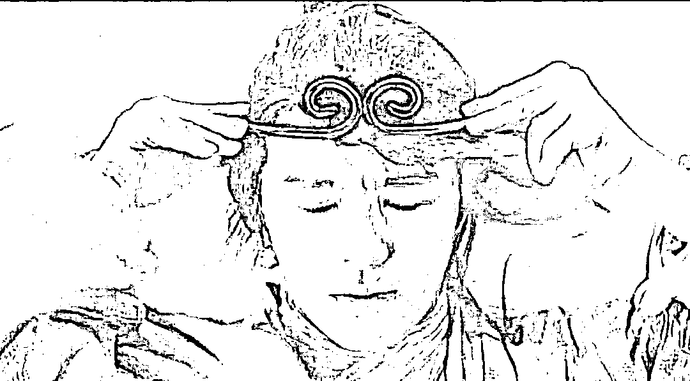

# 妖精有两条路？不，只有一条

> 原文：[`mp.weixin.qq.com/s?__biz=MzU0MjYwNDU2Mw==&mid=2247505541&idx=1&sn=01770c159c83c36b3c43f6ce942fa46f&chksm=fb1abaf9cc6d33ef035ee4448374c5f57252ab627c3f6fbb37058bcdc938fd004f94b8766f0d#rd`](http://mp.weixin.qq.com/s?__biz=MzU0MjYwNDU2Mw==&mid=2247505541&idx=1&sn=01770c159c83c36b3c43f6ce942fa46f&chksm=fb1abaf9cc6d33ef035ee4448374c5f57252ab627c3f6fbb37058bcdc938fd004f94b8766f0d#rd)

[昨天小号聊奥派](http://mp.weixin.qq.com/s?__biz=MzU3NDc5Nzc0NQ==&mid=2247516662&idx=1&sn=f6361cf4914339a469deae2dacb0f60e&chksm=fd2e2328ca59aa3efda6fd1c8b7616c0a31236a45d234c0ee53cbd0197f5913fd3fece4e86e3&scene=21#wechat_redirect)，引起很多争议，让我不禁想起十年前的一幕。

十年前有个商人和我聊天，聊一个方向，他觉得是个机会，跟我说了很多名词以及市面上流行起来的概念。

我后来怎么说服他的？是跟他辩论吗？并不是，我直接给他交底，争论就结束了。

他用来说服我的那些名词儿和当时市面上流行起来的概念的始作俑者，就是我本人。

我跟他讲，当时我还在甲方，是出于什么样的利益诉求，在什么样的安排下，把一个局用技术的语言包装起来，然后出去讲，到处讲，各种会议上讲。

给一些低一个级别的甲方讲，给一些乙方龙头讲。再通过他们二次传播，给整个行业讲。一两年后，这事儿就传到他耳朵里去了。

我们弄个概念出来，一定是有目的的，即便我只是一个具体实施者，那么给我下令的人，也一定是有目的的。

这个目的你务必要弄清楚，这才是做生意的首要任务。如果目的你没弄清楚，你在外围瞎琢磨，那就是我昨天说的那句话，你不由自主的忘了目标，忘了自己是为了赢，不是辩个输赢。

他是个商人，我一交底，秒懂，知道自己哪儿被忽悠了，也就知道这个方向如果要盈利，到底应该怎么去弄。

我当年读书的时候，最喜欢的一本书是 TCPIP 三卷本，道格拉斯写的，是一本工程类技术书。

但是这本技术书要比很多讲情商，讲人性的更加透彻。

为什么呢？因为他的写作方式。

很多工程类技术书的作者写起东西来，给你的感觉就是好像是他在主导一个架构。

工程类技术的背后一定是利益主导，绝无可能是技术本身主导。

换句话说，所谓专家，只是仆人，仆人背后一定是有主人在下令的。那个主人下的什么令，这才是重点。

道格拉斯的优点就在于絮絮叨叨，他一边写书一边发牢骚，到处是抱怨，这个资本有这个要求，那个监管有那个要求，前任互联网的设计者有各种小九九以及各种目光短浅遗留的历史问题。

以至于自己是戴着镣铐跳舞，捉襟见肘，只能各种打补丁。

好书，奇书，对于学校里的学生而言，这就是给你上了一堂人生课。你将来毕业后要面临的就是这样一个环境。

就像我说过，甲方召集开会，讨论行业规范，下面一群甲方高管和市场占有率高的乙方老板，每个人看似都在说技术，没有一个人真的在说技术。

你张嘴肯定要说，我是为了技术好，我是为了框架好，因为今天的讨论内容就是行业技术规范。

但实际上这里面所有人都是在谈蛋糕，我们团队的蛋糕，我们公司的蛋糕。

大家只是拿技术来说事儿。

一个工程师在走向软硬件架构师，乃至系统架构师，行业架构师的过程，实际上是什么？

实际上就是在不断地抛弃技术的过程，你越来越不关心技术了，你越来越关心利益的分配了。

你的价值在于怎么样把一个利益分配的话题，用技术包装出来，讲到全行业都听得进去，还觉得那真是个技术话题，从而把利益掩盖起来。

就像文初那个商人，你不给他交底，他就真的被你的话术带着走了，到这一步，你才是一个好的架构师。

道格拉斯就是一个好的架构师，只不过他这人不讲武德，按理说应该欺瞒的，他给公开了。

但是这种公开对于大学生而言，是宝贵的财富。我当年读书的时候，看到他的书，惊讶了。我的天呐，原来技术是服务于利益的，而不是反过来。

如果这个点你想不通，那我说什么都没有用，如果你认了，那么接下来一切都将顺理成章。

无限的时空内，天大地大，大不过一个理字，秦始皇这么拽，也得死。可是有限的时空内，秦始皇可以让你先死。这就是技术的从属性。

人类可以跳出时空来琢磨道理，但是都得活在固定的时空内，这就叫现实。

做商人的，一秒就懂了，我在说什么？我在说所谓的道理，都是由人来维系的。

你就比如人类的道理的是什么？人类现阶段的道理就是五常。

五常就是道理，道理就是五常，你看到的所有秩序，都是五常主导下的。

想明白这个边界很容易，有时候五常之间会有矛盾，当他们出现矛盾的时候， 你会惊奇的发现，道理消失了。

那一刻你就明白了，哦，你像孙悟空一样，飞到天边了，看到了支撑天的五根柱子，如来的五根手指。

我知道有人要辩论，什么超出人类之外的道理，那些当然存在。但是你要记住，那些东西的时间计量单位，是亿万年。

亿万年之后，人类都不存在了，何况五常。但是在你讲这番话之前，先照照镜子，看看自己到底是什么生物。

你要是什么位面之子，当我没说。如果你还是个正常人，看看自己爷爷活了多少岁，太爷爷活了多少岁，你心里就有数了，你就知道亿万年和你之间，连半毛钱的关系都没有。

这就是我说的，有限时空内的思考，确切的说，是站在人类寿命下的思考。

上面这些话，如果对着一个商人，就不用说了。领先一步是先驱，领先三步是先烈，他们对时间很敏感，比绝大多数人都敏感。

这个理论铺垫做完，结论呼之欲出。

天底下的妖精，有几条路？想想看，有几条路？

只有两条路。

第一条路是招安，成为秩序的维护者之一；第二条路，是取代天道，成为秩序的构造者。

有没有可能有第三条路？比如幻想无秩序，有没有可能？

别闹了好吗。

昨天有人跟我讲欧神，这个人我聊过，我不清楚为什么一群屌丝给他起个了名字叫什么神。

他算哪路神仙？

我们不谈神仙，我们今天的话题是妖精。在妖精这个序列里，是分三六九的。

最底层的是什么？就是白骨精，你翻开西游记，她很有名，因为她是很罕见的被打死的那种。

这其实就是一个野路子的野妖精，你们所谓的欧什么玩意儿来着，就这路数。

这种野妖在商人群体里多的是，如果你想了解自己所在行业里的妖精分布图，你去甲方干几年基本上都晓得了。

行业布局一般来讲都是甲方主导秩序，下面围绕一群龙头级别的乙方，再外围，高参级别的乙方，再外围，就是到处串门子，想要入围的乙方。

白骨精属于连外围都不算的那种。

龙头级别的乙方特点是什么？是已经成为了秩序的重要维系者之一。

你比如昨天聊巴菲特。在美国金融行业这个圈子里，甲方是谁？就是美联储。

巴菲特和美联储之间的关系实际上就是很亲密的。

美联储救市，很大一部分也等于在救巴菲特，美联储让巴菲特出面救市，巴菲特救美联储的过程很大程度上也是救自己。

这就是深度绑定，实际上美国的金融秩序就是靠美联储以及巴菲特们在共同维系着。

这种情况下巴菲特当然是有钱赚的，实际上巴菲特已经成为主导切蛋糕的一部分了。

那么下一个等级，那就是高参。什么叫高参？实际上是有能力介入，最起码，有能力旁听的。

你总得了解秩序是个啥吧。

我们有在甲方工作过的读者听了会心一笑。你发现经常有些被戏称为二当家的中等公司老板。就是这些人。

论实力他们不够，但是他们也有两把刷子，所以经常能够影响甲方的秩序构建，于是自己也就能够因为信息不对称，舔舔盘子。

一般来讲，绝大部分拎得清的妖精，目的都是被招安。能够成为二当家，甚至个别二当家里的有实力者，还想进一步，成为巴菲特那一类的。

有没有想要开创新秩序的？有。

但那不是白骨精们有能力做到的，那得是另一个国家。

你比如芒格为什么屡屡对我们示好。因为他清楚，美国能够主导金融秩序的核心因素是综合国力，而我们的综合国力正在追赶并超越美国的过程中。

巴菲特为什么不用正眼瞧那些喊喊什么奥派，什么去中心化的屌丝小妖们？

因为那群小妖就是出来搞笑的。人家都不用出动美军，甚至都不用出动 FBI。

关闭你的交易账户，你就得滚蛋。你生气？不让你说话，你慢慢生气去。

这个道理太浅显了，美联储不会去剿灭巴菲特，是因为巴菲特是秩序的一部分，秩序不会去剿灭秩序自己。

但是白骨精靠什么？

耗子偷东西，偷秩序的东西，本就该东躲西藏，贼眉鼠眼这个词儿就是这么来的。

耗子信奉奥派？那跟信奉刀枪不入有啥区别？

脑子正常点的耗子都是躲在精美的花瓶里，它懂，人类心疼花瓶才不会弄死它。

只有脑子有问题的耗子，才会走在大街上，嘴里默念着刀枪不入，然后被一脚踩死。

人，尤其是商人，一定要明白一个道理。

不要问自己能够赚到什么，一定要问自己能够为别人赚到什么，俗称自己到底有什么用。

我聊过几次那个昔日收购我们的乙方龙头，他们的大 BOSS，就是一个悟空。

悟空的出身也是妖精，妖精怎么才能完成自己的修行？

就是要打妖精，打掉昔日的小伙伴，打掉其他妖精，这就叫修行。

修行修行，修的是什么心？修的就是一颗忠心。

巴菲特曾经说过一句话，没有一个超级富豪是做空自己国家取得成功的，没有。

你以为他在唱高调？不，他说的就是心里话，越忠诚才可能越成功。

巴菲特 30 岁之前就是做高频的，投机取巧赚到相当于今天几个亿购买力的财富，然后开始求招安，再然后开始剿匪，剿昔日的小伙伴。越剿越忠，越忠越剿，这就叫滚雪球。

忠心大了财富才可能大，佛法精深武功才可能深。

悟空的修行之路，就是一个降妖的过程，不仅要让妖精形灭，还要让妖精神灭。

你以为你灭的是别的妖么？不，你灭的是自己心中的妖。

