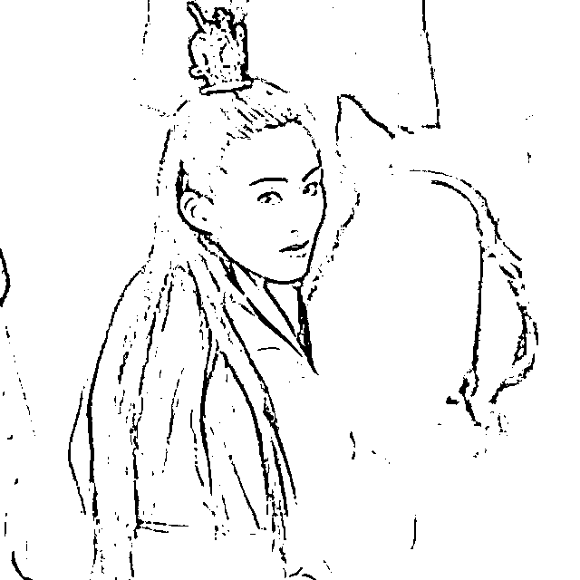

# 赵敏不是天下奇女子，但她哥是

> 原文：[`mp.weixin.qq.com/s?__biz=MzU0MjYwNDU2Mw==&mid=2247505261&idx=1&sn=332ad70eb8cdf0a2fcc1e08b1cb865f0&chksm=fb1ab911cc6d30073a9fa4861219b8f2f6acde366f95d2767edb629ed871b6a8a1a9076fbcea#rd`](http://mp.weixin.qq.com/s?__biz=MzU0MjYwNDU2Mw==&mid=2247505261&idx=1&sn=332ad70eb8cdf0a2fcc1e08b1cb865f0&chksm=fb1ab911cc6d30073a9fa4861219b8f2f6acde366f95d2767edb629ed871b6a8a1a9076fbcea#rd)

读者让我写《山河月明》的剧评。这部戏里面出场了太多老戏骨，值得一写。

剧是快播完了，但是怎么说呢，出场这么多人物里面，编剧用笔墨最少的，反而是我最想写的，是一个蒙古人。

你没有听错，山河月明，明代初期那么多豪杰我都不想落笔，只想聊一个蒙古人。

这个人就是金庸小说里赵敏她哥。

金庸小说倚天屠龙记里，赵敏的名字叫做敏敏特穆尔，特穆尔谐音帖木儿。她是汝阳王察罕帖木儿之女，王保保之妹。

翻开元史，察罕帖木儿没有做过汝阳王，他爹阿鲁温晋做过汝阳王，他本人做过颍川王，而且是死后被追封的。他也没有女儿。

王保保来历就很清晰了，他娘是察罕帖木儿的姐姐，他本人是察罕帖木儿的养子，就是说，他被他舅收为养子了。所以他的蒙古名字叫做扩廓帖木儿。

王保保舅舅没有亲生女儿，可是他自己确实有个亲妹妹，这个妹妹，在历史上被叫做观音奴。

所以金庸这么编故事还是有道理的，王保保确实是察罕帖木儿的养子，那么把他妹妹编造成察罕帖木儿的女儿，合情合理。

这个观音奴，大概率很漂亮，如下图：

我不是信口雌黄，游牧民族通常和观音沾边的，都是美女。美貌且风流。 

金庸另一部小说，《天龙八部》里面萧峰的大哥，辽道宗耶律洪基的皇后，就叫做萧观音。

据说此女精通诗词、音律，善于谈论。弹得一手好琵琶，称为当时第一。

后来被诬告泡男明星，与一个伶官私通，被她老公赐死了。

这事儿不知道真的假的，不过我读过所谓她写的那些艳词，她大概就是因为缺一个首席风控官。

这说明自古以来，写作一直是一个高风险的行业，无论农耕民族还是游牧民族。 

扯远了，我们来看看观音奴，也就是赵敏。 

历史上的观音奴绝没有赵敏的本事，我看电视剧《山河月明》里有点企图把她描述成身在明营心在元的女探子。

我觉得不现实。 

原因非常简单。观音奴当年被明军俘虏，朱元璋想要以她为质，说服她哥投降。

所以就把观音奴嫁给了自己的二儿子秦王做正妃。

秦王是朱元璋仅次于太子朱标之外最重视的儿子，嫡次子，是马皇后所生。

嫁给他做正妃，很能说明问题。 

观音奴是作为俘虏，人质的存在，她清楚朱元璋打她哥主意，不喜欢这段婚姻很正常。

秦王也是个很傲娇的人，不可能像西门庆一样潘驴邓小闲，赔着小心意去哄她，于是这段婚姻有名无实。 

这种不受宠的情况下，她想做间谍，是不现实的。

何况秦王的侧妃也容不下她，观音奴也没有子嗣。她实际上是被软禁终身，待遇还很差，每日用度与奴婢无异，秦王死后，还被拉去殉葬了。

非常凄惨的一生。

我们把目光拉回到她哥身上，毕竟她的婚姻就是为了招降她哥哥王保保。

朱元璋一直都有很严重的王保保情结，他自己说，这辈子三大憾事。 

第一、没有得到传国玉玺。就是李斯篆刻“受命于天、既寿永昌”，王莽篡位时被太皇太后扔在地上摔碎了一个角，用金子补起来那枚。

这东西估计被元朝最后的皇帝遗失在草原上了，从此不见踪影。后来清代皇太极说他捡到了，是瞎说的。 

第二、就是没有得到王保保，或者说，没能劝降，收编赵敏她哥。 

第三、元皇太子下落不明。

皇太子下落不明是个很糟糕的事情，随时可能打着复兴大元的旗号卷土重来，这就跟朱棣派郑和下西洋，一遍一遍的寻找失踪的朱允炆一个道理。 

你想一想，传国玉玺，元是否终结，与王保保并立。这得是个什么人呢？

王保保这人，曾经击败过蓝玉，汤和，李文忠，常遇春，甚至徐达。 

这些人有多牛？对比一下就知道了。 

朱棣，大神吧，主角嘛，干掉侄子上位的燕王，应该说朱棣时期，最能打的就他了。 

这是为啥？因为他爹老朱同志把所有能打的，都弄死了。 

换句话说，王保保击败过的任何一个人只要活着，都不需要上阵，只要还活着。朱棣连造反的勇气都没有。 

蓝玉，常遇春的手下，北上破元，平定西南，凉国公。曾经在太子朱标跟前点眼药水，说燕王朱棣，久后必反。

汤和，朱元璋的入伍介绍人，他做千户的时候，朱元璋还是和尚。此后追随朱元璋西征北战，死后追封东瓯王。

李文忠，朱元璋外甥，平定江南，征讨北元，死后被追封岐阳王，配享太庙，肖像挂在功臣庙，位列第三。

常遇春，小说里张无忌的大哥。这位都不用介绍了，非常有名，打破陈友谅，攻取元大都，朱元璋能坐江山，最重要的两件事，他干的。死后追封开平王，他的画像上面绘的是龙袍，朱元璋特批的。

徐达，这个都不用介绍了，大明开国六王之首，有明一代，最能打的男人，肯定是他。 

上面这些人，都曾经至少在某一战中，成为王保保的手下败将。 

其中最难的是徐达，徐达平生仅一败，败给了王保保。 

有人看到这里肯定会说，这不对呀，王保保真要是这么牛，怎么会是朱元璋夺天下呢？ 

应该是王保保追着朱元璋打才对呀。 

你问的很好，因为我只告诉你王保保曾经赢过这些人，我没有告诉你的是，他输过更多。 

严格意义上讲，王保保的一辈子是被朱元璋手下各路名将按在地上打，一边挨揍一边跑，冷不丁还能还个手。 

你不要以为这不牛，实际上这很牛。 

朱元璋曾经评价过，当时人们都说常遇春是天下奇男子，朱元璋不以为然，他说，如果论打仗，常遇春肯定不是王保保的对手。至于徐达与王保保究竟谁更能打，他也不清楚。

但是把王保保放到徐达的位置上，徐达能做到的，他多半能做到，而把徐达放到王保保的位置上，恐怕没有王保保的业绩。

这是站在老板的视角下点评各位优秀员工。 

我们就说王保保和常遇春，王保保一生对战常遇春，输多胜少。问题在于，常遇春不是一个人，他经常有汤和，李文忠，蓝玉，各种配合，甚至有时候只是作为徐达副将，在徐达的带领下，一群人围殴王保保。

不仅名将如云，人多势众，更重要的是，大后方很稳定。 

明军的背后不仅有长城，还有刘伯温，李善长，一众谋士，类似张良萧何，还有一个能力超强的大 BOSS 朱元璋坐镇。 

王保保这边有什么呢？什么都没有。 

他首先要做的不是打仗，而是党争。蒙古人始终在内乱，大敌当前，没有人想着捍卫大元，大家想的都是自己能捞多少是多少，能带走多少是多少，反正是要回到草原上去的。

所以王保保一生当中的主要精力并不是对外，而是对内。他得先让自己说了算，事实上从来都没有过。

比如王保保曾经被封为左丞相，只要他打的顺利，元顺帝就会安排太子夺权，然后内斗。

内斗到不可开交，老朱就会抓住机会，让徐达北伐，眼看要玩完，这些内部打王保保的力量就暂停了，让他去对付朱元璋。

等王保保打退徐达，他们又开始内讧。

所以剧中王保保有句话，他对着手下的万夫长说，徐达的背后是长城，是众志成城，而他的背后，除了一望无际的野草，还有什么呢。

丢了大都，逃亡上都，丢了上都，还能逃到哪里去呢？ 

当年朱元璋和陈友谅、张士诚酣战，王保保不是不想参与，问题是，他背后掣肘，元顺帝还在安排人讨伐王保保。

而等到朱元璋把元顺帝赶到塞外之后，他才意识到自己对王保保下手的时机不对，你注意，是时机不对，不是下手不对。

元顺帝恢复王保保的官位，让他去讨伐朱元璋。你让他怎么做？他真要打，结果就是他在前面打朱元璋，元顺帝就在后面打他。

所以王保保最惨的时候，被徐达打败，和妻子抱着一根木头漂过黄河，才逃得性命。 

是王保保不行吗？不，是没有机会让他行。 

[这些天我看到了很多内部的分歧，很多读者一定要让我写。](http://mp.weixin.qq.com/s?__biz=MzU3NDc5Nzc0NQ==&mid=2247515433&idx=2&sn=c2ebb2d58bb8ead50f79d10d2a80c0e2&chksm=fd2e1ff7ca5996e1f5cdf2bcd61bd9a3bb2288485ecffee1bfc625f0fe77a31083e6f51643c7&scene=21#wechat_redirect)

其实在我看来，你们不是想听我的观点，你们只是想逼我站队伍。

我有时候一直在想，有什么工作比统战工作更重要的呢？有什么见识比共识更重要的呢？

若是不团结，纵然天下奇男子又能怎么样呢？若是团结，输几次又何妨？

当我们急于互喷的时候，是否还记得，什么才是我们共同的目标？