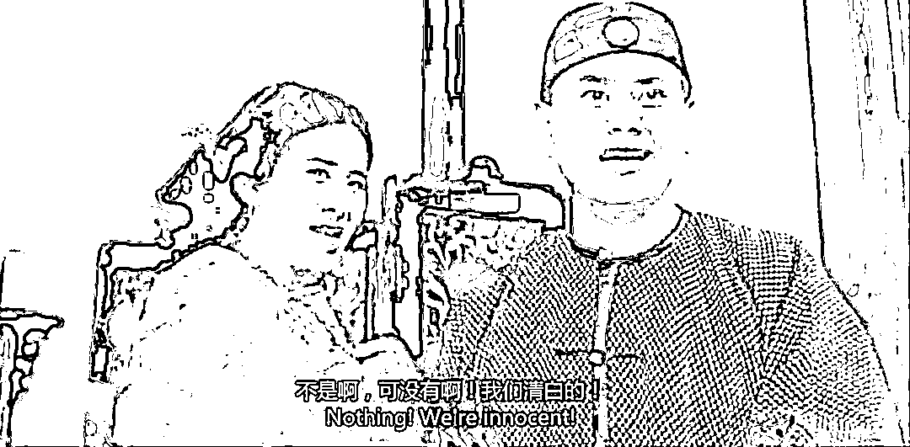
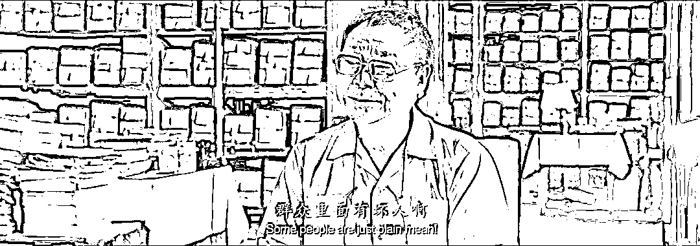

# 是什么把这幕人间有情变成了悲剧？

> 原文：[`mp.weixin.qq.com/s?__biz=MzU0MjYwNDU2Mw==&mid=2247504821&idx=1&sn=d3cd2c60dfdcb3ea98a44d56ebae4163&chksm=fb1abfc9cc6d36df07003a073690705ad072c4f5b6c3969d15e62596b1f4f1eea2dad62b0385#rd`](http://mp.weixin.qq.com/s?__biz=MzU0MjYwNDU2Mw==&mid=2247504821&idx=1&sn=d3cd2c60dfdcb3ea98a44d56ebae4163&chksm=fb1abfc9cc6d36df07003a073690705ad072c4f5b6c3969d15e62596b1f4f1eea2dad62b0385#rd)

有这样的一个故事。 

上海疫情期间，有个虹口区的女人，失业在家，没有收入，带着 7 岁的孩子，全靠丈夫维持开支，还房贷。 

她有一个退休的父亲，住在青浦区的经济适用房里，有听力残障，且年纪很大，没有自己烧菜的能力。

在疫情之前，都是这个女人自己烧好饭菜，送到 27 公里外父亲的住处，因为疫情的缘故，她的父亲只能天天吃白米饭。 

孝顺的女儿想到了一个好主意，她找到了前一天给她送菜的小哥的电话，问他能不能帮自己送一次餐，从自己家送去父亲家。

小哥不是很愿意，但是听完具体的情况，想起自己也有一个九岁的女儿，想起似乎相识的家庭责任，心软了。 

于是小哥选择晚上七点，去这个女人家里取饭菜。一路上经过很多次交警的拦查，查他的核酸报告与通行证。

走得慢，电瓶车没电了，他只能停下来找电柜。疫情期间，很多电柜也停止营业了，找了很久才找到，这时候已经晚上十点多了。 

小哥把电瓶车骑到距离目的地 2 公里的位置，发现再也过不去了。因为前方封路，电瓶车过不去，又上不了高架。于是小哥就拎着饭菜，徒步走完了最后的两公里。

到了之后，发现老人是听力障碍，无法联系。只能开通视频与这个女人通话，最后由小区志愿者负责转送。 

此时已经过去 7 个小时了，小哥只能在附近找个宾馆入住。于是女人出于感激，给小哥转了 200 块钱，并替他充了话费。

此后事情上了热搜，两个原本经济困难的人抱团互助的人间有情的喜剧故事，变成了悲剧。 

为什么呢？女人跳楼了。

原因据说是受不了网络暴力。 

很多网民在网络上喷这个女人，说她小气，怎么着也得打个 500 起，但是只打了 200 块.......

人间有情的开局，荒诞离奇的悲剧。 

话说到这里，按照正常的节奏，我是不是该骂人了？骂一骂这帮网民？ 

不是的。

我来告诉你为什么。 

在看来，这个女人的死因之一就是预期，说的透彻点，她把网民想的太好了，她把人，想的太好了。 

人间当然有真爱，当然有像她这样单纯的人，当然也有像这个小哥一样忠于托付的人。 

可如果你放到大面积来看，这是所有人吗？并不是。 

你把人想得太好了，希望越大，失望就越大，别人对你的伤害，就越大。 

**所以我才不去骂，我骂得越多，扭曲你们的预期就越深。你们就会以为坏人很少，将来遇到坏人，你们就会受不了。** 

实话实说，坏人比你想得多。 

经常有读者问我，他们听别的博主讲，每天都能收到很多辱骂的，肮脏不堪的网暴，却很少听我提起。 

似乎在我嘴里，这些人都变成了笑话，被我当段子调侃了。

为什么？为什么我的经历如此与众不同？ 

真相当然不是这样，我的后台每天也充斥着网暴的声音，其中不乏冲着我来的。 

问题是为什么我不在乎呢？这跟职业有关。 

我说过很多次，赌徒与嗑药本质上没有什么不同。你没有见过赌徒，总见过瘾君子吧。 

人性深处到底什么样，两种人身上看得最清楚，一种是毒瘾发作的嗑药者，另一种就是输光了的赌徒。

这两种人我第一次见到的时候也会震撼，甚至会呕吐，人性原来可以像蛆虫一样恶心。 

但任何东西见多了就习惯了。这就是我常说的预期。 

如果在你的眼里，人性本质上就这样，那就不可能让你觉得意外。 

国际市场就是这样一个环境，一个比寻常赌场还要糟糕很多的环境，所以我说，像养蛊。 

毒蛇窝已经够恶心了对吧，蛇是吃蛇的，缠绕在一起，阴冷，黑暗，互残。 

可是蛊是怎么诞生的呢？是把蝎子，蜈蚣，毒蛇，各种玩意儿关在一个容器里，看看最后谁能走出来。

最后走出来的那玩意是什么？是蛊。

你觉得这些都经历过的人，还有办法被伤害么？

你走进蛇窝里，蛇能把你吃的渣子都不剩，他走进蛇窝里，毒蛇都被吓得四散而逃。 

你接个电话，接个午夜凶铃就能把你吓个半死。他能坐在井底跟贞子打牌，斗地主，还玩得不亦乐乎。 

这就是预期的力量，预期一旦被调整，人的心态就会很强大。 

国际市场里每天都是各种肮脏的游戏，习惯了，你就不那么敏感了。 

就像此前咱们分析俄乌战争，两个多月过去了，你难道没有发现么？很多大 V 的观点，也都开始趋向于两个月前我的判断了。 

这并不是预测能力，而是因为我太熟悉这个游戏，这个游戏从骨子里讲，就是这么玩的。 

前面的我不清楚，但是从我 08 年接触这个游戏起，美国一直是这么玩的，就像欧洲也一直是这么被玩的。

美国各种禁止欧洲购买俄罗斯的能源，他自己呢？大买特买。买铝，买油，然后加价卖给欧洲。 

美国就是这么做的呀，一直这么干。

欧洲的那些大国，比如德国这种，听美国的吗？并不听。他们继续向俄罗斯采购能源。 

泽连斯基一个劲的忽悠白左，配合谁？就是在配合美国呀。严丝合缝。

我为什么这么说？因为我天天泡在市场里，每一个消息与每一段讲话之间的关联打我耳朵里过。

美国一想着卖，泽连斯基就跟着上节奏，简直如同卖拐+托儿。

你告诉我他们之间是清白的？那多隆与韦小宝的姐姐想必也是清白的。 

在这个过程中，欧洲不同国家的反应是不同的，你比如波罗的海三国就不怎么顾及民生，有些德国，匈牙利之类不听美国招呼的，也未见得是讲道理，人家也有人家的选票方面的考虑。 

说到底，在整个游戏中，没有人会去关心欧洲这帮白左。你白左你买单嘛，就这么回事。 

在这个过程中，通过观察美联储最近的会议纪要，你会发现美国遇到的问题实在是很严重，并不仅仅是通过与欧洲比赛摆烂，就能解决的。 

这是美国一以贯之的思路，一定要适应。

你千万不要以为美国是一个学生，考不过别人就努力复习，从来不是这样。

美国的思路从来都是如果我考不过你，我就给你下毒，让你没法参加考试，这才是他们一以贯之的思路。

欧洲与他们一脉相传，下毒下的毫无违和感，对你就会轻轻放过？你脸白啊？ 

美国一定是惟恐天下不乱的，一定会在各种地方捣乱的，明的，暗的，阴的，阳的，收买，武力，一个也少不了。

作为一个依托于金融的国家，让别人表现得不如自己，从而吸引避险资金，就是唯一的选项，这就是美国。 

我一直说群众里面有坏人，你们还不信。

[之前小号其实我就差点名了。](http://mp.weixin.qq.com/s?__biz=MzU3NDc5Nzc0NQ==&mid=2247515245&idx=1&sn=d95aa5a3e85525adf60fd18496bb617e&chksm=fd2e1eb3ca5997a5c6557b784ac99bc179fa9da31fdb8c00424295ede68729a22c151c4bc930&scene=21#wechat_redirect)我之所以不点名是因为我没有证据，我这人习惯了严谨，拿不到证据，不乱扣帽子。

但是我心里一百个不信任，对于人性的不信任。 

我们未来的几十年，再也回不到过去的蜜月期了，我们必须要习惯于直面人性深处的肮脏。 

外面有居心叵测的人，内部也会有的。你要适应。

过去的几十年，我们挣钱更多的是卖苦力，未来的几十年，你不得不学会斗心机。 

否则别说继续前进，你想保全昔日挣到的，都没有那么容易。 

成熟点吧，坚强点吧，脆弱的人，又怎么能够完成伟大的使命呢？