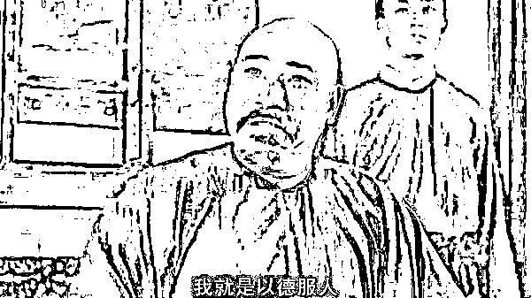

# 兔子的特点是以德服人

> 原文：[`mp.weixin.qq.com/s?__biz=MzU0MjYwNDU2Mw==&mid=2247504542&idx=2&sn=2d732bd6df4d55d2c661d32f29f25da6&chksm=fb1abee2cc6d37f48e718e17025350b385d05196f275e10f97d8edabd5472c7fed382faf297a#rd`](http://mp.weixin.qq.com/s?__biz=MzU0MjYwNDU2Mw==&mid=2247504542&idx=2&sn=2d732bd6df4d55d2c661d32f29f25da6&chksm=fb1abee2cc6d37f48e718e17025350b385d05196f275e10f97d8edabd5472c7fed382faf297a#rd)

[看了大帝那一期的](http://mp.weixin.qq.com/s?__biz=MzU0MjYwNDU2Mw==&mid=2247504498&idx=1&sn=1f88ca743019b400dbceedac130d97cd&chksm=fb1abe0ecc6d3718d34ea794e5a48c5bfee15ce822ed37276d07cd1172560e1b25653290ce6d&scene=21#wechat_redirect)，很多读者激情澎湃，很希望我来写一期兔子。 

如果 GDP 只有我们一省之力的俄国都被写的像漆黑中的萤火虫一样，那么鲜明，那么出众。那么从 40 年前，GDP 和印度相当的我们，走到今天的 G2，该拉风成什么样？

很遗憾，不能满足你，因为这不是我们需要的形象。 

你注意，需要。 

我曾经拿两个企业举过例子，我说很喜欢腾讯的形象，很不喜欢阿里的形象。 

很多读者都觉得这是一种个人情绪。十年前我第一次创业的时候，阿里的一个副总裁，当我们的面讲，他们每年有上百亿的预算，目标是培育市场，而我们有什么呢？只是一个想要在市场里存活下去的小公司。

言外之意，凭什么谈合作？

你们觉得我记仇，所以从此不喜欢阿里。 

当然不是这样，因为事后我们还是和阿里合作了，我们的产品还是进了阿里的机房，但是与腾讯并没有合作过。

商人是不记仇的，没有永远的朋友，没有永远的对手，只有永恒的利益。

我不喜欢阿里的形象，很大程度上是因为这不符合常识。 

强则示之以弱，弱则示之以强。从来都是这样。

刘安的《淮南子·兵略训》里面说：“用兵之道，示之以柔而迎之以刚，示之以弱而乘之以强。”

这话翻译翻译什么意思呢？就是说最优秀的猎人往往伪装成猎物。 

大哥别走嘛，来玩嘛，你来嘛，来了就让你占便宜，等来了之后，也许把你吃干抹净。

那么弱则示之以强，是疑兵之道，类似空城计。

昔日宁王，就是周星驰电影《唐伯虎点秋香》里那个动辄发飙的王爷，造反了。

王阳明兵力不足，怎么办呢？

他就在宁王的老巢南昌附近各州府县张贴了假檄文，大肆宣扬朝廷准备大举进攻宁王的老巢南昌，宁王深信不疑，乖乖的躲在家里防守，而失去了趁空虚进攻各地的战机，给了王阳明充足的时间招兵买马，征调军粮，打造兵船器械。

等宁王反应过来，已经被王阳明瓮中捉鳖了。

这是非常常规的套路，兵者，诡道也，虚虚实实，实实虚虚。虚则实之，实则虚之。

以阿里之强，按说应该像《草庐经略·虚实》里描述的那样，“实而示之以虚，以我之实，击彼之虚，如破竹压卵。”

也就是装怂，诱人前来。 

但阿里不是那样，阿里的风格非常张扬，对下宣传的是阿里铁军，对上展现的是马云成天讲，要改变世界。

那么企鹅表现出的风格则是相反的，竭尽全力的展现自己蠢萌的一面。

我是一只蠢蠢的小企鹅，你看我傻乎乎的，被老干妈涮了都不知道，大家尽情嘲笑我吧。

事实上企鹅江湖号称南山必胜客，只是这个绰号，是企鹅极力压制而非宣传的。 

也就是说，企鹅并不想让你觉察它的强大。

从形象上看，阿里像鹰，熊，而企鹅像兔子。

我很喜欢兔子这个形象，而不是龙。这个原因非常简单，因为兔子今天真的很强。 

当你非常非常强的时候，你要展现自己的温柔。

你看我们聊国际形势的时候，聊起其他国家，尤其是西方各个大国，我给你描述的都是他们尔虞我诈，各种激烈奸诈的手段。 

但是描述到兔子的时候，我就不谈利益了，更多的是谈勤劳，朴实，真诚，善良。 

事实上翻开全球实力占比图，你会发现在过去的四十年当中，如果按照占比，也就是相对位置，美国没有变，兔子从很小一块变成几乎和美国一样大，其他的国家都在缩小。 

一群激烈奸诈的飞禽猛兽，鹰，熊，虎狼之国，撑死了维持不变，其余都在缩小。而最温顺，朴实，真诚，善良的兔子反而不断地长大，这说明什么？

八个字：天道酬勤，以德服人。 

我们从小就在学，兔子始终是吃亏的，我们勤劳，用自己生产的商品，去换取别人的一张纸。 

所以结论是什么？很简单，吃亏是福。 

你看企业里面，企鹅就深得兔子文化的精髓，企鹅是一种很蠢萌的动物，傻傻的，很可爱，从来不想占便宜 ，谁想摸摸就给你摸摸，谁想抱抱就给你抱抱。

这就叫大智慧。

大智慧是告诉你，当你很小的时候，要韬光养晦，当你实在大的没有哪棵树能够隐藏大象的身形了，你要努力的卖萌。 

对了，就是卖萌，让世人看到你身上可爱的那一面，而忘却你的强大。

那天写俄国，我用了三个典故，让读者热泪盈眶，关云长，诸葛亮，郭靖。有细心的读者跟我说，这三个似乎都是悲情英雄。

你说对了，其实英雄大部分都是悲情的。 

所谓英雄，实际上是在实力不足的情况下，燃烧小宇宙，迸发出所有的潜力，透支未来，发出惊天一击。 

那么你想一想，什么情况下才不得已这么做？

一定是遇到危难了。

疾风知劲草，板荡识诚臣。感动的同时，通过考验的同时，也意味着遇到了巨大的困难。

真正的成功者，是步步为营的，很少遇到什么坎儿，也就很难让你感动。

十几年前，我服务过的那个甲方，大 BOSS 看起来就像一个忠厚长者，虽然实际上他跺一脚，全行业都要震三震。 

他带给你的感受就是我不懂，我很蠢萌的，我都是被你们这些供应商，被你们这些各种围绕在身边的精英忽悠，被你们占便宜。 

但是你想想看，当年他出道的时候，没钱没资源，拿着一张牌照就能打天下，树起行业巨无霸。 

这种大佬真的是他展现给你看的那么好被你占便宜的样子吗？

真的吗？ 

别的不说，每年那么多供应商，挂的挂，卖的卖，裁的裁，而甲方屹立不倒，越来越大。 

你自己去琢磨这里面的道理。 

说到底，我们不是印度。印度的特点是生怕你瞧不起，我们的特点是生怕你注意。 

油管五常，印度、韩国、土耳其、波兰、越南，以印度为首。

之前泽连斯基说乌克兰发生战争，世界上最强大力量却在远处观望，他们需要大国来主持公道。

这时候印度跳出来了，表示说，没错，世界上最强大的力量就是在下，我们不再沉默，不再观望，为世界主持公道来了。

然后战斗力惊人，在西方媒体彻底禁止俄罗斯发声的耍赖的玩法下，印度人愣是把舆论口水战打翻盘了。

但这不是我们的风格，我们也没法是这种风格。

说到底，我们一国之实力，近乎整个西方世界的一半以上。同一句话，在不同身份的人说出来，意思是完全不同的。 

街上一个混混，说他是这条街最能打的仔，大家不会怎么样，只会觉得他是出来搞笑的。 

但是换做陈浩南，浩哥都不用说话，他只要走出来，整条街都会鸦雀无声，这是实力带来的压迫感。

这就是为啥那天很多激烈的留言我没有放出来，我觉得你们太强势了，我们要学会展现柔软。 

你注意，是展现。 

我上初中的时候，班主任给我的批语是水晶猴子，猴子本来就够精了，还是个水晶的。 

到了高中，班主任给我的批语是悍，就一个字。悍不仅有勇敢的意思，更有凶狠的意思。

作为一个人，又是水晶猴子又是悍，是不是好事我不清楚，但是我很清楚，作为形象，这是对自己不利的。 

所以我花了很多年去学习，并努力地展现以德服人。后来就成长为一个忠厚长者。

你看我们聊过很多次国际市场里的波谲云诡。 

但是你有没有发现，在我笔下，尔虞我诈的都是白人，而我真诚善良。那我是怎么胜出的呢？ 

这就是以德服人的力量。吃亏是福，我就是因为太善良，吃亏吃得太多，所以才总能迎来福报。 

你去看西方的剧作，《权力的游戏》、《纸牌屋》，充满了手段。但是你总结我们上下五千年的文明，无非一句话：

天行健君子以自强不息，地势坤君子以厚德载物。

一个是乾卦，一个是坤卦，合起来就是乾坤。乾坤之间，世间真理无过于此。

自强不息，厚德载物。这八个字吃透了，无往而不利。

我知道有些读者不信，觉得这八个字你也懂呀，为什么不那么管用呢？

道理很简单，饭是一口一口吃的。

这八个字就像高深武功，你要有武功底子，换句话说，我在 30 岁之前，学的也是黑虎掏心，狮子偷桃之类的。

但是三十岁之后，逐渐的就开始慢慢领悟以德服人，慢慢的体会出温良恭俭让的深刻含义。

我写过七篇权游的影评，读者老问我为啥说是压着初一的水平在发挥。因为我初一的时候，脑子里就是那些，类似权游里的那些玩意儿。

但是我现在已经人过四十了，相比较于小时候，我更喜欢看喜羊羊与灰太狼，更喜欢看聪明的蓝精灵。 

你想一想，善良的喜羊羊与蓝精灵，为什么总能识破灰太狼的奸计，打败格格巫呢？

为什么呢？你好好想想。

一个人，越来越喜欢喜羊羊，蓝精灵，说明什么？说明你开始成熟了。

我非常的尊敬关羽，诸葛亮，郭靖，但是我并不希望咱们的形象像他们。

我们这代人的形象应该是像蓝精灵一样，我们聪明可爱又善良。