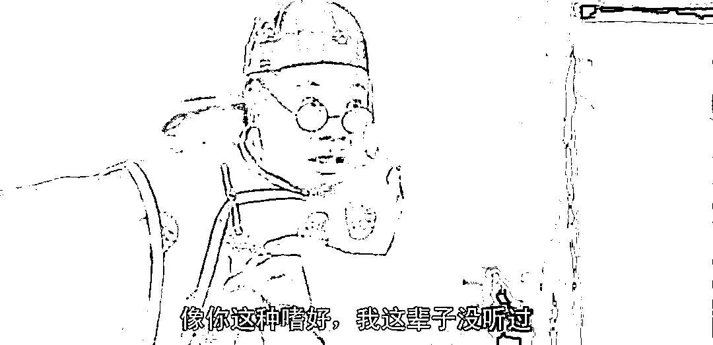
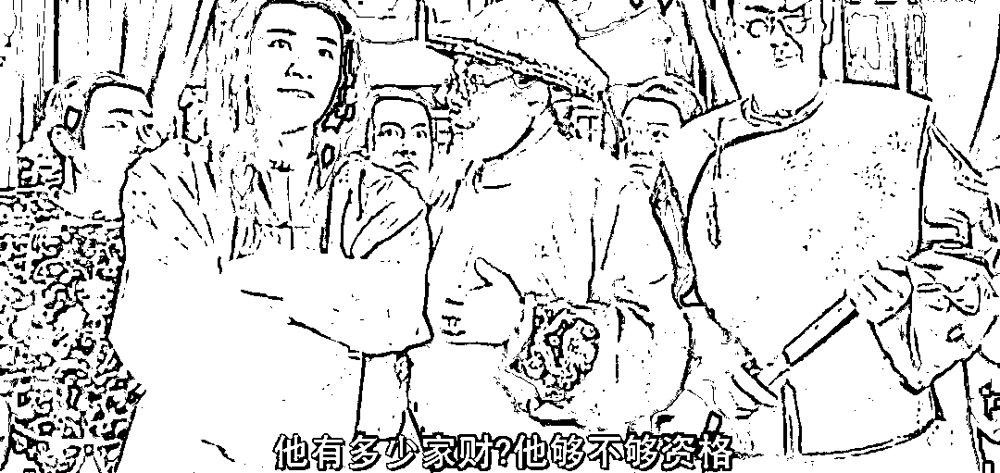

# 如果能活到 200 岁，欧洲将匍匐在我脚下：叶卡捷琳娜大帝

> 原文：[`mp.weixin.qq.com/s?__biz=MzU0MjYwNDU2Mw==&mid=2247504484&idx=1&sn=261fff0d5f5672605ba54564c08aab04&chksm=fb1abe18cc6d370e6044dfdf5dd206f9f1160e699f393d75eb5568aeedff5de9efd699febb88#rd`](http://mp.weixin.qq.com/s?__biz=MzU0MjYwNDU2Mw==&mid=2247504484&idx=1&sn=261fff0d5f5672605ba54564c08aab04&chksm=fb1abe18cc6d370e6044dfdf5dd206f9f1160e699f393d75eb5568aeedff5de9efd699febb88#rd)

很多读者问我怎么反驳部分公知关于标题的说法。

我懒得看推荐给我的那些文章，看标题就猜得出啥意思，无非想说俄国历史上一直很好战。这么好战，所以威胁很大。

其实我告诉你，如果你这么喜欢参考历史，你更应该去听郭德纲。 

郭德纲怎么说于谦的？他说，于谦的老丈人是蒙古国海军司令，牛吧？太牛了。如果这是真的话。

历史上真正威胁大的，是蒙古。对，就是夹在两个巨无霸之间的那位，你应该好好去担忧一下。 

我是一个活在现实中的人，我们参考历史不是照抄，而是去理解其中的道理。 

历史没有真相，只残存了一个道理。[咱们昨天提到慈禧](http://mp.weixin.qq.com/s?__biz=MzU0MjYwNDU2Mw==&mid=2247504458&idx=1&sn=f016079464362df17f592187784d1c44&chksm=fb1abe36cc6d3720b6733cbcfa1ecb63174de8b16746381e2241187948627c0a42d29598a452&scene=21#wechat_redirect)，慈禧也懂预期管理，但是价值锚错了，效果就没有。

你看，你要理解其中的道理，而不是生搬硬套。 

[咱们小号此前聊市场里的第一手资料](http://mp.weixin.qq.com/s?__biz=MzU3NDc5Nzc0NQ==&mid=2247514143&idx=1&sn=241b350d5f63f10a597af57068acdc10&chksm=fd2e1ac1ca5993d778de128e148130a67894821579dc09d16f6dbd74100a5dcc38a9d4a24f5b&scene=21#wechat_redirect)，你发现没有？其实这帮全球说了算的人物出来说话，跟宫斗戏没有区别，我是指说话的口吻没有区别。 

但是内容完全不同，就是[昨天说的，大人，价值锚变了](http://mp.weixin.qq.com/s?__biz=MzU0MjYwNDU2Mw==&mid=2247504458&idx=1&sn=f016079464362df17f592187784d1c44&chksm=fb1abe36cc6d3720b6733cbcfa1ecb63174de8b16746381e2241187948627c0a42d29598a452&scene=21#wechat_redirect)！ 

**你要深刻地理解今天大家玩游戏，到底在玩啥。**

你去看大小号，我第一个给你们讲，美国要避险情绪，要抬高美元，要为继续放水提供台阶，而俄国手里最大的武器是能源，他们需要速战速决吗？他们会怕打仗吗？怕就见鬼了。

大毛把二哈围起来不打是打不过吗？人家分明是想卖高价油好不好。从来只听过卖油的担心不打仗导致油价低，你见过一个卖油的会担心打仗导致油价涨吗？

这就是在告诉你，今天这个时代大家在玩啥。 

否则呢？历史上蒙古骑兵也很可怕，日本武士也很嚣张，so tama what？ 

威胁大么？现在骑兵对砍，武士对打，都属于各地传统民俗乐园里的常规节目。

拜托，醒醒，都 2022 了，连全球在玩啥都不清楚，还参考历史，参考个罗永浩。 

历史可以参考，但是你要把其中的价值锚替换掉，否则你参考了个寂寞。 

你的行为会变得忒可笑，就像韩寒电影里，那个老爸攒了一箱子小灵通，说这是留给儿子最大的财富。 

此一时也，彼一时也。俄国早已不是当年的俄国，我们也早已不是当年的我们。 

你应该习惯于去看当下的全球实力占比图，所谓一颗星球，其实只有中美欧，[欧洲就像昨晚小号文末开玩笑的，古龙小说里那个掌柜的](http://mp.weixin.qq.com/s?__biz=MzU3NDc5Nzc0NQ==&mid=2247514194&idx=1&sn=f00be26550c396b786eec64b62b7767f&chksm=fd2e1a8cca59939ad43ac2bf3fe1111ef164d0021a6eed6fc3ee8a502ec3ffcf75a56b822d58&scene=21#wechat_redirect)。散装的，没有凝聚力。 

实际上，放眼天下，只有中美。 

其他你觉得我们要去担忧，那也得人家够得上资格。

我们来看看历史上的俄国。俄国在历史上大部分时候都是欧洲二流国家，只有少数时候称得上一流。

这就是俄国历史上有大帝的时候。 

叶卡捷琳娜不是俄国人，是普鲁士人，父亲是个将军，因战功封得公爵，这就是她的出身。

俄国当时的沙皇是伊丽莎白，她和她姐姐安娜公主都是俄国历史上彼得大帝的女儿。

伊丽莎白是发动政变当的沙皇，她没有嫁人，而是把姐姐的儿子小彼得，接来做俄国的继承人。

问题是这个外甥，在德国长大，而且没有任何政治才能。

那么她就为外甥寻找妻子，找来找去，找到了叶卡捷琳娜，这不是她的原名，她是个普鲁士人，原来叫索菲亚，后来改的。 

这个名字来自伊丽莎白的妈妈。老外很喜欢同名，不是汤姆就是玛丽。

我们可以看到叶卡捷琳娜的出身很低，她没有什么很强大的资源，所以终其一生，她都在做三讨好。这是她自己说的。

寻找一切机会讨好婆婆伊丽莎白，寻找一切机会讨好丈夫小彼得，寻找一切机会讨好这个国家，俄国。

她改变了自己的信仰，皈依东正教。她竭尽全力地学习一切有关俄国的文化。她得到了沙皇伊丽莎白的信任。

伊丽莎白选择她就是觉得小彼得不靠谱，希望找个靠谱的辅佐。

问题是，小彼得不喜欢叶卡捷琳娜，两人成婚七年后，叶卡捷琳娜仍然是处女。

这严重的影响了伊丽莎白的安排，于是在沙皇的授意下，叶卡捷琳娜开始有了很多很多的情人。

用伊丽莎白的话说，你不要那么矜持，这事儿在王室里面属于常规操作，只要对外讲是合法继承人就可以了，至于到底谁的种，没那么讲究。

后来在沙皇的强力干预下，叶卡捷琳娜与小彼得圆房了，而且同时也有各种情人助力，果然生下孩子，被伊丽莎白宣布为俄国未来的沙皇。

这后面又经历了非常多的斗争。伊丽莎白死后，她的外甥小彼得上位，不喜欢这个妻子，想要放逐她。 

问题是小彼得是个纯粹的德国人，他作为沙皇，缺乏支持。但是叶卡捷琳娜则不然，她非常有政治头脑。而且裙下之臣，也就是情人团里不乏禁卫军军官团。

叶卡捷琳娜一生，公开的情人就有二十多个，大都是政治因素，也为情人生下孩子。后面的孩子可以肯定，都是为情人所生。

但是第一个，也就是被伊丽莎白认证过的那个，大概率不是情人的，因为他的相貌与小彼得十分相似。

我讲的这些内容很狗血，与很多人心目中的大帝可能不一样，但我认为这才是本质。 

政治说穿了就是一个谁支持你的游戏。 

叶卡捷琳娜到底是利用裙下之臣还是用什么方式，根本不重要。重要的是俄国当时大部分人都支持她，而不是她的老公小彼得。

小彼得作为一个德国长大的人，根本就不了解俄国，遑论其他。 

叶卡捷琳娜也是普鲁士人，问题是，她愿意了解俄国。正如同她自己说的一生三讨好。

她不讨好伊丽莎白，就根本没有成为女大公，获得与小彼得同样合法继承权的资格。 

她不讨好小彼得，无法维持这段婚姻，无法生下那个被伊丽莎白认定为未来沙皇的儿子，她自己做沙皇的合法性就会被质疑。 

说到底，伊丽莎白是彼得大帝的女儿，有彼得大帝的血统，她通过小彼得生下的那个被伊丽莎白认证过的儿子身上也有彼得大帝的血统。

而她作为一个外来人，一个普鲁士人，不借助血统亲妈的名头，是无法服众的。

而这一切并不够，最后还需要那几十个裙下之臣的帮助，才能在她与彼得之间的王位竞争中获胜。 

从此就如同她说的，她只需要竭尽所能地讨好这个国家，即是她全部的责任。 

这就是政治，政治本身就是这样一个获取支持的游戏。纸牌屋里对美国而言最重要的是美元，对美国总统而言，最重要的就是支持率。 

至于什么活到 200 岁，欧洲匍匐在她脚下，那只是口嗨。战争天才拿破仑也做不到，不要说她。 

因为有件事到最后你是无法解决的，那就是利益团体太多了，顺得哥情失嫂意，你没法讨好一切。 

**试图讨好所有人，只会让你得罪基本盘。** 

**如果反过来，什么都不讨好，是不可能成为一个成熟的政治家的。甚至恐怕连做事的机会，都没有。**

这世上除了出身好，其余所有人才想要得到一个施展才华的舞台的途径，大都来自抱怨。

抱怨就是指责，指责舞台上的人做得不好，**说这句话是为了什么？是为了吸引注意，是为了得到支持率，是为了能有一个 let me try 的机会。** 

懂王就是这种人，他 2016 年以前也好，被拜老头踹下去之后也罢，所有的抱怨，指责，都是为了登上舞台，或者再次登上舞台。 

说到底，他还是一个想要做事的人。至于他做不好，被群嘲，甚至被我们加封建国同志，那这个原因很多了。 

美国那摊子太复杂，历史遗留问题太多。虽然我们当年天天嘲笑他，但是有一个算一个，我们当中任何人去坐他的位置，都做不好。 

大概率不如他，远不如他。 

那么还有一种人，什么样的？就三国里面祢衡那样的。

祢衡也是成天抱怨发牢骚，时人以为公知。曹操是按照惯例推测，你骂人不就是嫌没机会上位么？那我给你一个机会，你出来做事吧。

祢衡啥事都不做，继续骂人，这就是京剧里的传统剧目，击鼓骂曹。

祢衡光着屁股，一边击鼓一边评论当世之人，荀彧可使吊丧问疾，荀攸可使看坟守墓，程昱可使关门闭户，郭嘉可使白词念赋，张辽可使击鼓鸣金，许褚可使牧牛放马，乐进可使取状读招，李典可使传书送檄，吕虔可使磨刀铸剑，满宠可使饮酒食糟，于禁可使负版筑墙，徐晃可使屠猪杀狗；夏侯惇称为完体将军，曹子孝呼为要钱太守。其余皆是衣架、饭囊、酒桶、肉袋耳！

你自己想一想，荀彧，荀攸，程昱，郭嘉，张辽，许褚，乐进，李典，吕虔，满宠，于禁，徐晃，夏侯惇，曹仁，搁在三国游戏里面，哪个不是你上杆子巴巴的求来的，挖来的大才。

这么多响当当的人物，如果你看不起其中一两个，或许你真是大才，野有遗贤。

如果你全都看不起，你说你没病，医生都不信。 

你说这帮公知像不像祢衡？每天雷打不动，让我们反思。反思什么？反思我们为什么不能讨好全世界？ 

遇到这种人，你一句话就怼回去了。

**你都不能讨好我，我为啥要讨好全世界？你这么喜欢反思，回去好好反思反思，为什么你天天号召反思，都得不到我的认同呢？**

曹操也是个好脾气，换做任正非，早给祢衡送精神病院去了。那话怎么说来着？

到底是精神病人思路广，弱智儿童欢乐多。