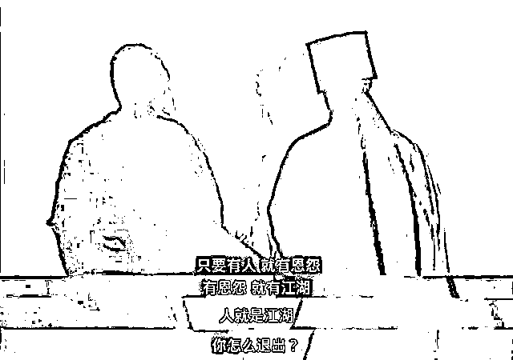

# 撇开事实不谈，俄罗斯就没有错吗？

> 原文：[`mp.weixin.qq.com/s?__biz=MzU0MjYwNDU2Mw==&mid=2247504444&idx=2&sn=23776119d9161abb2980d17ce56257b3&chksm=fb1abe40cc6d3756d6f3e642a9be446b586241609efcd9facba9f15ae8b68616543a64e11488#rd`](http://mp.weixin.qq.com/s?__biz=MzU0MjYwNDU2Mw==&mid=2247504444&idx=2&sn=23776119d9161abb2980d17ce56257b3&chksm=fb1abe40cc6d3756d6f3e642a9be446b586241609efcd9facba9f15ae8b68616543a64e11488#rd)

有个读者问了我一个很有意思的问题，内容很充实，但我真没法像以往回答读者问题那样稍加整理后贴出。 

因为他写得实在是太长了，上万字。我们历史上最长的不限字数的付费文章，7000 字。你这上万字弄出来，我就啥也别说了。

我来发挥一下自己的概括能力吧。 

他应该是看了很多很多持有不同观点，不同立场的大 V 的文章，然后梳理了各种素材，最后给出了他自己的观点，就是标题。 

先看看他提供的素材吧。

素材一、从戈尔巴乔夫时代开始，美国给出的承诺就是北约到德国为止，再不东进一步。但是后来呢？美国从来也没有契约精神，一次又一次的违约，北约一直在东进，缓冲地带完全消失，都快要试图合并昔日的二毛了。如果乌克兰也加入北约，那么事实上，就已经成了美为刀俎，俄为鱼肉的局面。

素材二、其实全世界没有人威胁到美国的本土安全，即便在这样的情况下，美国依然发动过很多战争。

1950 的朝鲜战争，1955 年的越战，1980 的两伊战争，1990 的 海湾战争，1993 的索马里战争，1999 的科索沃战争，2001 的阿富汗战争，2003 的伊拉克战争，2011 的利比亚战争，2013 年的叙利亚战争等等等等。

素材三、古巴导弹危机的时候，美国先在土耳其和意大利部署中程导弹，但是不允许前苏联反制，在古巴部署导弹。 

素材四、2016 年，联合国投票打击纳粹。所有的国家里，只有两个反对，一个是美国，另一个是乌克兰。 

为什么呢，因为乌克兰有一个亚速营，他们的特点就是纳粹化。但是极度亲美，极度反俄。站在美国的角度，很容易理解为什么投反对票，毕竟利益远大于道理。

素材五、乌克兰的纳粹主义者杀害了数万俄罗斯族人，与之对比的是，在这场战争中，反而是两名俄罗斯的士兵用身体挡子弹，救了乌克兰女性一家人。

这是我们这位读者这些天，总结的素材，基于这些素材，他坚持自己的道理，那就是和平大于一切。

这位读者是一个非常爱好和平的人，在他的价值观里，和平永远是第一位的。 

他说，**无论事实是什么**，发动战争都是不对的，这一点，西风，你认同吗？ 

这是他的第一个问题，还有一个问题，他一共问了两个。

第二个问题是，站在普通人的视角，**无论什么情况下**，永远支持和平，才是最好的选择，西风，你认同吗？

我不认同。原因已经给你加粗了。 

这话，如果搁在一个《三体》书迷身上，或者搁在一个刘慈欣粉丝的身上，我就不用那么多解释。一句话就可以了。 

宇宙的第一法则是生存，不是无论。 

所以无论后面不能跟空乏的大道理，无论后面只能跟生存。这是刘慈欣说的，据说奥巴马曾经看得十分入迷，成天催稿，助理不得不跟他解释，那个中国作家刘慈欣还没完稿。

很显然，这位读者肯定不是《三体》书迷。那只好花点口舌了。 

我们首先站在乌克兰普通百姓的视角。 

作为一个普通人，你当然不希望发生战争，但是要知道，不发生战争，不等于你就是安全的。 

那个乌克兰的小姑娘站出来哭诉，自己的族人在过去数年中，被杀害了数万人，他们难道是安全的吗？ 

用《笑傲江湖》里那句话，有人的地方就有江湖，因为有人的地方就有利益纷争，你以为退隐牛背山就能退出江湖？ 

任我行都要笑了。 

你把地球看成一个馍，张三多吃一口，李四就要少吃一口。很多事情叔可忍，婶不可忍。 

你也不想想看，叔叔家里如果总来穷亲戚打秋风，婶婶不也给脸色看么？

一家人都能这样，何况跨族，跨国呢？ 

所以作为那些生活在乌克兰的俄罗斯人，他们的处境是尴尬的。 

我知道你要说什么，你说干脆全部投降美国不就好了吗？都跟美国做小弟，不就天下太平了吗？

你太天真了。你活在一个农耕视角下，而不是商业视角。

我们穿越回古代，所谓的农耕视角就是诗经里那句话：普天之下，莫非王土，率土之滨，莫非王臣。

这话听起来很霸气，其实不是那意思。

拿你当臣，是拿你当一家人。这是农耕文明特有的思路。就是说，征服之地，视同一族。

不仅拿你当自己人，甚至有可能还要倒贴，补贴你钱，补贴你各种福利。

你去翻看历史，中原王朝一直都是这个思路，经济主要靠黄河流域的时候，就由黄河流域补贴周围，经济主要靠江南的时候，天下赋税半出江南，江南来养活大家。 

商业文明是什么思路？不是这个思路的。 

**商业文明不要你的地，也不要你的人，要什么？要你源源不断输血给他。**

[前两天我怎么说的，都忘了么？](http://mp.weixin.qq.com/s?__biz=MzU0MjYwNDU2Mw==&mid=2247504389&idx=1&sn=a44933d64bafb703194ecb81bbf51023&chksm=fb1abe79cc6d376f5b4c16cd99c007aed770b7230e85c7fa19c964646d62d35094eab0e59b6d&scene=21#wechat_redirect)天底下大部分的结论都和你的阅历相关，和是非对错没有那么大关系。你想不通的，等你阅历到了，你不用想也是通的。

我当年在甲方做架构师的时候，怎么跟自己直属小弟们说的？ 

那种探路式的，方向不明确的工作，那种有可能出错的，都交给供应商派驻的技术团队去做。等他们把路探明了，你们再上。

听得懂这意思吧？ 

我现在不清楚技术方向，也不清楚能否出结果，我需要很多人去反复试验，试到什么时候呢？试到我觉得有把握了，觉得研发路径明确了。 

这个探路的工作是很苦的，天天要加班，周一到周日，没有休息。所以我跟手下交待，你们的工作就是盯他们，你们可以歇，他们不能歇，他们歇你们就去告状，去他们老板那里告状。

事情做不成，原因很多的。有可能是这个方向本身就不通。那怎么办呢？大领导问起来怎么回话？ 

很简单，都是供应商不给力。当然是他们不给力呀，因为我们没有出兵，现在只有他们在做，谁在做，谁有错，我们没做，怎么可能有错呢？

如果路探明了，这事儿真能成，怎么办？马上出兵，自己人上，摘桃子。我们必须要把核心技术快速拿下，这样才能往死了压价。 

你想卖给甲方卖高价？对不起，核心技术我们来掌握。你只能赚辛苦钱。你说你的兵前期有多少投入，那又如何？商业社会嘛。一切都是市场决定的，愿赌服输。 

你觉得太坑了对吧？我遇到过好几次供应商的团队私底下跟我谈招安。他们是真心想要被我们收编。 

一份又苦又累又看不到前途又没有功劳的工作，和一份趴在别人身上吸血，不出力还总能抢头功的工作，搁谁谁都选后者。 

招安？可能吗？ 

**如果把你们都招安了，你们的工作谁来做呢？** 

爱迪生发明灯泡，最后能够卖钱的是那个成功的配方，问题是，没有前面 999 个失败的配方，哪儿来的最后那个能够卖钱的配方呢？ 

这就是商业的奥义，成本与利润率。失败尽量留给别人，才能提高自己的利润率。 

商业游戏的本质我跟谁学的？跟美国人学的。你反过来看，徒弟都会的，师父能不会吗？

美国人要的是你乌克兰的地和人吗？不是，他们要的是你的利用价值。 

中东对他们来说，有石油，非洲对他们来说，有原料，哪怕是老家欧洲，对他们来说，也是随时通过避险情绪收割的存在。

那你站在俄罗斯的角度也是一样的，俄罗斯就算忍无可忍，继续再忍，没有用的。

人家打你左脸，你把右脸也伸出去，就能换取和平吗？不会的。你太天真了。

你始终是站在制造业的角度看待商业。制造业的特点是与人为善，我劳动，我提供价值，我与客户搞好关系，共赢，你有赚我也有赚。 

但是**商业游戏越靠近金融，就越不是这样**。金融游戏想的是我怎么把你多年辛辛苦苦的劳动一把拿走。 

**你注意，是你的劳动成果，不是你这个人。**你这个人人家不想要，不想要你加入人家的团队，人家只想要你的成果。

所以你想要和平，我非常理解。但是**你要弄清楚，你要来的是怎样的一种和平。** 

是一种平等或者接近平等的和平，还是从此之后别人趴在你背上吸血？

我本来还想聊几个华尔街的故事，后来想想不聊了。咱们今天的视角是普通人，站在绝对普通的基准线上看问题。

站在绝对普通的基准线上看问题，如果你所在的国家不强，就像职场里你跟了一个不强的团队，想要过好日子，是没可能的。 

你想想前面那个故事，我的手下和那些人的手下能力上有啥区别？为什么他们干最少的活拿最多的钱，而对方干最多的活拿最少的钱呢？

因为我打赢了呀。你们在那里写程序调试，你以为我在干嘛？ 

我在申请资源，包装成果，挖坑，埋人，点眼药，耍阴招，挑拨离间......

斗是不可能避免的，尤其团队之间。所以标题的这个问题，没有讨论的价值。

就像在职场里一样。作为团队中的一员，自己老大赢了，还能跟着喝汤，自己老大输了，只能被收编，被边缘化，去做最苦最累收益最低的工作。

人家团队里的人，有人家的立场，唇亡齿寒团队里的人，也有自己的立场，对手盘团队里的人，也有自己的立场，无关团队里的人，也有各自的立场。

无所谓对错，小孩子才聊对错，成年人都是用屁股思考问题的。

在这个话题上，2 月 27 号的时候 BBC 就说过了，俄罗斯如果输了，下一个就是我们。

所以只要你脑子正常点，你就该知道只有我们强大了，作为普通人，作为只会洗盘子的人，你才能收入翻几倍。

这就是你最该期盼的事情，没有之一。普通人又不是白马，大盘不涨你怎么涨呢？

要知道每个人的屁股不一定是一样的。

你也不看看，这帮反战的大 V，有谁提过哪怕一句美国的所作所为？美国那么多次入侵别国，他们一声不吭的。反战不提美，心里都有鬼。

我没有骂他们的意思，相反，我很理解他们。收了人家的钱嘛，说穿了还是屁股决定脑袋。只是人家的屁股和我们已经不同了。

你没必要管人家怎么想，[我很早就说过了](http://mp.weixin.qq.com/s?__biz=MzU3NDc5Nzc0NQ==&mid=2247513575&idx=1&sn=41b621c129b867c93cbd0eb7d67b4f4b&chksm=fd2e1739ca599e2f28e563d642b0e6ee0471505f0db00ce7d5d4ac92bdc8cbc992da8ed1903a&scene=21#wechat_redirect)。作为普通人，人家大 V 有机会收钱，有机会出卖，你可没这些机会。

你就是个普通人，团队整体强，才有更多的就业机会，更好的就业机会，你才能过得更好。