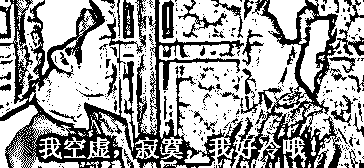

# 这个杭州模特非婚生下三个混血孩子引起了热议

> 原文：[`mp.weixin.qq.com/s?__biz=MzU0MjYwNDU2Mw==&mid=2247503635&idx=1&sn=be97c1e4c04d362079442fd6e8f39cf3&chksm=fb1aa36fcc6d2a797e52834bbb107347413e2bec33d68b421428c58857f88116df09b42e41f4#rd`](http://mp.weixin.qq.com/s?__biz=MzU0MjYwNDU2Mw==&mid=2247503635&idx=1&sn=be97c1e4c04d362079442fd6e8f39cf3&chksm=fb1aa36fcc6d2a797e52834bbb107347413e2bec33d68b421428c58857f88116df09b42e41f4#rd)

[自从那天引入了一张网络上盛传的 ABC 男，ABC 女的图](http://mp.weixin.qq.com/s?__biz=MzU0MjYwNDU2Mw==&mid=2247503604&idx=1&sn=aa8a5cb4045943468edd95dabbbec1b2&chksm=fb1aa288cc6d2b9eead1250203b2b6b07752f33d22fddf5b4fde6150118e4a6009013e7725a2&scene=21#wechat_redirect)，加上[前一天我建议 C 男出海](http://mp.weixin.qq.com/s?__biz=MzU0MjYwNDU2Mw==&mid=2247503598&idx=1&sn=cd143b9f1ecaf9cbbbc75b733ba3f20d&chksm=fb1aa292cc6d2b84afc5f87e515c270e3ef185928454eb889dad6e4452df0aaa9ef9108de972&scene=21#wechat_redirect)。

一直有读者问我，为什么不给 A 女出出主意。见我始终不回复，就有热心的读者建议，A 女可以“去父留子”。

既然找不到中意的男性，为啥非得进入婚姻才能有孩子呢？合法的单亲生子，好像也是一条路哦。

我始终不搭腔，原因很简单，因为 C 男的问题好回答，A 女的问题不好回答。 

你问我说，我想要找一份工作，这个很好回答，去开滴滴嘛，买不起车可以去送快递，如果连身份证都没有还可以去工地上打灰。

但是如果你问我说，我要找一份好工作，这个问题就很难回答。 

什么叫好工作？就是让人眼前一亮的，真要是眼前一亮，我干嘛要介绍给你呢？有好处也是自己先上呀。 

所以复杂的问题只能当事人自己去权衡，外人不方便说什么。 

就比如这个问题，“去父留子”。 

如果关起门来说私房话，你问我的态度，我会告诉你两个字：无感。 

这是别人自家的事，一个女人，她找不到中意的，不愿意凑合进入婚姻，又想要有个自己的孩子，也有经济能力，等不下去了，自己的生育周期有限，于是乎决定，成为一个单亲妈妈。 

我完全能够理解，完全。 

但是搁在公开的场合，我会沉默，如果你一定要问我的观点，我会强调以下几点。 

1、途径要合法。精子的来源是什么，正规的，对方要不知情，你不知道对方是谁，对方也不知道你是谁，保护双方的隐私权。

2、过程要合法。你得自己生，在正规的渠道下，通过正规的机构。

为什么要强调这么多？为了保护男性，也为了保护女性，更为了保护孩子。 

小龙女的故事我们都知道，这个过程中其实所有人都是受害者，最大的受害者是那个孩子。 

人家都是因为爱而出生，她是因为算计被出生。 

这个过程中那个算计的女人负有很大的责任，那个不洁身自好被盗取精子的男人也负有很大的责任。而那个成为筹码的孩子是无辜的。 

要知道这还是原始的手法，在现代技术的辅助下，卵子是可以被冷冻的，怀孕的过程不一定是由自己完成的，郑爽是怎么凉的，大家都清楚。 

换句话说，这个过程如果非法就有可能伤害别的女人。

有人说，一个出钱，一个出力，怎么就非法了呢？ 

那你想想，新社会为什么取缔了八大胡同？ 

八大胡同里也说是自愿的呀，老鸨让姑娘们管她叫妈妈的，人家都说是在和客人们谈恋爱，so tama what？ 

传说中你还是自愿加班的呢，你是吗？回答我你是吗？如果被威胁了就眨眨眼。 

别闹了，姑娘们能不自愿么？被人家打骂威胁着写了欠条，或者染了毒瘾，这就是为什么出卖自己的身体器官是违法的原因。 

你不清一色的定义为非法，就一定会有胁迫产生，就一定会有很多年轻女性被沦为代育机器。 

所以郑爽跑去美国做那种事嘛，她反复强调的是自己做的事情在美国是合法的。 

对不起我们不是美国，就像我们也不是日本。 

日本媒体抽样调查显示，高一以下的女生有 13%有过援交行为，高二达到 32.3%，高三达到 44.7%。你注意，这不是结束，这只是开始。这种“援助交际”还存在于女大学生、女护士、女教师、家庭主妇当中，以至于日本媒体后来改变了采访模式。

他们采访，到底有多少日本女人从头到尾，终其一生都没有过援交行为....... 

[难为我们昨天还花了一整篇的篇幅讨论日本女人爱不爱钱](http://mp.weixin.qq.com/s?__biz=MzU0MjYwNDU2Mw==&mid=2247503616&idx=1&sn=8554828f6be986069aadbc48b9e5a6ba&chksm=fb1aa37ccc6d2a6a5959cb33e15472bc83b5cada61fa0ccff03bc862a50a014a966575bebec6&scene=21#wechat_redirect)，不爱钱为什么援交呢？难道是？

哦，我懂了。

回到正题，我们不可能，也永远不可能像美国，日本那样忽视最底层人的安全问题。 

在这个基础上，很多事情一定是不被鼓励的。 

你注意我的措辞，我用的仅仅是不被鼓励，并没有说反对。

举一个例子，这两天被热议的沸沸扬扬的杭州某个女模特。 

她是一个创业者，某公司 CEO，是一个模特，是一个微商，也是一个 30 岁的妈妈，单亲妈妈。 

她之所以被热议是因为生了三个宝宝，混血。 

网上骂她的声音很多，支持她的也很多，后者就不赘述了，支持的原因很简单，人家爱和谁生，是人家的私事。 

那么骂她的话就五花八门了。 

非婚生子，混血，炫富，每月花 10 万请了三个保姆分别照顾这三个孩子。

骂她的内容，我基本上都不认同。原因很简单。 

1、如果是骂她炫富，那么应该做的事情是审查，对她的收入进行调查，她这些年怎么赚的钱，有没有非法收入。 

换句话说，一个人有钱不是错，有多少钱都不是错，只要经得住调查，享有自己合法赚来的财富是一个人的权利。

2、如果是骂她非婚生子，那么重点还是审查，途径审查，重点查查有没有代孕，是否通过合法渠道。 

我前面说得很清楚了，婚生也好，非婚生也好，这些不构成你歧视别人的理由。她只要没有花钱去购买别人的子宫，那么她就没有侵害别人的利益。她在法律的框架内自己非婚生了三个孩子，是好事嘛，有利于生育率。

3、混血。

这一点诟病的人最多，解释起来也最难。我试着解释一下我们汉人的形成。

我曾经写过一句话，胡人居于汉地则为汉，汉人居于胡地则为胡。

这句话讲清楚了过去几千年来我们民族是怎么融合形成的。

我们没有谁是纯粹的古汉人的后人，我们无论谁，身上或多或少都掺杂着少数民族的血统。 

这影响今天你我之间彼此认同了么？ 

没有。 

为什么没有？就是我前面那句话：胡人居于汉地则为汉，汉人居于胡地则为胡。

我们几千年的封建王朝史，就是一部农耕民族与游牧民族打来打去的游戏。 

周幽王烽火戏诸侯，架设烽火台搞了一套原始的电报，一个地方被游牧民族侵袭，就报警，四面来救。

秦始皇修长城，搞了一套移动高速公路网，在长城上运兵运粮是很快的。你打一个地方，别的地方沿着长城马上来救。

汉武帝主动出击，花几代人，硬是把匈奴打的西迁。

到这个时候，问题解决了么？没有。

为什么没有？

打是要成本的。汉武帝时期，三十石粮食运到边地仅剩一石，为什么？因为运输损耗，运送的路上，马也要吃草，人也要吃饭。

那么打下来，你占不占？你不占，汉朝的兵走了，游牧民族又聚拢了来，到了西晋，你一衰落，人家又占了回去。

西晋时期塞外众多游牧民族趁八王之乱，国力衰弱之际，陆续建立匈奴、鲜卑、羯、羌、氐，形成与南方汉人的对峙。

史称五胡乱华。

你看到了么？没用。只要这块地在，一定会产生新的游牧民族。

到了唐朝，想出来的办法就是融合，要不大家试着一起过？你熟知的那些高仙芝，哥舒翰，安禄山，都是胡人。

唐朝干脆在当地成立一个节度使，派点汉人过去一起住。

问题是，久而久之，这些新汉人，会不会胡化？

新移民怎么在草原戈壁上生存？是不是得放牧？是不是得按照草原的方式生活？

那天长日久，他们就变成新胡人了。

汉人居于胡地则为胡。

这个问题是怎么解决的？是进入现代社会后，用公路网，交通线，经济融合，文化融合解决的。

我得把你纳入到同一个游戏体系里来。这个游戏就是好好学习，天天向上，参加高考，考得好去北上广深，想办法买房买车娶媳妇，留不在一线去二线，下一代继续。

只要这个人相信这套游戏，无论他祖辈是什么，他都是地地道道的汉人。

我认识好几个同学，同事都是祖祖辈辈在草原上放羊的，你问他还放羊么？

等一个人考上 985，念完硕士，升了高管，期权套现，买了房子娶了媳妇加入京户，你跟他谈草原？ 

他早就把长生天忘了，此间乐，不思草原。

我知道网友看见那三个混血的宝宝，觉得他们长得和别人不一样。问题是，只要他们跟咱这儿生活，早晚都会一样的。 

一个中国人跑到美国去，两代之后，也会黄皮白心，反之亦然。橘生淮南则为橘，生淮北则为枳，人是环境塑造的。

对于这个“去父留子”的单亲妈妈，我觉得只要人家一切途径都合法，那就没有什么值得诟病的。

当然，即便一切合法亦不值得鼓励，因为没法鼓励。 

你稍微动动脑子，就该明白对于一切高收入群体而言，单亲生育都是划算的。不仅对高收入女性是这样，对高收入男性也是一回事。

单亲生育意味着没有婚姻带来的财产分割风险，还没有约束，这是多么完美的解决方案？ 

问题是，如果你鼓励“去父留子”，意味着什么？意味着高收入的男性也会动了“去母留子”的心思。

那么有多少没钱的女性，有可能受到伤害？ 

很多时候，自由的背后就是不自由。 

我们约束一个有钱人，实际上是为了保护没钱的人；我们约束一个成年人，实际上是为了保护一个未成年人。

当然，只要合法，一切行为别人都无权质疑，只是够不够得上被鼓励，被赞美，被广泛宣传乃至成为榜样，那要看是否有益于多数人的利益。