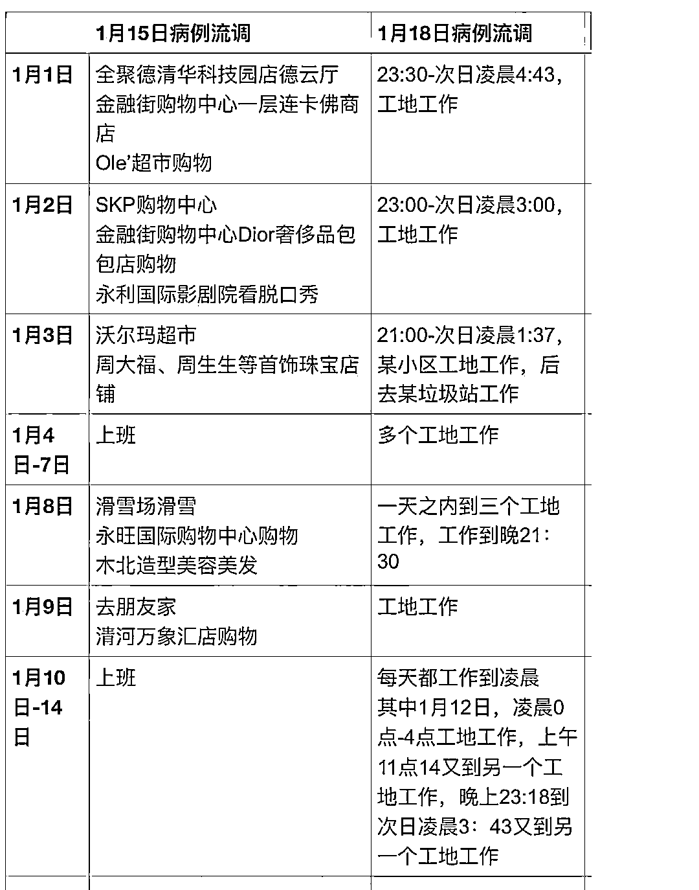
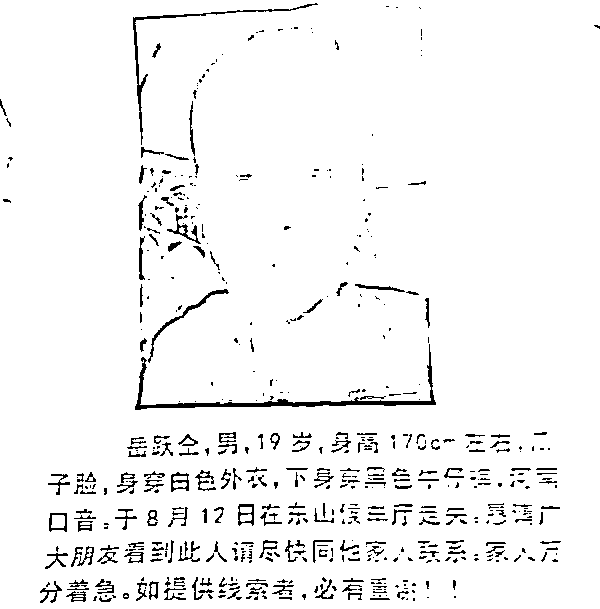

# 北京的两份流调报告如果搁在一起

> 原文：[`mp.weixin.qq.com/s?__biz=MzU0MjYwNDU2Mw==&mid=2247503583&idx=1&sn=231fabc325470797671065524dc39934&chksm=fb1aa2a3cc6d2bb5e710056181ded5715b221b4eb4ea4508daf399696044cdaa51c2e545cfd7#rd`](http://mp.weixin.qq.com/s?__biz=MzU0MjYwNDU2Mw==&mid=2247503583&idx=1&sn=231fabc325470797671065524dc39934&chksm=fb1aa2a3cc6d2bb5e710056181ded5715b221b4eb4ea4508daf399696044cdaa51c2e545cfd7#rd)

这是有心的网友把两份公布的流调报告合并在一起后的样子。

图的左边，是一位确诊患者，图的右边是另一位确诊患者，他们的时间有交集，但是地点没有，内容没有。

我们可以看到同一天，有的人或者在购物，或者在娱乐。而有的人，正从一个工地奔向另一个工地。

如果你对这二人做个私下的采访，问问他们对北京留下的印象，你猜猜看，会是一样的么？

我把这个对比拿出来，可不是给你聊什么《北京折叠》的，虽然做这张表的人也许想要说的就是那点事。

我拿这幅图，只想告诉读者一件事，同一个城市，人不同，感受是不同的。

前几天，我在大号里聊的始终是性价比，是一笔账，是请不同牌面的人，思考下，如何打好手里这副牌。

但是很多读者最后都不由自主的引向了地图炮，而且不由自主的开始划阵营。

我能够理解这种情绪，有首歌怎么唱的？人人都说家乡好。

这句话听起来很简单，真正想明白这个观念怎么来的，并不简单。

我们长期是个农业社会，大规模的工业化是最近大几十年的事儿。绝大部分的城市人口往上推三代，都来自农村，都是农民，都曾经以种地为生。

对于农民来说，所谓的家乡本质上是土地，你有块地，那才是你的家乡。

所以古人很不喜欢离乡，离乡意味着离开自己的财产，通常离乡不是逃难就是灾荒，等待他们的往往也是卖身为奴，或者为佃户。

人人都说家乡好这句话背后的潜台词，是农业社会人们对自己耕种的土地，或者讲对于生产资料的眷恋。

这种长达数千年的习俗经过一代代的口口相传，最后就变成了一种意识，进入商业文明后，你的潜意识里仍然保留了这种观念。

这才是为什么地图炮能够打起来的原因。

但是如果你的理智超越了潜意识，你就会意识到这种互打地图炮，是荒唐的。

就比如我们这个例子，两个确诊患者的例子，这两个人都待在北京，你觉得他们的幸福感相同么？

他们幸福不幸福难道不是直接和他们的财产关联，和他们的收入关联，难道是和这个城市关联吗？

有人可能会说，第二个人不算北京人，他只是来京打工的。

那我告诉你，第一个人也可能不是北京人。

你不需要有北京户口，你不需要在北京买房，只要你足够有钱，你可以天天在北京消费，天天。

第二个人假如能够有房，也不是和哪里人挂钩，而是和财产本身挂钩，你有钱，你就可以想怎么消费怎么消费，想去哪儿消费去哪儿消费。

你付费了，你掏得起钱，你就是客户，是盘古酒店不接待你，还是全聚德不接待你？

如果你能够忘掉农业社会带给你的残留，你就会很清楚所谓不同的城市，只是不同的店。

你在不同的时期，不同的消费能力下，根据自己的需求，选择不同的店，仅此而已。

中国有所大学，门口立着块石头，上面有两行字：

1、你来这里做什么；2、你走的时候希望成为一个什么样的人。

这两句话放在城市这个话题上也很适用，城市其实就是你经过的大学，单位。

我把这话说的现实一点，所谓你来这里做什么，无论你是生在这里，求学在这里，工作在这里，还是买房在这里，都要想清楚，自己在干嘛，每天在干嘛。

而第二个问题是在问你，当你离开的时候，你准备带走点什么。

就比如鹤岗，你觉得鹤岗有什么不好？觉得鹤岗不好是一种情绪，能说清楚鹤岗哪里不好，是一种理智。

在我看来，鹤岗确实不好，因为如果我花十年待在鹤岗，赚到钱的概率很低，我在鹤岗买套房子，升值的可能很低，转手卖出去说不定还亏了。白搭十年光阴白搭十年本金，当然不好。

那如果反过来，假如过去的十年，鹤岗一切都不变，所有的一切都还那样，只是鹤岗当地的房价涨二十倍。鹤岗好不好？

好呀，有什么不好呢。你在鹤岗投入了一百万，十年后带走了两千万。拿着两千万你去逛街，连卡佛里买衣服，能买一千多件，天天换新衣服你都能穿几年。

这是谁带给你的收益？是鹤岗。

这就是商业社会下的思路，能上市能让你股票解禁的公司就是好公司，一个商业文明下的现代人，一辈子会经历很多城市，正如同你会经历很多公司。

即便你始终待在一个城市也不见得是因为农耕文明的那个原因，这就像你在腾讯在阿里待了十几年，你觉得为啥？因为你每年都做出了一次新的判断，给你的回报率够不够，够，你才没有跳槽而已。

换句话说一旦有了更好的，你抬脚就走了。

你之所以能够抬脚就走也是因为资产流通变现的渠道畅通，古人安土重迁，不是什么乡土眷恋，说到底，就是因为那块地。

你真给他一块别处的封地，他抬脚就走了。《雪中悍刀行》里面徐骁是北凉人么？是么？

徐骁不出生在北凉，不求学在北凉，不起家在北凉，问题是，他的封地在北凉，他是北凉王。

所以他口口声声北凉如何如何。他不是北凉的，北凉是他的，理解？

想一想，自己的北凉是什么？

有跟过四年的老读者，问我，怎么从来也没听我聊过我的家乡，我的母校，我家住哪儿，.......

因为你加的那个前缀“我的”，在我看来，并不成立。

我是这么想问题的，如果我没钱了，我的家乡会养我么？会让连卡佛送我衣服穿么？会么？如果我失业了，我的母校会收留我么？会给我安排个编制吗？

如果都不会，那就不是我的家乡，我的母校。你弄错了归属关系。

北凉是徐骁的，而你，是北凉的，拎得清这里面的归属关系么？

拎不清自己画张图。

如果我不交物业费，所谓的我家，真的是我家么？

把我说的这些问题想清楚你就会发现你问的那些问题，很幼稚。

我的注意力从来都只集中在给我下金蛋的鹅身上，因为那才是我的北凉。

我的，我的，我的，重要的问题强调三遍。

徐骁很清楚，只要手握三十万大军，他就还是徐骁。

你也要清楚，只要你始终能够付费，哪个城市都会对你说：XX 欢迎你。

该跟读者说的道理说完了，文末说点无关的，和我们其实都无关，但是和今天被咱们引用的这个例子里的主人公有关。

这个没日没夜奔波在北京各个工地上打工的确诊患者，他是为了挣钱，也不是。

确切的说，他是一边工作一边找儿子的，他儿子丢了。大儿子今年 21 岁，已经失踪两年，小儿子今年上小学六年级。

他一方面要打工赚钱找大儿子，另一方面，要养家里的小儿子。

我把他丢失的大儿子的照片贴出来，希望有看到的人，能帮到他。

这件事官媒已经关注了，目前山东荣成公安局正在调查，希望有消息的网友，直接通知官方。