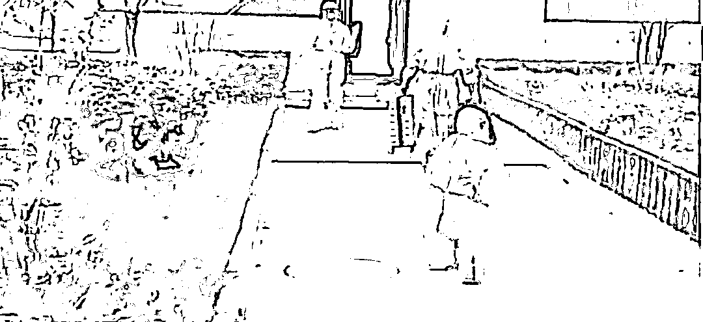

# 西安 3 岁的萌娃确诊被隔离，独自转院，懵懂回头

> 原文：[`mp.weixin.qq.com/s?__biz=MzU0MjYwNDU2Mw==&mid=2247503352&idx=1&sn=8e3e8b2054a3016bf700798b2f996a40&chksm=fb1aa184cc6d28929ed7f3ee4aab1d1dcbe16645d88a32e15fc59b49d70cf659841fd1f8ff0f#rd`](http://mp.weixin.qq.com/s?__biz=MzU0MjYwNDU2Mw==&mid=2247503352&idx=1&sn=8e3e8b2054a3016bf700798b2f996a40&chksm=fb1aa184cc6d28929ed7f3ee4aab1d1dcbe16645d88a32e15fc59b49d70cf659841fd1f8ff0f#rd)

昨天大小号两篇文章，[有些别有居心的人，连唐代长安的坊市制度也拿来说事儿了](http://mp.weixin.qq.com/s?__biz=MzU0MjYwNDU2Mw==&mid=2247503341&idx=1&sn=eb56ee6e774bf1f9c0c18983c0677d58&chksm=fb1aa191cc6d28873634ee521e7420c4455a3e091d412ac4f2b269daa9520cf506fef2821431&scene=21#wechat_redirect)，[我对西安这种屈服于舆论的道歉，深感悲哀](http://mp.weixin.qq.com/s?__biz=MzU3NDc5Nzc0NQ==&mid=2247511623&idx=1&sn=fbb75b1af922b81e58bce3752308726e&chksm=fd2e0c99ca59858f7f1eef5e5fbb1ceb05da2dc3e9bd19274ed9c3b4b571b5e321374c1a4265&scene=21#wechat_redirect)。 

拉黑了很多人。

我这人就是这么干脆。 

有个老读者问过我，为什么我从不给人反驳的机会？或者讲，我不给人表达的机会？

在文化人眼里，被允许表达不是世界上最重要的事情了吗？

你已经说了呀，在文化人眼里，我又不是文化人。 

在我看来，只有鸭子才把是否被允许表达看的那么重要，否则鸭子为什么肉烂了嘴都不烂？

我又不是文化人出身，我又不靠写书过日子，我混迹国际市场十几年，我做高频交易的。 

很多人不知道何所谓高频交易，他们把那个当作炒股，或者讲，他们理解的国内的炒股。

国内连日内交易都不允许，哪儿来的高频？你高一个我看看？

在职业高频的眼里，国内那种炒股跟工地上打灰搬砖的没啥不同，同一个风险等级。 

国际市场里职业做高频的，这些人的死亡率，高于毒贩，你品，你仔细品。

我说的死亡率不是爆仓率，是最后赔光了上天台跳下去，或者主动吞“花生米”。

毒贩的死亡率是非常高的，在国内逮住就是个死，在国外成天火并，也剩不下什么活口。 

做高频的，比这个风险还大。

所以你跟我讲表达很重要？表达有什么重要的？十几年来，市场给过我表达的机会么？

市场甚至没有给过我拉黑的机会，市场从不拉黑我，他让我领盒饭我就真的领盒饭了。 

我聊过很多部电影，除了李连杰的《投名状》。

不是不能聊，而是不想聊。

我很喜欢庞青云的那句台词，他说我十几年来都走在满是裂纹的冰面上，我踩的每一步，脚底下都嘎吱嘎吱响，我不清楚哪一步，冰就会碎，我就会万劫不复。我每一晚都梦见刀锋划过我的脖子，往前望去，看不到对岸，往后望去，早已远离来时的路，前无进路，后无退路，每一步都战战兢兢，如履薄冰，每一天都在生死边缘打转.......

我拉黑你怎么了？我拉黑你是爱你好不好。我只是剥夺了你抬杠的权力，这算什么？ 

有读者说，西风，你的视角永远和人不一样。 

当然不一样。

一个每天待在湖中心，如履薄冰，一步踏错就得领盒饭的人，他想问题的角度和那些吃饱了饭剔着牙线嚼舌根子的文人，当然不一样。

我看问题必须一眼就看到问题的本质以及问题的演化，或者讲，演化中的关键点。 

如果我看不到一次，只要一次，作为一个高频交易者，那么高的杠杆，瞬间，就会灰飞烟灭。

所以这是本能，或者讲，职业习惯。 

给大家看一张图，陕西都市快报发的。

一个三岁的孩子，被确诊了，独自转院去长安区隔离，他穿着与年龄不符的防护服，跟在医护人员的后面，一步一回头。

如果你们真的要反对隔离，没有什么比这个更打动人的，这比什么无法及时领取姨妈巾，让人泪目的多。 

知道我看到这张图的第一反应是什么？是我感慨幸好有隔离。 

你想知道如果我们没有封城，没有隔离，采取美国那种模式，接下来会发生什么吗？ 

咱们对比一组数据。

美国排名第一的是麻省总医院，床位接近 900 张，员工超过 21000 名。著名的梅奥诊所床位接近 1300 张，员工数 28000 多。

国内医疗资源最顶级的是协和医院，床位数 2000 多张，员工总数 4000 多。

而协和的接诊量是梅奥的一倍还要多。 

你注意，我选择了一个很意思的视角，我用了我们年收入实际上已经步入发达国家序列的北京地区，我对比的是双方的顶级医院。 

如果往下看，美国整体上医疗水平很强，医生占比很高，而我们出了北上广深，医疗就要降一个台阶，出了天津，南京，杭州，武汉，西安，郑州，苏州，重庆，成都等等二线城市，医疗又要降一个台阶。 

你猜猜看，一个四线小镇，他们的床位，员工，是怎样的？ 

如果我们不采取封城，流调，隔离的策略，任由你眼里死亡率也不算太高的疫情自然蔓延。你马上就会体验到真实的泰坦尼克。

你以为的泰坦尼克是什么？是电影里演的？有钱人都聚集在船头，拉小提琴，把救生艇让给三等舱的妇女儿童？ 

醒醒吧。

我就问你一句话，如果你很有钱，你是会去想办法在救生艇上买个舱位，还是会待在船头拉小提琴？ 

正面回答我，不要犹豫。

就算你有绅士风度，如果是你的孩子呢？你的父母呢？你会不会为他们买一个舱位呢？ 

我可以负责任的告诉你，天底下的有钱人，基本上全都会为自己，或者家人买舱位的。 

这里的舱位指什么？指医疗资源。 

是，得了新冠不见得很严重，死亡率也不高。问题是现在你有钱呀。 

天底下最痛苦的事情是人还没死钱花光了吗？

不，天底下最痛苦的是钱还剩一大堆，人提前死了。

没有哪个有钱人愿意接受这种自然死亡率的筛选，没有。 

你会那么想，只能说明你太穷了，你穷的连想象力都没剩下。你根本想不明白有钱人会怎么做。 

有钱人可能会死于意外，但是如果他知道自己确诊了，他知道花钱可以提高生存率，他一定会花的，因为他有的是钱。 

如果大量的人同时感染，就一定会出现医疗资源挤兑。这种挤兑并不是你以为的一群人去排队，而是你根本排无可排。 

如果你是一个医生，现在有两个选择，给一个 KFS 老头看新冠，他会给你一套房子，医院门口的；给一个没钱人家的孩子做心脏手术，他的父母会对你千恩万谢，当然，也可能是医闹。 

你会怎么选？

别骗自己了好吗？我们都正常点好吗？你一定会选择给 KFS 老头看新冠的难道不是吗？ 

否则呢？否则你要熬多少年？从住院到主治，从主治到副主任，从副主任到主任？你心爱的女孩早已嫁作他人妇，而你，只剩常年加班留给你的静脉曲张与腰椎间盘突出？ 

现在钥匙就在你面前，拿到它，你就可以迎娶美人归。 

回头看一看我们的医护人员的人群占比，哪怕是协和，能和美国比么？ 

再给你看一个数据，胡润的全球富豪榜显示，中国的富豪比美国还要多哦，北京的富豪比纽约还要多哦。 

一头是医疗资源这么少，一头是有钱人这么多，你觉得会发生什么？ 

床位上躺着的到底会是那些有钱的症状不重的新冠患者，还是急等救助的重症患者呢？

有钱人多买了几套房子，大家就受不了了，就苦不堪言了。如果买的是医疗资源呢？ 

有钱人可以不多买房子的，因为投资标的物多的是，不玩 A 可以玩 B，可是生病了，谁会忍着不看呢？ 

你阻挡得了么？ 

大医院说，摇号，谁病重谁进来，人家可以直接把医生挖走。你不是想买房么？送你两套，出来干吧。 

....... 

医生总量就这么多，如果忽然迸发出大量的患者，哪怕看起来就是咳嗽感冒，它也会对现有的体系产生你想象不到的冲击。 

到那时候就不是一个两个人生孩子排不着队了。 

一个两个人生孩子排不着队，是管理问题，管理问题就有办法处罚，就有办法改正，起码有个盼头。 

真当医疗资源挤兑的时候，你拿啥解决？靠你那张肉烂了嘴都不烂的鸭子嘴么？ 

两年来，我们为什么坚持动态清零？为什么坚持流调甚至必要时封城？为什么？ 

我们是在人力铸造一道水坝，把那滔天的洪水，拦阻在那里。

为谁而阻拦？为绝大多数在必要的时候，兜里不能随时拿出几百万现金的普通人而阻拦。 

拜托都回去看看自己银行卡，如果活期里面连一百万都刷不出来，就别犯浑了。 

你犯不起！

**现在为了姨妈巾大家会安慰你，会替你抱不平是因为大家自身都是安全的，闲的。真当医疗资源挤兑的时候，你哭晕过去都没用！没人有功夫再理你。**

想不通就去看看《一九四二》，十个人九个必需品，价格一定会涨到最后一个人倾家荡产都付不起为止。

知道我们的医疗资源占比是多少么？一百七十五个人，一份必需品......，这是把兽医，行政，都算进去的结果。 

知道什么叫年薪百万么？如果你达到了，恭喜你，假如大家一起得新冠，你还是有希望请得起一个医生照顾你的，虽然是兽医......

我真是很纳闷，一群兜里随时连一百万都刷不出来的人，瞎起哄，非要把这抗洪的堤坝给毁了。

毁了之后干啥？以后你是不去医院了是吧？医生都给有钱人去看新冠，以后你娃发烧了，你抱着她，嚎啕大哭？这就是你想要的完美生活？

再让我们看看这孩子小小的身影。

他身边只是没有妈妈嘛，但是有叔叔阿姨，有医生护士。

等这孩子长大了，可以告诉他，你的经历很有价值，因为你，保护了数不清的宝宝们；因为你，使得医生可以有序的接待患者；因为你，使得千千万万个宝妈们因为付不起钱而无法给孩子看病的事情不会出现。

看看这孩子的背影，再照照镜子，有的人，还不如个孩子。