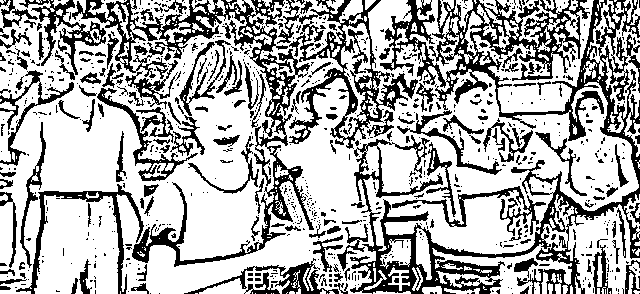
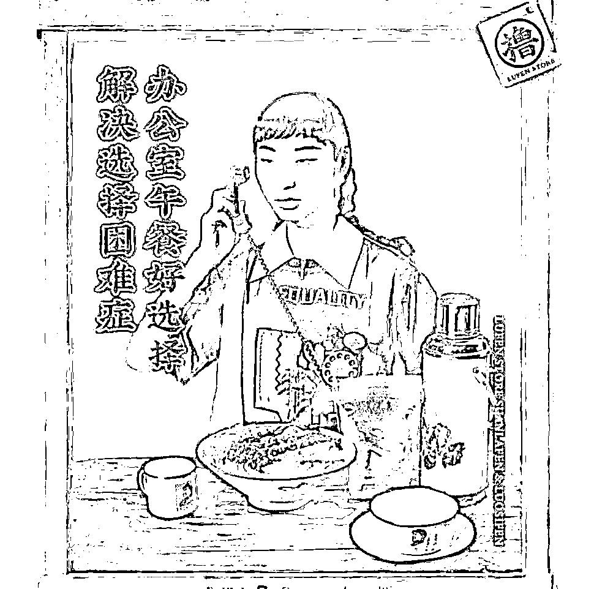
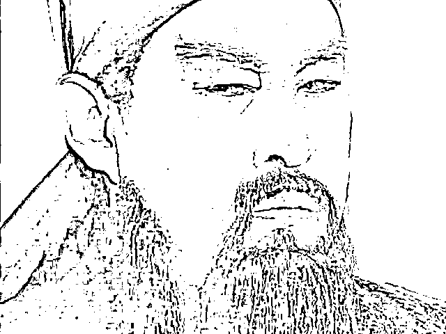
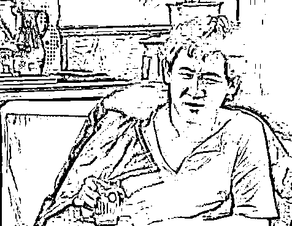
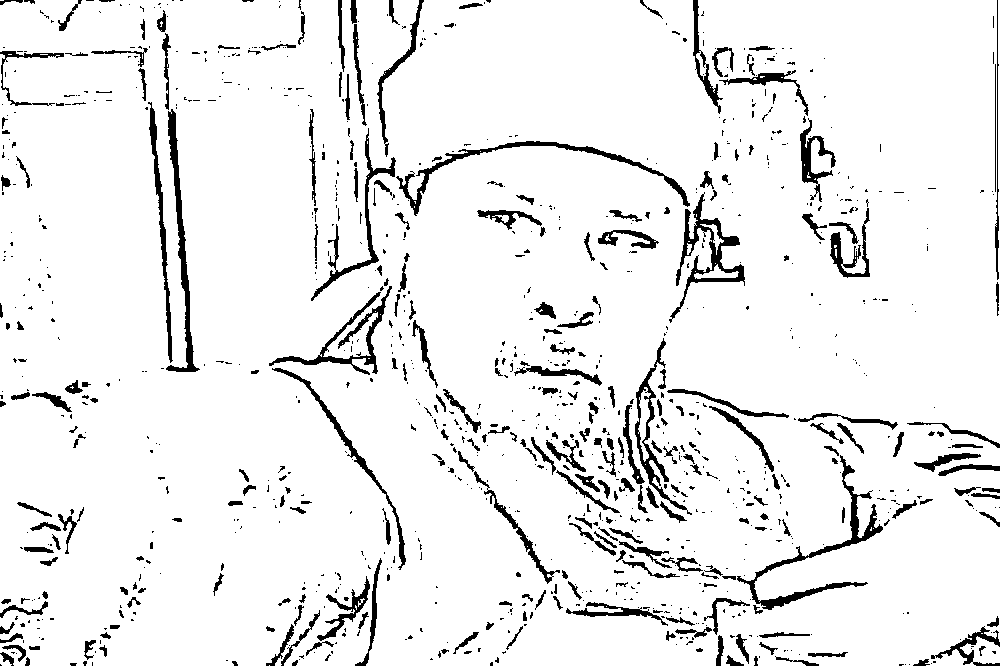
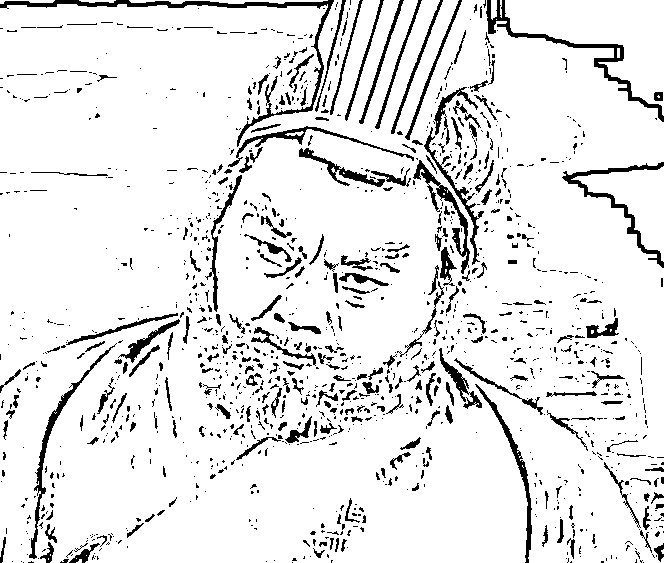
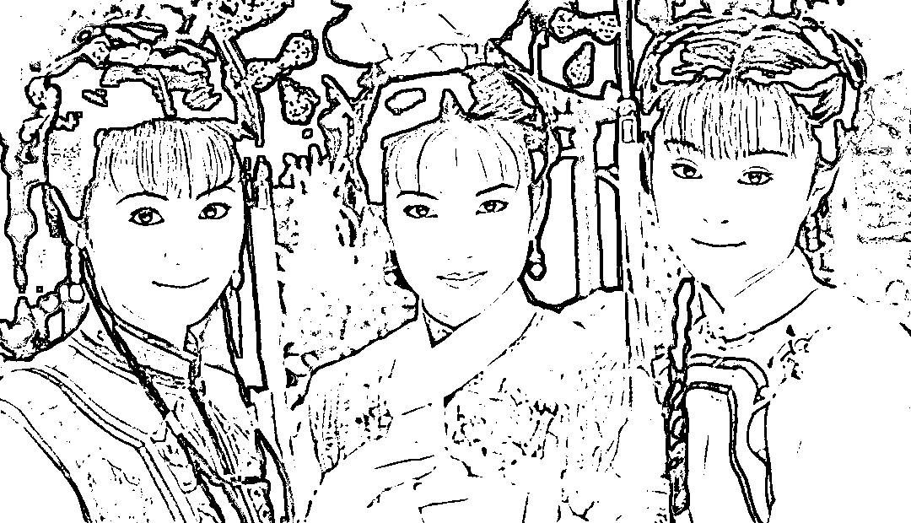

# 《雄狮少年》，三只松鼠，与关云长

> 原文：[`mp.weixin.qq.com/s?__biz=MzU0MjYwNDU2Mw==&mid=2247503086&idx=2&sn=46b1ebdae8907f8166430f4accc5ce79&chksm=fb1aa092cc6d298404ea76fffc765a17b36f2e53a62814a8b1d70bfac572dc5ea69695cc0b05#rd`](http://mp.weixin.qq.com/s?__biz=MzU0MjYwNDU2Mw==&mid=2247503086&idx=2&sn=46b1ebdae8907f8166430f4accc5ce79&chksm=fb1aa092cc6d298404ea76fffc765a17b36f2e53a62814a8b1d70bfac572dc5ea69695cc0b05#rd)

这个标题很有意思，连我自己都觉得很有意思，这仨哪儿哪儿都不挨着，却在标题里挨着了。 

《雄狮少年》，一本动画片，我还没来及看，最近被骂，以至于引起了互联网上站队伍。 

有一波大 V 强烈推荐大家去看，另一波大 V 强烈抵制大家去看，以至于我很好奇的看了看介绍，这到底是啥片子，这么给劲。

一看片花我就知道他们吵什么了，电影的画面是这样的： 

这画面，我懂。

那么三只松鼠，一个卖坚果零食的，为什么挨骂呢？因为他们早在 2019 年的广告，没有改，直接拿出来重复利用，里面的人，长这样： 

就算之前你没懂，现在该懂了吧？

还没领悟的，去看之前我写的[“迪奥、陈漫的丑化中国女性，背后透露出的是什么？”](https://mp.weixin.qq.com/s?__biz=MzU0MjYwNDU2Mw==&mid=2247502578&idx=1&sn=e7c208fb6125f8f92e0a5be9821b4781&chksm=fb1aa68ecc6d2f98e8dd81473a2c2a5d3ed76a4dd360839af2fa8edf83a547ef2bfc3e57f7a0&token=278023653&lang=zh_CN&scene=21#wechat_redirect)

陈漫那次，说白了就是为了舔老板，舔迪奥，而迪奥默许陈漫这么做，就是为了舔客户，确切的说，舔部分西方客户。 

那次是铁板钉钉的，陈漫身为一个东方女性，故意那么画，用意在于纳投名状。 

我当时打了一个比方，女真时期，被俘的大明臣民，为了混个二鬼子汉奸的身份，刻意舔新主子，给自己弄了一个自鸣得意的身份，叫做包衣奴才。

包衣奴才只有加倍的欺凌自己的同胞，才能摇动尾巴，在主子那里讨得一些赏识，这种行为，就叫做纳投名状。

这么评价她一点问题都没有， 逻辑链闭合。她本来就是靠迪奥混饭吃的嘛。 

那么我们按照这个逻辑来看下《雄狮少年》。 

首先，我们要承认，《雄狮少年》确实有动机，这个动机在于拿奖。拿奖说到底是一种迎合评委的活动，并不是很多人以为的自我表达。

我们很多没有参加过评选类比赛的人，对这一点有很深的误区。 

你以为你有才华，或者讲，你觉得大家眼里最有才华的人应该拿奖，其实完全不是这回事。

拿不拿奖，拿几等奖，说到底，是裁判，是评委会决定的，并不是大家决定的。 

大家可能觉得这个姑娘一点也不漂亮，大家可能觉得那个姑娘才是大美女。 

问题是，不漂亮的就是当选港姐，漂亮的也许就得落榜。

赵雅芝年轻时漂亮么？漂亮，无缘港姐前三。邱淑贞，港姐十二强。港姐冠军里面像李嘉欣那么漂亮的，并不多。

很多之所以能得冠军，是多种因素合并起来决定的。

所以站在竞选者的角度，你首先要知道标准答案是什么，你得千方百计往上面靠，不然呢？

就像八股取士，取的人不一定有才华，但能够考中的人，一定是关于这场考试有所准备，一定是投其所好。

如果你有这个心思，你看下历史上所有拿了国际奖项的华人导演的作品，把相似的元素归纳起来，你自然而然的就会找到一些窍门。 

当然，有可能是旁门左道。

就比如《雄狮少年》的这张画面，里面所有的人，清一色的咪咪眼。 

有很多大 V 讲，眯眯眼不意味着侮辱，你比如，三国演义小说里描述的关云长关二哥，长这样：

丹凤眼、卧蚕眉。

难道说，长成关二哥这样，也给华人丢脸了不成？ 

这种说法看起来很有道理，其实是有问题的。 

**问题一、关羽并不是眯眯眼，他只是咪着眼。**

眯眯眼的意思是说这人眼睛睁不开。

什么叫眯眯眼？比如梁天，《我爱我家》里的贾志新，他得长这样： 

梁天不是眯着眼，他睁了，他睁了，他努力的睁了，问题是，他眼睛就这么大，睁大了，也就这么大点。

你不能怪他，这是他天生眼睛小。

而眯着眼，是说这人能睁开，他只是不想睁开。 

为什么不想睁开？因为看不起人呗。

你还想被关二爷看得起？你有几颗脑袋？ 

曹操问他河北人马，可雄壮否？

他说，某观之，如土鸡瓦犬耳。

曹操跟他说，麾盖之下，绣袍金甲，持刀立马者，乃颜良也。

关羽笑道，某观之，如插标卖首耳。意思是说，颜良就是个插着标签卖脑袋的货。

连张辽都看不下去，劝二爷别吹了，风大。二爷白了他一眼，顺手就把颜良的脑袋砍了下来。 

这就是千军万马之中，取上将首级。 

你注意，关羽斩杀颜良的那一瞬间，他眼睛睁开了，神目如电。 

看懂了吧？二哥不是眯眯眼，二哥是眯着眼，他看不起你，犯不着睁开眼。

当然，被他看得起也没啥好下场，他睁眼是要杀人的。

这是第一点。

**第二、罗贯中的三国演义里，可不是人人都是丹凤眼、卧蚕眉。**

随便举个例子，关羽的三弟，张飞，长这样：

看到了么？这个镜头里，张飞是眯着眼睛看人。他眯着眼，都有这么大。

所以小说中描述，张飞的眼睛像铜铃那么大，他是睁着眼睛睡觉的，以至于张达和范疆想趁他酒醉杀他，都被他吓了一跳。

那我们想一想，如果一部片子，每个人的眼睛都长成这样： 

或者，反过来，每个人的眼睛都长成这样：

**你不觉得都是故意的么？** 

如果前者你不相信，那么后者已经是人尽皆知了。

《还珠格格》选角的时候，就是故意的，小燕子的眼睛像牛眼那么大，紫薇，金锁，都是这样。 

这是一种刻意，现实中无论关羽那样的，还是张飞那样的，或者小燕子那样的，又或者梁天那样的，都属于特型演员。 

你见不到那么多小眼睛，或者大眼睛。

眼睛的大小符合正态分布，如果随机选，一定是大的小的中等的，都有。 

如果清一色大眼睛，或者清一色小眼睛，那就说明这是为了迎合特定的客户，《还珠格格》是，《雄狮少年》也是。

你注意，我没有讨论眼睛大小与爱国之间的关系。长成赵薇那样，也不见得爱国，长成梁天那样，也不见得不爱国。

讨论眯眯眼与爱国，确实是胡搅蛮缠。 

但是，如果一个导演，刻意的把所有人，都集中的筛选成大眼睛，或者小眼睛，忽视正态分布这个规律，那么他一定是有用意的，一定是为了迎合部分市场的。 

这一点，谁也洗不干净。 

那我们再来看三只松鼠。 

说实话，我不太相信三只松鼠有什么居心，因为从利害关系上分析，逻辑链都不成立。 

三只松鼠是干嘛的？是做广告设计的么？当然不是。三只松鼠是一家卖零食，主打坚果类产品的。

我们都知道，美国才是全世界最大的坚果类商品的供应国，碧根果，巴旦木，大杏仁，夏威夷果，太多太多了。 

像三只松鼠这样的经销商，他们做的事情是把美国的坚果卖到国内，换句话说，国内才是他的主要客源。

他讨好美国干什么呢？犯得着么？

我只见过面馆讨好吃面的，你见过面馆讨好种小麦的么？而且是冒着不惜得罪食客的风险？

所以从逻辑链上讲，我实在难以相信三只松鼠画这么一幅画，是为了讨好谁，或者是为了恶心谁。 

这太荒诞了，他为什么要砸自己的饭碗呢？他图什么呢？他一个商人，不为挣钱为什么？

所以，我想，这里面恐怕是没有想清楚，太随意了，直接复制之前的文案。他们在发布的时候，根本没有想过会引起什么问题。

还有一种可能，他们是惯犯，一贯如此，根本不 care 舆论的看法。两年前是这样，两年以后依然是这样。

说实话，一个做快消品的，这种态度，简直是，没谁了。哪怕仅仅是作为一个商家，连这点舆论敏锐度都没有，何况还是个做 TO C 端的，我想，他们的生意到头了。