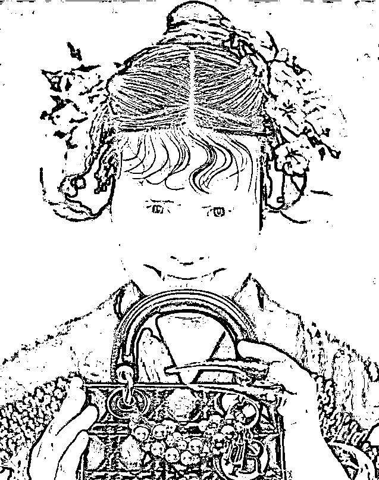

# 迪奥、陈漫的丑化中国女性，背后透露出的是什么？

> 原文：[`mp.weixin.qq.com/s?__biz=MzU0MjYwNDU2Mw==&mid=2247502578&idx=1&sn=e7c208fb6125f8f92e0a5be9821b4781&chksm=fb1aa68ecc6d2f98e8dd81473a2c2a5d3ed76a4dd360839af2fa8edf83a547ef2bfc3e57f7a0#rd`](http://mp.weixin.qq.com/s?__biz=MzU0MjYwNDU2Mw==&mid=2247502578&idx=1&sn=e7c208fb6125f8f92e0a5be9821b4781&chksm=fb1aa68ecc6d2f98e8dd81473a2c2a5d3ed76a4dd360839af2fa8edf83a547ef2bfc3e57f7a0#rd)

给大家来看一个人，这是谁？ 

我靠，你瞧，这不是咱拜爷么？怎么改女妆了？ 

**瞧**，**拜**爷这样子，真摩**登**。缩写简称**瞧****拜**登。**** 

这是 cosplay 么？还真不是，这是自称土生土长的中国摄影师陈漫设计的作品。当然不是原版，是我们的热心网友改造后的加强版。

她大概是照镜子设计的，估计她自己长成这样，自己照镜子，越看越美，简称心里美。 

星爷的电影里怎么说的？ 

长的丑不是你的错，出来吓人就是你的不对了。陈漫你自己觉得自己美不是问题，但如果你这么喜欢代表中国女性，那就是你的问题了。

当一个人有问题的时候，连你的老板也会抛弃你，比如迪奥。 

当我们的网友群起怒斥的时候，迪奥第一个响应，把挂在官网上的陈漫的作品删除，然后表示不知情，这是陈漫的作品，不是迪奥的作品，更不是迪奥的广告。

这一幕让人看着很眼熟。 

就像浪潮集团有人在办公室里悬挂标语，还很押韵。 

白天加白班，不瞌睡；晚上加夜班，睡不着。 

大家加，才是真的加，加班真好。 

互联网哗然，然后浪潮马上出来纠正，说这是员工于某的私人行为，未经部门负责人审核。 

...... 

于某真可怜，看来这年头舔狗也不是那么好当的。 

我一直在脑海里想，一个伸手不见六指的黑夜，某舔狗爬窗溜进办公室，在墙上悬挂自己出钱打印的鼓励加班的标语，他贴的时候，知道自己后来的下场是被主子严惩么？

你说，人溜进办公室贴标语，好像还可以做到。但是陈漫一个设计师，是怎么取得迪奥官网的编辑权，把作品挂上去的呢？ 

人艰不拆，人家已经这么艰难了，我们就不拆了。 

她怎么艰难？恰饭恰的很艰难。

陈漫在华语圈里道歉，讲自己是一个土生土长的中国人，知道什么是中国女性的美，愿意恶补历史知识，愿意深刻改造自己的思想，这那那这的，然后一转身，就去外网圈里说，我这都是为了恰饭，才那么说的......

很多人在骂陈漫与迪奥，我们来说点深刻的。 

首先陈漫该不该骂？当然该骂。但是骂她能不能解决问题？当然不能。

陈漫这种人，说穿了，就不是奔着移民去的，人家是投诚去的，理解这意思么？

人家就是奔着当舔狗去的。 

你让一条狗不去舔，可能吗？回答我，可能吗？ 

其实还是有可能的，狗有时候挺有骨气。 

但是陈漫是不可能的，因为她的目的就是舔，这就叫纳投名状。 

她就是要通过侮辱自己的出身的方式来换取，或者讲，摇尾乞怜，获得别人的认可，与赏赐。 

女真时期有一种奴才叫做包衣奴才。就是奴才的奴才。

旗人见了旗主，自称奴才，有些汉奸，投降了，给奴才当奴才，这就叫包衣奴才。

包衣奴才只有加倍的欺凌自己的同胞，才能摇动尾巴，在主子那里讨得一些赏识，这种心理，就叫做纳投名状。

你把人性看透了，你就明白骂她有什么用呀。你看我就没骂她，我骂了么？有谁看见我说了一个脏字了吗？ 

我们再来看迪奥。 

迪奥是一家公司，商人的目的都是为了赚钱，没有哪个商人是存心非要和谁，尤其是和客户，还是大客户过不去。 

如果有，如果这种行为发生了，那只有一个原因，就是另一个客户在起作用。 

我给你举个例子，一个台湾省的客户在一家店里说闲话，说福建人如何如何不好。 

这个店老板起劲的拱，说，您说的对，我也这么觉得，这那那这的，为什么？他想做什么？ 

他想卖东西，他想套近乎。

人想套近乎无非两种方式，你喜欢的我也喜欢，你不喜欢的，我也不喜欢。 

别说当面骂福建人，你让迪奥当面骂自己的亲爹，亲妈，他都会骂的很起劲。 

这就是经商。 

出来卖嘛，卖什么不是卖，说到底，就这点事儿。

骂自己亲妈不要紧，问题是，福建省的人也是大客户呀，回头怎么交代？ 

很简单，牵一条狗出来，说，诺，都是她的错，是她自作主张，未经允许，与我们无关哦。

然后跟那条狗屁股上揣一脚，来，叫两声给客户大爷听听，让人家消消气。 

那条狗就叫两声，叫完转身还得去跟另一波客户那里说，我这都是为了恰饭......

什么叫双恰？这就叫双恰，恰两次，两边都得讨好。 

所以当你把这个问题看透了，你就会发现问题的根源出在两拨客户之间。 

而这两拨客户之间的分歧，非常非常大，因为彼此的经历完全不一样。

欧洲一直很封建，是真封建，国王分封领主，是真的封，封着封着，资本主义了。 

而我们的封建是什么时候？春秋之前。

换句话说，我们春秋之前和人家拿破仑战争那会儿观念上是有交集的，拿破仑喜欢封弟弟，春秋之前的君主也喜欢。

但是我们结束封建结束的太早了，秦始皇那会儿不可能诞生资本主义，而是诞生了另一种平衡。 

俗称狼吃羊，羊吃草。秦始皇是狼，官僚体系是羊，老百姓是草。

从秦一直到清，其实都是一个模式，狼吃羊，羊吃草，草反过来决定狼。这就叫水能载舟，亦能覆舟。不是李世民魏征说的，不是，是孔子说的。 

《荀子·哀公》里面记载，这是孔子教鲁哀公的话。

周星驰有本电影应该记得吧？如烟房里，龙内裤那一集，老鼠怕猫，猫怕老虎，老虎怕大象，大象怕老鼠。 

这就是我们形成的闭环，流传到市井也是如此。 

换句话说，二十四史里皇上和官僚从来不是一伙的，你想想打麻将就明白了，对手的对手，是朋友。 

狼是不吃草的，羊才是吃草的。狼如果吃羊吃的不积极，草原没了，狼也就没了。 

所以魏忠贤没有了，东林党把草吃光了，李自成就受不了了。我们古代的平衡是这么玩的，这跟三权分立是两套。

你站在狼羊草的角度看三权分立，其实能看出很多问题。 

一个游戏里，只有羊和草，你把羊分成三种，制约谁？你怎么制约，不还是只有羊和草么？

就像你让东林党和西林党搞竞选，怎么选，不还是得吃草么？不吃草吃啥呀？现在这个游戏里只有羊和草呀。

这就是美国今天要面对的，无论你怎么玩，只有两种人，有钱人和没钱人，而有钱人在美国是无法从本质上去制约的。 

而且你站在狼羊草的游戏模式里去看欧洲很多东西，都有潜在的隐患。

你仔细想一想那句话：风可进，雨可进，国王不可进。

这句让无数公知感动过无数年的那句话，你品，你仔细品。 

品不出来问题在哪儿，你就假想一个情景。 

一个村里一百个人，一个人拥有 100%的土地，剩下 99 个人，和这个人之间面临一个问题，什么问题？ 

风可进，雨可进，国王不可进。

所以只能把那 99 个打包送去火星吧。 

你看到了吗？契约精神，财产神圣不可侵犯这玩意儿是有天然桎梏的。 

所以美国今天没法不乱，契约精神+财产神圣不可侵犯就决定了它必须乱。

因为风可进，雨可进，国王不可进呀，因为没有三态平衡。

但是三足才能鼎立，双足无法停留只能不停的走，这就叫扩张，掠夺式扩张，俗称大航海时代。

羊吃草，没人吃羊，大航海时代不结束，就能维系，当大航海时代结束了，问题就暴露了。 

广义上的大航海时代啥时候结束的？在川普手里结束的。 

所以你现在回头去想，为什么美国人买马斯克的股票？ 

因为他们真的懂西方，这些西方投资人真的懂西方，打小这个环境里长大的，自己知道问题的根儿在哪儿。

他们这种模式必须开启一个又一个对外掠夺的所谓大航海时代，如果地球不够，那就飞上火星。

风可进，雨可进，国王不可进就决定了你只能向外。

而我们，玩了两千年的狼羊草之后，升级了，抛弃旧社会，进入新社会了。

你看到了，双方的经历差异实在是太大了，你非要指望着彼此理解，能理解么？ 

我们南方人，北方人，为了吃米还是吃面，地图炮开了多少年了，彼此理解了么？ 

理解是不可能理解的，永远都不可能理解的。 

唯一能做的是什么？是学会彼此尊重。

自己学会尊重别人，非常简单，自我教育就可以了。别人不尊重自己怎么办？ 

很简单，让他知道不尊重的结果是什么。

结果是什么？如果你今后还买迪奥，那就是你不自重了。

人必自侮，而后人侮之；人必自重，而后人重之。

你自己不拿自己当回事，人家是不会拿你当回事的。

一个优秀的消费者，一定是较真的消费者。