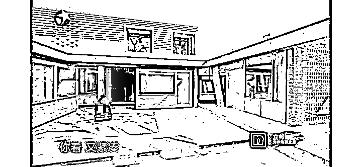
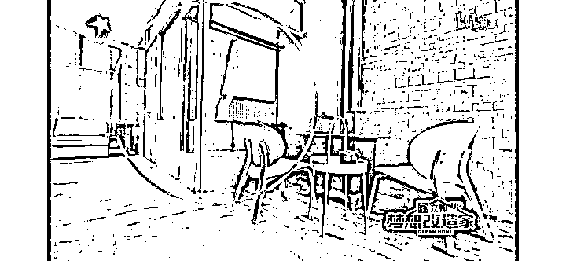
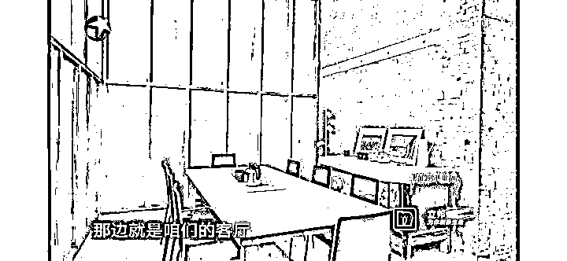
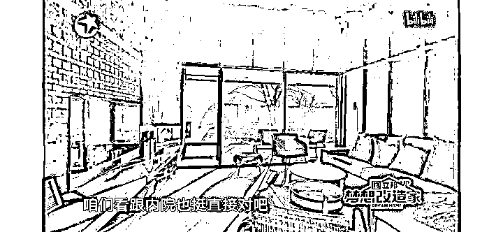

# 司马南笔下的柳传志与骂上热搜的《梦想改造家》设计师陶磊

> 原文：[`mp.weixin.qq.com/s?__biz=MzU0MjYwNDU2Mw==&mid=2247502566&idx=1&sn=5c392d9ed1239f983c21ea522ce2c05f&chksm=fb1aa69acc6d2f8cb5198da331f86a59877a8a68115d509b6714d2648d101f45ccacfaeffe84#rd`](http://mp.weixin.qq.com/s?__biz=MzU0MjYwNDU2Mw==&mid=2247502566&idx=1&sn=5c392d9ed1239f983c21ea522ce2c05f&chksm=fb1aa69acc6d2f8cb5198da331f86a59877a8a68115d509b6714d2648d101f45ccacfaeffe84#rd)

我们小号写了一篇，[我上一次听到柳传志的时候，他还是网友口中的小甜甜](http://mp.weixin.qq.com/s?__biz=MzU3NDc5Nzc0NQ==&mid=2247509889&idx=1&sn=ce8925ccbcca603c311a5f4cc02b67d5&chksm=fd2e055fca598c495af5ea4c96685d8565cac05a932ed70205d49fc23ca97343088a979e94f1&scene=21#wechat_redirect)。 

有读者说我什么都没写，其实我什么都写了。你看不出来，那是你的问题，不是我的问题。

我最起码写了三个维度。第一个维度是星爷的电影里老出现的那位特异功能者，他曾经火过，后来不火了。火的时候所有人都崇拜他，不火的时候所有人都骂他。 

好像他有什么不同似的，其实他有什么不同呢？他还是他，你们还是你们。不是风动，不是帆动，是人们的心在动。 

我在调侃谁？我在调侃吃瓜群众。

第二个维度，我说一个女子打针，当众哭着喊妈妈，我笑了。因为我很少见过这么不要体面的成年人。 

可是护士没有笑？为什么？

因为见多了呀，这世上总有人不要体面的呀，总有呀。

我在调侃谁？我在调侃被骂的那位。 

第三个维度，我调侃的范围更大了，我举了一个例子，郎咸平。他当年可不是因泡空姐倒赚 900 万出名，他是以郎监管出名。 

他十几年前讨论过的最多的内容，研究过的最深刻的话题恰恰是司马南六问柳传志的内容。 

这就是为啥我都不想看，因为在这个话题上没有人比郎咸平给出的调查研究更细致，更深刻，更全面的。 

你要是对这个话题真的有兴趣，翻开十几年前郎咸平天天讲，到处讲，苦口婆心的讲的那些内容，比你今天看到的，精彩一百倍。 

可是郎咸平后来变成了一个什么样的人呢？网友口中的唱多房地产者，为金融产品站台者，以及软饭硬吃者。 

是不是很有趣？很多事情，你沉溺于当下，沉溺于你收到的那一点点的信息碎片，是一种理解。 

你跳出时空，把过去几十年的事情揉在一起，再去看，是另一种理解。

当然，后者是不讨喜的。如果你是自媒体从业者，切勿学我。

正确的写作方式是什么？是告诉读者，有一个人叫做喜羊羊，有一个人叫做灰太狼，然后喜羊羊是好的，灰太狼是坏的，而您，作为高贵的判断者，则是睿智的。 

读者听了怎么样？那个高兴的劲儿，就别提了。你看，还是咱牛吧，啥喜羊羊，灰太狼，都逃不过我一双眼。打赏，必须的。

错误的写作方式是什么？就像我这样。 

把喜羊羊，灰太狼以及读者的陈年旧账都翻出来，无情的嘲讽一遍。读得懂的人看完了之后就像吞了一只苍蝇，读不懂的人，看了之后都不知道这家伙在说啥。

所以老读者才给我们起了一个外号，泥石流。人家是清流，咱们是泥石流，可见何等不受待见。

深刻的说完了，所谓深刻的就是跨越了人，跨越了时空的话题。但是很多人想要听的是不深刻的，比如想听我评价柳传志。 

那我们来说点肤浅的。 

要说清楚这个问题，咱们得打个比方，比如这两天被骂上热搜的《梦想改造家》。 

甘肃白银有户老汉，花了 132 万委托《梦想改造家》在他的原宅基地上设计一套别墅。

他梦想中的别墅什么样呢？就是小二楼，三楼当然更好，为了表达，还带设计师去看了邻居家的欧式别墅。

设计师瞄了一眼就走了，因为他觉得太土了。于是告诉老汉，我办事，你放心，我拿过那么多大奖，最后的产品一定让你满意。 

那么他花了 132 万，最后交出的产品什么样呢？如下图。 

这个是室内：

我们看到了，主要设计是镂空，敞开，而用的材料则集中在红砖与清水混凝土。

于是网友们给了一个评价，这是战后叙利亚风。 

人家老爷子辛辛苦苦攒了 132 万，回头住在这么个丑不拉几的地方，能被村里人笑话一辈子。 

你这个设计师，简直就是欺负人，连村里老汉的钱都赚，132 万的装修预算，是不是 131 万都被你吞作设计费了？ 

首先我们来看风格，好不好看。 

好不好看，要看你怎么看。 

我看过这个设计师陶磊的代表作，几乎清一色都是红砖+清水混凝土的风格，其中不乏拿奖的设计。

但是这些作品和这个白银的老汉有一点最大的不同，地点不同，几乎都在一线城市。

你在一线城市盖楼，盖的越矮越土豪。你想一想嘛，土地是寸土寸金的，同样的居住面积，四合院盖 500 平，那占地可不止 500 平，但是盖三层楼的排屋，占地只有一百多平。 

在土地的价格面前，建筑物的预算几乎可以忽略不计。 

所以如果条件允许，当然是四合院比二楼好，二楼比三楼好。一般来讲，大城市里盖别墅，顶多到二楼，到二楼是为了防潮，再往上，那就是因为土地不够用。

白银的老汉是这种情况么？不是的，他家里土地是免费的，充分供应，建筑的费用才是大头。

同样还是地点的不同，使得人们设计时侧重点不同。 

大城市里盖别墅，为什么讲究敞开，通透？因为便于取景。 

想一想，你们家巨大的落地玻璃对面，是紫禁城宫墙下的落日余晖，什么感觉？ 

你说镂空通透有取暖的问题？那都不是问题。 

能坐在自家院子里看宫墙，值几亿？取暖才花多少钱，几万？ 

在前者面前，后者等于零。

这一点，也和白银老汉家里的实际情况不符，他家推门向外看，除了光秃秃的山，就是光秃秃的山。 

而且对他来说，132 万不包含空调地暖的费用，四面镂空，在甘肃白银这个地方，他该怎么过冬？

最后一个问题，装修只是一部分。你在红砖混凝土的室内，摆个北魏的佛头，也很有味道。

问题是，现在全部预算就只有 132 万，清水混凝土+红砖+廉价的家具，可不就是战后叙利亚风么？ 

你看，同样的设计，有时就能拿奖，有时就会被骂成翔。 

无他，**需求变了。** 

小号聊周星驰的时候说，无论赌神怎么神，都会说他怕一个人，因为特异功能山外有山。 

星爷怕的那个人，当年在内地很有名。之所以能成名，时代使然。 

那个时候美苏的太空争霸告一段落，实际上是双方钱都花光了，谁也扛不住了。 

没有预算怎么办呢？就只能研究一些花费小的项目，比如人体科学，俗称特异功能。 

实际上，那时候别说我们，美苏也都在研究这个。

那你说后来他为什么凉呢？也很简单，因为预算又有了。 

预算又有了，大家又去研究星辰大海了，这种耍蛇的把戏，自然也就没市场了。

那你说有没有可能卷土重来呢？有可能哦，有可能。哪天经费又紧张了，研究领域又会回到人体科学上来。 

你不要觉得很可笑，你翻开人类的历史，本来就是这样。 

你不要脑子里固化一个东西，什么对的错的，你首先要弄清楚需求是什么。 

**绝大多数时候，答案都是在迎合需求，换句话说，并不是先有答案，而是先有需求。**

你把预算摆出来，就会有人去根据预算填答案。没有预算，或者预算变了，答案一定会变的。

一个人拿着固定的答案去生搬硬套不同的需求，最后的结局就像这个设计师陶磊，被骂成一坨翔。 

我们在不同的时期，需求是不一样的，这个需求之差，可能比北上深的土豪客户与甘肃白银的老汉之间的差别还要大。 

我们曾经有一段时期，面临的问题就在于你不把股权分给个人，那人家就是没有干劲。 

不仅在你这里没有干劲，还会跑出去反过来干你。

95 年的时候，段永平从国企小霸王离职，走的时候拿了辆奔驰，签了一年的不竞争协议。 

1 年后，段永平就创立了步步高，小霸王的总经理助理、外销部长、内销部长、工程部长、计调部长、生产部长、计财部长、后勤部长、供应部长......，全都跳去了步步高。

后来段永平成了资本大佬，中国的巴菲特，他还有个徒弟，在富豪榜上的排名比马云还高，叫黄峥。 

而小霸王呢？消失在商业史的长河中。

这就是那段历史，那段历史中几乎所有的人才都梦想成为富豪。你现在想想为啥倪光南到处呼吁都没用，因为在当时，就没有人才愿意走他想要走的那条路呀。

十年前我在国企做系统架构师的时候，集团人力部门的最高负责人，是我师姐，她问过我一个问题。

为什么我们，就是指她们集团永远也无法建立起自己的研发团队，技术上处处受制于供应商？

我说原因很简单，因为我们不允许分股票，即便做到上市公司高管，年薪一百万封顶。

你想一想看，有谁会来？ 

她说，外面就那么好么？我们这里有稳定的薪水，有远超行业的福利，可以干到退休，退休金十分丰厚，医疗全报，各种假期，培训，应有尽有。 

我笑着跟她说，对呀，你都这么好了，人才还在流失，说明什么？说明外面更好。

外面人家上市了，一个小组长可以分上亿。

后来科创板期间，她跟我打电话，说我多年前告诉她的话，这会儿她才看明白。

我说，师姐，那我再给你预言一次，你们以后招人会很容易的，这次预言要不了两年就会实现。 

其实这个道理很简单，赚快钱有个窗口期，你在那个窗口期里面想要做某些事儿，就是做不到的。 

因为大家卯足了劲，都想赚快钱，都想成为富豪，这是一种时代的力量。 

当窗口封闭的时候，赚快钱的概率下降了，降到一个阈值以内的时候，人们的预期就会发生转变。 

我师姐现在的处境牛的不得了，一堆博士来求职，求一个很普通的岗位。她可以尽情的挑。 

她们集团如果现在还有心搞研发，是时候了，反正暴富不了，都老实了，安安静静的写代码。 

从段永平那个年代一直到十年前，人心都是很浮躁的。我只比黄峥小一岁，是同龄人。黄峥有搞研发么？没有吧。

代码写的那么好，大学里就被当时的首富丁磊看上的黄峥，也没有去做产品，而是去割韭菜了。 

没有办法的，在一个所有人都忙于割韭菜的时期，你要么主动割，要么跟着割，在大家都浮躁的时候，你想摆一张安安静静的书桌是没法子的，你找不到同伴。倪光南这么大号召力的人都找不到。

但是现在就可以了，无他，需求变了。

曾经抓住了窗口从劳方转型资方的人，如果你还想跟上时代，唯一能做的，就是脚踏实地，赚慢钱。 

而生晚了的人，当年求之不得的所谓安静的书桌，现在满地都是。你真的可以读到博士，然后应聘一个研发的工作，静静的写代码。 

踏踏实实做事的时期，到了。而如果你觉察不出时代的变化，还要拿以前赚快钱的老黄历来应对当下，那你注定被骂死。

甚至，比被骂更悲剧的事情，也不是不可能发生哦。

毕竟，这世上本无所谓道理，有的只是大家喜欢不喜欢，或者讲，大家当下喜欢不喜欢。

大家的需求，才是真需求。