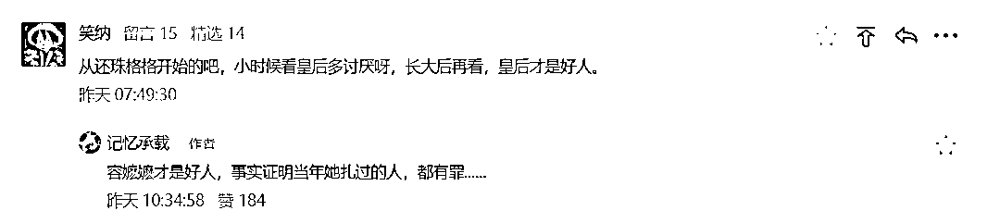

# 赵薇终于被除名了，我们欠容嬷嬷一个道歉

> 原文：[`mp.weixin.qq.com/s?__biz=MzU0MjYwNDU2Mw==&mid=2247500747&idx=1&sn=80f9eb9b6ffe48adbf51857ec59eda76&chksm=fb1aafb7cc6d26a15b3e4be1aff6e0e9eafc4748ca455b370372707f4e2ab58e4d099d6a7d3f#rd`](http://mp.weixin.qq.com/s?__biz=MzU0MjYwNDU2Mw==&mid=2247500747&idx=1&sn=80f9eb9b6ffe48adbf51857ec59eda76&chksm=fb1aafb7cc6d26a15b3e4be1aff6e0e9eafc4748ca455b370372707f4e2ab58e4d099d6a7d3f#rd)

[昨天切钱枫的瓜](http://mp.weixin.qq.com/s?__biz=MzU0MjYwNDU2Mw==&mid=2247500736&idx=1&sn=7a8566c6a58f51d622cd2472975b14f5&chksm=fb1aafbccc6d26aae98ec10f628b9fe1d178efe0c250d1b8565cb47eeb00bb905ca37766c70f&scene=21#wechat_redirect)，有个读者留言。

我回复他是昨天早上 10 点半，到了昨天晚上，容嬷嬷就被证明，果然是好人。 

看来我们当年冤枉了她老人家，她老人家才是太上老君炉里炼过的，火眼金睛。

昨天晚上，还珠格格，画皮，情深深雨蒙蒙，京华烟云，甚至虎爸虎妈这种都搜不到了。

不仅作品搜不到了，赵薇的超话也搜不到了，优酷爱奇艺里面赵薇这个艺人也搜不到了。

[我们聊过赵薇，在小号里面聊过](https://mp.weixin.qq.com/s?__biz=MzU3NDc5Nzc0NQ==&mid=2247505992&idx=2&sn=2833867d469c8a987e29358c202951aa&chksm=fd2e7a96ca59f380cefb6fea8ac4e865233abeab7b0e76d65741793d71df393246f549c5420e&token=728375999&lang=zh_CN&scene=21#wechat_redirect)，在聊张哲瀚的时候聊过，因为赵薇就是污点艺人张哲瀚的老板。 

与张哲瀚相比，当年她身穿日本国旗，做的更出格。

[我也在小号里面聊过她昔日在股市里坐庄，被处罚的那点事儿](https://mp.weixin.qq.com/s?__biz=MzU3NDc5Nzc0NQ==&mid=2247486991&idx=2&sn=a466c1d80659ab28bb381776ecda2ed4&chksm=fd2dacd1ca5a25c73d27792662dfbf849898c94a15c4ff05bba36511968df6fb2392b4f1b129&token=728375999&lang=zh_CN&scene=21#wechat_redirect)，但是没有展开事情，我只是一笔带过，因为我们聊的是一个普遍的坐庄的手法。 

对于艺人的态度，甚至可以说是对于演艺圈乱象的态度，我很早之前就提出过明确的观点。

这个乱象主要指两点，一个是流量明星，一个是资本操盘。 

我的观点用《雍正王朝》里面一段剧情，给读者们解释过。 

《雍正王朝》里面有这么一段情节，西北要打仗，大军出征，人吃马嚼，一天就是二十万两银子。

你管谁要呢？

站在全局看问题，西北有军情，放任，迟早祸害大家。可是站在每个人自己的角度，试问江南地区的人怎么可能感同身受？ 

你西北打你西北的仗，秦淮河上歌照唱，舞照跳，大家感受不到的。如果你以西北打仗为由，直接问每个人摊派，只会引来怨恨。

这时候李卫，时任两江总督，就表现出了过人的才华。 

他是怎么做的呢？他也不摊派，他就问秦淮河上的花船征税，征收粉头税。

你们一个愿意卖，一个愿意买，我要管你们，还要派兵丁，还不受待见，我的兵不要发粮饷么？ 

回头你们从明里变成暗里，从公开变成隐私，我还得派卧底，派人明察暗访，我这儿钱本来就不够花，哪有经费做这个？

于是他换了个思路，我不管你干什么，但是无论你干了什么，收入的大头都要上缴。

这就叫粉头税。 

那帮盐商，平日里跟他们讲国家大事，向他们募捐，一个个都装缩头乌龟，跑到秦淮河上喝花酒，个个一掷千金，倒是大方的紧。 

那行，我不管你们要了，**你们花在谁身上，我就找谁要**。这就是拔鹅毛的艺术，李卫深得其精髓。

有人说，秦淮河上的粉头们不满意了，爱不满意你们别满意。有种的你就不要出来卖，你不出来卖，就没有人拔你的毛。

我认为这是一个很靠谱的思路，古人用过。

说到底，观众是没有多少分辨力的，你指望他们自觉自发的去伪存真，是很困难的。 

但是从目前的进展来看，是我格局小了。 

李卫的这种思路，治标不治本，说穿了只是打补丁，因为我们可以笃定这些流量明星，或者操控娱乐市场的资本贪恋利润，不会离去。

所以治理他们，他们也得老老实实听话。 

但是，李卫的这种思路，治理了经济问题，治理不了风气问题。算了一笔经济学上的小账，没有算社会意义上的大账。

换句话说，如果要治本，要从源头立规矩。 

赵薇的凉，对娱乐圈的意义是非常重大的。我们想一想，前有金锁，后有小燕子。

有人说那不对呀，紫薇格格例外。

你放心，就在十几个小时前，林心如的影视工作室主动注销了，材料显示是在 8 月 24 日，在没有任何风吹草动的情况下，人家自己先闪了。

当然有意思的是，连高晓松的作品也下架了，这就有点意思了。

因为我们知道高晓松除了艺人之外，还有另外一个身份，.......，呵呵。

你现在翻看前天小号的推文：[这个世界真的发生了一点变化](http://mp.weixin.qq.com/s?__biz=MzU3NDc5Nzc0NQ==&mid=2247506358&idx=1&sn=3d6243e8a3dd0c966e4d34b4a7a44f27&chksm=fd2e7b68ca59f27eadc7d40a1e769c445dbc7d70df689e5ed4e8ea7f1d8c3360fe73ea8241a4&scene=21#wechat_redirect)

是不是有点感受了。