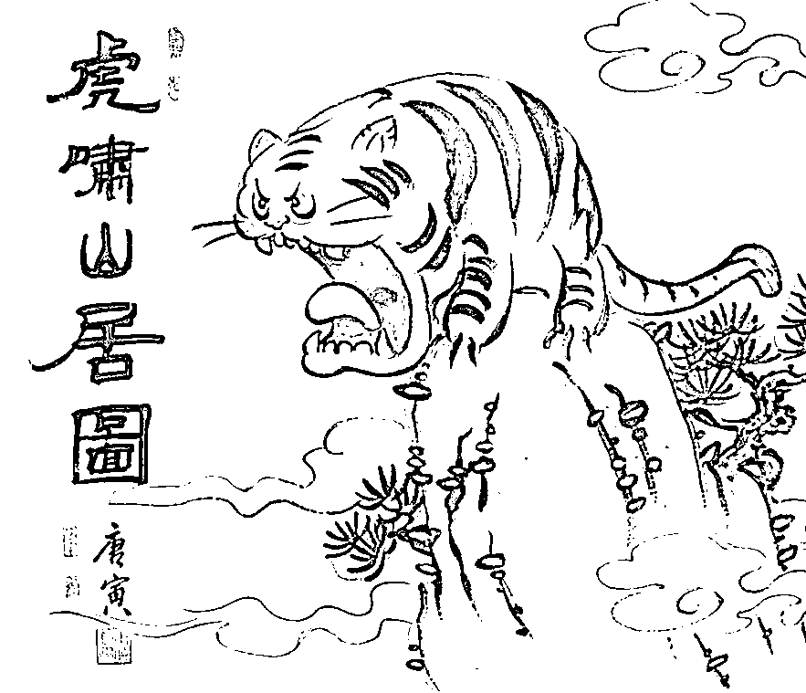

# 造谣的骗子已经有序撤离了，被骗的傻子还在负隅顽抗

> 原文：[`mp.weixin.qq.com/s?__biz=MzU0MjYwNDU2Mw==&mid=2247498790&idx=1&sn=1682387a36b314a5a45bccb9142d17ab&chksm=fb1a905acc6d194c73a4d1ecdcd9238b95593ae28d94363c3d91d3fa488746c4a6c2a87da517#rd`](http://mp.weixin.qq.com/s?__biz=MzU0MjYwNDU2Mw==&mid=2247498790&idx=1&sn=1682387a36b314a5a45bccb9142d17ab&chksm=fb1a905acc6d194c73a4d1ecdcd9238b95593ae28d94363c3d91d3fa488746c4a6c2a87da517#rd)

有个成都的读者问了个非常有趣的问题，昨天他跟我说，成都那件事都出来辟谣了。

他都亲眼见过，那个中学门口事发之后立刻围着一群人，穿着统一的服装，拿着统一的旗帜，有组织的在那里操着普通话，喊这喊那。 

很明显，肯定有境外势力，或者得了什么资助。 

但即便如此，都这么明显了，他朋友圈里至今仍然有几个人不信，肉烂了嘴都不烂，和他还在辩论。 

于是来问我，该怎么说服这些人，或者说怎么和他们展开辩论？ 

别逗了，兄弟。 

应该反省的是你自己，你的朋友圈，你怎么通过的？这么 LOW，你也加，还展开辩论？ 

每一只公鸡都认为太阳是它叫出来的，要不你也去辩论一个？ 

你要是辩的赢，你好去发 Science 了，你是生物学大神啊，连公鸡都辩得过，可不是么。 

所以别闹了，这很正常，这是人类最正常不过的情绪反应。 

骗子撤退了，傻子当然还在负隅顽抗，否则干嘛叫傻子呢？ 

傻子要是能够有序撤退，那还叫傻子？那说明人家是骗子，明白不？

[就像昨天我在留言回复里提到，某个大 V，也参与了忽悠傻子的行为](http://mp.weixin.qq.com/s?__biz=MzU0MjYwNDU2Mw==&mid=2247498780&idx=2&sn=301cbefcc6af3c8a7979c732ac767800&chksm=fb1a9060cc6d197613ecea6a98b6413126bbfa56454f49205fca66d90918b363c2f9f288999d&scene=21#wechat_redirect)，不过我相信这厮背后倒不至于有境外势力，我觉得他就是纯粹捞钱，忽悠流量。

有读者义愤填膺的指责我，西风，你怎么不去批他？揭露他，让更多人不要上当？

我看的一头雾水，我为什么要批他？

鸭子是注定要送去全聚德的，明白么？理不理解注定两个字？

既然是注定的，谁送不是送？

我不送不是因为我心疼鸭子，只是我忙，我别的事儿多，我懒得送鸭子上路而已，明白了么？

就像爽子的粉丝，谁能拯救他们？你觉得谁能？

真相是谁也不能。

我见过爽子被封杀的那几天，做媒体的朋友私底下发给我的小视频，很有意思的。

一个民警小哥，看起来也就 30 岁的样子，在那里陪着闹情绪的爽粉，一个像十来岁二十岁的小姑娘。

小姑娘就一直闹，一哭二闹三上吊，意思是你们凭什么把爽子封杀了。 

民警小同志刚开始还跟她解释，说：你看，我也了解了你的家庭情况，你爸妈也是打工的，不容易，一个月总共休两天才挣个 3，4 千，你替人家动不动一年赚几亿的人操的哪门子的心。

但是完全没有效果，视频里那小姑娘就像爽子说台词，没头没尾，谁都不知道她的逻辑是个啥。 

最后民警同志实在被闹的没办法了，跟她讲，回家吧，就当帮个忙，我也不容易啊。 

他的意思是自己工作也很辛苦，一天到晚的接待你们这些社会上的各路大神，心力憔悴。何况说一千道一万，封不封爽子，也轮不着他一个小民警管呀。 

视频里小姑娘还是不依不饶，什么要投诉了，这了那了。 

你想看社会，这就是社会，你想要了解社会的平均水平，那你找个民警，把他每天的经历告诉你，比笑林外传还好看。 

所以当一件事冒出来的时候，社会上很多人被忽悠是必然的。 

无论是那些别有用心的境外势力，还是某些纯粹只想割韭菜的大 V。 

你想要去怪坏人太多，你怪不着的。 

因为说穿了并不是别人太坏，而是部分人太傻，他们已经傻到了没有任何办法保护的地步。 

她们甚至愿意相信有人要害他们的爽子爱豆，都不愿意相信有人想害世界第二大经济体。

昨天小号里我说，[对于一个年轻人来说，死于为情所困，是最不值的。](http://mp.weixin.qq.com/s?__biz=MzU3NDc5Nzc0NQ==&mid=2247503046&idx=1&sn=05931b588add7561483bd92d1aadc684&chksm=fd2e6e18ca59e70eaf2a4eca42c3972c03e807b6ba15924764704b7ef2f1f09d91f6dd1d8b86&scene=21#wechat_redirect)

有读者问我，为什么现在生活条件好了，孩子们变得这么脆弱，动不动寻死觅活，好像过去不常见这种事。

这个问题实际上就是袁老爷子带来的，袁老爷子最新的消息听到了吧？他的团队再传佳绩，新品种水稻亩产两千斤，又可以多养活数亿人。

袁老爷子这么大岁数了，不好好歇着，一定要勤奋的工作，效果又这么显著，那么副作用也必然随之而来。

凡事都有两面性。搁在过去，在旧社会，饭是不够吃的。别说寻死觅活，你抢食儿的动作稍微慢一点，就活不下来。

那种动不动伤春悲秋寻死觅活的，大自然就把你淘汰了，轮不到悲剧的发生。而自从有了袁老爷子，你也看到了，反正什么人都长大了。

那长大了你就得管啊，就像视频里的民警小同志，我相信他内心深处也很无奈。

有很多话限于纪律他不能讲，我猜得到，我替他讲出来好了。

他肯定在心里嘀咕，我的小姑奶奶，您能不能省省心，你说你一天到晚正经事儿不干，花着爸妈的血汗钱追星，还给我们派出所添乱。

我们都不容易啊，你爸妈辛苦工作不容易，我熬夜加班的安抚你，我也不容易。

我们这帮人一天到晚的辛辛苦苦的撅着屁股干，合着就为了伺候你这号的，我心里也委屈 ，我去跟谁讲呀。

你现在明白为什么我特别欣赏游戏行业？

就是因为我看透了，我看透了社会上相当一部分人的底色。

说的难听点，有些人根本就是造粪机器，又不得不养着，那为什么不用最低的成本养着呢？

如果说给你汉堡可乐，再给个游戏，你就能安安静静的，不给干活的人添乱了，这不挺好的么？

这是站在一个维度，站在实力的视角上看。我们换个维度，站在道德的视角上看，社会也远没有你想的有那么多所谓好心人。

但凡有工作经验的读者，我问问你，平常你碰得到好人么？你摔一跤有人扶你么？可这一出事儿吧，好人全出来了。

合着好人全在网上呐？

网上这么多好人你很激动对吧？我们有很多读者是大龄的适婚男女，都找过对象吧？ 

有没有发现，在网上好人挺多的，怎么一找对象就不见了呢？

为什么不见了？因为大都是装的呗。 

你以为起哄儿，拨火儿，架秧子的都是热心？

那也得看他们热心什么。

叫喊着让六子剖腹的，真正关心的是六子么？真正关心的是摊主么？真正关心的是六子到底吃了几碗粉么？ 

不，他们只是看热闹，等六子剖完了，没得看了，他们就一哄而散了。

六子真的剖完了，证明自己只吃了一碗粉，为什么还有人在旁边，两碗，两碗的坚持？ 

**他坚持的是什么？他坚持的是自己的面子。** 

**他要显得自己有面子，自己没看错，自己是对的，就这点事儿。他眼里有六子么？或者有粉么？都没有，他眼里只有自己的面子。** 

记得《编辑部的故事》里张国立是怎么形容大多数人的？ 

势力眼，冷脸子，闲言碎语，指桑骂槐。好了，遭人嫉妒；差了，叫人瞧不起。忠厚了，人家说你傻；精明了，人家说你奸。冷淡了，大伙说你傲；热情了，群众说你浪。有钱是王八蛋，没钱是穷光蛋。走在前头挨闷棍儿，走在后头全没份儿......

那个年代可没有网络，没有网络的时代里，王朔笔下的大部分人就这样子。 

网络只是把大家该有的样子，又给你翻来覆去的看而已。 

你现在明白为什么我从来不企图把鸭子拉出全聚德？ 

他们既无才，也无德，我企图改变他们？我是有多闲的蛋疼？ 

回到读者关心的话题上，这个读者之所以和他们辩论，是因为他很爱国，我懂你，你怕这些傻子被坏人忽悠了，搞出点什么事情。

这件事，你放一百个心。 

有一本神剧，我介绍过，小号里写的多，《觉醒年代》。

剧中有一个镜头，就是陈公独秀的两位公子，延年、乔年，很年轻就被捕牺牲了，28，9 岁吧。戴着镣铐，双腿鲜血，走过的路上都是血水，可是血水中开出了鲜花。

详情不介绍，你去看剧，很好的一本剧。里面的年轻人勤奋，务实，身上实在有太多闪光的品质。

我看着那两兄弟在码头扛大包，帮助工人，吃冷饼，攒学费，勤工俭学去法国留学，中间多少富家小姐的橄榄枝，都不曾放弃自己的理想。

你注意哦，仅仅是追随者们，就是这个水平了。

无论人家的才华还是品德，都是光耀天地的级别。互联网上耍嘴的键盘侠们和他们能比么？ 

回过头，你想一想，那些你认为企图搞事情的，我就问你一句话，他们当中，有一个能打的么？无论德才，有一个么？ 

谁？你举个例子，哪怕一个，谁？ 

你不要告诉我是圆圆这号的，为自己走后门搞来两箱口罩兴奋的不要不要的，过年就为了争两条尾巴长点的带鱼戳同事是非，就这？就这？ 

就这出息的人，屁股后面跟着一群爽粉，还搞事情？

八十年前南京另一个汪好歹也是写过引刀成一快，不负少年头的。所谓大反派，总要有一定的迷惑性嘛。

你看《狮子王》里面选个反派也选只老虎，连狼都轮不上。你说你现在派个哈士奇出来当反派，就这？就这？

这就是所谓的敌军猛如虎？ 

就这水平还搞事情？ 

你确定他们不是被德云社相声训练班淘汰下来的？

我这人交朋友很现实的，我不听你说什么，我只看你这个团队里队长的水平，队员的水平。

十年前第一次创业的时候，在某个会场上，隔壁座位那位自称是 VC 的投资经理，跟我谈了一个多小时的融资问题。一个劲儿的跟我说我们选的方向不好，他们不投一个亿以下的项目。 

结果会议结束后，主办方有个抽奖活动，按座位号抽奖，奖品是个什么网络播放机顶盒，不超过两百块的东西吧。 

我要提前离去，而他坚持要等抽奖，结果还抽到了，我看着他兴奋的激动的上台领奖的样子，忽然心中什么都明白了。 

对着那手舞足蹈的背影微微一笑，我删掉了他的号码，头也不回，转身离去。

郭德纲那话怎么说来着？

我要是多瞧他一眼，那就算我输了。