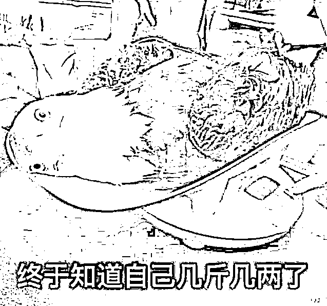

# 老拜登上个飞机摔了三次，这预示着什么？

> 原文：[`mp.weixin.qq.com/s?__biz=MzU0MjYwNDU2Mw==&mid=2247497367&idx=2&sn=148ced8bfa5b82bd8ad161a0815d9470&chksm=fb1a9aebcc6d13fdbe900ee959daf0c2258a84e49ad6fa0ab2f81f7dea5697620c41ce8e9edc#rd`](http://mp.weixin.qq.com/s?__biz=MzU0MjYwNDU2Mw==&mid=2247497367&idx=2&sn=148ced8bfa5b82bd8ad161a0815d9470&chksm=fb1a9aebcc6d13fdbe900ee959daf0c2258a84e49ad6fa0ab2f81f7dea5697620c41ce8e9edc#rd)

这个新闻我看了，尤其外网的网友比我们还能恶搞，就像闪电五连鞭的马保国被搞出各种视频剪接桥段，瞌睡乔也没有被放过。

CNN 对这件事的解释是当时风很大，但是我仔细看视频中拜登登机时的衣角，飘起的角度风应该不是很大。

而且他也不是踏空，也不是绊倒，第一次摔跤像是老年人体力不支，为了表演身强体壮，故意小跑登机，跑的太快，有点跟不上，人老腿先衰，脚软，摔的跤。 

紧接着他就去扶扶手，有了手臂的力量辅助，但似乎脚还是软的，于是摔倒第二次，第三次。

当然他最后很努力的站起来，继续保持小跑登机，上去后还转身向大家行礼，就冲这一点，我觉得他不该被嘲笑。

毕竟不是每个 80 岁的人都是钟南山，人家年轻的时候打破过 400 米栏全国纪录，这种人是异数。

80 岁同龄人中能小跑登机不摔倒的，不会超过一成。毕竟不是每个人都跟马保国练过接、化、发，一把岁数小腰扭得跟电动马达似的。 

所以我们不调侃拜登的健康了，这种事普大帝可以调侃，可以隔着屏幕遥祝拜登保重身体，但我们不可以。

毕竟普大帝是特工出身，身体的先天条件不比钟老差，奔七的人了，开战斗机，跳进冰天雪地的湖里，所以他有资格调侃。

你我这种寻常人，到了拜登的年纪，打瞌睡，忘词儿，步履蹒跚，实属正常。嘲笑人家等于嘲笑未来的自己，还是彼此都留点面子吧。 

但是放过拜登的健康，不等于放过拜登的政策，这一点，还是可以拿来调侃的。 

我觉得，拜登登机一连摔了三跤，预示着点什么。

咱们来看看拜登为这四年准备的大礼包，他的工作计划，他的目标，总结下来，一共有三点：

**1、制造业回流。2、绿色经济与新基建。3、对富人加税。**

这三件事情中，第一点和川普想干的，努力干了四年的目标是一致的。 

川普用过的所有手段都指向一件事，减税。 

说白了就是要让全世界的资本家觉得美国是个投资天堂，你来吧，你来，就能赚钱。

这个思路本身没有错，川普所思所想的本质是什么？是提高就业。 

他想要让制造业回流的根本原因是提高美国的就业，让美国的红脖子们有份工可以做，从而改善美国内部的贫富差距。 

当然，**川普没那么善良，站在他的角度看，红脖子就是他的票仓，解决票仓的就业，就是解决自己的就业。** 

票仓想当工人，川普想当总统，都是就业问题，没毛病。 

那么经过四年的努力，问题解决了么？没有。 

没有的原因起初看起来是美国的人工成本高，工会的存在使得劳动效率低，最终生产出来的产品缺乏性价比，在国际市场上没有竞争力。 

川普一直致力于降低成本，各种减税白送土地就是围绕这个。 

但是在努力的过程中，他们发现一个尴尬的事实，就是自己缺乏全产业链。 

你在中国的东莞开厂，生产各种配件的小厂都在周边几十公里范围内。有水有电有配套，道路畅通的不得了。 

一天 24 小时三班倒，灯火通明，只要你有 idea，马上就有 DEMO 给你看，看完 DEMO 马上可以叫齐配套工厂，连夜给你加班赶工。 

一个厂子为了挣川普的补贴，来到美国，第一件事不是爸爸去哪儿了，而是配套去哪儿了？ 

我一个人是完不成一个产品的，就像一台手机，上下游牵扯几百家生产厂商。 

如果你打越洋电话，跟中国的配套厂家隔着大洋，隔着时差协同工作，那这个成本海了去。 

一个样品，寄送到美国，一两天过去了。时间就是金钱，这是三十多年前深圳的口号。 

川普减税填补不了美国缺乏全产业链的坑。 

那么我们看看，拜登是怎么做的？他在川普的基础上又是怎么改进的？ 

**对不起，这里你要改变思维习惯。拜登是不会在川普的基础上改进的，这就是美国。**

美国并不是一个政策连续的国家，拜登不会继承川普的探索，他只会把川普描述成一坨翔。 

既然是翔，那就丢掉吧。 

**拜登的制造业回流不是以解决美国国内就业为目标的，不是。**

他的侧重点在于自动化。就是利用美国的科技优势，大量的采用自动化生产，去抢夺高端制造业的那部分市场。

你注意重点，不是像川普那样为了解决就业全面的追求制造业回流，而是抢夺**高端**制造业，抢夺自动化制造业的高端市场。 

中低端我不要了，我知道也抢不过你。 

**就思路本身而言没毛病，但我问你一个问题，就业怎么办？** 

四年后，当红脖子们发现自己的工作更难找了，他们难道不会把懂王，或者第二个懂王选上去么？ 

**到时候，你拜登的政策怎么延续？还是又被一脚踢开，再重走老路？**

理解我的意思了吧？ 

拜登的做法顾头不顾腚。你就一块布，遮了脸，屁股就露出来了。 

当然，我相信他也不想这个，他关心的就是自己的任期，没有什么真正意义上长远的目标。 

**咱们再来看第二个问题，绿色经济与新基建。** 

如果说第一条是为了挣钱，那么第二条的特点是需要花钱。 

不搞新基建，美国的配套上不去，很影响第一条的落地。人们很难想像全球老大成天家里停水断电，这让人家怎么搞制造业？ 

同样，不搞绿色经济，目前的产业就无法升级，拉不动新消费。 

**但是我问你一个很实在的问题，钱从哪儿来？**

钱只有一个地方可以来，就是发行美债。 

一百年来皆如此，皆如此。 

要发行美债就得有人买，谁买？放眼全球，除了我们，没人买得起。 

你现在回头去看小号的文章《[拜托美国说话前掂掂自己的分量](https://mp.weixin.qq.com/s?__biz=MzU3NDc5Nzc0NQ==&mid=2247500927&idx=1&sn=5567fed66b8e93efa4bb9f4293076ea4&chksm=fd2e66a1ca59efb7b2188ac00a1c59bbd3c08142a8c2f953f3099bb050627afa5e0d2272fc3b&token=216286204&lang=zh_CN&scene=21#wechat_redirect)》。 

明白我们为什么这么硬气了？ 

因为很清楚，到底谁求谁。现在是你求我。

当然我相信最后会买的，这要看对方开什么条件了。 

我知道有的读者想什么，他们想，我们干脆不买，让他们玩不下去。 

NO，NO，NO，这是基层的思维模式，这不是管理层的思维模式。 

你看某些电视剧，一个厂子里，两个工人闹翻了，他升了一级工资你没升，结果老死不相往来，到子女那一代都彼此不做朋友。 

管理层之间不会是这样的。 

我今天跟你翻脸了，当众在老板面前点炮，抓住你所有小辫子，联合你所有对家，集体发难，为的是什么？是老死不相往来么？ 

不，不，不，我只是希望从你的手里夺走一个重要的项目。会议结束了，刚刚捅完刀子的人可能又会抱住你，一脸热情的叫着好兄弟。

你会嫌弃么？你嫌弃就做不了管理层。 

因为此一时彼一时，刚才你们有分歧，可是刚才那一局已经结束了，现在开的是新局。 

你们需要合作的时候还是要抱在一起，因为要防止螳螂扑蝉，黄雀在后，要防止背后还有第三个人把你们一锅端了。

所以如果我们真的一毛钱美债不买，他们就会死扣芯片，在我们还没有攻破某些高端技术领域之前，大家真这么彼此伤害，只会便宜了第三方。 

**毕竟在黑暗森林中，明处的对手不可怕，暗处的还有一大堆。** 

**既然指望卖美债，何来第三点，****对富人加税呢？**

因为很清楚嘛，能买你债的，是你最大的竞争对手，人家岂会真的给你一个喘息之机？

不会的，人家会买，但是不会买到够你用，不会的。

所以美国真的要走出泥淖，打铁还需自身硬，绿色经济，新基建这些钱的大头，还得指望美国的富人出。 

这就是个笑话，天大的笑话。

因为它不符合人性嘛。 

贾代儒因为孙子贾瑞要死了，跑去贾府借点人参，借来的也是参须沫子，这还都姓贾呢。

其实很容易理解，都姓贾有什么了不起？庶出嫡出，大房二房之间还不待见呢。 

又不是自己亲生的，凭什么照拂你？

一个富人，即便是想让他拿出银子，兴办义学，购置族田，都是很难的，这还是照顾同族同宗的子弟。 

你让他去照顾外族，甚至外种？大家肤色都不一样，你幼不幼稚？ 

**天底下或许有一两个特蕾莎，断无成群结队的特蕾莎。**

何况在美国，这两拨人之间的关系好么？ 

关系要是好，盖茨就不会被美国的穷人描述成恶魔，那个黑人青年也不会被白人警察跪断了脖子。

美国的问题不是谁能解决的，也不是什么方法能解决的，因为在长期竞争这件事上面，政策的连续性很重要。 

而政策能够连续是需要国内一致作为支撑的。但遗憾的是，或者讲幸运的是，美国的白人已经不再是主体。

换句话说，除非美国出个奥古斯都这样的人物。 

其实很多懂王的支持者内心深处就是这点事儿，只是为了政治正确，大家心照不宣，他们寄希望于懂王，希望他就是那个奥古斯都。连续执政四十年，保持一个长期的目标，并且把非白人都送走，那兴许能够力挽狂澜。

可你们读过历史么？建立罗马的屋大维是什么时候登上的历史舞台？19 岁。

而懂王呢？70 岁。

还需要我讲么？命运早就注定了。 

就像拜登的三点对应着他摔的三跤，画面感很强。

如果放在《水浒传》里讲，这就叫开篇预示着结局。

智多星叫什么？吴用。

吴用啊，无用......