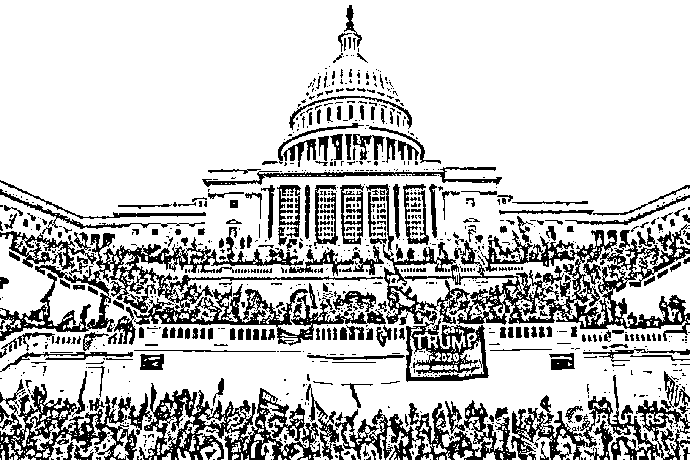
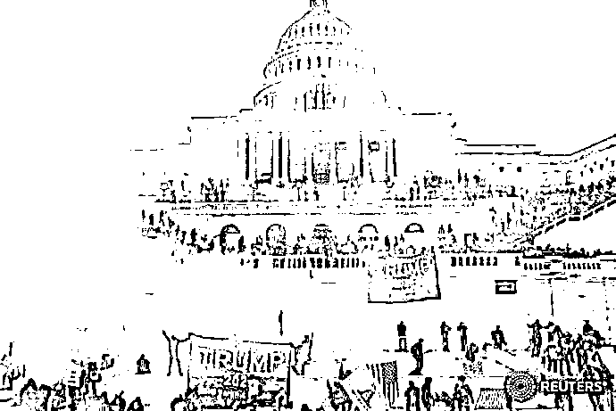
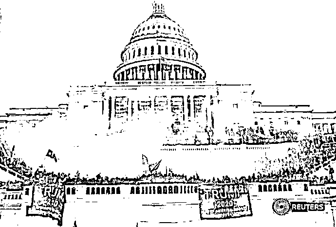
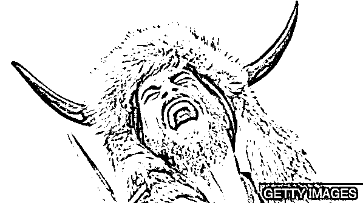

# 我发现我真的是个乌鸦嘴，说什么来什么

> 原文：[`mp.weixin.qq.com/s?__biz=MzU0MjYwNDU2Mw==&mid=2247495633&idx=1&sn=46146c1ea9b47581c27caee543f19468&chksm=fb1a83adcc6d0abb5fe190d2d6b277a3423676555fc4bd0978e582405a68ce62e6ea29568f3f#rd`](http://mp.weixin.qq.com/s?__biz=MzU0MjYwNDU2Mw==&mid=2247495633&idx=1&sn=46146c1ea9b47581c27caee543f19468&chksm=fb1a83adcc6d0abb5fe190d2d6b277a3423676555fc4bd0978e582405a68ce62e6ea29568f3f#rd)

在[昨天的文章](http://mp.weixin.qq.com/s?__biz=MzU0MjYwNDU2Mw==&mid=2247495621&idx=2&sn=e40ae93aa46794f4440ecdce0bf2fb0a&chksm=fb1a83b9cc6d0aaf2ccc04af9685c0aed8b32098debd96dbd6d7d434f57f00422717f8961b90&scene=21#wechat_redirect)末尾，我说了那么一句话。 

我说这位待在美国的公知，既然这么喜欢百家争鸣，那干脆把美国分成东美和西美，一半听科技金融大佬的，另一半听川粉的。

名义上还可以是同一个总统嘛，但总统就像周天子，垂拱而治。

如果分两瓣还不足以体现百家争鸣，还可以继续分嘛。

东南西北中发白，号称战国七雄。

回头让懂王身披六国相印，搞个合纵，另外一方搞连横，我觉得这都是可以的。

但是我大意了，我大意了啊，我没有闪。

按照传统的规矩，我这就是个提议，仅仅是个提议，没想到美国人民动作这么快，“啪”的一下就行动了。

昨天有好些读者说我乌鸦嘴，话音刚落，太平洋彼岸就闹出了大动静。

我问助理，发生甚么事了？

助理告诉我，美国的国会山沦陷了，这是 1814 年遭受英国人袭击以来，第二次沦陷。

下面这张图是懂王登基时的国会山：

这张是懂王即将卸任，也是川粉们上洛勤王时的国会山：

2016 年川普当选的时候，他说要让美国再次伟大。

甭管美国有没有再次伟大，川普已经够“伟大”了。

他创造了很多历史，2020 年发生了很多事，比如 90 岁的巴菲特活久见的那些事儿，大部分都和川普脱不了关系，再比如他硬是靠一己之力把美国送上了疫情第一的宝座。

但是我确实没有想到的是，他走都要走了，还能整这么大动静。

这会儿他已经没啥资源了，推特已经把川普禁言了，FACEBOOK 也把他禁言了，INS 也把他禁言了。甚至平台警告他，再助长暴力，就全面封杀他，永久禁言。

这意味着他已经失去了影响力。在这种情况下，川粉们这么做，是真爱啊。

我以前说罗永浩是东方的懂王，现在想想看，太高估他了。

罗粉嘴里的真爱，都是说说的，连买个手机都不肯，否则老罗也不至于背上 6 个亿的债务。

咪蒙当年的粉丝嘴里说有多爱她，可是当她被禁言之后，一哄而散，没有一个人念着她。

而川粉在他们的大统领已经人走茶凉的情况下，让全世界在 2021 年的开始，又一次见证了历史。

好感人的川粉。这是一张川粉在国会山被拍到的样子：

说实话我不能完全理解他到底在想什么，但是我看出来了，这是真爱，而且是那种山无棱天地合，乃敢与君绝级别的。

所以我收回调侃的语气，很诚恳的给一个建议：我建议美国还是分家吧，各过各的。

分家之后，一半人继续搞金融高科技，就像一个欧洲的国家，另一半人变成墨西哥，劳务输出。

刚开始肯定有摩擦，但随着时间，会趋于稳定。

当然，这个有利于长远的建议，现实中发生的概率很低。

因为川粉们缺乏组织，也没想清楚自己到底要什么，以后怎么过，他们是乌合之众。

而美国的军方很冷静，毕竟工资是硅谷华尔街发的，这场国会山的闹剧会随着军方的介入，表面上趋于平静，虽然人们内心的撕裂，愈发严重。

这是站在美国的视角。

如果站在世界的视角，这是一个很糟糕的消息，对于眼下的疫情就是个坏消息。

病毒的宿主是人，只要有人这个载体，它就可以存活，可以传播，可以变异。

**疫苗发挥作用的前提是大家都打，大家都打，病毒没有载体了，就会随着时间消失。**

可如果有相当一部分人不打，病毒就会在他们这个群体内，传播，变异，直到疫苗无效。

我们想一想，**老美，尤其是川粉，都疯成这样子了，你指望他们乖乖排队打疫苗，现实么？**

No man is an island, entire of itself.   —— 1624 多恩

没有人是孤岛，没有人能自全。

站在长远的角度，这件事让我更加体会到自己生活在一个不确定的时代。 

如果美国人能这么凑合着过下去，保持华尔街硅谷的主流声音，那无非是他们国内始终撕裂着，隔段时间就闹腾一次。 

如果连这种程度都控制不了，让川粉成为主流声音，那就会走向彻底民粹，不懂这句话的，去看二战前的德国。

**前者，仅仅是美国内部的不确定性，后者，将是全世界的不确定性。**

我们确实生活在一个全世界充满不确定性的时代，甭管你希望不希望，这都是无可避免的。 

这个世界唯一不变的，是变化。 

**生在不确定性中，最重要的是什么？** 

是顺应变化，而不是拧巴着来，非要企图在沙滩上盖房子。

过去的两年中，我们绝大部分读者问我的问题的背后都体现出你希望要一个固定的答案，按照这个答案，一步一步的走，就一步一步的得到回报，比如有好的学校，好的工作，好的晚年生活。

但很遗憾，你生的这个时代，整颗星球，都在坐过山车。

坐过过山车吧？如果你绷紧了肌肉，希望让自己抵抗那种失重以及快速移动的感觉，你就会很难受，想吐。

如果你彻底放松，让自己甩出去，让自己跟着车子的节奏，你反而很平静，就像生命已经融入天空。

这个原理中学物理老师教过，叫做相对运动。

你在飞机上感受不到飞机飞，是因为你也在飞，你们之间是相对静止的。

**所以跟上节奏的人，并不会觉得时代是变化的，而企图对抗趋势的人，是很难过的。**

人类在过去 200 年的变化比过去 2000 年大得多，而在过去 20 年的变化，又比过去 200 年大得多。 

也就是说我们从变化走向了加速变化。

这种时候一定有人怀念过去，怀念那个不变的过去。

我们聊过《流金岁月》，有读者跟我说，她很羡慕南孙奶奶，那种过去老人身上的传统。 

你羡慕是因为你只看到了她演给你的优雅，却没有看懂她内心的拧巴。

剧中她吃饭，一定要十个菜，盘子还得是圆的，不能用装鱼的长盘子，讲究个团团圆圆。

过去旧社会出生的老人，有很多讲究，本质上不是因为她们的经验有什么参考价值，更多的是因为她们恰好生在一个大时代的末尾，被打小灌输的旧观念。

旧社会的时候，我爷爷生在一个商人家庭，我奶奶生在一个官员家庭，一个做生意的时候租另一家的码头仓库存放木材，于是就联姻了。 

他们就是很典型的，老话讲，过去那个社会的老人。 

我爷爷吃饭喜欢摆一桌子，那个鱼，或者蔬菜，有讲究的，要求什么季节吃什么，大小尺寸都有讲究，比如鱼，他要指定什么季节的什么鱼，多大，不能大不能小；黄鳝，多粗，筷子粗，再粗了不要；那个芹菜，要一段段掰断，抽丝，否则塞牙缝；馄饨馅，里面要剁个梨，有果香，去油腻；炖肘子，要和鸡一起，先喝汤，小勺子要沾一点酱油，从外面翻进去舀汤；豆沙包子，豆沙都是自己熬的；夜里一定要喝什么糖水，什么百合莲子，银耳里面还非得放几个小橘子；毛线都是指定的几个品牌，毛衣自己织的......

太多了，旧社会留下来的穷讲究。

我想，我是有评价权的，我上小学前都和爷爷奶奶生活在一起，上大学前，周末寒暑假都和爷爷奶奶生活在一起。 

作为纯粹的白纸，小孩子的感受才是真实的。

我小时候的感受就是，老人们坚持的讲究，不是享受，是自己跟自己过不去。

因为我长大后，再也没有主动的哪怕过过一天，那样的日子。

如果一个东西，在没有外力强迫的情况下，你不会去主动追求，那就说明不是真爱。

就像如果你是为了别人的评价而去学习，那就不是真爱学习；你是为了获取世俗的认可而去做事，那就不是真爱做事。

**我来告诉你什么叫真正的懂美食，什么叫真正的懂生活。**

你想吃什么，就吃什么，想怎么吃怎么吃，这才叫懂美食；

你想干什么就干什么，不受束缚，这才叫懂生活。

只要你乐意，你是站着吃，是蹲着吃，是躺着吃还是趴着吃，是坐在椅子上吃还是站在桌子上吃，随便你。

丘吉尔这辈子都是躺在床上吃饭的，他高兴，你管得着么。

超人从来都是把内裤穿在秋裤外面，这叫引领时代的潮流。

**打破规矩，不拘一格，说明你这个人富有创造力**，而向规矩低头，做到极致，就是上上一代老人身上的那种拧巴。

看过《乱世佳人》吧，女主小时候觉得腰带太紧了，这才是人真实的感受，她是个孩子，还不会撒谎。

长大后，不由自主的穿束腰那么紧的裙子，还认为是体面，就是被驯化了。

就像一只大象，你要驯化它，就得在它小时候强迫它栓根链子，它长大后可以踩断脚上的链子，但是踩不断心中的链子。

如果，世界趋于不变，什么占优势？家养的大象占优势，因为动物园里比的就是对于既有规则的谙熟于心。 

如果，世界趋于变化，而且越来越剧烈，那就意味着这是野外世界。

在野外，什么最重要？**够野才最重要。**

**要应对趋于剧烈变化的世界，需要你拥有更高的创造力，而创造力需要你释放天性。**

不要问自己体面不体面，不要管别人眼里的自己，先问一问，你自己到底要做什么？ 

**你坚持终身学习，终身思考，保持好奇心，接纳新事物，不断的探索舒适区之外的世界，你就会对变化的世界如鱼得水。**

你坚持捧着祖宗们留下来的老皇历，那等待你的就是不适应。

无论你做什么，都会发现做着做着，岗位没了；做着做着，行业没了；甚至做着做着，一睁眼，熟悉的世界都没了。 

但是在野象眼里，这才是最好的世界，“意外”还有另一个表达方式叫“惊喜”。

危机危机，危中有机。**混乱才是最好的阶梯。**