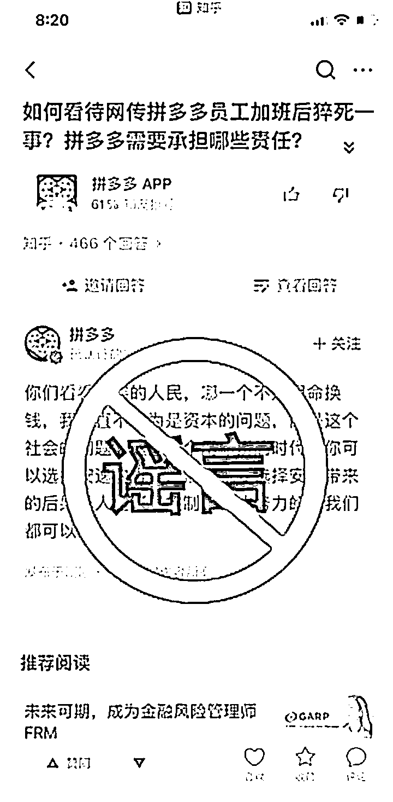
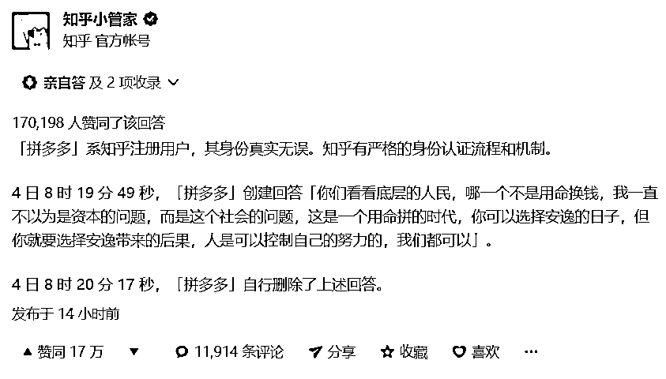
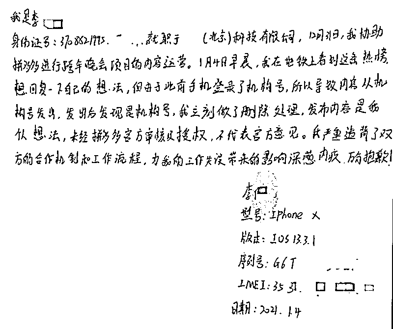

# 拼多多的公关危机

> 原文：[`mp.weixin.qq.com/s?__biz=MzU0MjYwNDU2Mw==&mid=2247495605&idx=2&sn=0493afa0ae9ecd003b8ec873ec7e81d4&chksm=fb1a83c9cc6d0adf6cdbdd1c4c9fbbe9a1734f9ee354d51aac2c4eb1750750259a8eee7c8e3a#rd`](http://mp.weixin.qq.com/s?__biz=MzU0MjYwNDU2Mw==&mid=2247495605&idx=2&sn=0493afa0ae9ecd003b8ec873ec7e81d4&chksm=fb1a83c9cc6d0adf6cdbdd1c4c9fbbe9a1734f9ee354d51aac2c4eb1750750259a8eee7c8e3a#rd)

前天后台好几个人在问这件事，我第一时间就看到了，但我觉得过于乌龙，所以没有评论，我想让子弹再飞一会儿。

飞到前天晚上，其实各方面都已经表态，整件事的脉络似乎出来了，但是来不及写，我要休息了。

昨天再写，今天发出来。

事情的起因很简单，就是下面这张图：

网络上忽然出现了一个来自知乎拼多多官方账户的帖子。

只出现了短暂的半分钟，就删掉了，但是被人截图，四处转发，然后拼多多就出来辟谣。 

当时我的第一反应是难以置信。

因为此前恰逢拼多多有一名员工猝死，小姑娘很年轻，还是独生子女，在这种悲痛的时候，公司官方怎么会发这么一个送人头的帖子，这种公关危机在商业历史上都很罕见。

所以这个桥段真的在现实中上演的时候，我第一反应不相信，直到看到知乎的官方回应。

说实话，我被惊到了。

送人头也不是这么个送法。

随后，拼多多给出了官方答复。

大概的意思是说有一个合作伙伴的员工，跳出来说，锅是他的......，是他用了人家公司的官方账号发送了自己的观点，在此澄清道歉。

这个回复我不予评价。

因为甭管是什么原因，这都是严重的商业公关危机。

但是咱们今天讨论的不是情绪问题，我们的读者和别家不一样，很高端，要求我们输出思辨类的内容，而不能和别家一样只有情绪没有干货。

那我们就来讨论加班问题。

先声明两点。

**1、不支付加班费的加班，是违法的。**

**2、支付了加班费，但超过法律规定上限的加班，依旧是违法的。**

违法的情况我们不讨论，如果你遇到了，应该立即诉诸法律。任何道理都在法律框架之下，天底下，法最大。

好，那我们来讨论，法律许可的加班，就是没有超过时间上限且支付了费用的加班，是什么引起的？

我们首先来假设一下，它是一个资本问题。

网上有一部分人持有这个观点，他们说，资本带来了加班。

那解决的方法很简单，把资本赶走。

我们只要告诉资本，你去别的国家投资开厂吧，我们不欢迎你，问题不就解决了？

真这么做，你会听到更多的骂声。

因为这部分人又会讲，不要放跑了资本，如果资本跑去发达国家，就是财产转移，如果资本跑去了东南亚设厂，就是产业转移。这些行为都是背叛，都是没良心......

**你会发现，怒骂资本的，和怒骂资本离开的，是同一批人。**

**如果资本来你反对，资本走你也反对，那你真的知道自己想要什么了么？**

我指出这一点，只是希望你在愤怒之前，先学会思考。

考虑到概念的抽象，我们就从工作场景中聊聊天。 

十五年前，我入职的第一家公司，996。

为什么呢？

原因很简单，公司是个创业团队，存活的 7 年间，花的都是风投的钱，从来入不敷出，直到最后烧光了关门。

**资本要什么？是要你的产品还是要你的理想或者要你加班？都不是。**

**资本只要一件事，就是你上市，它好卖了股票套现。**

你看到了吧，没有哪个资本那么有耐心，真的指望靠榨你的劳动，等着你卖产品挣钱。**起码在计算机和互联网行业，就是这样。**

我说过很多次，资本和打工人是合作关系，资本和资本才是竞争关系。

**风投想要的，是和你这个打工人合伙谋一个局，假装能够从你身上榨出利润的样子，然后包装上市，卖给下一个资本，就是散户，把他套牢。**

看懂了吧？资本没有耐心赚打工人的钱，他想赚的是接盘资本，也就是散户的钱。 

但是，1000 家创业公司能活过 10 年的不足 10 家，能上市的不超过 1 家。

也就是说，**绝大部分创业团队，也就是打工人团队都像我第一家公司一样，无论主观意愿是什么，实际上干的都是直接骗资本，而不是陪资本一起骗下一个资本。**

团队花了资本的钱，又没有结果，只能用加班的方式给个交代。

无论计算机还是互联网行业，绝大部分的钱都花在了薪水上，你让我退钱是没门的，但加班是可以的。

**这个过程，就像吃霸王餐，吃进去的东西你让我吐出来，门都没有，但你可以打我。**

就这么回事。

这一套，后来我第一次创业的时候学去了。

我们融资前后工作量没有变化，但是创业拿到风投后，给普通员工加薪 50%，给管理层加薪 100%。

这意思很简单。

**许诺给资本的那些理想能不能实现，回头再说。兄弟们先吃饭，吃饱了，躺倒，任凭资本想干嘛干嘛。**

饭，吃进兄弟们肚子里，是吐不出来了；钱，揣进兄弟们兜里，也拿不出来了。

但是，我们认罚。

这就是我的那句话，谁给钱多给谁干，你要咋干就咋干。

我躺平了，你来吧，要钱没有，要别的随便。

**反正你要是指望我们上市，那就继续给钱，给了钱我就继续躺平，你说咋办就咋办，直到你继续给钱，或者一拍两散，那我们再次创业，继续吃下一个资本。**

你看到了吧，我从来就不相信资本能够欺负打工人。

你也不想想，资本上班么？**你买了獐子岛的股票，难道你真的下海喂鱼么？**

你连班都不上，你怎么阴他？

**他天天上班的人，想怎么阴你就怎么阴你，他说扇贝走了就走了，他说扇贝回来就又回来了。** 

不服气咋的？

你除了看几张不知道真的假的，几手的财报，两眼一抹黑，你还能做什么?

**资本从来阴不了打工人，能阴打工人的，只有管理层，俗称中层陷阱。**

这就是[昨天小号给你讲的](https://mp.weixin.qq.com/s?__biz=MzU3NDc5Nzc0NQ==&mid=2247498317&idx=1&sn=16a66e9a063081a056905a7c5a5e4393&chksm=fd2e5893ca59d1854b555c3deefd76679115698d4fab31963eb2fabbad8a88f1b294e14138f8&token=2045361127&lang=zh_CN&scene=21#wechat_redirect)，假如没有中层，咱们组个团队，攒个局，直接去忽悠风投，回头钱花光躺平，给资本一个交代，继续忽悠下一个。

一个个忽悠下去，咱也退休了。

但如果有了中层，这事就麻烦了。

这就是前几天我跟读者说的，打工人和打工人之间才是竞争关系，是打工人导致了打工人加班，**是打工人中的管理层导致了打工人加班。**

你想一想，什么叫中层？就是 VP，经理这帮人，只有他们才能做到欺上瞒下。

**又想忽悠资方的钱，又不想真的躺平有所付出，最佳的策略是什么？**

**很简单，自己忽悠资本的钱，给自己高薪，高股权，让自己的下属躺平任凭资本出气。**

说白了，就像老鸨一样。

**钱，都让老鸨赚走了，姑娘们加班，是老鸨为了装样子，给个交代导致的。**

这，才是真相。

我前几天为什么告诉你资本和打工人不是竞争关系而是合作关系，你想一想就明白了。

如果资本越少，融资越难，就会怎么样？加班就会越严重。

1000 家创业公司，990 家都不挣钱，大家原本吸引资本，靠的就是谁躺的更平。

好，**如果资本很多，很泛滥，你就可以很拽，我为啥要躺的那么平？想投我们的资本排着队呢。**

**如果资本真被你赶走了，变得很稀缺，那你惨了，你只能和别的团队比，看谁躺的平。**

人家 996，你只能 007 了。

没办法，为了吸引仅剩的资本，不丢人。

去年我们聊过一个话题，就是疫情期间的经营贷款，利率很低，不到 4 个点，比房贷低多了。

当时我说过一个话题，为什么银行明明知道你拿去买房，还肯打着经营的由头借给你？

道理很简单，你真要是投到企业里，他还真不敢借给你。

**银行靠算帐混饭吃的，他心里门儿清****，你买房的风险比你投入公司，小多了。**

你投入公司，接下来就是前面那个局面，一群打工人吃干抹净躺平，你还收得回来么？

所以资本脱实向虚。

**你也不想想，如果资本真的能够欺负打工人，它是吃饱了撑的要脱实向虚？**

**恰恰是因为打工人欺负了资本，资本被欺负怕了，再也不敢跟打工人玩了，宁愿去和资本玩，这就叫玩虚的。**

**站在打工人的视角，我们要做的，不是把资本赶走，而是千方百计的忽悠他回来。**

大哥，来玩嘛，别走。

**愿意投入实体公司的资本越多，打工人才能把它按在地上**薅。****

你想一想，为什么官方那么努力的，**千方百计的吸引、鼓动资本脱虚向实**？

因为这才是治本的办法，只有忽悠的资本多了，打工人稀缺了，才能薅的越多，躺平越少。

那什么是治标的办法呢？或者说什么是在资本与打工人比例不变的情况下改善的办法呢？

[就是昨天小号聊的](https://mp.weixin.qq.com/s?__biz=MzU3NDc5Nzc0NQ==&mid=2247498317&idx=1&sn=16a66e9a063081a056905a7c5a5e4393&chksm=fd2e5893ca59d1854b555c3deefd76679115698d4fab31963eb2fabbad8a88f1b294e14138f8&token=2045361127&lang=zh_CN&scene=21#wechat_redirect)，减少中间层。

因为直接导致大量基层打工人 996 的，就是中层管理者。 

像我这种年纪的江湖老油条，如果去打工，是没有可能被搞得精疲力尽的，因为我太懂了。

我太清楚绝大部分工作都不是资本要做的，而是中层管理者因为勾心斗角，邀功请赏，或者根本没有理解市场目标导致的。

换句话说，你没有给资本加班，你只是在给你的上司们，给那些中层打工人在加班，干的也不见得是资本希望你干的事儿。

**他们只是希望用你的真躺平，来摸资本的鱼，这叫做两头吃。**

解决这种问题只有一个办法。

[昨天小号告诉你了](https://mp.weixin.qq.com/s?__biz=MzU3NDc5Nzc0NQ==&mid=2247498317&idx=1&sn=16a66e9a063081a056905a7c5a5e4393&chksm=fd2e5893ca59d1854b555c3deefd76679115698d4fab31963eb2fabbad8a88f1b294e14138f8&token=2045361127&lang=zh_CN&scene=21#wechat_redirect)，推广扁平化的管理模式，减少中层，让基层打工人和资本直接对接。

就是那句宣传语：**不要让中间商赚差价。**