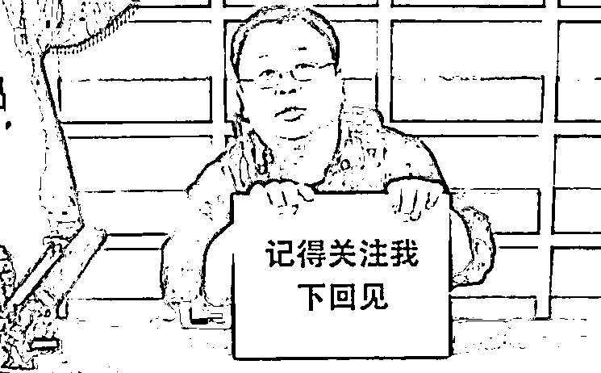

# 为什么这么多人骂丁真？因为这就是人生嘛。

> 原文：[`mp.weixin.qq.com/s?__biz=MzU0MjYwNDU2Mw==&mid=2247494924&idx=1&sn=b24913664610126465a665bba6e7f6ed&chksm=fb1a8170cc6d08660e33421717f26d966643a2cba34baac931b94c8d829c7e256fe24f2cd779#rd`](http://mp.weixin.qq.com/s?__biz=MzU0MjYwNDU2Mw==&mid=2247494924&idx=1&sn=b24913664610126465a665bba6e7f6ed&chksm=fb1a8170cc6d08660e33421717f26d966643a2cba34baac931b94c8d829c7e256fe24f2cd779#rd)

有人问我怎么看这么多人骂丁真？而且男的居多。

其实这有啥不解的，你去看骂杨超越的也很多，女的居多。

虽然骂的花样百出，拿各种东西来说事儿，究其实质就两句话：

**为什么是丁真？为什么不是我？**

当然，嘴上不会这么说，肯定会找出各种各样的由头。

比如某些科学家，辛辛苦苦一辈子也没有出名，丁真你不就是长得天真无邪么？天真无邪了不起么？天真无邪就可以出名么？试问你有甚莫贡献？你是创造了接化发呢？还是提出了闪电五连鞭？

问话之语气，赶上嬴政给吕不韦的绝命信了。

嬴政把吕不韦罢相，赶去蜀地，还问了他两个哲学问题：

君何功于秦，食十万户？何亲于秦，号称仲父？

就是说，你到底立了什么功劳，领这么高的工资？你到底和我有啥关系，让我叫你一声“二大爷”？

大爷是伯父，那么二大爷想必是仲父了，伯仲叔季嘛，我这么翻译也有理有据。

但是说句公道话，丁真和杨超越还是不一样的。

杨超越的出名是商业活动使然，或者说，她本来就是奔着出名去的，那个背后有选秀，有资本运作，一开始就有，一开始就是冲着这个目的。

出来混嘛，遭人非议在所难免，所以我并没有替杨超越说过公道话。

可是丁真这事儿还不太一样，至少在他出名之前，是没有商业介入的。

换句话说，人家求你了么？

他是不是像罗永浩一样立个牌子，求关注？

有没有像下面这张图？

没有嘛。

答案就是没有，丁真没有这样做。

就好比有个人，在马路上看见一个漂亮的姑娘，让他起了邪念，以至于控制不了海绵体，当众出丑，被女友看见暴打了一顿，于是生恨。

辩解说：都怪她，她为什么那么漂亮？都是她的漂亮引起的.....

你觉得，这是个什么人呐。

丁真的出名，纯粹因为运气，你骂他，纯粹因为妒忌，没有什么别的原因。

妒忌就说妒忌，妒忌不丢人，不要找别的理由，找别的理由才丢人。

就像你看见一个人，运气很好，买彩票中了头奖一个亿，你很嫉妒，这是正常的情绪，就跟你看见美女有反应一样。

但如果你企图掩盖自己的嫉妒，找一些像下面这样的理由，比如为什么买彩票中奖的不是科学家？科学家那么勤奋，做出了那么大的贡献......

那你真的很丢人。

因为所有人都明白你到底在想什么，你到底在琢磨什么。就像一个人，光着身子，却以为自己穿着衣服。

当然，我相信有一部分人，并不是嫉妒丁真，也许只是单纯的觉得不公平。

你要是论绝对的公平，这世上有些人，考上了清华北大，却买不起学区房；有些人，辛苦的加班，赚的没有丁真多；有些人，也长得天真无邪，埋没在富士康轰鸣的车间里。

这是一个什么话题？这是一个预期的话题。

前几天我聊规则，我说完善的规则比不完善的规则要好，不完善的规则也比没有规则要好。

整个人类文明就是在不断地企图完善规则的过程中，摸索着前进。

有一位读者措辞激烈的跟我讲了很多人类社会中不完善的地方，然后义愤填膺的问我，这正常吗？

我好奇的问了句，你觉得什么是正常的？

他说，完美的社会，才是正常的。

这就是一个预期的问题，你觉得考 100 分是正常的，99 往下都是不正常的。

我觉得考 60 分就是正常的，往上往下都叫做异常。

就像疫情期间，谁是正常的？日本是正常的。

有人会说，日本疫情控制如此不利，前期各种推诿，后期各种反复层出不穷，这还叫正常？

对呀，这就叫正常。

放眼全球 100 多个国家，日本岂止正常，他们是良，如果打分，是 70 分，比 60 还高呢。

有人说中国考了 95，那美国还考了 25 呢，这些都叫异常，无非往上还是往下。

如果你眼里只有 100 分才叫正常，那你看什么都不正常。

你说的很对，科学家从小到大比丁真更努力，甚至有可能连你都比他努力。

在你看来，100 分的社会应该按照努力的程度，来分配名气，财富.....

我且不论你这个想法靠不靠谱，首先我们人类社会就不是 100 分的社会。

如果把原始社会作为起点，我们今天有没有 60 分？不知道。可能你再过 2000 年回头看，我们今天等于原始社会。

社会前进的步伐是非常缓慢的，可能一个百年间，从 59 到 61，又跌回 60，又前进到 62，是这么跌宕起伏，有前进有回撤的往前走。

而每个人的一生长短不一，有的人运气不好，生在 61，死在 60，都没经历上升周期。

也有的人，其实命很好，像我们这代人，生在上升周期的起点。但他对正常的预期很高，他希望是 100 分。

什么时候才能到 100 分呢？可能是 1000 年以后，可能永远都到不了。

也有可能 1000 年以后人类文明已经消失了。

恐龙是一种生物，恐龙灭绝了，人类也是一种生物，凭什么人类就非得进化到至臻至善的境地？

佛经讲六道轮回，既然吕不韦何功何亲，丁真何功何亲，那你又有何功何亲，凭什么就得投胎在天人道呢？

就像扔色子，如果你觉得把把六六六才叫正常，那你也很搞笑。

有人觉得，怎么会有这么傻的人呢，他们不会算算概率么？

我给你换个例子，你就不觉得傻了。

成天都有人问我，西风，你不觉得只有人人赚钱的资本市场，才是合理的么？

那我们来算一笔账。

假设一个资本市场能够充分的体现社会财富的增量，就好比一个社会每年创造 5%的财富增量，全部体现到资本市场里去，比如以股票上涨或者商品期货价格上涨的形式。

那你说这 5%的增量首先要满足哪些基本开销？

金融市场的所有从业人员要不要先分钱？

基金经理，分析师，交易员，算法工程师，客服，销售，配套的团队，市场推广，购置服务器，机房维护，.....，这是基本运营的费用。

甭管你赚不赚，他们的这笔服务费得先从蛋糕里切出去吧。

好，那我们看剩下的，剩下的蛋糕，资本大的，消息广的，人才出众的，先分钱，你没有异议吧？

**你有异议也没有意义。**

你有 1 块钱，对方有 100 块钱，你输一次，就出局了，你要赢 100 次，对方才出局。你觉得谁更可能出局呢？

你连牌有多少种玩法都还没弄清楚呢，人家可是造诣颇深，眼观六路耳听八方，不该他赢，难道该你赢么？

等这些人依次分完，你觉得蛋糕还是个正数么？它已经变成负数了。

一群人在玩一个负数游戏，整体上看，当然是亏钱的。

这就是为什么你看到散户整体上是亏钱的，这有问题么？我没有看出有什么不合理呀。

因为前面那些先分钱的部分，每一样都是去不掉的。

哪怕是一个赌场，也有运营的费用，把桌子去掉还怎么打牌？

而前面你也看到了，那些长期稳定盈利的，都是有数学在那里保证着。不是资本大的赢面高难道是小的赢面高？不是信息高地赢面大，难道是信息洼地赢面大？

这是数学确保的，你就算想反对数学，也得先推理出可以取而代之的科学吧？

那么剩下的人，在一个负和游戏里，能做的，无非就是谁运气好，可以从负蛋糕里分一块，留下剩下的倒霉蛋们。

丁真不就是这么一个好运气的 boy 么？你还骂人家？

其实不想靠运气，道路是光明的。

你完全可以加入金融机构，成为赌场里第一波分钱的。

去北大念个金融，沃顿念个硕士，加入投行，你就是种铁杆庄稼的，旱涝保收。

甭管散户赚还是赔，你死工资拿着，甭管机构赚还是赔，你佣金提成拿着。

人家赚了你有分红，人家赔了你还是年薪百万。

你完全可以加入互联网大厂。

去清华念个计算机，一直读到博士，3 年在阿里混到 P8，5 年在阿里混到 P9。P8~200 万，P9~400 万，30 岁出头你就可以有房有车了。

这两条路有没有说长得不够天真无邪的不要？

没有吧。

那就去走嘛。

放着金灿灿的阳光大道不去走，骂丁真，又能得到什么呢？

当然，如果你不想走，那我懂了，这是你的选择。

你只是觉得骂一骂丁真会让自己好过一点，那请继续。

就像有个读者问我，西风，你怎么看清华北大很多人也买不起学区房？

我反问他的现状。

他告诉我职高肄业后，就在家里待着，也没钱也没女友，目前很迷茫。

我问他为啥不把职高念完呢？

他说实在读不进去。

我问他为啥不去学一门手艺？

他说学了又能如何，清华北大，不也买不起学区房。

我问他，餐桌上没龙虾，难道不吃饭把自己饿死不成？求上不可得可以求中，求中不可得可以求下。

他说他是个讲究的人，绝不向不完美的社会低头。

我心中暗暗称赞，果然根骨奇特，卓尔不凡。于是给他推荐了歪嘴邪神系列的视频以及我不是气运之子系列小说。

他看了之后很开心，很感谢我。

他坚信自己是龙王转世，有一天会有十万家将带着百亿现金来救他，到那时，他会名扬四海，震烁古今...... 

你看到了，这就是他想要的，这也是他唯一能要的。这就是人生嘛。

学会理解别人，学会改变自己。千万不要反过来。