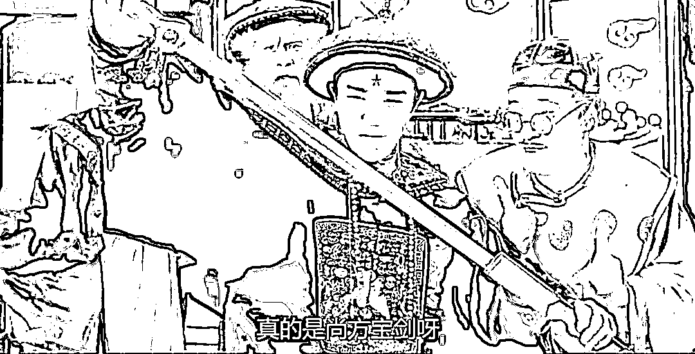

# 澳洲主播史密斯是要拿前朝的剑，斩本朝的官么？

> 原文：[`mp.weixin.qq.com/s?__biz=MzU0MjYwNDU2Mw==&mid=2247494567&idx=2&sn=4d7c78121846481a2d2d97e8f2aff807&chksm=fb1a87dbcc6d0ecd40ef73c99d766fbd2922471c433ec713529cd6bb8ba73b1ad5f049a25c53#rd`](http://mp.weixin.qq.com/s?__biz=MzU0MjYwNDU2Mw==&mid=2247494567&idx=2&sn=4d7c78121846481a2d2d97e8f2aff807&chksm=fb1a87dbcc6d0ecd40ef73c99d766fbd2922471c433ec713529cd6bb8ba73b1ad5f049a25c53#rd)

这个事情的起因非常简单。我们的外交部发言人在推特上发消息的时候用了一张图片，是一张讽刺漫画，画的是澳军在阿富汗屠杀平民，其中包括两名十四岁的男孩，他们被割喉，装袋，沉河。 

而且新兵还通过射击战俘来“练手”，或者说适应战场。 

这本来是个很简单事情，澳方如果要回应，你就说有没有就可以了，有则改之，无则加勉。如果说此事子虚乌有，那你拿出证据来，咱们大家伙讨论。

但是澳方的态度很搞笑，他们不讨论自己有没有做这事儿，而是先跳出来说：这种事儿，谁又没有呢？ 

你听懂这个逻辑了么？

你摸小尼姑的头，被抓了个现行，如果你说没有，那你提供人证物证，只要你能推翻结论，那权当你没摸过好了。 

可是，你的第一反应是：小尼姑的头，别人摸得，我摸不得？

这就值得玩味了。

你的意思是说，你真的摸过喽？ 

这次可是你自己说的哦，别赖别人。 

按说交锋到这里，聪明人就会打马虎眼，混过去得了，澳大利亚的大头，都已经出来灭火了，转移话题。 

但是没想到，自己有一队的猪队友，一个比一个搞笑， 都是冲上来补刀的。

首先跳出来的就是我们标题中这位，澳大利亚天空新闻主播克里斯•史密斯。

这哥们像谁呢？像极了电影《九品芝麻官》里面星爷那个老糊涂的娘。

电影中星爷正在庭审现场与人家打的不可开交，他老娘忽然冲了进来，高喊：十三，十三，我拿了尚方宝剑来给你呀。

星爷早有准备，说：娘，你出去先，那条咸鱼你自己蒸了吃吧。

他习惯了，他老娘总是把咸鱼当尚方宝剑。 

结果他老娘说：这次不是咸鱼，这是真的。 

星爷拔出来一看，如假包换，果然是真正的尚方宝剑。 

星爷很激动，以为手持高级货，从此天下无敌了。

结果人家让他介绍下宝剑的来历，是谁赐的。

他老娘说：是明朝崇祯皇帝.......

呵呵，你要知道，剧中的现场是清朝.....

我本来以为咱们是职业说相声的，没想到一山还比一山高，克里斯•史密斯才是隐藏的王者段子手。

他在自己主持的新闻节目中说，澳军杀害平民，就不叫个事儿，这事儿谁没干过？谁没干过？

然后举了两个例子。

他说，1927 年，常凯申对共产党人，大肆屠杀，至今上海人民未曾忘却。 

他说的是事实，咱们的教科书上有这一章节。 

接着他又说，在 30 年代，常凯申烧了长沙，间接害死了三万平民。

他说的也是事实，咱们的教科书上也有这一章节。

但是他好像没有搞清楚一点，这是谁的罪行？这是常凯申的罪行好不好。 

正因为常凯申坑害过共产党人和老百姓，所以他被二者齐心合力赶到台湾去了。

这是 70 年前发生的，难道克里斯•史密斯今天才知道？

何况，按照克里斯•史密斯的这个逻辑，那澳洲政府是不是也应该被赶到昆士兰的大堡礁上面去呢？ 

呵呵。 

非常搞笑的一个主播。 

当然，接下来法国的外交部发言人更搞笑。 

他说，你们不能这样说澳军，因为这么做，等于把我们所有人都捎带进去了。

此言一出，舆论哗然。 

你这什么意思？ 

我们有个人指出，澳军摸了小尼姑的头皮，你跳出来说，不能提这事儿，提这事儿等于连带了我们所有人。 

所以，你想表达什么？

你想表达小尼姑的头皮，你们人人摸过？

呵呵。

这真的是个非常可爱的发言人。 

我们本来只是说了句澳洲，没想到法国主动把自己，甚至美国都捎进去了。 

其实澳洲老大的头脑是最清醒的，这件事最好的方式就是不吭声。 

整个西方世界的主流声音毕竟是白左，而且你们确实屠杀平民了，这事儿明摆着。 

你越辩，对你越不利，所以鸡贼的就赶紧熄火，转移话题，互联网就是这样，一天不聊大家就忘了。

国际互联网也是互联网。 

最怕的就是这种猪队友，神补刀，硬是把自己搞成段子手的笑料。

这个故事本身很简单，但是它透露出一个问题。 

你想想看，为什么澳洲的主播，法国的发言人会犯这种低级错误？ 

说到底，承平日久，**躺在发达国家的椅子上舒服太久了，人已经失去了动力，失去了了解别人的动力。**

这种错误，咱们以前犯过，大清朝的时候犯过。 

那时候林则徐还以为洋人离不开我们的茶叶，大黄，给道光上书：“外国若不得此，即无以为命。”

那时候张之洞开设汉阳铁厂，工程师说要先化验铁矿石，他一句话，中国地大物博，何须化验，结果导致开工后因为铁矿质量不合格而铁水不合格，卖不出去连月亏损，最后幸好李鸿章派盛宣怀去帮忙官督商办才解决。

要知道，林则徐，张之洞这都是晚清名臣，当时顶级的人尖子了，也会犯这种低级错误。 

说到底，他们的心态高傲的太久了，缺乏接地气的学习上进之心。

其实你今天看到西方世界很多问题的根源都在于此。 

他们骄傲太久了，也的确成功太久了，两百年了，已经不愿意去了解外部的世界了。

我很早之前就聊过，对于我们而言，核心的竞争力就是接地气。

因为我们不得不接地气嘛，我小时候大人一个月一百块钱都不到，我们买台彩电，那是几年的收入，那是全家的大事情。而当时美国人，如果愿意，月月可以换彩电。 

《走向共和》里面有一场戏，慈禧太后一顿饭吃 108 个菜，还嫌没地方下筷子，明治天皇为了省钱买吉野号，每天只吃一顿饭，一个饭团。 

我们今天的心态，和剧中的蕞尔小国日本是一样的；而西方人的心态和剧中自比天朝的大清是一样的。 

我上高中的时候，香港回归，同学在舞台上唱那首歌，“一百年前，我眼睁睁的看你离去.......”，台下学生们泪流满面。 

为什么哭？ 

80 后，90 后的整体民族自豪感平均值，恐怕是比肩于上世纪 20 后，30 后的。

这是一个很有意思的现象。

我不知道有多少人看过一本 90 年代的情景喜剧的鼻祖，《我爱我家》。剧中的圆圆就是当时台下高中生那代人。

圆圆的爷爷老傅参加过战争，扛过枪，他两个儿子一个叫志国，一个叫志新。

剧中有一集，志新托哥们买特定号码的电脑，中了大奖，一万美金。电脑公司的总裁要来他们家家访。

总裁谁演的呢？英达演的，演一个美籍华人，相当自信的来到了一个中国家庭，而老傅一家子表现出了过分的热情。

这种热情实际上是收入差距带来的。就像《红楼梦》里有一回，宝二爷偷跑去袭人家做客，袭人的哥嫂忙慌不迭的招待，那种热情中带着点惶恐，唯恐招待不周的劲儿，是一样一样的。

换句话说，老傅那一代人的自豪感，其实没底子，人穷骨头硬，全靠精气神。

志国、志新那一代人，生在动荡的时期，他们没有那么强烈的信心。这就是剧中表现出的那股子有点仰望人家的意思。

到了圆圆这一代，就是 80 后，90 后，圆圆到今天也奔四了。她内心深处是承认自己父辈不如美国人有钱的，但是她生在高速发展时期，速度给了她自信。

她非常自信在自己有生之年这一切都会扭转。

圆圆这一代人的内心深处，就像汉武帝。相传汉武帝有一次看到汉初与匈奴双方的来往信件，看到单于调戏吕后，吕后卑谦的回复，勃然大怒，引以为奇耻大辱。

因为他怒的起，经过文景之治，他有底气怒。

你现在明白为什么台下哭成一片了，因为那些孩子，当时 16，7，所谓正值英气勃发之年，发展速度又给了他们自信，却同时背负着 200 年的耻辱。

这简直是武侠小说主人公式的开场。

又很多年过去，这些孩子成为职场的新兵。 

06 年的时候，我们老板从硅谷回来创业，就感慨，国内的人都疯了，大家已经拼到匪夷所思的地步。 

确实，从那时候开始，我们各行各业全面占据国外市场。 

我今天已经等同于退休了，从来也没有休息的这么富裕过。 

但即便是现在，我每个工作日刨去吃饭睡觉锻炼娱乐上厕所，纯粹的工作时间也超过 12 个小时，周末很懒散，但每天也超过 5 个小时。

也就是说我每周实打实的要工作 70 个小时。 

而所谓的 996，扣去每天一小时通勤一小时午休，其实只有 60 个小时。

你去看澳洲人，他们一星期实打实的能干 30 个小时就不错了。 

这就是大家实质上的区别。 

你可以认为你是富二代，我是泥腿子，没问题的，你不需要了解我，但我一定会了解你。

就像大清当年从不了解日本，但是日本人里面充满了中国通。 

你们不愿意了解我们，是好事，请继续你那前朝的剑斩本朝官的笑话。 

但我们不会，我们愿意花时间去了解西方人怎么想，了解他们的思维模式，游戏规则，思维缺陷，规则漏洞。

我们愿意。

《走向共和》里面有个镜头，吉野号买回来了，大臣问天皇啥时候恢复一日三餐，天皇说，啥时候你们打赢了，啥时候恢复。

你猜猜看，中国人这种集体奋进的状态什么时候会改变？ 

啥时候我们的文明重回巅峰，啥时候才会改变。