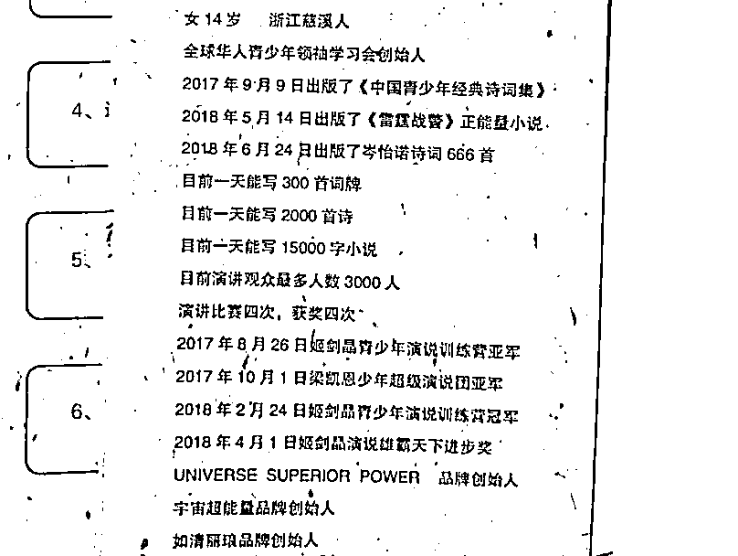

# 十六、岁天才少女的简历和小学生研究肿瘤获奖，是不一样的

> 原文：[`mp.weixin.qq.com/s?__biz=MzU0MjYwNDU2Mw==&mid=2247490952&idx=2&sn=9c37f8a000c33969b82fd38073467943&chksm=fb1971f4cc6ef8e226dece9be5e5222bdda67a0c96c3b779c0af6ab4b23d3f77deb512f589ff#rd`](http://mp.weixin.qq.com/s?__biz=MzU0MjYwNDU2Mw==&mid=2247490952&idx=2&sn=9c37f8a000c33969b82fd38073467943&chksm=fb1971f4cc6ef8e226dece9be5e5222bdda67a0c96c3b779c0af6ab4b23d3f77deb512f589ff#rd)

好几个读者留言，想我聊下十六岁的天才少女小岑同学。

据说很多人被她的简历暴击了一万点。

我看了下，她那个简历是这么说的：

咱们一条条来看下：

第一条，全球华人青少年领袖学习会创始人。

这个没啥难度的，还记得 80 年代有一次春晚，是谁来着，我忘了，反正是卖宇宙牌香烟。

这个什么学习会嘛，你随便成立。

咱们哪个读者不服气，马上去淘宝上印个名片，宇宙领袖巨头研讨会首席创始人。

顶多问你收五块钱，还附赠一枚章，你想刻什么刻什么，只要不超过 8 个字都免费，超过了顶多管你多要一块钱。

后面这三个，什么诗集，小说，诗词，这都随便你出。

你有没有发现，人家上面没写出版社，这就是埋下伏笔，懂的自然懂。

一般来说，如果你出个人诗集，要是弄个中华书局，上海古籍出版社，那人家是要高看一眼了。

要是连出版社都不敢写，这意思就是说，小区楼底下打印店，张大妈喊一声，就给你出版了。

懂吧。

再往下看，什么一天写 2000 首诗，15000 字小说，这都不叫事儿。

因为有程序呀。

你难道今天才知道？

很早，十几年前，我读研的时候，就有程序自动辅助写作工具，因为那年月网文开始流行。

就是说你把主要出场人物，姓名，关系，大概的走向设定一下，程序一分钟就给你生成一百万字的小说了。

肯定有些不通顺的地方，需要你手动去修改，但 9 成以上的文字是可以使用的。

质量你就不要想了，反正人家给你写出来了，有些人注册很多账户，骗网文写作平台每个月 1000 块底薪，用的就是这个套路。

你看，我一不留神，又告诉读者们很多小九九。

再往后，什么观众 3000 人，这个更简单。你跑去抖音上，直播吃 108 块一碗的“皇家泡面”，观众 3 万都不止。

后面那些什么雄霸天下的奖，淘宝上获奖证书是论斤卖的。

再后面那些什么什么品牌，更容易了，这年头。

你注册个公众号，起个名字，比如：诗仙复出之风云再起。

你马上就是“诗仙复出之风云再起”公众号首席创始人。

当然，你还可以把你太太也拉进来，给她一个联合创始人的头衔。

有助于增进你们夫妻感情......

还有什么额外想要的？淘宝上都有，无论是证书，软件，攻略，还是印章，想要啥有啥。

这都不叫事儿。

所以我不明白那么多网友骂她做什么，无论她，还是她爹，其实也就是干了点自娱自乐的事情。

网友们把她和云南那个研究什么肿瘤基因获奖的小学生相提并论，是不妥的。

后者违规了，后者的父亲也出面郑重道歉了，获奖资格也取消了。

因为全国青少年科技创新大赛，是一个被官方认可的奖项。 

它有可能，在不同的地区，不同的年限，对一个人的升学，会有加分，所以不能儿戏。

而小岑同学那一堆的简历，就跟居委会发给你一个捉耗子小能手的流动红旗，你自己留着玩呗。

它没有什么破坏原则性的问题。

我记得很多年前，武汉有个很火的五道杠少年，我们小时候，大队长才三道杠，人家五道。

后来干嘛去了呢？去民办念三本了。

这种几道杠很无聊的，社会犯不着这么敏感。

你高兴，自己带十八道杠都可以，还不满意那就纹身嘛。左青龙右白虎，老牛在腰间，龙头在胸口，随便你怎么纹，这都不叫事儿。

我之所以不愿意喷这位小岑同学，还有一个很重要的考量。

就是我认为，咱们的文化太内敛，或者说，过谦了。

你看我对罗永浩，从来都是有所保留的。

按理来说，我这么喜欢拿人开涮的，为什么偏偏放过他？

因为我觉得，我们很多人，需要老罗那种勇气。

你想嘲笑老罗，喷点实在太多了。

老罗应该感谢川普，得亏有了川普，天不生川普，老罗何以自处？

在川普还没有晋升为懂王的那些年里，老罗一个人默默的承受着我们五千年文明能够想象出的各种挖苦人的词儿。 

当然，他挨骂也不冤，如果你看过当年他写给俞敏洪的求职信，你就知道小岑同学根本不算什么。

用罗老师的话说，在他写这封一万字的求职信之前，他一事无成。

请记住这个词儿，一事无成。

那么老罗是怎么描述一事无成的自己的呢？

太长了，我给你摘下重点，他是这么描述自己的：

1、我高二辍学了，理由是与教育制度格格不入。

老罗认为他是一个独与天地往来的存在，没人配教他。

这有点像西游记里的镇元子，独独拜天地二字。

他的童子是这么介绍他的：“三清是家师的朋友，四帝是家师的故人，九曜是家师的晚辈，元辰是家师的下宾。”

2、我 58 天减了 48 斤，所以很有毅力。

这是罗老师全篇求职信里，唯一的硬核内容。

他当年没去应聘健身教练，真是健身行业最大的损失。

3、罗老师说自己高二就辍学，到 30 岁，十几年不工作的原因，是高卧隆中，有待明主。

当然，今天遇到了新东方，他的心动了。

4、新东方老师的水准，配不上它的声誉。

为什么呢？因为没有我老罗嘛。

5、最后一点，我不是来当老师的，我是来成就新东方，成就你俞敏洪的。

乔布斯当年说服百事可乐的总裁，也是这句话，难道你想卖一辈子糖水么？

老罗是想告诉俞敏洪，难道你想教一辈子英语么？

不想，就请我出山吧。

如果把老罗的简历搁这儿，小岑同学那份还刺眼么？

我估计你都忘了小岑同学了，因为在吹牛逼这个领域里，老罗太耀眼，你根本看不到她了。

萤火之光岂能与皓月争辉？

可是如果我们把老罗和懂王放在一起呢？

你还看得见老罗么？

老罗什么语气？

顶多说一句，论做手机，东半球谁与争锋？！

或者说，自从乔帮主去世，论科技创新，扛把子一哥舍我其谁？！

你注意哦，他始终透露出那么一点不自信，无论是地域上，还是向传奇人物低头。

你再看看懂王什么口气？

地球上没有人比我懂一切，你注意，是一切！

天不生懂王，万古如长夜！

要是没有我懂王，你们人类都还在石器时代呢！

这么霸气，这人是疯了么？

**你错了，这才是其他民族的常规交流方式！**

有媒体在美国大街上采访，问美国大妈，你怎么看懂王？

他说没有人比我懂基建、税务、竞选、科技、ISIS、环保、再生能源、民调、法院、钢铁、贸易、税法、进攻防御、体系、债务、政治......

记者问，一个人懂这么多，您不怀疑么？

你猜美国大妈怎么回答？

人家说，我觉得川普很自信呀，至少他敢站出来说他最懂，那我不选他选谁呢？难道选一个说自己不懂的吗？

你是不是要昏倒？

这就是人家的逻辑。

我们在与全世界打交道的过程中，要学会新的逻辑。

否则，我们就很吃亏。

你想一想，为什么硅谷的码农，那么多华人，而 CEO，那么多印度人？

很简单，印度人和老美，都比较神神叨叨，彼此搭的上话。

如果你和日本，印度，美国都做过生意，就知道，一个比一个能吹。

连在国际上素以严谨著称的日本人，都比我们能吹。

举一个大家都知道的例子，你去翻下光荣公司的游戏，信长之野望，太阁立志传，三国志系列，都是他们公司出品。

三国时期，武力最高，吕布，108，还是加了方天画戟，统率，曹操才 98。

回过头去看日本战国武将，动辄统率 120 多，武力直逼 130。

这什么逻辑？

日本战国最强盛的时候，丰臣秀吉集中全日本的力量，名将如云，什么加藤清正，岛津义弘，小西行长，在游戏里吹的山响的人物。

被李如松一个边军头领，打的连他妈妈都不认识。

有人问李如松是谁？

不知道很正常，他爸爸是李成梁。

不知道李成梁也没关系，他待努尔哈赤如同养子，这会儿你该知道了。

李成梁，李如松父子肯定是明末的区域性名将，但在中国的将星榜里，根本就排不上号。

所以有人说日本战国群雄，其实就是一群村长在打架，被他们自己吹成了神。

交流，就是这回事。

吹牛，吹牛，你不吹，我怎么知道你牛？

印度人成天满嘴跑火车，一个个搞得像罗永浩一样，人家不当 CEO，谁当？

这就叫领导力。

**先做到，再说，那是述职报告。** 

**先吹出去，再实现，这就叫领导力。**

实现不了也没关系，吹出去，别人就有可能记住你，保底也是个网红。

只要不影响规则的吹牛皮，我们应该鼓励。

因为我们这个民族，过于谦逊了，过了，就需要矫枉过正。