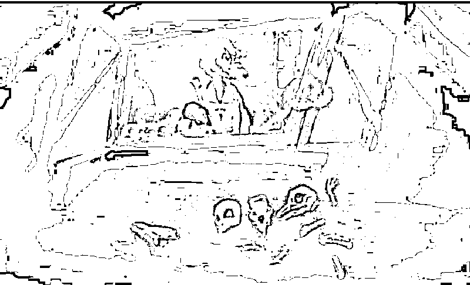

# 《隐秘的角落》实际上告诉你，每个人，都是画皮

> 原文：[`mp.weixin.qq.com/s?__biz=MzU0MjYwNDU2Mw==&mid=2247490494&idx=2&sn=ea193d188f8b69ff765fa0f26b194b67&chksm=fb1977c2cc6efed47efca8c93702e7b52213ea6c972de9deb9ef0578a4d56a01e2d66152b0ad#rd`](http://mp.weixin.qq.com/s?__biz=MzU0MjYwNDU2Mw==&mid=2247490494&idx=2&sn=ea193d188f8b69ff765fa0f26b194b67&chksm=fb1977c2cc6efed47efca8c93702e7b52213ea6c972de9deb9ef0578a4d56a01e2d66152b0ad#rd)

《隐秘的角落》很不错，如果说它像什么，像李安导演的《少年派的奇幻漂流》的电视剧版。

《少年派》是双结局，明线，暗线，你究竟相信童话还是相信阴暗，随你。

《隐秘的角落》有种致敬《少年派》的味道，它也是双结局。

我们今天只聊一种，就是阴暗，我选择相信阴暗。

故事情节非常简单，三只小鸡和一只狐狸，三个小孩和一个杀人犯。

杀人犯是伊能静的老公秦昊演的，叫张东升。

张东升本来可以读博士，留在高校做教授，但是为了老婆放弃了一切，来到应该是广东省的某个小城市里。

剧中这地方沿海，但是看着很破。

在这个地方呢，张东升找不到工作，只能去少年宫做了个义工，偶尔代代数学课，一干就是八年。

按照电视剧里的演法，是说他的岳父母看不起他，他的老婆也出轨了，要和他离婚。

张东升觉得婚姻的阻力来自岳父母，于是就带他们爬山，把他们推了下去。

非常凑巧的是，这一幕被三个小孩子无意中拍摄了下来。

这三个小孩分别叫做朝阳，严良和普普。

朝阳和严良打小是朋友，朝阳的父母离异了，他跟着妈妈过。他的爸爸娶了后妈，还生了一个妹妹，大概上小学，朝阳上初中。

严良的爸爸当初因为犯罪被判了刑，严良就被送去了孤儿院，在孤儿院里认识了一个小姑娘叫普普。

普普说自己的弟弟得了白血病，但收养他的家庭无力出医疗费，于是撺掇严良带着她满世界找弟弟，同时想办法筹措三十万。

那么这三个小孩就用拍到的杀人视频敲诈张东升。

张东升发现即便岳父母死了，妻子仍然执意要和他离婚，又被三个小孩催着要钱。

无奈之下，干脆连妻子也杀了，然后把房子抵押了三十万，换回视频，再想方设法把三个孩子杀掉。

就这样为了掩盖一件事，不得不搞出新的事，最后一路杀来杀去，只有朝阳活了下来。

大概就这么个故事，细节就不告诉你了，你自己去看，还挺好看，当然原著比电视剧更好看。

我们聊三段关系，也许能够引起一些思考。

**第一段关系，张东升的婚姻。**

按照剧中的暗示，张东升反复讲到一个传说，笛卡尔和公主的爱情。

他说，1650 年，贫穷的数学家笛卡尔在斯德哥尔摩的街头邂逅了瑞典公主，俩人不顾及 34 岁的年龄差距，相爱了。

国王大怒，赶走了笛卡尔，他后来感染了黑死病，临终前写给公主一封情书，只有一个公式，r=a（1-sinθ），画出来是心形线。

这是童话的结局。

事实上还有另一个结局，公主背叛了笛卡尔，笛卡尔死于背叛。

我觉得，他是在描述他的这段婚姻。

事实上，作为观众，我不认为张东升是因爱生恨。

所谓的爱，你看泥石流中，父亲挡在儿女前面，自己先死想要保全后代，这个是爱。

如果你得不到，就要摧毁，那是占有。

婚姻中没有爱，只有占有欲也没什么稀奇，爱本身就是稀缺品，不是必需品。

但张东升之所以连环杀人，我觉得不是占有欲的催使，而是他这个人的算法系统，出了严重故障。

我打个比方。

张东升的人生就像一个投资人，这个人满仓某个品种，高杠杆，无对冲。

当行情走势与他之前的判断相反的时候，他没有及时止损，而是飘单，任由亏损放大，直到最后他无法接受爆仓的事实，采取了疯狂的行为。

其实就这么点事儿。

他为了一个莫须有的爱情，跑去一个小城市当义工，最后老婆也看不上他，他眼看要失去一切，前面的付出都成了沉没成本，不甘心爆仓。

所以我一直告诉读者，钱是人生中很重要的事情，至少是最重要的事情之一。

没有爱情，至少你还有钱嘛。

如果张东升卡里有很多钱，他绝对不会这么干的，即便说阿里给他抛个 P8 的 offer，他也不会这么干。

钱的确不是万能的，但钱肯定至少有一千种功能。

你有钱可以后半生躺在赌场里纸醉金迷，花天酒地，而不是非得搞成这样。

所以张东升的选择从一开始就神神叨叨，一个大好青年，不忙着挣钱，跑到一个小破破城市，也不知道搞什么搞的荒废了八年。

这个搁在男生身上很少见，有些女性过分相信爱情，把婚姻当作人生的唯一，离婚后一无所有，倒是有可能的。

所以还是那句话，无论男女，哪怕你不追求财务自由，至少追求经济独立，这是很正确的决策。

翻开婚姻法，里面没有一个字谈爱情，它从头到尾谈的都是财产保护。

说到底，婚姻就不是为了爱情设立的，你们有爱不需要结婚呀，爱就行了嘛。

结婚实际上就是公司并购，董事会引入新成员，就这么点事儿。

何况剧中还通过一个小孩子的水枪射张东升裤裆，暗示他那方面有问题。

怎么说呢，这是在暗示你，钱确实不是万能的。

你那方面如果不行，非要维持两性关系，也是很无厘头的。

就算你再有钱，82 岁非要娶 28 岁，那你到底行不行嘛，我这意思你懂的。我们谈爱情，动不动就是精神上的柏拉图，其实情欲也很重要。

不懂的去看渡边淳一的小说，我就不延伸了。

**第二段关系，严良、普普与朝阳的友情。**

严良敲诈完张东升的三十万，要朝阳复制一张卡，保留视频，准备拿了钱再告发张东升，自己去自首。

这样普普的弟弟得救了，坏人也可以被惩治。

但恰恰是这一点，使得朝阳动了杀机。

普普为了替朝阳出头，把他后妈生的那个妹妹带到了少年宫的五楼。他妹妹不慎失足从窗户上跌了下去。

其实只是衣服挂在了窗台上，朝阳没有救她，也许推了一把，也许默认她自己掉了下去。

但警察通过妹妹尸体嘴上的 DNA，已经查到她曾经咬过一个小女孩。

假如严良自首，必然牵出普普，最后牵出朝阳杀妹妹的事情。

那朝阳只能杀了严良，否则他等于置自己于险地。

所以我一直告诉读者，要严格界定人与人之间的关系。知道别人太多秘密没有好处的。

人与人之间终究不是一体。凡事留一线，日后好相见。

人和人还是要保持距离，不要亲密到啥都推心置腹。

人与人之间不应该有也不可以有绝对的信任，因为只有死人才不会背叛。

你非要让别人不得不绝对信任你，实际上，等于把自己往绝路上逼，也是把别人往黑化上逼。 

**第三段关系，朝阳父子。**

家庭，尤其朝阳爸爸这种前房后房的复杂家庭关系，和公司董事会是很相似的。

无非董事会里大家都拿项目说事儿，说的都是前景，实际上都是利益。

家庭也一样的，嘴上说的都是爱，实际上谈的也是利益。

我前面说的很清楚，婚姻本质是一种财务关系，其实父子也是，尤其是你有多个孩子。

朝阳的父亲就算离婚了，我们不说你的爱能否一碗水端平，起码应该对财产做一个明确的划分。否则他的新太太与女儿一定对朝阳这个前房长子有抹不去的敌意。

剧中已经暗示朝阳爸爸知道女儿是儿子杀的。

他带着录音笔，去套儿子的话，被儿子发现了，回家后反复听这段录音，发现有皮包拉链拉开的声音，就说明儿子已经发现了。

所以他或多或少猜到了真相，他扇了自己一个嘴巴子，因为说到底，责任在他。

剧中这个父亲做的很失败。

套话归套话，居然带着录音笔，这会让儿子觉得他爸要把证据交给警察，这使得父子离心离德。

更何况，他这个人一贯如此。小舅子绑架儿子，差点杀了他。他竟然为小舅子求情，求朝阳不要告发。

父子做到这份上，只能说很遗憾，当爹如同当董事长，爹不是这么个当法。

最后的结局：

一只狐狸想杀三只小鸡。

其中一只小鸡杀了狐狸和两个同伴。

中间的那个头骨，是哺乳动物的头骨，不是鸡。

换句话说，真相是有一只小鸡，披上了狐狸的皮......

这小鸡就是朝阳，他虽然看着是个好孩子，其实他才是隐藏的张东升。

小号昨天的文章《[同样是高考被替，为什么在苟晶和陈春秀的故事上，我给你了两种视角？](https://mp.weixin.qq.com/s?__biz=MzU3NDc5Nzc0NQ==&mid=2247489544&idx=1&sn=0f22c2f99c1e122e8df12f866ecbe80f&chksm=fd2dbad6ca5a33c090ba4ffc0dfefe04dab60118266513f1fc224f252c808e82ee6e01411d53&token=1508926511&lang=zh_CN&scene=21#wechat_redirect)》，就是想告诉你：

我们有太多人喜欢讨论谁是好的，谁是坏的。

事实上，每个人每一瞬间，都有可能变成好人，或者变成坏人。

我们有太多人指望把世界变成纯粹的，消灭所有的坏人如何如何。

事实上，每个人都是画皮，那一瞬间，你又怎知画皮的背后，是鸡还是狐狸......

所以我没有给你讲好人坏人，鸡随时可以变成狐狸，狐狸也许会回归鸡，人都是藏在画皮后面的，知人知面不知心嘛。

我给你讲的三段关系，就是告诉你，提升认知，才会有好的结果，至于别人是鸡是狐狸，重要么？重要么？

反正重不重要，你也不可能知道。