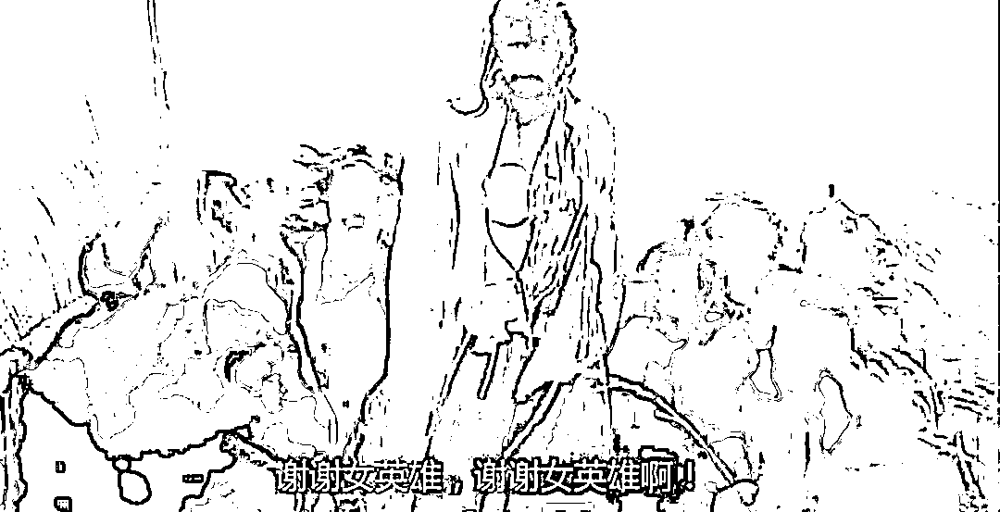
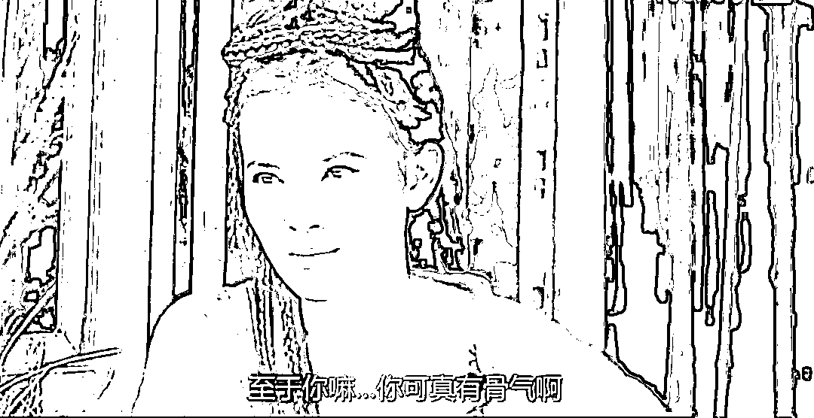
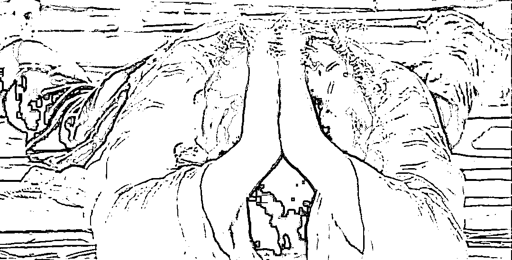

# 日本 10 岁孩子在铁轨放置石头，导致火车脱轨，是创新么？

> 原文：[`mp.weixin.qq.com/s?__biz=MzU0MjYwNDU2Mw==&mid=2247490239&idx=2&sn=1481d464746b178c4f01f225262698b7&chksm=fb1976c3cc6effd52bc31462b6c36fa37ebcb76ab1035b8178d708a4741b8a8d7af9950b80cc#rd`](http://mp.weixin.qq.com/s?__biz=MzU0MjYwNDU2Mw==&mid=2247490239&idx=2&sn=1481d464746b178c4f01f225262698b7&chksm=fb1976c3cc6effd52bc31462b6c36fa37ebcb76ab1035b8178d708a4741b8a8d7af9950b80cc#rd)

日本千叶县鸭川市 JR 外房线的一列普通电车翻车了，经过警方调查，原因是一名十岁的小学生，故意在铁轨上放了很多石头。

据这名学生自己说，他在做实验。

起初放一颗两颗，发现被冲开了，后来放很多颗，发现也被冲开了，经过多次实验和反复观察，他发现火车经过铁轨拐弯处速度会慢下来。

于是他就一次性在铁轨拐弯处堆叠了很多大石头，坐在旁边目睹了火车脱轨翻车的全过程。 

我们有很多公知，借这个新闻夸赞日本的教育精神。

说只有日本这么包容的环境下，才能诞生这么具备探索精神的小学生。

一个健康的社会，最重要的是保护大家探索的心，至于火车翻不翻，那都不叫事儿。

反观我们的社会，过于追求 GDP，过于追求正确的结果，扼杀了孩子们的创造力。

这个逻辑我也是醉了。

假如日本开全国表彰大会，让这名具备探索精神的孩子，戴着大红花，在各个小学里做巡回演讲报告。

那我相信公知们的结论，日本是真保护创新精神。

事实上，这名小学生已经被警方移交儿童咨询所，等调查结束后，还要面临法院对其家庭的处罚。 

所以**你不要光看别人说什么，你要看人家做什么。**

就像美国很赞同打砸抢，但那是在别人家，要是发生在他们家，你听到的就是川普的那句命令，“向那些低等生命和失败者扫射。”

公知们的言论固然好笑，可教育是一个全世界共同的话题。

我们昨天聊了我小时候的事儿，很多读者说，你们高中班主任真有水平，一番话彻底改变了你。

这种看法是被文章误导了。文字限于篇幅，只能选取一个截面，你看到的只是完整时间段里某几个镜头。

你说我们班主任有水平，那是事实。

在一个遍布名校毕业生，以及特教的高中教师队伍中。他一个没背景的农村出来的孩子，念的也不是名校，仰仗的也不是教学成果。别的学校教到 30 多岁才调进我们高中。

进去之后，1 年班主任，2 年年级组长，3 年德育主任，5 年副校长。肯定是有过人之处的。

但我此前经历过优秀的老师多了，何以都不起作用？

**因为人在不服气的情况下，是不会听你讲什么的。**

而要让一个熊孩子服气，通常有这么几种办法。

**第一种、摆 POSE。**

比如我初中时的化学家教，我祖母同事的老公。

上来报家门，C9 联盟的教授，研究所主任，曾经有啥啥专利，创汇多少亿。

这意思就是告诉我，他水平很高，时间宝贵，我要认真听，不要捣乱。

这种方式，适用于年龄大一点，有心向学，且不那么调皮的孩子。 

**第二种、秀肌肉。**

对于未成年人，秀履历不一定管用。

未成年人的世界没有秩序，他并不认为玉皇大帝就比孙悟空厉害，虽然成年人都知道，俩不是一个 level。

对于未成年人来讲，你的地位远不如你的肌肉更有力量，换句话说，你要证明你自己能打，而不是你能调动十万天兵。

我初中时的外语家教，他上来就说，自己当年是高考外语类榜眼，现在是外贸局里首席翻译，会四国语言如何如何。

我初中时的数学家教，肌肉就更闪亮，人越强话越少，他直接告诉你，哪一次数学竞赛，他是全国第一。

这就是利用小孩子崇拜强者的心理，树立榜样引导他。

看过大话西游么？普通山贼是很容易收服的。

如果前两种办法都不起作用，恭喜你，遇见了真正的刺儿头。

**那就只有一种办法：打服他。** 

真正的刺儿头不服你的原因很简单，他很自信，也有实力，跃跃欲试。

这个道理可以用西游记来解释。

寻常妖怪只要你表示给他一个仙界的职位，他就降了。

难弄一点的，哪吒晃一晃手中的乾坤圈，他也降了。

要是遇见猴子，就很难搞，因为他跃跃欲试。

他觉得你做得，我怎么就做不得，你不把他打到服气，他是不会听你念经的。

我高中班主任固然擅长讲道理，但他最初并没有讲给我听，因为他知道，对着不服的人，讲了也没用。

他用了马谡给诸葛亮的建议，攻城为下，攻心为上。

既然你不服，那就让你服。 

有一次，打扫卫生，我站在桌子上，一边用鸡毛掸子扫灯上的灰，一边对着同学大骂班主任。

正骂在兴头上，忽然发现对面的同学不附和了，甚至和我唱反调，说班主任的好话。

我就觉得奇怪，这是怎么了？

一回头，忽然发现班主任就在我身后，笑眯眯的看着我。

后来我问同学，他已经在我背后，站了五分钟。 

第二次，我在自修课上，高谈阔论，说班主任的坏话，说的正兴起，同桌踢我，我看看她，再四下看看，忽然发现班主任就在窗边，笑眯眯的听着，听得津津有味。

后来我养成一个习惯，凡是要说他坏话，先四下看看。

结果第三次，课间我在楼道里，先四下看看，确认他不在。然后开讲班主任的坏话，刚讲了两分钟，对面的人挤眉弄眼，我一回头，靠，他又悄无声息的出现在我背后，笑眯眯的看着我。

我不喜欢出早操，觉得站在队列里，你让做什么就得做什么，太没面子。

于是每次躲起来，教室里，厕所里，各种地方。

我们班主任也是个很奇怪的人，人家都是点卯，谁不到记下来，他偏不，他一定要去抓现行。

我这么聪明的人，怎么可能被他抓呢？

他什么时间在操场上，什么时间走到教室，什么时间巡查厕所，我都做了详细记录。

甚至连他走路的速度，巡查的偏好，都一一记下，然后和他打时间差。

他到教室，我在厕所，他到厕所，我在教室，体操结束前，我溜回队伍，好似早就在那里一样。

一个月后，我很得意，开始劝说另一名全班前三的男生一起逃操。

我先带着他待在二楼楼道观风景，指着下面操场上巡查的班主任。

然后告诉他，多久之后，他必然出现在厕所，去逮那几个躲在里面的人。

而咱俩此时此刻，先回教室，再去哪里，如何如何，听我指令，最后一起溜回操场即可完美收工。

一路上果然无人查访，他很佩服，问我何以如此有把握。

我和他一边走进教室，一边洋洋得意的说，我胸有甲兵百万，腹有韬略三千。班主任的路线图早已被我调查得一清二楚，他哪里是我的对手，然后哈哈大笑。

笑罢，拉着他正要一起躲进门背后，结果看见一个人，瞬间石化。

班主任此时就躲在门背后，笑眯眯的看着我俩，一言不发。

这种感觉就像盗墓贼，辛辛苦苦撬开棺材，看见的是稽查队队长，正躺在棺材里笑眯眯的看着自己。

你可以想像我当时的心理阴影有多大。 

是那一天服气的么？不是。

是高一快结束的时候军训，训练的内容是一周之内教会大家军体拳，然后给大领导和电视台汇报演出。

几天下来，全班同学非常疲劳，情绪低落，连长把班主任请来训话。

他一句大道理都没讲，而是当场打了一套拳法。我们连长，是那个军校里的散打第一名，据他说，班主任是练家子，不仅拳法精奇，而且练过轻功。

我靠，难怪走路落地无声。

那天我情绪忽然崩溃了。

因为我的底牌出光了，他的底牌我还没看见，他把我看透了，而我根本不了解他到底还有什么手段。 

我曾经对他有个形容很贴切，此人形似鬼魅。

我有很长一段时间都落下了心理阴影，回到家中，时不时还往身后看，每次推开一扇门，都要鼓起勇气，生怕门背后又是那张似笑非笑的面孔。

你想想人为什么怕鬼？因为看不到才怕。人怕的不是有形的鬼，而是心中的鬼。

我老在想他会怎么处罚我，但他迟迟不动手，又似乎如芒在背，像幽灵一样盯着我，最终我的内心崩溃了。我被自己的恐惧感压垮了。

很多人说诸葛亮七擒七纵，以德服人，其实不然。

孟获哪儿管你什么德，他一开始自认为有大象，还有藤甲，没把诸葛亮放眼里。

后来反复的被破坏预期，最后他的心态崩溃了。

说到底，诸葛亮在孟获心中种下一个鬼魅的身影，孟获活在恐惧中，受不了了才降。

我们很多时候，过于强调道理的作用，道理就那么几个道理，关键是谁来说？

唐僧跟至尊宝说教，至尊宝想打死他。

观世音和孙悟空讲道理，悟空骂她死八婆。

可是至尊宝面对春三十娘，扑通一声跪下了，五体投地的高喊：英雄。

为什么？

因为他知道，唐僧和观音都是说说的，而春三十娘是妖怪，真的会杀了他。他产生了恐惧感。

教育和管理说到底，是一门操控他人预期的学问。

所以他一个没有背景，又不以教学为长的人，五年混到副校长，擅长的就是这个。

他能把这套用在学生身上，自然会用在所有人身上，操控领导的预期，操控同事的预期，操控下属的预期，所以升的快。

但作为被管理者，你就是通过被管理，学会了管理学。

你想一想，投资的本质就是不断地总结市场规律，然后面对市场规律的改变。这和摸清班主任的规律，和面对他的突然袭击是类似的。

你想一想，管理的本质就是操控预期。用控制他人预期，左右他人心理的方式来使得被管理者的行为符合自己的预期。

妖怪被收编，位列仙班，再去收编新妖怪；

被管理者学会了操控预期，进而成为管理者；

熊孩子长大了，去教育下一代的熊孩子。

所有的这些，都是相通的。