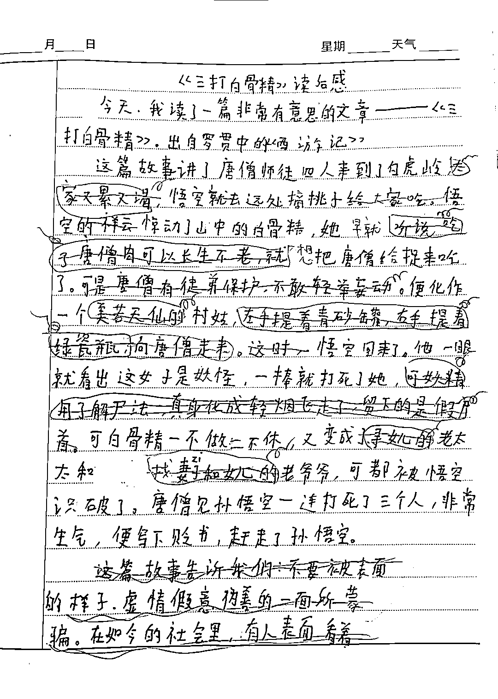

# 袁老师改的这篇作文的那些事儿

> 原文：[`mp.weixin.qq.com/s?__biz=MzU0MjYwNDU2Mw==&mid=2247490085&idx=2&sn=7c37327fd1798aa6ae39c8bd4ae52872&chksm=fb197659cc6eff4f1ef4d86c532b89221347b015766142824ae0fa04955a1e2a0257b9fb2f30#rd`](http://mp.weixin.qq.com/s?__biz=MzU0MjYwNDU2Mw==&mid=2247490085&idx=2&sn=7c37327fd1798aa6ae39c8bd4ae52872&chksm=fb197659cc6eff4f1ef4d86c532b89221347b015766142824ae0fa04955a1e2a0257b9fb2f30#rd)

常州有个小学五年级的小姑娘，上完作文课后，坠楼了。

媒体说是她的作文被老师痛批，这孩子一时想不开；

家长说，这位袁老师是因为孩子没有报她开的作文补习班，而是报了其它机构的，生意没做成，心生怨恨，故意刁难。

在调查清楚之前，我不下结论。

但这件事，可以引出三个话题。

**第一个话题：这篇作文改的确实有问题。**

作文和老师的修改意见，我都贴出来了。

红笔是老师划掉的，我不理解为啥要删掉，删掉的部分是文章的精华。

据某些媒体说，因为孩子的最后一句话讽刺了老师，让她难堪。

孩子最后一句是这么写的。

不要被表面的样子、虚情假意、伪善的一面所蒙骗。在如今的社会里，有人表面看着善良，可内心却是阴暗的。他们会利用各种各样的卑鄙手段和阴谋诡计，来达到自己不可告人的目的。

假如你结合家长说的，孩子没有报老师的补习班，那这句话听起来是有点讽刺。

似乎在暗示自己的老师，就是伪善的那个人。

但这一切的因果关系又有些倒置。

你想，这孩子最初写作文的时候，还没有被批。换句话说，她那时候怎么提前知道老师要因为自己没有报作文补习班而发难呢？

所以我对各路媒体的解读，也保持怀疑的态度。

但有一件事，我个人的意见是确定的，拍板拍在这里。

这老师作文改的确实有问题。孩子最后一句话没毛病，你去翻社会课，哲学课，咱们的课本里有大量同类表达式。

即便搁置最后一段话，前面那些被她删掉的部分，也删的毫无道理。

所以这一点，没啥争议。不服咱就把这篇文章拿出来公开复议，像论文评审一样，让各大中文系教授以及知名作家给出各自的评审意见，然后汇总。

第二个话题：此类问题的减少只有一个办法，教学信息化。

我们都知道，码农写代码，一定有测试，白盒测试，黑盒测试。

但为了减少 BUG，或者说减少码农在修复 BUG 的过程中引入新 BUG，有一个很重要的措施叫什么？

叫做 Code Review，代码评审。

就是说你提交代码不能这么瞎提，尤其是大的系统工程，不能你想提交就提交。

也许你解决了你的 BUG，但给系统的其他模块引入了新的问题。

所以我们需要让更多的人看到你写了什么，也就是把你的工作公开透明。

在教学中，也有同样的事情，几十年前早已有之。

这叫什么？这叫上公开课。

我们小时候就有，老师在上面讲课，最后两排坐着其他学校的同科老师以及教育局的领导。

同行评审嘛，我得知道你到底合格不合格，你到底有没有在工作中夹带私货。

这不仅仅是管理上的要求，也是给家长一个交代。

但这是不够的，你想嘛，公开课，理论上是随机抽查，但老师总能提前收到消息。校长会通知她嘛。

毕竟她上不好，她丢人，学校也丢人。校长要提前接待，总是会提前知道，为了学校的面子，也会通知老师好好准备。

所以这种事情有作用，但有限的很，老师们会应付检查。

所幸，技术发展的很快，现在某些大城市的试点学校里已经开始有全程教学录像，批改作业全部信息化，全部互联网上传。

人家抽查你的公开课，不会提前通知你了。直接调你前三个月的教学录像，电脑随机摇号某一天，摇完分派给其他区的老师，给出评审意见。

你想，常州的这个老师，假如头顶上也悬着这么一把达摩克里斯之剑，她敢这么瞎批？

借她个胆也不敢。

作文批成这样，一旦别的区的老师看到了，你这工作要不要了？

这一定是趋势，中国的企业别的不好讲，打价格战特别强。

欧美人发明的平衡车，为啥不能普及？因为要卖 70 万。

这东西搁在小米手里，只卖 700，结果保安人手一辆。

昔日富人奢侈品，进入保安脚底下。 

好几年前我参加展会的时候就看到好些公司创业做教学信息化。相信市场一打开，价格就会变得极低，价格一低，就跟平衡车一样，很快会普及。

那你说这是不是好事呢？是好事，但它也会带来另一个你意想不到的结果。

很多文科生大 V，带节奏，他们只看到了老师用正能量为借口，打压这个学生的创意。

但要解决这个问题，唯一的办法是技术，是信息公开透明化。

而信息越公开透明，这个社会的表达就会越发倾向于政治正确，或者讲叫做正能量。

你想嘛，老师很清楚，自己说的每句话都会被拍摄。

那她就不敢说私房话，因为她的每句话等于都是公开的，所有家长都能看到，所有同行都能听到。 

所以我们想一想，这个孩子随意写作的权力，到底是被保护了？还是被瓦解了？

短期来看，她被保护了，那么多大人都看得到老师对她做什么，老师教给她的每句话。

长期来看，她自己说话的权力也被瓦解了。因为她长大了，也会做老师，也会做其他职业。但对不起，为了保证你无法伤害别人，只能把你透明化。

等到那一天，就不是老师来强迫你正能量，而是你不由自主的正能量。

因为你很清楚，自己说的话是透明的，你弄不清楚暗箭从哪个方向来，出于自我保护，你也会趋于政治正确。

有点意思是吧，我们为了保护学生的表达，最终一定会给所有人套一个更大的紧箍咒。

第三个话题：这孩子写出来的话，她自己真懂了吗？

她写的是什么？

她写的是：在如今的社会里，有人表面看着善良，可内心却是阴暗的。他们会利用各种各样的卑鄙手段和阴谋诡计，来达到自己不可告人的目的。

看着很成熟，看着很大人，看着很社会，看着啥都懂。

那我问你，既然你已经知道了，社会就是这样。为什么遭到老师的打压，就想不开了呢？

很多读者问我：西风，我觉得你讲的东西，我也懂呀，为啥我干嘛嘛不成？

你做不到，就是你没懂。

就像这孩子，她只是学着大人讲话，好象很懂，好象很成熟，其实非常脆弱。

社会只对她展露了一丁点的獠牙，她已经崩溃了。

我曾经讲过一个故事。我初中的时候，在校内买了一个面包，结果被校长勒令当着全校师生的面做公开检讨。

这个事情是这样的。那个卖面包的，是副校长的亲戚。校长想让他滚蛋，然后安排自己的亲戚来挣这份钱。

但是人家不滚蛋。

他又不方便明面儿上轰人走，于是就通知学生，课间不可以买零食。想让那哥们挣不着钱，被挤兑走。

我没搭理通知，仍然我行我素，被蹲守在侧的校长，抓了个现行。

然后他就让我周一做公开检讨，检讨书肯定是事先写好，给他过目审核通过的。

这份检讨书里我讲了一个典故，扬汤止沸，不如釜底抽薪。

就是那个水开了，你用瓢不停的舀，能阻止么？当然不能。

你只有把锅子底下的柴抽走，火熄灭了，才行呀。

这个典故在原先的文章里，是自我批评的，我是指，自己犯错误由来已久，我虽然考试始终是年级第一，但同时也是全校德育倒数第一，全校出名的刺儿头。

我让校长以为我在反省，说自己平日犯错犯惯了，犯一次检讨一次，扬汤止沸，这样没用的。

根子上是我这个人有问题，没重视，所以我要对自己釜底抽薪，痛哭流涕，满地打滚儿，改头换面，重新做人。

他看了十分满意，觉得孺子可教，瞬间对自己的威望又加了几个信心。

到了周一，全校大会，我公开检讨，念稿的时候，变了几个字，意思全变了。

稿子是我写的嘛，哪怕你让我脱稿演讲，临时即兴发挥，也没有问题。

我把这个典故用在了校长头上。

有的人没本事釜底抽薪，没本事赶走卖面包的，只能扬汤止沸，蹲在那里抓无辜的学生，何其可笑？

大家不妨想一想，为什么有些人这么可笑呢？他到底在惧怕什么？他又有些什么不可告人的目的呢？

当然，我没有点名，但明里暗里指桑骂槐，下面的老师，学生，忍不住一次次的哄笑。

校长的脸上，一阵儿红，一阵儿白，神情复杂的望着我，心想，全校德育倒数第一果然名不虚传，自己怎么就这么天真，被他摆了一道。

你注意，我为什么不在私下场合硬怼校长？为什么前面表现得痛哭流涕，一幅改过自新的样子赢得他的好感？

然后翻脸就不认人，当众给他难堪？

因为我想过了。那年代，又没个证据，私底下你怼他，他要是明白过来，换个借口整你，你咋办？

可是弄到全校大会上，就不一样了。他和副校长明争暗斗，我们年级组长，班主任都是副校长的人，和他早就不对付了。

他当众怎么发作？

我占着理。我就是要他难堪，就是当众羞辱他，他还就是没办法发作。

因为副校长那帮人就等着他发作，等着抓他小辫子。一旦他绷不住，当场斥责我，马上就会酿成教学事故。

因为我会立刻倒地蜷缩一团，捂着心口叫救护车，然后装昏迷。副校长马上就会把事情捅到教育局，顺便联系媒体，标题都想好了，一个面包引发的昏迷。

而他从头到尾没占理，全校都看见了，想掩盖都没机会。

他看到我得意的笑容，就明白中计了，但也只能忍，权当没听懂，在全校哄笑中，表示我的反省是深刻的，是得到他认可的。

他当着全校的面，红着脸，给自己圆这么个场，那以后还能用这件事找我茬么？

当然不能。

只能当个哑巴亏吃了。

我讲最后这个故事，是告诉你：

你觉得你懂了，和你懂了，是两码事。

就像你觉得你很社会，和你真的很社会，也是两码事。