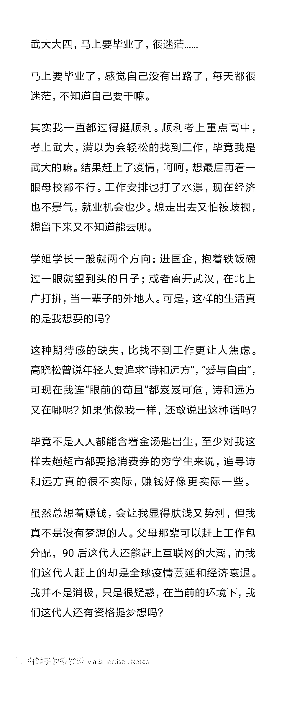
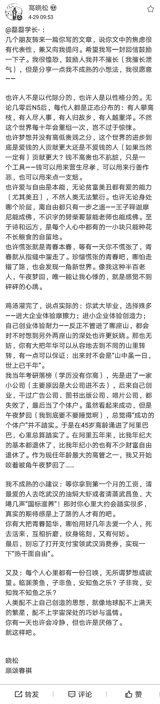

# 月圆之夜，紫禁之巅，武大后浪 VS 晓松前浪，究竟谁更浪？

> 原文：[`mp.weixin.qq.com/s?__biz=MzU0MjYwNDU2Mw==&mid=2247489319&idx=1&sn=67da0867626a1b51b34349b07774b1cb&chksm=fb197b5bcc6ef24d9ca3dd74956f384d669cd5738019de9cac98f14d7a1d18979ba462cbd5d2#rd`](http://mp.weixin.qq.com/s?__biz=MzU0MjYwNDU2Mw==&mid=2247489319&idx=1&sn=67da0867626a1b51b34349b07774b1cb&chksm=fb197b5bcc6ef24d9ca3dd74956f384d669cd5738019de9cac98f14d7a1d18979ba462cbd5d2#rd)

有位武汉大学的学生，临近毕业，写了一份后浪的迷茫。 

他点了高晓松的名，结果高晓松还真给回复了。

其实提问的挺好，回答的也挺好，但互联网，不太友好。

我没觉着有什么不妥，说句实话。

但网上分成了两派，挺高晓松，喷高晓松的。

所以有时候挺怀念 99 年以前的网络。

如果我们穿越一把，回到 99 年以前，我相信这俩挖的坑，也有很多人来灌水。

年年岁岁后浪相似，岁岁年年灌水不同。

20 年前的互联网灌的水，一定会提及如下三个问题。 

**1、诗与远方和干活赚钱之间到底是不是互斥关系？**

这个问题很简单。

是不是说赚钱的事情都是枯燥的，乏味的，浪费人生的？

是不是说有趣的人生，一定是穷困潦倒的？

我觉得不是。

我给你举几个例子。

一个是唐朝的李白。

五花马，千金裘，呼儿将出换美酒，与尔同销万古愁。

非常洒脱的一个人，非常个性的一个人。

但我有个问题，你知道什么叫五花马？

唐三彩里面出土过三花马，马的鬃毛剪成花瓣形状，三瓣的叫三花马。

五花马我也不知道是个啥。

推测一下，如果三花马相当于奔驰，五花马难道是兰博基尼？

千金裘，裘皮大衣上几十万很正常，欧洲有些私人定制手工的西服也要上百万。

那私人定制纯手工的裘皮大衣呢？我就不知道了。

李白把这些东西都拿出来干嘛呢？换酒喝。非常的洒脱。

但前提是，你得有啊。

天生我才必有用，千金散尽还复来。

重点是什么？是有用？是复来？

不是的。

重点是有才，有千金。

你得有才，才轮到有用，你得有千金，才能散啊。

大哥，现在的问题是，假如没才呢？

假如李白一毕业失业了，没有工作，也没钱，想喝燕京都没门，想燕京自由都不行。

如之奈何？

洒脱的态度固然重要，那个态度对着的五花马，千金裘，我才，千金，这些得存在啊。

请原谅我是个工科生，真的不够骚包，缺少文艺气息，我更喜欢研究李白的经济情况。

李白同志出生在碎叶城，今天的哈萨克斯坦。

小李同志是个富二代，他爹是当地有名的胡商，就是洋大款的意思。

这位款爹出手很大方，给了小李同志三十万金这么多的路费，让他去随便浪。

这意思大概就相当于川普说，他没靠家里，也就是 70 年代随随便便问老爹要了 100 万美金；或者相当于王思聪，白手起家，也就是随随便便问老爹要了 5 个亿。

所以，小李同志也是白手起家，只是随便要了 300 个千金。

难怪日后那么喜欢用千金这个词儿，感情他有 300 个。

小李同志带着 300 个千金，到扬州去，歌舞，美人，宝马香车，大半年，就花光了，果然应证了扬州是个销金窟。

钱花光了怎么办呢？

他只好“执手相看泪眼，竟无语凝噎”，“谩赢得青楼、薄幸名存”，一转身，去云梦，娶了宰相的孙女。

。。。

这意思就是钱花光了不要紧，娶宗庆后的闺女就行了呗。

我就不想打击你了。

李白一生娶了四个老婆，两个都是宰相的孙女。

其实，即便他不娶，问题也不大。因为唐玄宗是他的粉丝，王侯贵戚也大都是他的粉丝。

这意思是说，他还是个大 V，而且是什么级别的 V 呢？

福布斯上随便一招手，都是他的迷弟。

这样有趣，又充实的人，历史上数不胜数。

比如清代的袁枚。不想当官，就不当了呗。

人称乾隆三大家，妥妥的生活大师，据他自己说，一生有八好，好昧，好色 ，好葺屋，好游，好友，好花竹泉石，好名人字画，好书。

满汉全席到底有没有，不知道，但随园食单，是真的存在。

我不知道读者有没有注意到，他写的那些书，前缀是什么？

随园诗话，随园食单，前缀是随园。

随园，是曹雪芹他们家当年的园林，说不定就是大观园的原型，被袁枚买下了。

袁枚买下随园干嘛呢？搞娱乐中心，喝酒洗脚唱 K，吟诗作画桑拿。。。

结交各路官商，名流云集，结果一不留神，把自己搞成了文坛首富。

我给你举的这俩人，至少说明一件事。

有趣与赚钱是可以并存的。

事实上，你翻开史书，历史上几乎绝大部分有趣的人，都是地主与官僚。

道理很简单。

在古代： 

春种一粒粟，秋收万颗子。

四海无闲田，农夫犹饿死。

解决不了生存问题，有心思有趣么？ 

**2、看不到目标的瞎浪，究竟有没有那么快活？**

很多人不是有趣，也不是真的向往诗与远方，只不过在逃避现实而已。

大学里很多人通宵达旦打游戏，难道都是向往游戏中的远方？

我不否认这里面一定有几个发烧友，真的爱游戏，真的花心思琢磨游戏。

但你我都知道，99%，无非是觉得打游戏比上课更 EASY。

不相信咱们做个试验。

假如我给你搞个 KPI，限定时间内必须通关，而且写出攻略。

限定时间内要找出 N 种通关方式，每种都不能一样。

每天要找出多少个游戏中的 BUG。

。。。

我相信，不需要一周，99%的人都回去上课了。

他们不是真的爱游戏，不是。

这也不叫浪，这只是以浪为理由，逃避现实，虚度光阴。 

**3、没有考核的浪，真能浪出个道道么？**

我们有很多人说诗与远方。

你去大理，你去西藏，总能见到文艺青年，在酒吧里，或者在路旁。

可我问一句尖刻的话。

这里面绝大部分人，能写诗么？

今天，是个自媒体的时代，人人都可以发微博。

但是，在过去，有标准的时代里，能够写一篇文章，哪怕豆腐块那么大，登在报纸上，究竟有多少人？

验证的办法很简单。

你去问问身边的人，看看他们谁发表过，心中就大概有比例了。

我可以告诉你，这个数字低的吓人。绝对比念过硕士博士发表过论文的人，低的多。 

能听戏的有很多，能唱戏的有几多？

跑去西藏很容易，哪怕免费搭车，但是能像仓央嘉措写出“世间安得双全法，不负如来不负卿”的，并没有几个。

绝大多数人，其实只是去酒吧里发泄了一下荷尔蒙，分泌了一些排泄物。

有没有净化心灵我不知道，但肯定对当地环境造成了某种程度的影响。

事实上，人世间没有未经刻苦的才华。

宝剑锋从磨砺出，梅花香自苦寒来。

这并不是高中老师在晃点你，这就是才华的来源啊。

夜梦嬉戏童子如，父师检责惊走书。

计功当毕春秋余，今乃粗及桓庄初。

怛然悸寤心不舒，起坐有如挂钩鱼。

这是苏轼的一个梦，才子 63 岁时做的一个梦，梦年自己孩童的时候贪玩。

但父亲对学习监督得很严格，按照计划，本该读完《春秋》，结果才读到桓公庄公的章节。担心父亲检查作业，提心吊胆的好像嘴里挂了鱼钩的小鱼一样焦虑。

惊醒一看，原来是个梦。

这才是人生嘛。你看到大才子的潇洒，看不到人家潇洒后面也有 KPI 的呀。

这三点如果你想清楚了，就不存在分歧。

一个有目标的人，一个有计划的人，一个自我鞭策的人，无论他做什么，就是去浪，也会在浪的过程中，做出点什么看得见、摸得着的成绩。

而一个没有目标，没有计划，自我放弃的人，无论打着什么旗号，其实都不过是在消磨时间罢了。

李白，苏轼，辛弃疾，袁枚，其实绝大部分你叫的出名字的所谓有趣的人，都是有钱人。

这本就不矛盾，何必自寻烦恼。

人生只有两种，充实的，和不充实的。

任选。

大号近期文章：

[B 站上被狂喷的马云，土耳其的口罩猎人](https://mp.weixin.qq.com/s?__biz=MzU0MjYwNDU2Mw==&mid=2247489260&idx=2&sn=5921ce69810d549d82389557b9f2ff49&chksm=fb197a90cc6ef38624c78fa2f3805495f726fbc5e021511ac6576a29406aec412fb8a84cf172&token=1021269801&lang=zh_CN&scene=21#wechat_redirect)

[五五断更节，罗胖的故事](https://mp.weixin.qq.com/s?__biz=MzU0MjYwNDU2Mw==&mid=2247489251&idx=2&sn=87a6a8e2518eb9e1253af6ad29d604da&chksm=fb197a9fcc6ef389d416ef7edd62db71ecc0c7c716b83601f57564c08aa3e7efcdb32be4ea8a&token=1021269801&lang=zh_CN&scene=21#wechat_redirect)

小号近期文章：

[被埋的母亲，道歉的校长](https://mp.weixin.qq.com/s?__biz=MzU3NDc5Nzc0NQ==&mid=2247487860&idx=1&sn=ec636755332f7f5cd9b9cd68f3d9cdb6&chksm=fd2db3aaca5a3abc9de8850eb34fcf9d705ae0208297050d616d1a20ec236a075ce461e50c6e&token=996746286&lang=zh_CN&scene=21#wechat_redirect) 

[被侵犯隐私的池子，不知谁裁掉 1100 的任正非](http://mp.weixin.qq.com/s?__biz=MzU3NDc5Nzc0NQ==&mid=2247487853&idx=2&sn=f8ad3315e5061570603c059d2a1c22ca&chksm=fd2db3b3ca5a3aa59e285f6eaa9e4deb3e5fe1553dcb751ccb3bcf4012572d4d96d0fda2f1de&scene=21#wechat_redirect)