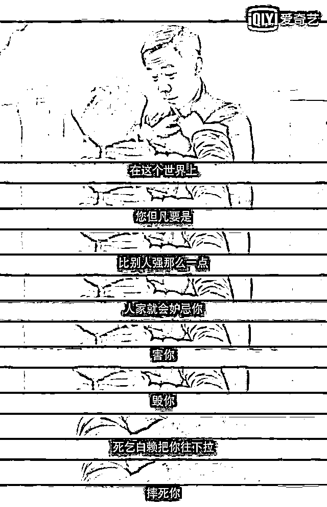
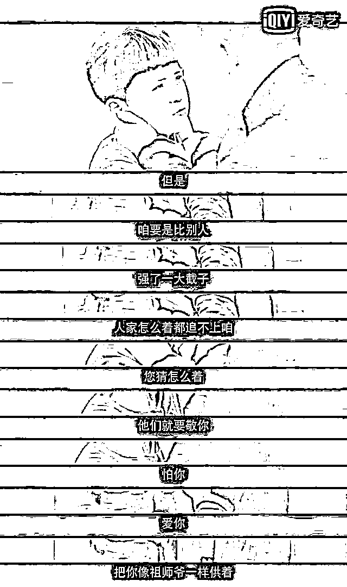

# 川普说的最有哲理的一句话：可能这就是人生吧

> 原文：[`mp.weixin.qq.com/s?__biz=MzU0MjYwNDU2Mw==&mid=2247488822&idx=1&sn=86481a883d6d83379285bdd3b69ec5ff&chksm=fb19794acc6ef05cec60375f120e1bbb5a4f3bb7474f87e6f3a23c61c487202691b0931aeb73#rd`](http://mp.weixin.qq.com/s?__biz=MzU0MjYwNDU2Mw==&mid=2247488822&idx=1&sn=86481a883d6d83379285bdd3b69ec5ff&chksm=fb19794acc6ef05cec60375f120e1bbb5a4f3bb7474f87e6f3a23c61c487202691b0931aeb73#rd)

你们都知道，我很喜欢取笑川普，倒不是他真的可笑，而是他天生自带相声段子。

我们今天正经一点，不拿他逗闷子了。

你会发现其实能让你看到的，都是精英。

无论他们说了点什么，那都是台词，不同的听众，需要不同的台词。

比如川普的对头之一，纽约州州长，民主党的安德鲁·库默。

他 3 月 27 号对着国民警卫队有一段非常精彩的演讲，很像《康熙大帝》里斯琴高娃演的太皇太后对于抓鳌拜行动中侍卫们的演讲。

我给你摘一段：

安德鲁·库默：“我不会要求你们做我做不到的事情，也不会要求你们去我不能去的地方。你们正处在历史的重要时刻，10 年之后谈起今日，你一定会热泪盈眶......”

**古今中外的人精，其实也都是戏精，不深谙人性，说不出这番话的。**

你注意这番话的对象，是国民警卫队，就像康熙大帝里，太皇太后说话的对象，是御前侍卫。

相似的听众，才能听到相似的内容。

很多人不喜欢川普，可能是觉得他对我国的态度很强硬，其实我相信，换安德鲁上，我们会遇见更多麻烦。

中美之间的竞争不是谁引起的，那是因为你自己发展的太好了。

所谓不被人嫉是庸才，因为你不是庸才，所以你早晚都得面临这一关。

国家是这样，人也是这样。

我有次提及《鬓边不是海棠红》，倒不是这本电视剧有什么好看，我也是盯盘的时候，同时开着电视，听了几集。

但其中有一段台词，把我的目光吸引过去了。

这是主人公商细蕊，和他的养父，也是他的师父商菊贞之间的对话。

商菊贞当年是和姜荣寿、宁九郎、侯玉奎齐名的角儿，给宫里进戏的梨园大拿。

后来因为倔，太后定的调子他不肯改，顶撞了老佛爷，就离开京城去了平阳。

电视剧演的就是他的养子兼徒弟商细蕊带着他们戏班子杀回京师，重新成为梨园大师的故事。

图中这段对话是商细蕊小时候受不了苦，再也不想学戏了，他爹跟他讲的。

这些话，后面全部应验了。

商细蕊封神，就是不断地被打压，被排挤，被陷害，然后不断地向前走的过程。

**借川普的话讲，这就是人生嘛。**

商细蕊是个性格很古怪的人，有点不够成，但撇开这一点，他的优点很明显。

1、老天爷赏饭吃。

2、祖师爷赏饭吃。

老天爷赏饭吃就是说这人悟性到了，说了就能懂。

祖师爷赏饭吃就是说这人已经勤奋到偏执了。

这两点，只能很少的人能具备。

这才是他爹商菊贞敢跟他这么说话的前提，说话也得看人下菜碟。就像川普，安德鲁一样。

纵观那本电视剧，商菊贞的教育方式始终很 LOW。无非就是打他，照死了打。

他爹死后，商细蕊独自扛大梁，社会对他的教育方法也很 LOW。无非就是整他，往死了整。

这就是成为祖师爷的必经之路，虽然绝大多数人都会嗤之以鼻。

我去年曾经多次聊起过这个话题。

对于最优秀的那一小撮人，教育方式就是简单粗暴的。

你去参加奥赛，到了最后的冬令营，教练对你的态度就是“做的了做，做不了滚”。

你去很牛的企业，很强势的团队，就是动辄招奥赛金牌得主的那种环境，BOSS 的态度就是“钱难挣，屎难吃”。

你要是去金融市场靠炒单过日子，市场又不是人，它连话都懒得跟你讲，做不到的都去天台上排队吧，天台上不用摇号，位置管够。

这不叫残酷，这叫真实。

昨天我回答一个读者说**收益来自于风险，所以叫风险收益，并不是来自于勤奋。**

原因很简单，勤奋太廉价。

在足够优秀的人群内部，勤奋是没法决胜负的。废寝忘食、终身如一日的死磕，门槛太低了，谁都能做到。

所以要引入风险。

所谓风险就是大家玩俄罗斯转盘，直到有人怂了或者被老天爷带走为止。

你说为啥要这样？都好好过日子，安耽点不好么？

不好。

你肯，那帮优秀的人不肯。无法达成共识。

张无忌整合明教内部，甚至调和与六大派的宿怨，不是靠说和，而是靠四个字：“不服来战”。

你要是武林盟主，那你就出面，把天下英才都揍一顿，揍到大家都服你，以后都听你安排。

你整理需求，你分配利润。大家都没意见，谁有意见你就把他揍到没意见为止。

但反过来，你要是没能力把天下英才都揍服，那就一定会回到“风险决定收益”的老路上。

你注意我说的并不只是经济，格林斯潘企图扮演张无忌，撑了那么久还是无果而终。何况天底下就算有张无忌，难道不会老不会死么？

《三国演义》第一回开篇：话说天下大势，分久必合，合久必分。

你看到了，说书的都特么懂了。 

任何事，任何领域，把时间轴拉长了看，本质只有六个字：**风险决定收益。**

其实古人早就明白，富贵险中求。 

真相始终就那点事儿，无非能不能、敢不敢跟你讲，又或者就算给你挑明，你的悟性到没到那份上。

上面的这番话，商菊贞一个唱戏的都懂，川普和安德鲁怎么可能不懂呢？

你觉得人家不懂，只有一种可能。人家不敢这么跟你说话。

就像商菊贞也只敢跟商细蕊这么说，对着他们水云楼剩下的孩子们，也只能哄着玩。 

人在不同的场合下，需要对着不同的人说话，他就得“胡说八道”。这就叫人生如戏，全看演技。

就像奥赛的教练，你让他换个场合，公开采访他，他也会大谈教育减负，因为他知道大多数人喜欢听这个。

但他回到队里，对着这帮万里挑一，十万里挑一的孩子，马上就会否认自己说过的每一句话。

他会告诉你，减负是他们的事儿，对你们几个增负是废话，玩命是起点。

所以人们往往会发现世界是混乱的，因为你听到的和看到的，对不上。

我们昨天有个读者写了很长很长的几条留言，讲述了他自己从当年十八线小镇青年到后来创业，公司销售额过亿的故事。

夜里被我们编辑加精了，早上我起来看了两遍，很有意思的故事。还顺便回了某位读者的留言。

那位读者也看了人家的故事，不理解这老兄说的。为啥即便年近三十，年薪六万也能赶得及日后捐出百万。

原因非常简单，时代+个人。

这老兄 70 后，90 年代毕业的时候去华为月薪就能拿 4000，那时候北京房价一平米 1000 块有的是。如果你按照房价购买力折算，他相当于今天本科一毕业，月薪 40 万。

所以他说自己买第一套房是老婆当年攒了几万块，言外之意，在当年，以他们这种人才买房，那就不叫事儿。

当然，还有一个细节，很多人可能没注意。他高考是湖北省第 28 名。

我们常说，第一名和第十名的距离，往往比第十名和第一千名的距离还要遥远。

人才这东西，有点像长尾效应，8 成的人集中在头部的一小块区域内，2 成的人，分散在尾部的极大范围内。

我强调这一点，不是告诉你学习的重要性，而是帮你理解学霸们的预期。

他有句话很重要，是说他在华为期间，看见通告上大学同学的名字，而自己还岌岌无名。

你看我把关键词抓的很准，我很清楚优秀的人们，到底在想什么。

他不会去想有一天有一套房子，面朝大海，春暖花开。

不是不够浪漫，而是这个一定会有，不值得想。

但他会介意为啥大学同学出现在通告上，而自己还岌岌无名......

你知道这东西叫什么？

这就叫预期。

就像商细蕊人家再怎么着，戏唱到他那份上，在平阳，也是一绝。买田置地，那不叫事儿。他想要的，是梨园行里有他的位置。

他为什么会想要这个？他见到过和他一样水平的人，大部分能得到，所以就会形成这份预期。

所以你看到昨天那读者为啥会不停的去折腾，去创业，因为这是他的预期。

他见过太多相似的同学是企业主，甚至公司能上市。你们能，凭啥我不能？

这就叫预期。

如果你够真实，翻开历史，会发现人类文明里强势的就那么几个，当过世界中心的，也就那么几个。

比如西班牙，日不落，亚历山大，罗马，美国，以及秦汉唐宋元明清。 

绝大部分时候，我们都是世界中心。这是一种预期，也是一种心态。

**人的行为实际上就是预期决定的。**

商细蕊为啥对着自家师大爷，梨园会长姜荣寿都不肯低头呢？

因为傲嘛，傲就是一种预期。

人家商细蕊的爹是商菊贞，这份出身，他就不肯低这头。何况他一身的本事，傲上加傲，肯低头才怪。

我们昨天那位读者，人为啥放着安耽日子不过，非要折腾，一个道理，预期。

一个人是这样，一群人如果有相似的预期，达成共识，那就是民族性格。

你想想秦汉唐宋元明清，为啥绕来绕去，最后还得汉人来当家？

秦时明月汉时关，

旌旗半卷出长安。 

大漠无垠江湖远，

暴雨惊雷夜如磐。

牛了几千年了，这份傲气实在压不下去，甭管是大漠无垠还是暴雨惊雷。

这不是诗，这是个现代人写的歌词。他要是出生在毛里求斯，也许歌词就写成“哇喳啦啦呦吼，哇喳啦啦呦吼”了。

我们文明中自带的傲气，渗透在作词者的骨髓里。 

老美也是一样的，人家也牛了八十年了，遇到任何事都不肯低头，骨子里傲慢是正常的。

我常说，骄傲的人，才能理解别人的骄傲。

美国的两百年，走来并不容易，就像我们的两千年一样不容易。

无论看着像德云社出身的川普，还是看着就像精英的安德鲁，本质上没有区别。

一样的骄傲。

总有人不喜欢优秀的对手。其实那是因为你自己不够优秀。

李云龙的原话怎么说的？ 

“老子打的就是精锐！”

你把篇头篇尾东西方的两句话凑一起，可以说段相声。

“老子打的就是精锐！”

“可能这就是人生吧。”