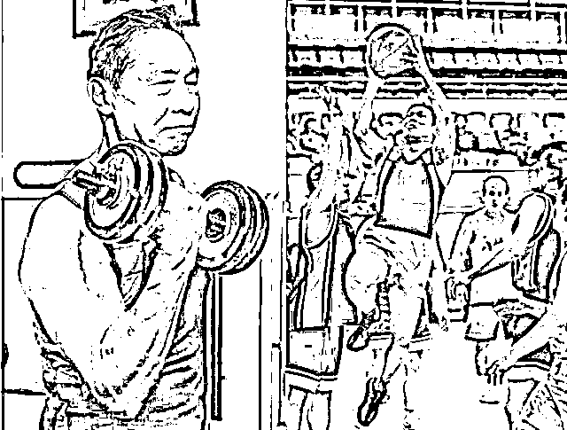
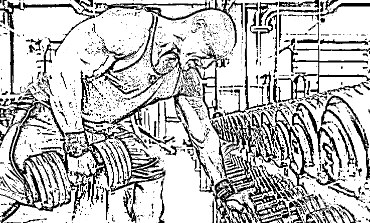

# 除了神奇的印度人，还有什么办法能与病毒共存？

> 原文：[`mp.weixin.qq.com/s?__biz=MzU0MjYwNDU2Mw==&mid=2247488440&idx=1&sn=d789d711b0979a6e1cda4dc1e5326c0e&chksm=fb197fc4cc6ef6d29780fec87604820725dfc45232aa53d627fbac970e6c9abbc4b25a1e4bc9#rd`](http://mp.weixin.qq.com/s?__biz=MzU0MjYwNDU2Mw==&mid=2247488440&idx=1&sn=d789d711b0979a6e1cda4dc1e5326c0e&chksm=fb197fc4cc6ef6d29780fec87604820725dfc45232aa53d627fbac970e6c9abbc4b25a1e4bc9#rd)

很多号都写过钟南山，年轻的时候如何传奇，当然年老了更传奇，一生都是传奇。

但我觉得，这些事情的背后，是什么？

是肌肉。

1959 年，钟南山在全运会，男子 400 米比赛中跑出了 54.4 秒的成绩，创造了当时的全国纪录。

有人会觉得，西风，你小子是不是写错了？

钟南山的传奇不应该来自医术和医德么，跟肌肉什么相关？

我问你个很现实的问题，他已经 85 岁了。

85 岁的老人原本应该在哪儿？

是躺在病床上等着别人来护理，还是站在病床边，作为医生救治别人？

在上上一代的直系亲属中，我的外祖父是第一个走的，祖父是第二个走的，都是 60 多岁，我的外祖母是第三个走的，70 多岁。

我的祖母，远超其他几位，她只比钟南山小一岁，还能够行走，但也已经不记得我了。

我一直觉得，这已经挺牛了，70 岁开始疾病缠身的老人很多，80 多岁只是个大城市里理论上能生存到的平均寿命。

平均寿命的意思就是说，有些人超过了，有些人到不了。

即便能到，最后的十几年也是熬吧熬吧熬过去的。

这意思你懂得。

比如我外祖母，后面就是糖尿病，脑梗，各种疾病缠身十几年，最后熬吧熬吧熬到 70 多，走了。

中国男性的平均寿命是 71，美国是 75，看着很接近，其实如果你看细节，细节不忍卒读。

那个老美里面有很多人是嗑药的，酗酒的，冒险的，死于意外的，相对来说，东方人安耽多了。

这一部分，我们没算上。

而且，你仔细看一看双方的老人，会发现美国的老人，普遍肌肉比我们发达。

换句话说，人家生命中最后那十几年的质量，是比你高的。像钟老爷子这种 85 岁一身横练功夫的，老美比我们，多得多。

有人说《红高粱》停播了，《叶问 4》应该置顶。

我也是武侠迷，功夫迷，打小幻想武林高手，但平心而论，就算编剧假设的是有道理的，叶问能够吊打海军陆战队，李小龙能够打遍美国无敌手。

你觉得，我们有多少叶问？有多少李小龙？

这个话题只能关起门来，咱们汉人内部聊，别说老外，哪怕像罗永浩那样自称朝鲜族的，说这种话题都会被喷死。

我们普遍肌肉不怎么发达没什么别的原因，就是不重视，甚至可以说，轻视。

我以前也很轻视，直到去年才不得不稍加重视而已。

去年年底我写过，今年的目标之一就是健身，为此每天去健身房打卡一小时，或练习杠铃，或游泳，本已坚持了两个月，被疫情打断了。

但我也没想过要练到巨石强森那种程度。

比如这种。

我一直以为，十三太保横练金钟罩，鳌拜鳌少保只是周星驰电影里的搞笑。

我一直以为，巨石强森这种是人种上的差异，就像在刘翔之前，连日本人也不认为黄种人还能跑的比黑人快。

直到我看到钟南山，这个 85 岁老人那一身的肌肉。

我觉得这是一个契机，是我们改变审美的一个重要的契机。

曾经有人说，咱们的男性，身材真的普遍不好。

我们崇尚什么样的呢？

大腹便便的商人或者官员。

大腹便便是什么意思？

大腹便便的意思就是说，只要这个人有权，或者有钱，他身材走成什么样，都不重要。

最近日本刷屏了，“岂曰无衣？与子同裳”。

我们被刺激了一把，觉得隔壁邻居秀了一把才华，比咱们的口号似乎文雅一点。

就算加上才，那也不过是，权，钱和才。

才，被认同很大程度上还是因为它能变现，能变成权或者财。

所以我们叫郎才女貌，或者叫郎财女貌，很少有强调肌肉的。

这是从什么时候开始的呢？

好像是从宋朝开始的。

有人说是程朱理学的影响，把人教傻了。

其实比那个早得多。

《宋史，狄青传》记载：“（狄青）临敌被发、带铜面具，出入贼中，皆披靡莫敢当。”

狄青是北宋少有拿得出手的将领。

至于杨家将，那主要是传说。

而且那种传说也不怎么让人舒服。什么十二寡妇征西，什么穆桂英挂帅，让男同胞听了，其实心里很不自在。

狄青不是读军官学校出来的，他起于行伍，发于戍卒。年轻的时候代兄受过，被刺面发配充军，就是所谓的刑徒。

但因为屡屡立功，不断地晋升。宋仁宗很喜欢他，提拔他，让他官至枢密使，就是军方第一人。

还把清河郡主嫁给他儿子，对他说：“你就是当世的关张。”

但就是这样一个人，在当时很不受待见。

欧阳修，文彦博，富弼这帮人，成天要求放逐狄青。

有一次，狄青为他的旧部焦用求情，焦用有罪但不至于死，理由是“焦用有军功，是个好儿郎”。

狄青的老上司韩琦嘲讽道：“东华门外唱名的，才是好儿郎”，然后就把焦用给杀了。

东华门外唱名就是科举上榜了，宋代文人地位很高，流行榜下捉婿。

就是宗室，外戚乃至达官显贵，在发榜的时候，看到谁没成亲的，就半绑半拥的拉回府邸，和他家闺女成亲。

像前面那个攻击狄青的富弼，少年时聪慧过人，提笔能文，范仲淹说他有王佐之才。

中了进士之后，神童宰相晏殊先下手为强，赶在另一个大臣王曾的前面，把闺女嫁给了富弼。

“昨夜西风凋碧树，独上高楼，望尽天涯路。”

王国维在人间词话里评价人生三境界，之一。

这首词就是晏殊写的。

二十年前，我念书的时候，从里面摘碧树西风四个字，做了 QQ 名。

如今的笔名，就这么来的。

所以有宋一代，武将地位很低，我们都说岳飞如何受委屈，宋代的将领都受委屈。

像辛弃疾是才子出身，虽然也受排挤，但是有钱，有美女，日子还是过得很滋润。岳飞这种行伍出身的受到的猜忌更重。

我们曾经聊过辛弃疾，不只有诗和远方，还有钱和数不清的姑娘，他那个稼轩庄园到底有多大，让朱熹瞠目结舌，他有多少莺莺燕燕的好妹妹，不一而足。

长期对武将不公平，到了明代，武将的地位就更低。

你经常可以看见四品的文官把二品的武将训的跟那啥一样。

上层是这样，下面也一样。明代百姓把军户叫“赤佬”，因为军户穿红色的衣服，很显然，是侮辱性的话，就像水浒里经常出现“贼配军”。

可我们在唐以前，不是这样的。

“北斗七星高，哥舒夜带刀。”

你想象一下那个景色，70 岁的名将哥舒翰，一头银发，腰挎宝刀，骑着白色的骆驼，踏着长安的夜色，缓缓走在大街上。

李白是他的狂热粉，曾经为他作诗，描述他年轻时的功烈。

“横行青海夜带刀，西屠石堡取紫袍”。

唐代分绿袍，红袍，紫袍，亲王和三品以上高官才能穿紫袍。

哥舒翰，封西平郡王。

即使李白，也不只是文人。

金庸的《侠客行》看过吧。

石破天在李白的诗歌里找到绝世武功。

十步杀一人，千里不留行。

事了拂衣去，深藏身与名。

.......

纵死侠骨香，不惭世上英。

谁能书阁下，白首太玄经。

石破天最后领悟的绝世武功就叫做《太玄经》。

当然这是金庸 YY 的，他可以 YY，游戏《王者荣耀》也可以 YY，所以王者荣耀里面李白是个高手。

事实是怎样的呢？

《新唐书》说李白是裴旻的徒弟，曾从其学剑。

而裴旻是谁呢？

左金吾大将军，号称天下第一剑。

《独异志》记载裴旻能把剑抛到数十丈高，然后用剑鞘接住下落的宝剑，几千个围观的吃瓜群众，无不惊骇。

我想，师父是剑圣，想必李白剑术也很了得。

不仅仅武功是这样，体育一样全民风靡。

《封氏闻见记》里记载，唐玄宗年轻时，还是临淄王的时候。亲自带队，打马球，以四对十，毙的吐蕃满地找牙。

你去看下今天的男足。

曾经有个企业主，很嚣张的跟我说：“天底下没有钱解决不了的问题”。说完后想了一想，觉得不严密，补了一句：“除了男足”。

如果你让一个人去解决哥德巴赫猜想，他一定会放弃。

但如果你让一个人在哥德巴赫猜想和男足什么时候能赢之间做选择，他肯定会选择去解决哥德巴赫猜想。

回到我们的主题，你会发现，汉唐这样强盛的时代，我们都是尚武的。

即便文人也以能武为荣耀，否则李白就不会写《侠客行》，也不会热捧哥舒翰。

到了宋以后，武的地位大幅度下降，以至于后来，我们甚至以大腹便便为荣，以吃野生动物为耀。

这是一种堕落，精神上的堕落。

钟南山当然是以医术著称，但他终究已经这个岁数了。如果只是行医，终究只限于这个领域。

我觉得，他身上可以挖掘的，不只有医术与医德。

既然现在全民崇拜他，我们能从他身上学到更多的是什么呢？或者说他能带给我们什么改变呢？

是他那一身的肌肉，是他那种逆行者的风采，是他那种从内在到外在都猛的一塌糊涂的牛掰。

这哪儿是钟爷爷，这是猛将兄。

85 岁的猛将，可以让子孙辈们奉为偶像。

把那些大腹便便的，那些娘娘腔的，通通取关。

男人当学钟南山，横练肌肉闯千关。

无论空气中的病毒能不能扫空，都愿精神层面的病毒，能随着这位全民偶像的冉冉升起，一扫而空。

即便我们最终不得不和这种新病毒共存，到那时候，什么是王道？

免疫力才是王道。

这颗星球上谁的免疫力最强？

印度人。

马中赤兔，人中印度。印度人号称人中蝙蝠，你进了 ICU 都没搞定的事情，他干了一碗牛尿就痊愈了。

但你能学么？这事儿和牛尿有关系么？你就是把牛膀胱生啃了，你也好不了。

那就不关牛的事儿！那是人家无数代人淘汰出来的。

所以，在这颗星球上，除掉印度人之外，要想提高免疫力，怎么办？

锻炼！

今天，你运动了吗？