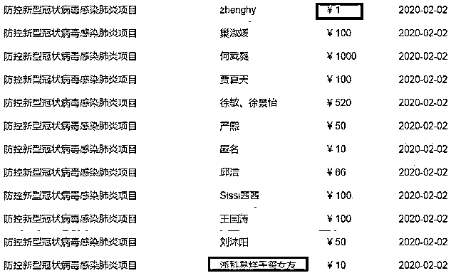

# 我怎么看 51 岁菜农冒雪步行十公里，捐 600 元卖菜钱

> 原文：[`mp.weixin.qq.com/s?__biz=MzU0MjYwNDU2Mw==&mid=2247488275&idx=1&sn=1b9a20d2e88d96f7e9d0156f87cc5df2&chksm=fb197f6fcc6ef679346e20a95dd629ab5991b428cc2830659d2df42242ebb21ad7c1c6716d10#rd`](http://mp.weixin.qq.com/s?__biz=MzU0MjYwNDU2Mw==&mid=2247488275&idx=1&sn=1b9a20d2e88d96f7e9d0156f87cc5df2&chksm=fb197f6fcc6ef679346e20a95dd629ab5991b428cc2830659d2df42242ebb21ad7c1c6716d10#rd)

今天我们号，正式开工了，虽然是远程办公。

前两周，全员放假，我独自一人，又写文章，又干运营。

既然是开工第一天，我觉得有必要给新读者们介绍下我们号的风格。

我们号称公众号里的泥石流，听名字你应该觉得很奇怪。

人家都号称是清流，我们咋起这么奇怪的名字。

这是读者为我们起的，清流太多了，这个世界不缺清流，像我们这样与众不同的，只好自称泥石流。

泥石流的特点就是没有立场，你去看下几乎所有的自媒体都是有立场的。

所谓圈定一批客户，他们的目的是找到相同的自己，让立场，观念相似的人，聚集在一起。

但我们不是这样，我们没有立场的，你会发现我们今天说张三好，明天说张三不好，后天说李四不好，大后天说李四好。

因为我们谈的仅仅是思考，我们压根儿就没说过张三，李四好不好。

是你自己还没有办法用纯思考的方式去理解这个世界，你自己下了一个好不好的定义，然后硬安在我们头上，非说是我们说的，如此而已。

我今天啥也不干，举一个例子。

通过这个例子，让你看一看，我们这个泥石流与你平日里看的那些清流不一样在哪里。

你注意，我不是说人家清流不好，我只是告诉你口味不同。

就像人家卖苏菜，我们卖川菜，口味不一样，但我事先提醒过你，你尝了一口太辣，就赶紧取关，因为不适合你。

下面是一则报道，很多号都写过，我也给你写一遍。

今年 51 岁的周国友是汉中市镇巴县泾洋镇李家坪村盘龙组的一名菜农，多年在家务农为生，主要经济来源是种菜，然后送去县里卖。

周国友每年种菜收入大概有 3000 元，家里有个 81 岁的父亲，瘫痪在床，他和他 40 多岁的弟弟，共同照顾起居。

他和弟弟都还在打光棍，他家以前是贫困户，在当地 ZF 的帮助下，靠种菜和养鸡得以脱贫。

确切的说，是去年，刚脱贫而已。

脱贫后的他，从电视里看到了武汉的疫情，很揪心，就想着帮一把，哪怕给人家买瓶水，也好。

从他家到县城有 15 公里山路，因为疫情防治，通村的客运班车停运了，他只能步行。

1 月 28 日下午将近 3 点，他从家里出发，步行穿越小路，因为路上有积雪，滑，摔了几跤，两个多小时才走到公路上，步行了有 10 公里山路。

此时已是下午 5 点，大概 5 公里路才能到县城，实在走不动的周友国，拨了 110 向警察求助。

值班的辅警收到请求后，立刻安排车辆去接应，接上周国友时，看到他摔的周身都是泥。

周国友穿着很朴素，脚上穿着一双解放鞋，内里的毛衣和黑色的裤脚都因长年反复磨洗而微微泛白，有的地方甚至还被磨破有了小洞。

坐在警车上，他反复道歉，觉得添了麻烦，他是看天黑了，担心人家下班，钱捐不出去，才求助的。

最后，他被送到了当地红十。

他从胸口掏出一个蓝色塑料袋，一层一层地剥开，最终从一个暗红色的旧手帕中拿出了崭新的 600 元钱，反复清点了两次，才将现金交到红十工作人员的手中。

看着他那双常年劳作，长满老茧的双手，镇巴县红十工作人员感动的热泪盈眶。

镇巴县红十表示，会尽快把周国友定向捐赠的善款交至汉中市红十，由后者统一汇至武汉市红十账户，款项将做详细用途记录，用于武汉抗击疫情，实现周国友的捐赠目的和心愿。

凭心而论，我很感动，如果我就着这个感动，给你发散，还能找出很多这样的好人好事。

但你知道，我不会发散，我也不会写那个角度。

我知道下面的这些话都不招人待见，我也知道招人待见的话咋说，但我不想说那些。

这个故事，在我看来，除了感人，更让我心里堵得慌。

汉初打匈奴，一石粮食运到前线，沿途损耗要三十多石。

你注意，我不给你讨论小问题，比如是不是沿途送货的饭量大。我给你讨论的，是大方向。

大方向上看，你用什么运输的？用骡子？

骡子要不要吃草料？赶骡子的人要不要吃饭？

都要对吧。

那这就是成本，运输成本，三十几石的粮食，从产区往草原上运，路途遥远，绝大部分都得消耗。

能运到的，所剩无几。

当然，那是古代，今天是现代社会。

但现代社会下，你知道要把 600 块钱精准的交给一个真正贫穷的人，沿途的成本是多少？

我们不讨论别的，我们只讨论经济学。

你想把钱给到一个穷人，起码要付出两个成本吧。

第一，你得在很多人里面筛选，究竟谁是真的穷人。

第二，你得设计一个游戏规则，让这个钱他拿到后，真的管用。

所谓救急不救穷，是说你这个钱，要像启动资金，它能够点燃对方，把对方推入自我赚钱的良性循环之中。

否则，你永远也帮不到对方。他缺钱你就给，他缺钱你就给，你没法让对方被纳入到社会协作体系里面去。

我们看下这个菜农，很显然，他自己曾经是个穷人。

当地 ZF 非常牛，做到了上述两件事，找到了他，而且真的帮到了他。

怎么找到的？一定是花费了很多成本，也许有下乡的基层干部到处走访，调查，统计，汇总。

怎么帮助他的？让他种菜，种的菜可以卖到城里，他被纳入到商业体系中，成为其中一个环节，从而得以脱贫。

那我们看下他目前的状态是什么？

是刚脱贫，年收入 3000，月收入 200 多，还有 81 岁的父亲瘫痪，五十多岁的自己和四十多岁的弟弟均未婚。

你觉得他应该捐钱么？

应该，因为每个人都有表达善意的权利。

可是，从经济学的角度看，不应该。

因为他这么做，不划算，不仅仅是对他自己不划算，而是对整个社会，都不划算。

600 块钱，是他五分之一的年收入，对他来说，可以做很多事。

是不是可以多租块地，多种一点菜？

是不是可以先解决自己家的事情？比如给瘫痪的老父亲买药，比如攒着，说个媳妇？

你说，他不这么做，是不自私。

可是，你算过账么？

如果他这么做，将来返贫了怎么办？

疫情是会影响到实体销售的，人家开菜店的，都不好过，都要寻思和物流巨头合作，开展送货上门的业务。

他一个种菜的，生意会好么？

我们假想一下，假如他返贫了，下一次，找到他，帮助他，成本是多高？

会是 600 块这么点么？也许是 6 千，也许是 6 万。

理解我这意思么？

他干的这事儿吧，从经济学的角度看，就像人家好不容易花了三十几石的代价把一石粮运去匈奴前线，结果又被他给运回来了。

你还没法说，因为他的确是出于善良。

你看到了，经济学中一个简单的常识，可它就是没法普及。

这就是泥石流的风格。

泥石流不中听的，因为他不停的跟你算帐，而不是渲染情绪。

相濡以沫，不如相忘于江湖。

两条鱼，在一个没水的坑里，彼此吐口水，想让对方存活，感人么？

也许吧。

但站在自然界的角度，这么干，只会死的更快。

还不如俩人没感情，谁也不认识谁，自由自在的在大河里遨游。

所谓泥石流，希望的就是这样一个结局。

社会的平均消耗不断地降低，彼此有距离感，安安静静的享受各自富足的人生。

我不给你举例子，很多人会觉得我是在 YY 未来。

在这次疫情面前，杭州的红十，就是这么做的。

大部分人捐款是通过支付宝或者微信，你说你有钱，掏了一千万，他说他没钱，掏了一块钱。

没问题的。

站在心意的角度，一样大。

你的钱，是后台数据直接导入，无需人工。

而且杭州的红十，每一块钱都会公示。

我没有在这次的新闻上看到杭州有冒出什么感人的人或者事，但显得很有秩序。

杭州的官员脱稿讲数据，对答如流，杭州的红十，一切收支精确到分。

背后一切数据走互联网，大家手机玩的倍溜。

有人会说，浙江 ZF 有钱，做的到位很正常，何况这本不值得表扬，这就是应该的，你本来就应该熟悉数据，你本来就应该有专业素养，你本来就应该公布详细开支到分，这都是你应该做的。

是应该的，但还是值得表扬。

有钱就怕逞能，可是浙江不逞能。

明明物资生产能力很强，但是一开始就对公众坦言，医用外科口罩缺 400 万，防护服缺 2 万。

“希望大家帮帮忙。”

你看，很诚恳，很坦率，很透明，没有对着媒体拍胸脯，打包票，说物资充足。

民众也很给力，你坦诚，他帮忙。

浙商买空了莫斯科的库存，浙商买下柬埔寨的工厂，直接生产口罩。

以至于杭州竟然可以对着民众，每人每十天提供五个口罩，快递上门白送。

是不是很有意思，尤其在某些地方已经开始互相截口罩的背景下。

为什么浙江的民间与官方，能够彼此信任，能够把后背交给对方呢？

这是科技的力量。

这里面有阿里耗资千亿的 AI 达摩院，直接提供疫情信息采集系统，所有数据走网络，一切数字化，而不仅仅依赖人的道德。

数据如果做成应用，管理者一目了然，他就不用记，打开手机，就能对答如流。

数据如果在后台让系统自动执行，就会尽量屏蔽人为的因素，人的因素越少，不可控的地方就越少。

我给你举一个非常小的例子，你马上就能体会数字化带来的价值。

比如你通过现金去捐钱，要靠谁记录？靠人。靠人的本质就是靠人品。

但如果你通过网络支付，这个记账是后台做掉的，这个数据是分布式存储的，如果你要改，牵扯的面大了，难度就提高了。

这就是用技术的手段来降低对人品的要求。

技术一小步，文明一大步。

无数这样的科技手段汇聚起来，用大数据来打造什么？

来打造智慧城市。

打造智慧城市是为了什么？

是为了节省成本，节省社会的运行成本，只有这样，才能民富，而民富，会进一步降低社会的运行成本。

**手机点点一秒钟，冒雪走路要一天功。**

山上的和尚下山挑水的过程中，会产生无数感动，但这不是目的。

目的是什么？

目的是有一天接通自来水，从此以后，大家不用再打水。

思考产生科技，科技改变生活。

你还觉得这仅仅是一场瘟疫么？

这是一场考试，这是一场大战。这是一场招商大战，这是一场抢人大战，各个城市的表现都会被企业看在眼里，都会被人才看在眼里。

瘟疫是一定会过去的，瘟疫结束后，某些城市会成为赢家。

他们赢得了企业，他们赢得了人才。