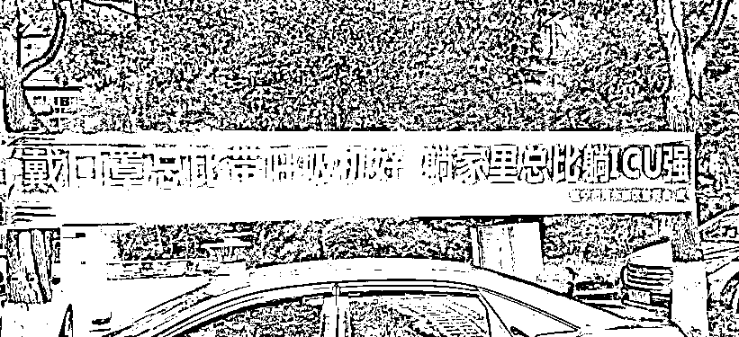
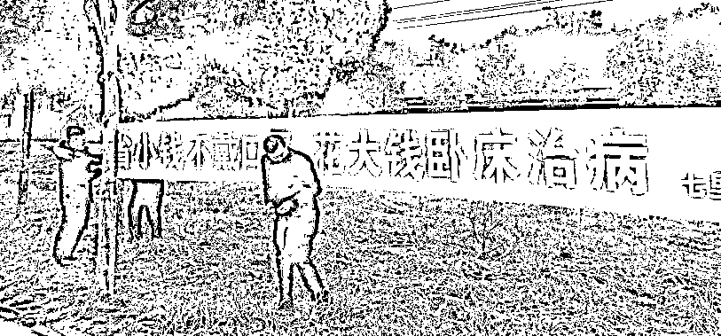
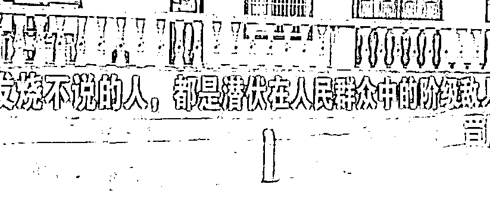
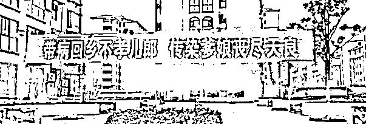
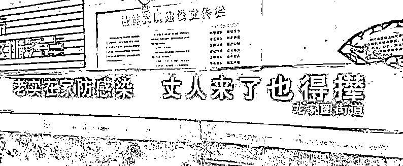

# 病毒都打上门了，你究竟是想赢，还是想辩个输赢？

> 原文：[`mp.weixin.qq.com/s?__biz=MzU0MjYwNDU2Mw==&mid=2247488221&idx=1&sn=e86c2cf4646504578ecc0fe85879044c&chksm=fb197ea1cc6ef7b7a70a52f12ce25cb1aebf4eba5633b11574d53b30041154bfea6380393022#rd`](http://mp.weixin.qq.com/s?__biz=MzU0MjYwNDU2Mw==&mid=2247488221&idx=1&sn=e86c2cf4646504578ecc0fe85879044c&chksm=fb197ea1cc6ef7b7a70a52f12ce25cb1aebf4eba5633b11574d53b30041154bfea6380393022#rd)

昨天我回答了部分读者的问题，因为 29 号的留言实在太多了，一篇文章回复不完的。

我今天专门回答一个问的人最多的问题，就是关于简单粗暴与正确与否。

昨天我的意思已经是明摆着的，对于像打仗这一类的事情，赢是第一位的。

就像《三体》说的，生存是宇宙第一法则，其它的，排在这条法则之后。

因为死人说不了话，能坐下来讨论，发表自己的看法，前提得是个活人。

29 号那天就有好些人反驳我，难道不讲是非了？你还是不是一个知识分子？

我的确不是知识分子，这个老读者都知道。

知识分子是一种思维模式，和学历无关的。

哪怕你学历很高，学校很好，你不持有某种思维模式，你就不是知识分子。

哪怕他读个三流学校，他持有某种思维模式，他就是知识分子。

所以我本就不是知识分子，重要的事情上面，我关注结果，并不关注道理。

我念过很多年书，念过很好的学校，在很好的公司里做研发，做到架构师，做产品，做高管，在行业会议上多次以专家身份发表过看法等等。

但那只是工作，或者讲，那只是一份差，just so so。

我的主要收入来源是作为投资人，作为交易者，而不是来自本行业。

市场评价一个投资人唯一的指标是活着，并且持续高回报。

这意思就是说，哪怕你拿个诺贝尔经济学奖回来，市场都不认你。

管你对不对，赢了就是赢了，输了就是输了。

自古赌场无父子，市场里根本没有道理。

所以你不要指望我会和你在重要的事情上讨论道理，我只有在那些鸡毛蒜皮的事情上，才喜欢讲道理。

威胁性命的事，肯定是第一要紧的事。

那在第一要紧的事情上面，结果当然比道理更重要。

而达到一个好的结果，有很多途径，或者说，有很多方法可供选择。

比如我昨天回复读者，就是围绕着数学期望展开。

不是说我的这种思维模式好，而是因为我只会这个。

因为自身从事的事情的特殊性，我每天都要做决策。

做决策就是选 A 或者选 B。

选 A，预期利润是多少，预期损失是多大。

选 B，预期利润是多少，预期损失是多大。

不仅要不停的做决策，用来做决策的时间本身也得做计算。

时间本身有价值，时间是一种成本，机会成本。

我做了这件事，就失去了做那件事的机会，所以要计入成本。

我单位时间是多少钱，机会成本是多少钱，成天都要算，算着算着，早已形成习惯。

所以昨天回答读者的问题，脱口而出的思路就是数学期望。

从经济学的角度给你算出来买一只高价口罩，究竟划不划算。

这种思维模式有普及性么？

其实没有，我太太，和我在一起二十年了，她都听不懂。

回到今天的标题。

很显然，像昨天那样，讲数学期望，问题讲的很清楚。

但如果你让村干部拿这个当工作方法，它不可能产生好结果。

因为需要大量背景知识，推广起来极其复杂，效果肯定很差。

那什么会产生好结果呢？

官媒说了，像下面这种。

你注意，它字都写错了。

“戴口罩总比带（戴）呼吸机好，躺家里总比躺 ICU 强”。

但字错了不要紧，效果好就行。

还有这种。

这两条为啥好呢？

乡下的老人，挣钱不多，自己的儿孙外出打工，恐怕挣钱也不容易。

钱来的艰难，他就心疼钱。

你跟一个心疼钱的人讲，如果不听话，就得花大钱，甚至拖累儿孙，他就能听得进去。

你看到了，编这种口号的人，真的是心理高手。你不要以为只有浸泡在市场里的投资人深谙人性，人群中哪儿都有智慧。

还有像这种。

编这个口号的，也是绝对的高手。

老人们是六七十年代过来的，经历过运动，熟悉扣帽子。

你用扣帽子吓唬他，非常管用。

还有像这种。

或者像这种。

他是针对传统文化。

他就是要占据传统文化的至高点，你做不到，就把你搞臭，搞的你抬不起头。

乡下不像城里。

邻里关系，亲戚关系，工作关系，实际上是三位一体。

村民既是邻居，又是亲戚，还是同事，而且动辄一辈子。

所以他才会很看重面子，如果被搞臭，一辈子都抬不起头，他受不了，就会听话，不聚会了。

你觉得这些手段，这些策略，合理么？

一点也不合理，简单粗暴，毫不讲理。

如果你要批评他，能找一千个理由，但为啥被表扬了？

因为管用啊，哥哥。

搞不定的方法，再对有什么用，**这会儿在跟病毒打仗，又不是和病毒开大学生辩论赛！**

这样的方法，只有了解当地实情的执行者里有智慧的人，才能想得出来。

你作为外人，凭空是没有可能想得出这些绝妙的语言的。

有人问昨天小号文章关于被 WHO 列为突发公共卫生事件的影响，也有人问，休假延长对于小企业的影响。

其实什么影响都是次要的，主要矛盾是什么？就是扑灭疫情。

无论是出口贸易，旅游，小企业节日里的损失，延迟开工的损失，都是次要的。

主要问题解决了，后面的事情自然连带解决了，主要问题不解决，拖拖拉拉，你后面会更难过。

**所以，只有扑灭疫情才能脱离困境，其它问题才能跟着迎刃而解。**

而在扑灭疫情的过程中，能发挥最大效果的，要靠大多数人自觉隔离。

**如何说服大多数人待家里，就是当下最有价值的事情。**

去年我曾经不知天高地厚的说某些应用上的小视频，都是闲汉在扯淡。

今天在这里，我表示被打脸，打的啪啪啪。

我昨天看了一段小视频，就是村汉编的，惊为天人。

他就是在那里乱改歌词，但是鞭辟入里，发人深省，传播量巨大，影响力深远。

我摘录下他的歌词，内容如下：

锄禾日当午，睡觉好辛苦；

睡了一上午，还有一下午；

今天睡明天睡，后天还得睡；

为国睡为家睡，再累也无所谓；

宁愿咱长点膘，也不到处飘；

长膘是富态，乱飘是祸害；

劝君要守规矩，切记爱自己；

天天睡觉我骄傲，为国省口罩！

你看这歌词编的，和前面的标语一样有水平。

我们曾经聊过审美的几种境界，这是什么？这就是大俗大雅！

你欣赏不了是你品味不够！

鉴赏能力不够的，别乱喷，当下，这些就是最实用的！

《亮剑》里面德国留洋回来的特种兵大佐觉得李云龙，篾匠出身，是个土鳖。

日军中将怎么回答他的？

“李云龙干掉我们那么多人，他是土鳖？我看你才是土鳖！

这是战争！活下来的，会上教科书，成为经典，败了的才特么是真土鳖！”

你以为这些还是村干部么？这些就是民间的李云龙！ 

就像我们常说的那句话：你究竟是想赢，还是想辩个输赢？！