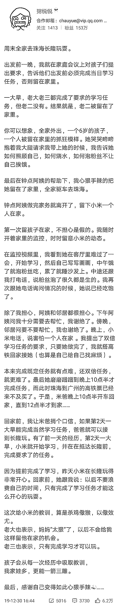

# 百万粉丝博主“惩罚六岁女儿”：她究竟是对的？还是错的？

> 原文：[`mp.weixin.qq.com/s?__biz=MzU0MjYwNDU2Mw==&mid=2247488021&idx=1&sn=42b3fe9d0e64374161f4f5b677605478&chksm=fb197e69cc6ef77f966817747c1d00b6fd29e3b449f0fa28a2c3bf305bd3b21a2b0d6be9f969#rd`](http://mp.weixin.qq.com/s?__biz=MzU0MjYwNDU2Mw==&mid=2247488021&idx=1&sn=42b3fe9d0e64374161f4f5b677605478&chksm=fb197e69cc6ef77f966817747c1d00b6fd29e3b449f0fa28a2c3bf305bd3b21a2b0d6be9f969#rd)

给大家看一个非常轰动的网络事件，截图如下：

网上的评论是沸沸扬扬，说什么的都有。

那些支持她的我就不说了，骂她的我也不说了，咱们篇幅不够。

站在我的角度上，作为一个父亲，我觉得这么做，很危险。

我孩子比文中的孩子大了一倍，而且是个男孩。他至今没有一个人独处过，哪怕是在家里。

我不是说我的教育方式是对的，我只是说，作为父亲，我完全能够想象这位妈妈把六岁的女儿单独留在家中，要克服的恐惧究竟有多大。

你会不停的想，万一她弄出点事怎么办，比如跌落，割伤，触电，......

事实上，你是来不及救援的，何况她居然敢驱车去另一个城市。

我想，这是她挨骂的主要原因。她是所谓的教育类大 V，读者被这位虎妈过激的教育惊到了。

所以你们猜我接下来要骂她么？

不是的。

我说过很多次了，我非常反感那些成天想要和我辩论对错的人。

对错太幼稚，属于我儿子玩剩下的，难道他老爹还会玩这个？

跳出对错，我们来展望下这些年见过的各种教育的案例。

我接触虎妈的思路是九十年代，那时候没有今天这样的网络。90 年代末你去网吧里，用的是 ICQ，你注意，不是 OICQ。

用 ICQ 和你聊天的往往是日本和韩国的女孩，去聊天室，和你聊天的基本上都是高校的女教师。

所以那时候教育只能从书上看，书基本上是台湾人写的，关于子女教育。

有个人，我忘了是谁了，好像做过日航的总经理，他聊过一系列对女儿的教育，很详细。

故事太长了，简单讲就是他对女儿的要求很严苛，从不惯她任何毛病。她小时候觉得爸爸太严厉了，但是后来长大了，这孩子也是读了美国的藤校，开始接触社会。

有一天，女儿回来跟爸爸讲，很感谢小时候爸爸对她的严厉。

因为她发现这个世界上很多人身上有太多毛病，或者说太弱了。以至于她非常容易，非常轻松的就能从一群人中脱颖而出。

她很感谢有这样一位爸爸，使得她今天有可能站在很不错的舞台上，够得到自己的梦想，而不是像很多浑身毛病的人那样，成年以后，只能活在唉叹之中......

大概就是这么一个故事，一位成功的父亲传授他的教育心得。

我那时候还是高中生，看了觉得挺好。

你注意，我觉得挺好是站在自我教育的角度上，而不是被教育。

事实上我打小没人用虎妈的方式教我，因为 80 后都是独生子女，不方便真下狠手。

我父亲倒是经常打我，但他打我的理由并不是教育，比如我小学放学回家的路上，一边吃东西，一边走路。

他看见了，打了我一路。他觉得这样不顾形象，非常丢人。

这其实不是教育，至少不是内在教育。

在他看来一个人只要谈吐风雅，形象气质佳，就是优秀的，反之，如果很随意，甚至有些邋遢，那就是该挨揍的。

这和我的观点差距很大，风度翩翩的也许是个蠢货，吊儿郎当的也许才是大哲。

至于其他人，教过我的很多，名校的高材生们，名校的教授们，教授们的老师们，全国第一，全省第二，等等等等。

但没有人能采用虎的方式，因为人家终究不是和你有亲，谁也不可能动手。

所以，是我自己动的手，自己对自己动手。

自己对自己下手的一个好处就是我形成了自我教育的概念，而不是教育他人的概念。

我从来都没有建议过任何读者，对子女，或者对下属采用我曾经对自己采用过的方法。

所以，在教育问题上，我一句骂都没挨过。

我通常都是这么说：你可以对自己有要求，但千万不要对别人有要求，别人指一切。

即便是自己对自己，也要掌握尺度，觉得 OK，就 OK，觉得不 OK，就收手。

我相信很多人听了会很舒服，这就像健身教练告诉你，我来练，您随意。

我不重复历史文章里对自己小时候的描述了，因为后来我看了都觉得不适合对着公众讲。

其实成年人虐待孩子，你看着是残忍；可如果一个六岁都不到的孩子在没有外力要求的情况下，主动对自己施虐，别人看着是毛骨悚然的。

这体现出这孩子的心性非常硬。

我们说人的心性似乎不是后天塑造的，有的人生来多愁善感，比如林黛玉，有的人生来没心没肺，比如薛蟠。

那自然也会有柔软的，也会有强硬的。

就像木头也分硬木，软木。特别硬的，比如紫檀，那就是古代的钢筋，你随便雕，下手可以要多狠有多狠，雕它的感觉跟雕钢筋一样。

但对着软木塞你可不可能用力？一使力，它就碎了。

自从前年开始就有人要我开投资训练班，要求了两年我也没搭理。

因为在别人身上下手，是要担风险的。

我完全有信心随时随地把我教的人送进精神病院，这是我太太对我的评价。我们 19 年前，就在一起了。很明显，她很清楚我的内心世界。

她不会让我去教儿子的，事实上，我自己也不敢。

我连对着下属，比如顶级名校的学霸，在狼性企业经过残酷的历练之后，千挑万选出来的企业战士，都没敢真下手去训练他们。

我曾经对着一个很胖很胖的下属，稍微施加了一点点压力，我是好意。心想着就算他不能上一个台阶，能瘦下来也好，起码有利于找媳妇。

没想到他崩溃了，直接辞职了，临走还去 CEO 那里告了我一状，说我比二战时的德军还那啥......

当然我们 CEO，没说我，反而跟他讲，其实那家伙顶多把他在你这个年纪时不到 1/10 的压力施加在了你身上......

甘蔗没有两头甜，如果你想出类拔萃，过程肯定没有那么美好......

我们跳出这个问题，来看一看教育的本质是什么？

我记得 80 年代时很流行说我们这一代人不如日本的同龄人，说的就是我这一代人，80 后。

那时候报纸上做对比，中日夏令营，日本的小孩很扛造，而我的同龄人纷纷落后了。

这个原因是什么？实际上是教育的侧重点引起的。

我参加的最后一次学校组织的远距离旅游，爬山，是初二的时候，后来再也没有了。

我是地理课代表，兼全年级课外活动小组组长，地理老师就是年级组长。最后一次爬山时分了两个队，他带一个， 我带一个。

结果他那个队里有个学生，别的班的，和一个同学自顾自跑掉了，在山上疯跑，往下冲，滑了一跤，连续摔了几个跟头，最后脑袋磕在一个突起的石头上，破了一个洞。

他的同伴没找到老师，找到了我们，救起他，抬到盘山公路边，找到一辆过路的卡车，让司机紧急送去医院的途中，已经没有呼吸了。

在车上就看着他的脑浆，一直在流。车上全是初中生，没有人有办法抢救。

到了医院，医生直接宣布，人一开始就走了，这起事故之后，再也没有所谓的一年三四次的野营探险。

别的学校也一样，收到上级通知，取消危险性旅游。

那时候我看报纸，隔壁的日本在更小的时候，比如小学阶段，就让孩子们参与类似我们初中地理课外组织才有的这种远途探险式旅游。

每年日本都会发生事故，都会有几个孩子出事，但他们从来没有取消过。

说句公道话，只要你探险，风险一定在。

我初中时另一次探险中，曾经企图跳到深水潭中间的石头上去钓鱼，没想到直接滑进了水里，没顶，还不会游泳。幸好鱼钩在我手里，鱼线在另一个人手里，他手中线瞬间拉出去很远，他回头看，才发现我不见了。

如果没有侥幸，我也可能溺水。这是一切探险活动不可避免的风险。

你说到底哪国的策略好呢？

答案就是没有标准答案。

很显然，日本人想清楚了，要提高体能，要增加探险精神，就得冒险，冒险就有风险，总有几个孩子会出事，这是你必须承担的成本。

这叫盈亏同源。

很显然，我们也想清楚了，我们不愿意冒险。因为 80 后都是独生子女，冒不起，所以取缔了组织学生去参与有风险的课外活动。

你看到了么？这才是标准答案。

你能得到什么，从一开始就决定了。

大家互相骂，什么也骂不出来了，任何事，有得就有失。

小日本求仁得仁，他们每年都会损失几个孩子，以此换取了夏令营中胜过我们的身体素质。

我们输掉了夏令营，但规避了风险，避免了悲剧。

你看到了，双方都得到了自己想要的。

这个虎妈，她怎么做，是她的事儿，这是她的选择。

也许有一天，她的闺女会在清华傲视的看着同辈，就像那位日航总经理的闺女跟她爸的答复。

但是也有可能，她的闺女中途没有扛住，在长期的训练中，成为了不幸的那几个。

都有可能。

我选择这样的教育方法。孩子成长过程中的体验也许挺不错，他有一天也许会跟我说，虽然自己不怎么优秀，但还挺幸福的。

但是也有可能，他长大了会怨我。他有可能错失心爱的姑娘，他有可能发现自己的实力够不上理想。

都有可能。

没有对错。

很多人老觉得有一条正确的路适合所有人，事实上没有。

你让那个健身教练举杠铃，他可以站着举，可以躺着举，可以蹲着举，可以用手举，还可以用脚举，你服气不服气？

起作用的是他这个人，是他那一身的肌肉。

他那一身的肌肉难道是讨论出来的么？不是，是他练出来的。

他不停的试，受伤，试，受伤，最后成了健身教练嘛。

有没有不受伤的运动员？没有的。

你要是不想受伤，就不要提那么多要求，要学会降低预期，安耽就好。

就像我对我儿子说的那样。

我只负责对你施加能够让你达到平均水平的那一点压力，剩下的，靠你自己。

你记得一件事就好了，生命中那些稀缺的东西，都是明码标价的。

你想要，不可能不付出代价，你想要，不可能不承受风险。

这就叫盈亏同源。