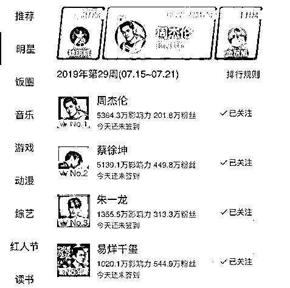

# 这个世界足够大，同时容得下周杰伦与蔡徐坤

> 原文：[`mp.weixin.qq.com/s?__biz=MzU0MjYwNDU2Mw==&mid=2247486972&idx=1&sn=5f724b29fea0b342ef28a9fcd6c48565&chksm=fb196180cc6ee896078cbe374caf5ded03c02ff7a7d257976233c99927b41343c8229cbf5896#rd`](http://mp.weixin.qq.com/s?__biz=MzU0MjYwNDU2Mw==&mid=2247486972&idx=1&sn=5f724b29fea0b342ef28a9fcd6c48565&chksm=fb196180cc6ee896078cbe374caf5ded03c02ff7a7d257976233c99927b41343c8229cbf5896#rd)

我们号的编辑一直希望我能够回复一期，回复那些不喜欢我的文章，又坚持每期必读的，特殊的读者群体，俗称黑粉。

我答应了，但没有机会，因为专门为这个事儿去写，太浪费版面，毕竟绝大部分读者，不需要这种答复。

可巧，机会送上门来了，周杰伦与蔡徐坤有了一场打榜之争。

让我们从 7 月 16 日开始说起。

当天，有位网友在豆瓣上一本正经地真诚发问，千言万语汇成一句话：“超话排名低，转发不破万，数据差成这样，周杰伦真有那么多粉丝吗？”

周杰伦当然不可能没有粉丝，只不过他的粉丝都老了。

比如我。

说实话，我看了这张截图，只认识两个人，周杰伦和易烊千玺。

认识后者的原因是我正在看《长安十二时辰》。

据说导演组是因为他有流量才让他演李必，但很遗憾，我是看了电视剧，才知道有这个人。

至于剩下的，别说蔡徐坤是谁我不知道，我连这世上有“超话”都不知道。

但这不表示人家超话做的不好，也不表示那些明星不好，只是因为我老。

我了解周杰伦是很正常的，因为极少的几首我能够从头哼到尾的歌里面，就有他的。

比如《青花瓷》。

尤其熟的是其中两句。

天青色等烟雨 ，而我在等你 

炊烟袅袅升起， 隔江千万里

我知道罗永浩抨击说他的歌词写的不好，狗屁不通。

这一点不奇怪，年龄不同。

也许罗永浩觉得例如像“吹起小喇叭，哒嘀哒嘀哒，打起小铜鼓，得龙得龙咚”，这样的歌词才入得了他的法耳。

当然这歌词写的确实是好，虽然年代久了一点，这是冼星海作词作曲。

十一年前，我是个工程师，给音频模块写驱动，那时候调试驱动，用来测试的音乐就是周杰伦的《青花瓷》。

大半年的时间里，我一天听几十遍，所以至今我脑海里随时响起《青花瓷》，一点都不奇怪。

你看，我很诚实。

我告诉你，我是周杰伦粉丝的原因只是凑巧。

虽然据我妈说，我胎教的时候听过无数经典钢琴曲，但自我懂事起，就五音不全。

所以我说周杰伦歌好，词好，不代表权威，这就是我个人的感受。

一首歌每天几十遍，而且大都是只听片段，重复大半年，我也没觉得厌烦，这一点，起码说明他的歌确实挺耐听。

像我这样人到中年的粉丝，周董有很多很多。

就像在周董还是个找不到饭辄的初出茅庐的小子的时候，我们还是他的老板，吴宗宪的粉丝一样。

虽然我估计今天的孩子们都不知道吴宗宪是谁。

中老年粉丝团不满于小年轻如此羞辱自己的偶像，一怒之下就把周董送上了超话的榜首，还上了热搜的头条。

我无意于帮助中年粉丝们再添一把火，去诋毁那个我都不知道是谁的蔡徐坤。

我不了解，自然没有资格评论。

讲这个新闻的目的，其实就是为了答复我们号里的那些坚持不懈的黑粉。

我们的日常运营工作是编辑在做，换句话说，您的所有留言，消息，都会由他先行预处理。

只有处理过的，我才有机会看到。

这就是为啥有些黑粉很愤怒，因为他们很努力的坚持天天骂，骂了一年之久，但是不见我回复。

这一点我必须道歉。

因为你没有被编辑遴选出来，我自然无从得知，无从得知，你让我咋回复。

那你说这个制度有问题么？这个制度没毛病。

首先，你得弄清楚我的时间安排。

我是个投资人，绝大部分时间得花在市场上，而且我还有全职工作，剩下的时间都得花在工作上。

那么我是用什么时间写稿呢？

每天开车去公司，以及回家的路上。

我在开车的时候，用录音的方式，把想要表达的内容，录成语音，再由编辑转换成文字。

所以你每天读到的内容，严格来说是我讲的，不是我写的。

打字，编辑，修修补补，排版，这些有专人去做。

那么再其次，我回复那些被编辑遴选出来的留言的时间，大都是抽空。

所谓抽空，就是韩愈说的，马上，厕上，枕上，那些零散时间。

你明白了我的时间分配，就知道，为啥想和我辩论，想了一年都没成。

原因很简单，你对我，不重要。

听了这话不要生气，因为我对你，同样不重要。

我们是对等的。

我们的人生里有太多事要做，就像我，恨不得一秒钟掰成两半用。

如果我有时间，我得先处理交易上的事情，再处理工作上的事，最后陪完家人，剩下的，拿来处理公众号上的事。

而处理公众号上的事，又分写作和运营，我只写作，就是为了节省时间。

而写作，我也没有整块的时间可供分配，所以只能在开车的同时，分心去做。

你看到了，我的时间是按照重要性等级，依次分配的。

假如我是读者，我读到了一篇文章，我觉得它狗屁不通，那么第一时间就不看了。

我无法想象一个人把一篇狗屁不通的文章硬是读完，还天天读，还写心得，还硬是要企图说服那个写这篇狗屁文章的作者。

找不到他，还天天找，日日找，缠着编辑找。

我不会干这种事的，因为不符合按照重要性的优先级分配时间的原则。

就像蔡徐坤，我到现在为止，都不知道他是干嘛的，是歌手，是演员还是别的。

但我需要知道么？不需要。

我不需要知道他，就如同他不需要多我这个粉丝一个道理。

世界非常大，容得下不同的人，不同的爱好，不同的思路。

这个世界上，优秀的人才如同恒河沙数，如果每个我都要认识，认识的过来么？

同样，这个地球上有 70 亿人，如果每个像我一样的人，蔡徐坤都非要说服我喜欢他，那么他，说服的过来么？

你想想，难道我是被周杰伦说服成为粉丝的么？

我了解周董的歌，仅仅是个意外。

假如当年公司里的音频测试文件用的不是周杰伦的歌，比如是邓丽君的歌，那我恐怕就成了邓丽君的粉丝。

你看到了，这叫做邂逅。

邂逅周杰伦的歌，是一种缘分。

碰巧这个邂逅带给我美好的体验，那我就记得了。

如果不美好呢？那我就忘记了。

你看，我是不是很现实？

我希望我的每一分钟，每一秒钟，都花在刀刃上，而不是白白的浪费掉。

这句话对每个人，都适用。

我们每个人来到世上，都有无数人在为自己节省时间。

比如我们这一代人很少自己做饭，都是买来吃，为啥呢？做饭太慢了，花不起那个时间。

那谁替我们节省的时间呢？厨师，服务员，快递，乃至很多很多。

再比如工作，很多年前我做到架构师开始，就很少自己写代码了。

更多的是我告诉人家要写什么，写成什么样。

再到后来做产品，我告诉人家要做什么，做成什么样。

也就是说，你做的每一件事，都有很多人围绕着你的思路在执行，在落实。

就像你看文章，你听到的这些话是我说的，可是那些边边角角，打字排版的具体工作，都是别人做的。

他们在做什么？在节省我的时间呀。

很多年前我开始做管理层的时候，就发现自己的兄弟们可能花了一个小时，就为了替我省出五分钟。

这么多人的工作，这么多人的努力，节省完之后，留给我的时间，是希望我用好它，而不是浪费它。

这是你身边每一个人，对你的期待，也是对你的要求。

如果我把这些人为我节省的时间随意的浪费掉，浪费在和别人斗嘴上，我对得起他们的付出么？我难道不愧疚么？

我有这样的压力，所以倍加珍惜时间。

如果我有空，为啥不做一点有意义的事情呢？

就像我写篇，或者叫做讲一篇文章，它如果能够让更多人觉得有价值，那我就觉得，值。

我去和一个不喜欢自己的人斗嘴，意义是什么呢？

即便不说我辜负了身边这么多工作人员的付出，辜负了他们的时间，仅仅从斗嘴这件事看，也浪费和我斗嘴的那个人的时间呀。

他的时间，难道就不是时间么？黑粉的时间，难道就不重要么？

我们每个人的时间，都非常昂贵，尤其是今天。

你不要认为某些人就闲的蛋疼，其实只是他们暂时没醒悟。等他们一旦醒悟了，马上会理解自己曾经的行为浪费了多少宝贵的时间。

这是一个所有人的认知都急速在奔跑的时代，没人有功夫闲下来与别人斗嘴，除非你选择自我放弃。

我希望我们的读者里，没有这样的人。

这个世界非常大，容的下无数个蔡徐坤，容的下无数个周杰伦。

并不是说蔡徐坤成功了，就会导致周杰伦的失败，不会。

我希望所有的蔡徐坤们都越来越好，就如同所有的周杰伦也越来越好。

当然，我更希望所有的读者们，越来越好，包括那些孜孜不倦的黑粉。

我今天讲这些话，主要是给他们听的，我不是想告诉他们，我对了，你错了。

就如同我不认为蔡徐坤和周杰伦里面有好与不好，在我眼里，都好。

同样，在我眼里，没有对与错，没有单赢，我希望大家都对，我希望双赢。

但这个对的前提是你自己是不是觉得自己越来越好，你的时间是不是越来越金贵。

如果是，那就不会浪费时间在一个自己不喜欢，对自己也不重要的人身上。

不是说只有关注我，认同我的那些人才对。

对那些所有讨厌我的人，我同样深深的祝福你们。

珍惜自己的时间，做更好的自己，我始终希望所有人，都越走越好。