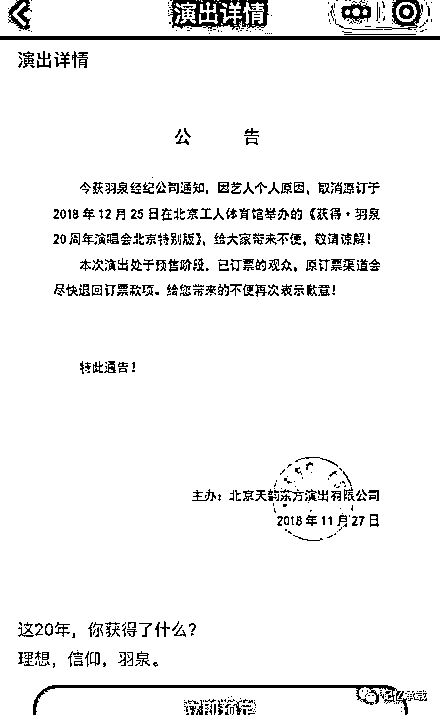
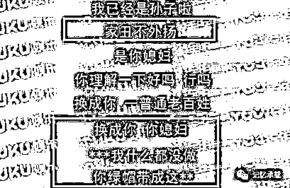
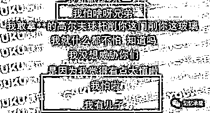

# 吸毒被抓的陈羽凡与布拉德的中年危机

> 原文：[`mp.weixin.qq.com/s?__biz=MzU0MjYwNDU2Mw==&mid=2247485283&idx=1&sn=f8ec6eaf09eabba70699173b72560eeb&chksm=fb196b1fcc6ee20910e038d4393f5bdb9a20a29f866d742cde8fe85c11c6ea17d99768a55c09#rd`](http://mp.weixin.qq.com/s?__biz=MzU0MjYwNDU2Mw==&mid=2247485283&idx=1&sn=f8ec6eaf09eabba70699173b72560eeb&chksm=fb196b1fcc6ee20910e038d4393f5bdb9a20a29f866d742cde8fe85c11c6ea17d99768a55c09#rd)

按说这俩事没有任何关系，前者是一条新闻，后者是一部电影。

但愣是被我安在了一起。

陈羽凡 26 日吸毒被抓，羽泉演唱会 27 日宣布取消。

11 月 26 日，有 43 岁男性歌手同 25 岁的女性何某一同因吸毒被拘留。“平安北京”转发该微博并用羽·泉经典歌名配文：“毒品，让‘最美’凋零”。

随后，11 月 27 日，主办羽·泉 12 月 25 日工体馆演唱会的演出公司“天韵东方”就已发布一张官方通告，通知“因艺人个人原因”，12 月 25 日的工体演唱会确定取消。并开始安排歌迷退票事宜。

这一天离白百何的出轨，过去了一年半。

平心而论，我不愿意像其它公众号一样去抹黑，攻击陈羽凡，因为任何事情有果，必有因。

陈羽凡父亲曾经在报纸里以第一人称描述过，由于父母工作繁忙，陪伴孩子的时间很少。小时候，陈羽凡主要由姥姥照看，与亲戚家的几个兄弟姐妹住一起，自己作为父母感到很愧疚。

我不知道这一点如果成龙看到会做何感想，因为我看过他很多的采访。他常在媒体里说，他的儿子房祖名含着金钥匙长大，但是他同时也说，自己很少见到儿子，也很少给他通电话。即使偶尔通电话，也只是骂回去。

我不是想说陪伴是最好的教育，但是一个没有陪伴的童年，显然不是好的教育。因为，孩子会觉得，自己没有受到重视。

陈羽凡不仅有一个不怎么完美的童年，他成年后，日子也并不好过。

用他自己的话说。

一个男人被反复的带绿帽子，显然是痛苦的，但更痛苦的是狗仔队不停的追。

直到他怕了，说：他有儿子。

不幸的童年，失败的婚姻。这就是他的前半生。

当然，这不能构成吸毒的理由，吸毒显然是错的。

但值得我们大众从中吸取的教训是什么呢？

我知道有很多读者在想什么，很多人都会觉得，明星吸毒是因为他们有钱。

有钱，为所欲为。

这就是为啥我把电影《布拉德的中年危机》放在了标题的后半段。

布拉德是一个美国的中产阶级，他 47 岁了，运营着一家非营利组织，妻子是政府工作人员，儿子马上要面试哈佛大学。

他发现昔日的同学们：

有的成了著名导演，和很多美女明星在比佛利山庄的豪宅里开着泳装 party.....

有的商业成功，开着自己的私人飞机，在飞机上与属于自己的空姐调情......

有的买下了一个小岛，和两个性感热辣的女朋友生活在一起......

还有的，为白宫工作，经常上电视，以公众人物的姿态指点江山，和自己一起聚餐的时候，冷落自己的女招待还对这位名人同学屡屡抛媚眼......

而他自己，则生活在一帮不求上进的人群中，妻子也满足于当下的生活.....

这电影很真实，没有回避人性中不光彩的那些欲望.....

人有很多欲望，绝大部分人，都是因为没有钱，所以被压抑着欲望而已。

比如布拉德，你看他，虽然身为慈善组织负责人，其实他内心深处有很多欲望通过电影镜头表现了出来。

比如，他想要同时和两个异性生活；

比如，他想要和一群泳装美女嬉戏；

比如，他想有一架私人飞机，想有一个自己的岛屿，想要像国王一样，为所欲为.....

他认为，这一切，只是因为他选择错了道路，他没有像同学们一样运作商业社团，而是做了非营利机构。

但是，如果他有钱了，这一切，就真的都能发生么？

看了电影的我觉得，以布拉德的性格，恐怕不能。

因为电影里他的性格体现出他一直生活在一个温暖的环境里，爱的力量，敬畏心，最终一定能够束缚他，即便他有了很多钱。

如果我们把吸毒也比作是所有邪恶欲望里的一种，你就理解为啥我会把这两件事同时放在标题里。

一个人，你想让他从来没有过邪恶的欲望，是不可能的。

哪怕圣人孔子，他内心深处也一定曾经闪过不道德的一面。

我们说一个贪官和一个清官，其实都贪财，其实都好色。

知道区别是什么吗？

是前者迈出去了，后者没有。

你想让他永远不迈出那错误的一步，靠的，并不仅仅是没有钱。

我们会发现这个世界上，有人有钱，很荒诞，比如《华尔街之狼》里小李子演的那个交易员。

他简直就是一只野兽，他的办公室里，公司里，家里，除了性与毒品，其它啥都没有。

这电影的原型是谁呢？就是华尔街著名的金融诈骗师，乔丹·贝尔福特。

他的父亲马克思酗酒吸烟，专横独断，母亲玛丽则野心勃勃，而他本人，个子矮小，样貌平平，并不招人喜欢，甚至会受人嘲笑。

这就是他生活的环境。

有没有发现什么相似之处？

富翁家的房祖名，大院里的陈羽凡，平民家的布拉德.....

**如果一个孩子，从小缺乏爱，缺乏榜样的力量，无论他出生在什么样的家庭里，他都会甚少敬畏心。**

因为，他觉得，他不欠这个社会什么。

我们说，要约束一个人，要在他年幼的时候，而不是在他成年以后。

一个人，在年幼的时候，是无助的。

如果环境给到他的是爱，是关怀，是帮助，是以身作则，是榜样的力量。

那他终其一生，都会心怀感恩；都会心怀敬畏。

因为所有的榜样，无论是否在世，都会活在他的身边，给他立下做人的规矩，立下做事的规矩，使其终身不敢逾越一步。

理解这意思么？

不是没有能力逾越，而是心中的愧疚感，背后如芒的目光，会让他难以逾越。

但如果反过来，在他幼年的时候，不给他榜样的力量，不给他关怀，教育，引导，甚至，给他坏的榜样。

那么，他也不见得就能折腾出多大动静。

因为，没钱嘛。

可是，一旦，他有了钱，你觉得，靠什么力量，还能束缚这个心中没有感恩，没有敬畏的成年人呢？

这里是大号，欢迎关注小号：记忆承载 2。

原创不易，转发的人运气会更好！