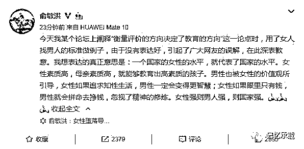

# 我们来窥视下俞敏洪的内心世界

> 原文：[`mp.weixin.qq.com/s?__biz=MzU0MjYwNDU2Mw==&mid=2247485216&idx=1&sn=e32530b4f9283a7119c7fffae48013b7&chksm=fb196b5ccc6ee24aa4d6a4878cb7d146b39b9ccc74430f92733c1e7ac1165434deeadd640bcd#rd`](http://mp.weixin.qq.com/s?__biz=MzU0MjYwNDU2Mw==&mid=2247485216&idx=1&sn=e32530b4f9283a7119c7fffae48013b7&chksm=fb196b5ccc6ee24aa4d6a4878cb7d146b39b9ccc74430f92733c1e7ac1165434deeadd640bcd#rd)

上上一期我们在大号：记忆承载里聊

[惹恼了全国同胞的俞敏洪](http://mp.weixin.qq.com/s?__biz=MzU0MjYwNDU2Mw==&mid=2247485201&idx=1&sn=33804b7f1fdb3a59eb0b196ea7869481&chksm=fb196b6dcc6ee27b25388e10913c9eae9bb8f623a7e1f43c5ecedd631364ae849d592303dbbb&scene=21#wechat_redirect)

我们聊了俞敏洪不正确的言辞引发的一系列的讨论，最后得出的结论是，别去理睬他的逻辑错误，我们要做更好的自己。

上一期在小号：记忆承载 2（欢迎前往关注）里聊

[俞敏洪：爱钱导致堕落，那什么导致的爱钱？](https://mp.weixin.qq.com/s?__biz=MzU2MjM3NDE3NQ==&mid=2247484140&idx=1&sn=831cf22a9a8a7836ad1e8ebf8c4e09cb&chksm=fc6b319ccb1cb88aaba8255ba9b237bd7942bccc58d8b2b62b16edaab4cd32b7e5617abce459&token=700475301&lang=zh_CN&scene=21#wechat_redirect)

我们聊了就算按照俞敏洪的思路往下推理，如果爱钱导致了堕落，那什么导致的爱钱？

这一期，我们来窥视下俞敏洪的内心世界，猜猜看，到底是什么让他对女性的目光如此的在意。

俞敏洪对自己的不当言辞做了一番回应。

但这个回应还不如不回应，越抹越黑。

我很好奇俞敏洪为什么对此事感受如此之深。好奇之余翻看了下俞敏洪的采访。

俞敏洪曾经在接受一个采访时说：

“他的妻子杨佳青开始对自己的生活状态不满意，那个时候对俞敏洪常常有很多的抱怨。

也是因为妻子的抱怨，所以才让俞敏洪有了创业的想法，俞敏洪表示自己创业成功之后，老婆对自己温柔多了，再也不唠叨自己，骂自己了。”

这是一个什么样的抱怨呢？

在另外一个采访中俞敏洪给出了答案： 

“当年在北大留校教书时，和同为教师的妻子经济拮据到只能买菜市场的“死鱼”吃；

俞敏洪也不止一次被妻子唠叨，不能像自己的那些同学那么成功。 她一直希望丈夫能够到海外深造，并为此倾注了满腔热情。

但最后，俞敏洪终究没能出国留学。 

仅仅是为了让妻子少一点埋怨，生活的更好一点，俞敏洪开始在外兼职给人代课，意外找到了自己事业的起点。 

当他拿着兼职挣来的外快第一次为妻子买了活鱼，让妻子吃好一点的小梦想成真时，妻子的心被彻底融化了，从此对俞敏洪无限温柔。

俞敏洪笑称，这都是吃上活鱼后，才有的待遇啊。”

这可真是一条鱼引起的新东方。

俞大佬年轻时，居然还有连条活鱼都吃不起的岁月，那太太抱怨其实很正常。

凭良心说，这个不能得出女性爱钱的结论。一条鱼而已，这能说明什么呢。他太太要是真爱钱，就不会嫁给他了。

只是也许作为一个男性，每天被老婆抱怨，久而久之，心里形成了阴影，后来恰好有钱了，这个抱怨消失了，这种阴影经过多年的发酵，最后得出一个女性其实是爱钱的潜意识。

我估计，他的关于女性爱钱，通过爱钱推动男性赚钱的潜意识，就是这么来的。

这其实不能完全怪他，他是 62 年生人，生在一个物质贫乏的时代，这是时代背景导致的。

人有什么样的经历，往往就有什么样的认知，这是很难改变的，谁都跳不出自身的视野，这是共性，不只有俞敏洪这样，我们人人都是一样的。

没有人能见过所有的女性，所以就没人能够得出统计数据。只能见仁见智。

我生的晚，所谓赶上了好时代，没有经历俞大佬那种物质贫乏的岁月。也就没有那么深的觉得他说的所谓女性特别的爱钱。

但我的体会是，女性相对于男性，确实更喜欢抱怨。

说一个自己的故事。我做高频交易有十年了。

最初的时候，每天下班回家就在电脑上操盘交易，一直到深夜 2，3 点。

期间还戴着耳机，因为有时在听某位指导我的老师的音频对话，他是华尔街前交易员。这在以前的文章里都有聊过那段岁月，老读者尽知。

我太太当然很有意见，意见就是我下了班也不说话，埋头交易，不理她，而且一忙就是很晚。

半夜三更，尤其是冬天，一个冷冰冰的身子钻进被窝，还把她吵醒了。

而且做交易这件事情，尤其是高频、重仓、大杠杆的交易，是需要注意力非常集中的。我动辄一个指头点错了，那也许就真的损失惨重。

所以我经常告诉她，跟我说话，要预约。定个时间跟我说话，不在限定时间内，不要跟我说话，以免打扰到我，造成不必要的亏损。

她显然很难完全做到。经过几次被打扰引起的亏损，我就想了一个办法。

我一下班，吃完饭，就跑去楼上最拐角的书房里，关上门，一个人，静静的操盘，直到深夜。

那我太太当然意见更大，用她的话说，白天见不着你，晚上，你躲起来，不允许别人跟你说话，你干脆娶电脑当老婆好了。

当然，只有交易日这样，周末，我还是正常的。

如果让我回忆这段经历，显然，我的结论是太太不怎么爱钱。

她很多次的表示过，她不喜欢这种赚钱的方式，哪怕我稳定盈利了之后，她仍然持反对态度；哪怕这件事成为家庭主要收入来源的时候，她仍然坚持反对。

她很反感看到我在任何时候都在交易，在家的时候，旅游的时候，陪孩子玩的时候，甚至跑到迪斯尼乐园里，我还在低头交易。

她觉得这一切影响了她的生活质量，她觉得我们两个人毕竟都有收入不错的工作，也有其它被动收入，根本没必要去赚这份多余的钱。

她甚至曾经去我父母家告状。

但我太太靠抱怨能解决这个问题么？

当然是不能的。

这个道理，我曾经多次解释给她听。

每个人，总有自己喜欢的事情。如果我喜欢做管理层，那我每天在天上飞，每天晚上应酬饭局，你也见不到我。我有好些年就是这样度过的。

解释自然是无效的。

那这个事情，在长达十年的过程里，是怎么解决的呢？

是通过技术手段。

我一点点的改进算法，改进交易模式。从搞到晚上凌晨 2，3 点，到晚上 12 点，到晚上 11 点，乃至最后和太太同样作息时间，不到 10 点就睡了。

从戴着耳机一个人躲进书房里，到不再介意被人打扰，再到每天晚饭后陪太太看言情剧，犹如正常人一样。

最后，我太太几乎感觉不到我在交易了。在她眼里，我就是在陪她看电视。

虽然，实际上，交易从没有停止过。

解决问题，靠的是技术手段。

就像人类从呆在田里劳作，到最后按一个按钮，机器人自动播种、收割，贩卖。

这是靠抱怨能解决的么？

不是。

这是靠技术演进。

假如我也是一个爱抱怨的人。我也可以找到各种说辞。我从一开始就是盈利的，尚且还要受到如此多的抱怨。那那些亏损的投资人，他们的太太岂不是要把他们捏死？更何况市场本来就是波谲云诡的地方，我既要面对巨大的市场压力，还要应对她的抱怨。她非但不体谅我，反而成为阻力，成天告诉我，别玩了，别玩了。

那最终的结果是什么？只能是夫妻不合，为此吵架。

正因为我足够理智，不去做无谓的争辩。所以才吵不起来。这叫做一个巴掌拍不响。

平心而论，我太太曾经有过的抱怨，都是合理的。因为我毕竟因为自己的爱好侵犯了她的权益。

但是，我们反过来想想看：抱怨有没有产生价值？

当然没有。

在那些年里，我希望听到的是她建设性的问我，有没有办法通过技术改良的方式来不要影响她的生活，而不是一味的劝我放弃。哪怕是她给我一个限定整改的期限，都好过无谓的抱怨。

当然，我没有责怪我太太的意思。

因为在我见过的所有女性同胞里，她不属于爱抱怨的那种，比她严重的有的是。

我曾经误以为女性同胞里有些人不爱抱怨。

但我后来发现，那只是职场里的假象。

比如，你在公司里，如果你是老板，你是领导。那你通常会发现女下属不会抱怨。

她们永远表现出“好的，对的，是的”的那一面给你看。

你就会产生错觉，觉得似乎自己娶错了人，是个不幸的男人，碰巧遇见了最爱抱怨的那个女人，如果你运气稍微好一点，就会娶到一个不抱怨的。

但这不是真相。

如果你和她们做过同事，或者你侧面的通过第三方去了解下。你马上就会知道。这些永不抱怨的职场女性，只是在自己领导面前不抱怨而已。

她们回到家中，面对丈夫，或者面对朋友，统统会表现出另一面。

比如加班是不是多了，比如股份是不是给的少了，比如薪水是不是开的低了，比如工作分配的是不是不公了........

但如果是男同事，相对来说抱怨的就会少一些。

你注意我的措辞，男性里面喜欢抱怨的也有很多。

只不过整体上看，男性群体里面爱抱怨的少一些，仅此而已。

这只是我的人生经历里的看法，如果你出生在不同的国家，不同的民族，不同的环境，可能结论就完全不一样了。

如果站在我的经历里看问题。

能得出的结论是什么呢？

男人不喜欢抱怨，男人群体里抱怨的少。

问题是，我总不能娶个男人吧。

这是其一。

其二，有时候，身为男性不喜欢听女性抱怨。跟她讲道理，她也不听，也不愿意建设性的讨论问题。

那怎么办呢？

没有办法的。

独自承担压力，去想办法解决问题。这才是有建设性的方案。

我看过《寿司之神》的纪录片。说实话我对小野二郎太太的钦佩还要超过对他本人。

小野先生捏了 70 年的寿司，每天临晨 4 点就去店里捏寿司，晚上 12 点才回家，做梦都在捏寿司，你要知道，他可是开餐饮店的，一年 365 天寒暑无休啊。

他太太得有多大的意见啊，他是怎么熬过他太太的抱怨的呢？这才是我纳闷的问题。

年轻的时候想这种话题，一定会以为他很幸运，娶了一个温柔，听话，善解人意的太太。

但如今你再让我想这种话题，我肯定会认为，这里面一定有小野先生自己的努力，他一定从某种程度上化解了太太的抱怨。而不是真的指望对方彻底理解他的所谓寿司梦。

这就是我文章里常说的一句话：

**改变自己的成本，比改变别人的成本低的多**。

我们活在世上，就难免听到抱怨。与其去争辩，或者指望对方改变，不如，自己想办法改变。

当然，男性其实也挺不容易的。

你看电影《叶问》，里面的叶问好像很风光，佛山第一高手，但实际上呢，电影里他太太多次甩脸色给他看，抱怨他：“练拳，练拳，就知道练拳......”

叶问心里显然不可能舒服，只是默不作声尴尬的笑笑而已。

其实人与人相处，还是要多一份理解，人与人最好的关系，是彼此成就，而不是彼此相怨。

这里是大号记忆承载。本篇是俞敏洪事件系列的第三期，第四期请关注备用小号：记忆承载 2。同一日推送，敬请自行前往查看。

原创不易，转发是最好的支持！