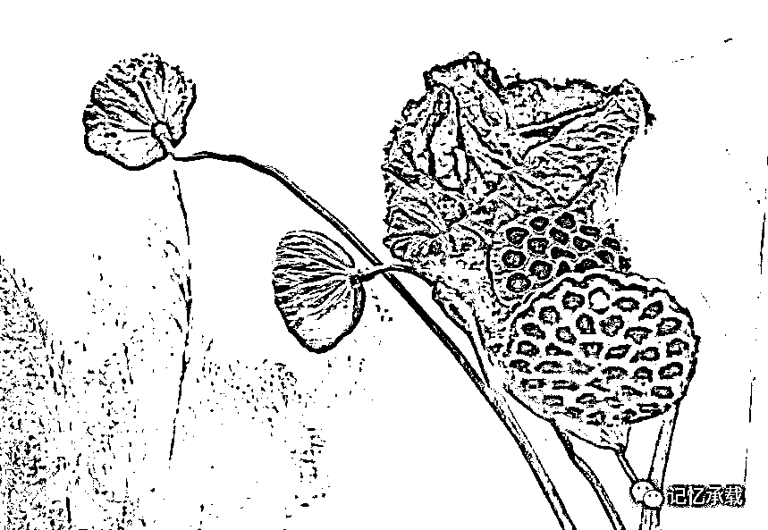

# 论中兴事件之人间百态为什么会被删

> 原文：[`mp.weixin.qq.com/s?__biz=MzU0MjYwNDU2Mw==&mid=2247484124&idx=1&sn=60da5ce050db1dd1cfb4a4b6ee43c756&chksm=fb196ea0cc6ee7b644d3bd30e25dfdde13946a29f064538dbe8ffefc4cdfdbe7469cc84c7753#rd`](http://mp.weixin.qq.com/s?__biz=MzU0MjYwNDU2Mw==&mid=2247484124&idx=1&sn=60da5ce050db1dd1cfb4a4b6ee43c756&chksm=fb196ea0cc6ee7b644d3bd30e25dfdde13946a29f064538dbe8ffefc4cdfdbe7469cc84c7753#rd)

4.21 号的《中兴事件持续发酵下的人间百态》最终定格在 26932 的阅读量上，被网监删了，理由是投诉过多。并且本号被勒令停止群发功能一周，以示警告。虽然第二天国资委就发文痛批中兴的愚蠢处理方式，以及痛斥国内的科研环境，并指出问题的根源是生活成本高企科研人员无法安心工作导致的。内容和本号严丝合缝。但是很可惜，有的人说话，一万句都被删，有的人说话，一句顶一万句。

就我知道的就有 10 多个号在转载这篇文章。而且很多破 10 万+。说实话我完全不理解为什么它会这么火，我后来仔细阅读了八遍原文，似乎我只是聊了一个技术人员成天聊烂的话题，就是心态太浮躁，没法静下心来踏实做事，而 BOSS 们更浮躁，忙着建科技园，炒消息拉股价，也不允许你静下心来踏踏实实做事。

这有啥好热的呢？这不是很正常么？我工作十二年来，一直如此。

后来和朋友聊天，似乎知道了答案。应该是评论引起的，评论后来我一一看过去了，有 567 条之多。**其中 90%的人在说同样的意思，大概就是认可文章说的事情，并指出是根源是资金十几年来一直在流出实体经济，忙于炒作，导致的结果生活成本越来越高，而生活成本的提高反过来又迫使所有人被卷入这个炒作的游戏，从而越演越烈。**而另外的 10%的留言主要是针对作者，大约就是以下几个意思，作者是喷子，作者是卖国贼，作者是美帝走狗，作者是日本奴才，是文革余孽的狗崽子云云。（其实这也很奇怪，同样的内容，国资委发文就不见人骂了，看来骂人者并不是完全相信自己的三观，也是看人下碟的）

先说我的态度，其实我是认可被删的。因为昨天被删前我一直在线关注，如果不删，以最后晚上急速增长的百分比来计算，它可能被群发数百万甚至更多。我因为没有经验，把最初上百条评论都加精了。我看到后来转载我的号反而没被删。因为他们没有放出那么多评论。而这些评论导致讨论越演越烈，最后偏离我的主题。

所以网监果断的删除了，其实即使它不要求停止群发功能一周，接下来我也不会让它扩大化的。因为我自己都被汹汹民意吓到了。

我为什么这么说呢？是因为消息的传播是一个越传越走样的过程。你可能只是在说一个浮躁问题，最后传了几十万之后的留言已经不知道在讨论什么了，这样是很危险的。

我本人已经奔四了，不是什么年轻人，更不是愤青了。我经历过很多很多事，深知做事的艰难。所以并不认为凡事用立场问题，用情感取向，就能够解决。我的观点有两点。其一，事情是很复杂的，它有很多维度。其二，人是更复杂的，他有更多维度。

能看到这条博文的应该就是我们新加入的粉丝了。从第一篇一直追到 4.21 日的粉丝其实就几十个到几百个而已。也就是说，只有极少数的读者是从头到尾知道本刊宗旨是什么，到底聊什么，以及作者大约是个什么样的人，有什么样的思想。而 4.21 日之后加入的这么多近乎上万的粉丝恐怕都只是因为一篇文章。

所以，我有必要用一期来阐述清楚我的基本价值观和世界观。因为你关注的前提就是大家三观一致，不一致你看起来也痛苦，我解释起来也难。

**第一个话题：人是极其复杂和多面的。**

首先作者不是美粉也不是日伪。碧树西风这个名字是我大学里的 QQ 号，虽然号后来被盗了，但是名字被我拿做笔名了。

王国维在《人间词话》里讲人生有三个境界。第一个境界是昨夜西风凋碧树，独上高楼望尽天涯路。

我大学里很彷徨，很迷茫，有太多疑惑，欲寄彩笺兼尺素，山长水阔知何处，我不知道写封信寄到何处才有人为我解答，所以才取了碧树西风这个网名。

所以，不要觉得四个字就是皇协军。其实近代汉字大部分都是胡适那一代人从日文中吸取来的，比如组织，政府，革命，党，方针，政策，都是来自近代日文。如果您要以文字为日奸与否的定位，那很遗憾，您琢磨咱们国家的政府又该如何被定义呢？

接着我们讲出身，原生家庭对一个人的影响是巨大的。我也不例外。我不是文革余孽，我是 80 年代初生人。我在最早期的文章里就提过，我读大学前生活在省军区家属院里，但是听美国之音长大。两种冲突的思想交叠在我脑海里，我没有觉得什么一定是对的，什么一定是错的。而是学会了思考。

思考的结论就是人是一种复杂的生命。

我不想曝露家人隐私，但我可以拿我外祖父论证我说的人是一种极其复杂的生命，他本人都已经被记录在县志里了，我成年后在网上可以找到，所以严格讲，他本来就没隐私，拿来举例但说无妨。

我外祖父出身在一个贫苦家庭，青年做了历史教师，因宣传革命思想被国军关押进了监狱，越狱后做了游击大队政委，带兵投了延安。多次参加战争，解放后继续在部队工作，后来文革中被打倒了，残疾，而后又平反恢复工作，直到埋进烈士陵园。

我举三件家事，我外祖父打进城前在乡下有原配，进城后随大溜，娶了城里的大户人家的小姐我的外婆，抛弃了原配和一子一女。文革时期他为了保护老战友保护属下做了重大牺牲，自己被批斗，以至后半生坐在轮椅上。他把子女们都安排进了最好的事业单位。

你能看懂什么？人，没有理想，没有情意，会不会在文革那种极端情况下牺牲自己保护战友？人，没有欲望，会不会抛弃原配？人，没有护犊子的私心，会不会给子女安排好的单位？

你想怎么评价一个人呢？人本来就是这么复杂的呀。

仓央嘉措可是六世达赖，佛耶，他怎么说的呢？

世间安得双全法，不负如来不卿。

历史文章《起跑线》的影评里，连海瑞这么极端的人我都能给你找出一堆的负面新闻，比如为了道德逼死年幼的女儿，逼死三任妻妾，恩将仇报于自己的救命恩公。

一个毫无情感，只追求至高至上道德的纯粹的人，可爱么？可信么？可以接受么？

所以人是很复杂的，真相是很难的看到的。如果我从烈士陵园里或者县志里的描述去判断，那他就是各种九死一生各种屡立奇功。可是我从外孙的角度去看，我就看到了他人性中最光辉的一面，要知道文革中那么选择是十死无生。也看到了他没有从一而终有瑕疵的一面，虽然当时所有革命军官都那么做了，但是显然他没有成为例外。

所以，我不是喷子，我也不是什么极端爱国主义者或者什么恨铁不成钢的只知道叫嚣的愤青。更不是一个喜欢鼓吹别人去做董存瑞，然后自己偷着乐的某种网络世界存在的奇怪生物。

我就是我。很普通的人。我有理想主义的情怀，有现实主义的思量，我接受过系统而多面的教育，我经历过复杂而多变的世事。

我认为一个人没有违法就算是个人了。能在绝大多数情况下坚守道德的底线，坚持做有意义的事就算好人了。能在个别极端时刻偶尔闪现人性的光辉，就算榜样了。

我能够从多维度去评价一个人，人有的时候会做些理想主义的事，有些时候会做些现实主义的事，有些事是对的，过后也是对的，有些事当时是对的，过后可能错了，也有些事，你当时明知道是错的，但是你也不得不做，当然，过后，它还是错的。

我首先是个理想主义者，我做实习生的第一天就直白的告诉招聘我的 CTO，我读研的时候觉得学术环境非常糟糕，我只是很想做一些我认为有意义的事情所以来公司，当时恰好在播热剧《士兵突击》，我想表达的意思其实和许三多没啥两样。CTO 问我各种待遇相关的事情，甚至告诉我公司刚建立，连房子都还没来得及给实习生们租，我直接回答他，有行军床即可，我睡在工位下。

他很欣赏我，就如同很多年后我也很欣赏某个同样方式回答我的被我招聘的应届生一样。

我其次是个现实主义者。06 年的时候，社会环境就已经很浮躁了，和今天并无多大差别。实习生们讨论的也是炒房，炒股，当时正值大牛市。以及各种赚快钱的渠道，比如隔壁就是游戏公司海贼王，他们 3 年就上市了，大家分了很多钱。在这样一个环境下，我又结婚很早，我要养家糊口。公司上市则罢，上不了市，我的薪水是不够花的。所以，理想的背后就是我很现实。我刚工作拿着仅有的 3 万块钱就开始学习投资了，历史文章《只赚不赔的投资方法》就是记录那段青葱岁月。

现实主义之中，我又是理想的，我第一次稳定盈利的时候，发现自己赚的钱大都来自最小最没有知识的初级散户的时候，我开始内疚。花费了极大的精力去改造交易系统，最终的变化就是我的盈利的对象变成了大机构。

你可以说这是自欺欺人，赚大机构的钱就高尚么？实话实说，不高尚。因为这件事没有意义，它本身没有创造财富，它只是在分配财富的环节里去得到好处而已。

我非常清楚这是错的。我也非常清楚什么才是对的。

但是，生活需要，我明知是无价值的事情，我也得做，我也做了。

道理很简单，如果我梗着脖子，那我今天就是一个努力了很多年没有办法改变技术环境而且生活压力很大的老技术人员。如果我不梗着脖子，稍微变通一下，我今天就是一个努力了很多年没有办法改变技术环境的但是还过得下去的老技术人员。

看到了么？生活中想保住理想是多么困难的一件事？哪怕你只是想守在道德底线之上都是费尽浑身力气的。

所以，喷子们，除非你们不生活在这个人间，否则，生活始终都这么艰难，尤其当你还是个理想主义者的话。

我曾经很困惑，为什么不能通过持续的深化技术来活的体面一些，但是后来想明白了，我们国家在全球化的分工里就是做集成和服务工作的。而且大部分资金也都流入了金融和房地产。

施一公说中国最大的危机是所有精英都想去做金融和房地产。但是他这是站在顶层精英的角度去看问题，实际上底层的人才们不是想，而是被迫。他们实在是没法有尊严的活着。我见过太多优秀的技术人员最后被生活压的喘不过气来生生放弃。他们纷纷去做互联网和金融了，起码，生活的会好一些。

当然，网上很多留言会指责为什么不能甘守清贫向各种书上的先辈们学习。饿死事小，失节事大，网上有很多人这么想问题的人。但是当你有了家庭，你有了责任你就知道你那所谓的纯道德至上主义无法执行，因为你一个人说了不算。而且，最关键的是即使梗着脖子，能阻挡滚滚的历史车轮么？

所以，我是个理想主义者，也是个现实主义者，但凡有丁点可能我都会想尽办法去守护理想，但是当弹尽粮绝，我也会诈降。投降后找到机会又会再度扯起理想的旗帜。这就是我的三观，我也是个复杂且多面的正常人。

你可以不认为我算个好人，但至少，我是个有趣的人，有思想的人，一个出发点不坏的人。让我体面的活着，未必能把世界变得美好了那么一点点，但是起码能把世界变得有趣了那么一点点。

**第二个话题：事是极其复杂和多面的。**

我做过技术，做过产品，做过市场，做过工程师，做过高管，做过投资，我已经误以为自己见过世面了。但是 4.21 一日之间 567 条留言让我见识了大千世界之大，思想之复杂。我不得不说，我真是高估了自己，我恐怕未曾见到社会的复杂性。

我母亲做公务员，是执法部门的。她接触的人和社会比我广泛的多。她有一次罚款的时候被少数民族区域的人集中起来拿刀围堵在商业街里，可见事态之复杂。

我少年时一直以为所谓的世界就是走出大院，走出校园，见到了商业体系，就算见到整个社会了。直到我成年后第一次独自坐火车，绿皮车，车厢里地上全是人，车警用脚一个个的踹躺在地上的民工，只是为了开路。我激动的去阻止他，因为我不明白怎么可以打人，而且被打者也不反抗。当然，阻止是失败的。双方都觉得我有病。

后来有一次我和邻居 S 叔叔聊了这个话题，S 的父亲和我家上上一代是战友。虽然两家关系不好，话很少，但是他恰好是火车站警察们的头。我跟他抱怨说叔叔您的手下怎么都这样，他从另一个维度解释了。

道理很简单，因为资源太少，车上挤满人已经没有任何空间了，执法时间又太少，车子毕竟是马上要开动的。那些执法的乘警根本没有办法在那么短的时间里去很 NICE 的一个个的去和乘客们解释应该怎么做。所以就采取了粗暴的方式。

当然，他也是一面之词，但是，也许那些乘警们已经很疲劳了，他们成天出差在列车上加班而且薪水也不高，估计心情也一样窝火。

我知道理想主义者会说什么，就和我年轻的时候一样，会骂乘警，无论如何，你都该礼貌待人。但是，你不是他。你没有在那种处境下。如果换你去干那份差，谁知你又会做什么。

今天看不到这样的事情了，高铁很干净。大家都有座位，不存在站票或者谁躺在地上。但是这背后有没有其它的问题呢？比如高铁票是否太贵，有人无法负担？不得而知。因为被掩盖了。

就像当我们看到的是漂亮的小区和到处拔地而起的综合体。但是有没有人因为消费被拉高太多而负担不起内心有压抑？我想绝对有。只是它被掩盖了，所以在 4.21 日的留言里通过另一种方式让你看到了被掩盖住的部分真相。

不要问我怎么办。天底下的事绝对不是说你有好心，就能办成，就能办好的。

就像 4.21 日那篇文章，我们讨论的原本是个事实，实际上芯片行业的薪水比较低，大概只有互联网行业的一半。那你就留不住人，就浮躁。我自己工作十几年眼睁睁看着一个个有技术情怀的年轻人因为生活压力转型的转型，变成斜杠青年的变成斜杠青年，这本来是个正常的讨论。但是一旦大量的留言被加精引发争论，矛头最后就扩散了。

虽然我很认同防民之口，甚于防川。要让大家说出来，再讨论怎么解决。但是说话的声音太多的时候，就变成吵架而不是心平气和的讨论。而网监在长期目标和短期目标之间，果断的选择了后者。

你很难评价他这个行为，长期看当然是不对的，短期看立竿见影。反对声音消失了，又憋回心里去了。

其实我把留言屏蔽就可以，只是那天我还不知道有这个操作按钮。我可能觉得自己在某些方面是能力过人的，但是可能处理这种事的水平不如一个居委会大妈。

由此可见做事是非常复杂的，绝不是用什么立场和情感就能判断。

一个人，不要利用别人希望得到解决方案的这种意愿就去骗人，去为自己谋取私利。做到这一点，就是善。

知之为知之，不知为不知。我说实话，知道多少说多少。就是德。

我只能做到这么多。

**第三个话题：本号的宗旨是什么。**

第一个话题我说了我有理想主义的一面，有现实主义的一面。有时候做对的事情，有时候做无益的事情，但是我的底线是不伤害别人。

第二个话题我说了我不是公知，绝大部分事我都不知道怎么办，而且我还发现它极其复杂，好心办坏事非常常见。所以，我很平庸。

那你写啥文章呢？

这就是本刊的宗旨，生活不全是为了有用，也是为了有趣和真实。

这就是我们聊的两个最重要的话题。

先说有趣。我们的生活已经够忙碌了，所有人所有时间都忙着赚钱，有没有一丝一毫的时间停下来驻足欣赏路边的风景？所以我们有聊收藏，电影，文学，历史，游戏。就是想表达，就算我无法让这个世界变得美好了那么一点点，起码，我让世界变得有趣了那么一点点。

再说真实。信息是今天这样被扭曲和不真实的么？还是一直如此？

答案是一直如此。

我后来接触到社会才知道，原来 80 年代只有大院里才能听邓丽君，看香港录像带，听美国之音。而外面的世界反而单一的只有伟大光荣的声音。

这真是很奇怪的，管理最严格最核心的内部反而最早接触多种思想和来源更广泛的信息。

**我一直认为听真话，讲实话，是人与生俱来的权利。**

但是很遗憾，我只能呵呵。看来，现实就摆在这里。

就像 4.21 那天那篇文章，如果真的传播到几百万几千万，最后的结果我都能预料的到。

就是我被打一顿，然后捂着脑袋出来澄清，所谓的浮躁就是指我一个人。其它所有人都很踏实，我们什么都很好。只有我一个人浮躁。

所以，较真有时候没结果，就像人家问你一加一等于几，你要是说二，那你就只能一直被打，就像一只被打的承认自己是兔子的熊。最后抱着脑袋说，是我二，是我二 。。。。。。

我今天会用周末的时间写写文章，是我发现我的下一代得到的教育过于片面，所以才企图释放一点我的看法，让他接受的观点更多元化一些。

因为我们不是公知类型的公众号，没有利益就没有立场。人都是屁股决定脑袋的，我没有屁股，也就变成想说什么就说什么了。

这有它的好处，就是真实。我没有撒谎。但是也有它的坏处，就是谬误。它可能彻底就是错的，因为我本来就无法看到一个完整的世界。

盲人摸象，谁摸到的都是他看到的那一面而已。

我想我解释的很清楚了。还想看的，谢谢继续关注。不想看的，请尽快取消关注。

谢谢。

**我们有早期的粉丝开了 QQ 群，便于粉丝交流，群主就是早期的粉丝。**

**我也在里面，但是基本不在线。**

**QQ 群号：773562226**

对作者最好的打赏就是转发

欢迎其它公众号转载，转载请注明来自微信公众号：wodqbs

扫码可关注