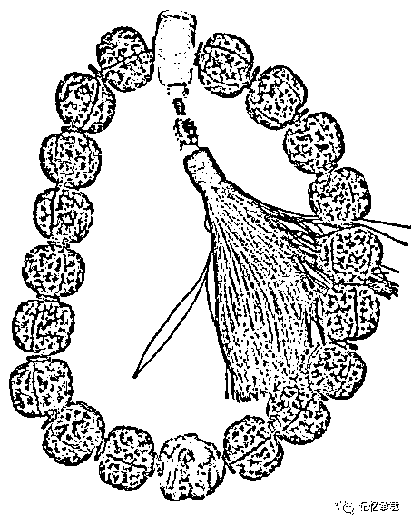
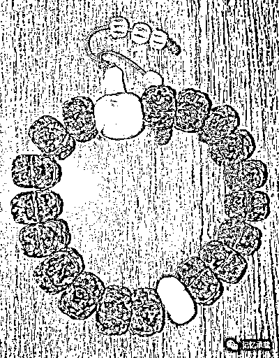
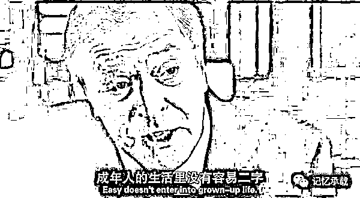
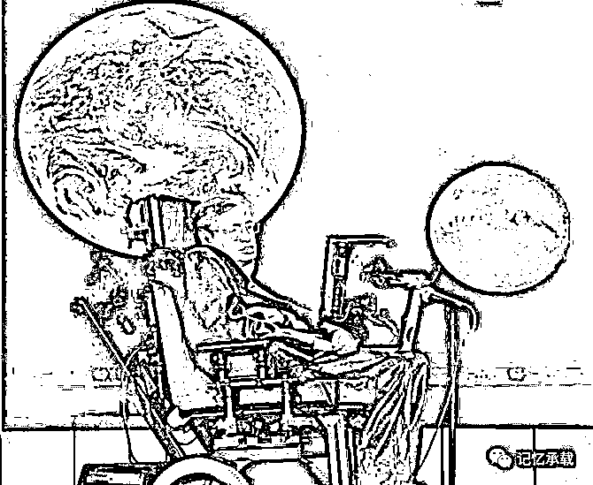

# 成年人的生活里没有容易二字

> 原文：[`mp.weixin.qq.com/s?__biz=MzU0MjYwNDU2Mw==&mid=2247483922&idx=1&sn=774edcad9977458908330778797d45d5&chksm=fb196e6ecc6ee77845d548c800e066c51d6eb0c4fa857b45dea4e3d9abb29804a9921a8763d8#rd`](http://mp.weixin.qq.com/s?__biz=MzU0MjYwNDU2Mw==&mid=2247483922&idx=1&sn=774edcad9977458908330778797d45d5&chksm=fb196e6ecc6ee77845d548c800e066c51d6eb0c4fa857b45dea4e3d9abb29804a9921a8763d8#rd)

周末看了冈波仁齐，刚出来的时候就看过，实在看不下去，放弃了，周末又补完了。

藏民去朝圣，手里都会拿一个摇来摇去的小筒，那个叫转经筒。

我家里没有转经筒，只能拿个作用相同的东西来凑数。

图中这个，叫念珠，是南红蜜蜡金刚菩提子念珠和砗磲南红金刚菩提子念珠。作用和转经筒是一样的。

注意，这是念珠，并不是手串，手串是戴在手上的，这两个都太大了，没有谁的手腕有那么粗，这两个都是拿在手上的。

行者若持此诸宝数珠，诵经持咒念佛，当能满足十种波罗蜜之功德，现身即得阿耨多罗三藐三菩提果。

冈波仁齐里的藏民花一年的时间一路叩拜去朝圣，是因为他们心中有信仰。朝圣的本质其实就是他们想知道自己在他们自己的信仰体系中处于一个什么位置，或者说，会得到一个什么评价。

藏民有信仰，一生可以去朝圣，问问心中的佛，自己一生算什么。

我们汉民又该如何？

上一章讲了中年危机。这一章讲人生的十字路口。

我为什么近期会反复聊起这个话题。是因为我现在就处在这样的局面下。有所思，才有所写。

如果把研二时做实习生算上，我从事音视频领域的工作已经 12 年了。职业生涯也已过半，后半场是继续这个领域，最终把一生交代给这个行业，还是其它的考量，我一直在思考。

我想过后半程有四个方向，要么投奔互联网行业，换个行业继续职场生涯；要么回校读博，开启学术和教学生涯；要么再度去甲方，在甲方完成职业的后半程；或者，扔掉职业，成为一个自由职业者。

这个问题我想了已久或者叫蓄谋已久。我一入职场，第一件事还不是思考如何加薪升职，而是如何把收入与工作彻底剥离。如果说做这件事，不是为了谋划今日，显然，是说不通的。

2014 年的一个秋天，在广州出差期间，某个周日，我一个人在华南植物园里转了整整一个上午。当时我在做一件极其难以决策的人生重大决定。因为那个时候，我的被动收入已经可以取代工作成为我主要收入来源了。

可是，我犹豫再三，最终只是在半年后，换了一家公司。并没有成为一个自由职业者。这里面原因有二。

第一，我不知道要做什么。自由也得有个目标有个计划，漫无目的那不叫自由那是浪费生命。

第二，我不知道离开职场之后，我的利用价值是什么。

冈波仁齐里的藏民很有诗情画意，他们管那个叫信仰，或者叫佛祖对他们一生的评价。

我们汉人历来功利世俗的多，刘墉先生说过，一颗枣树，只有在结枣子的时候，人们才认得它，一旦它不结枣子了，无论它以前结过多少枣子，人们都不会再承认它还是颗枣树。

而我一旦离开职场，失去的还不仅仅是一份收入，而是失去了很多利用价值和潜在的利用价值。

直接点说，这颗枣树，暂时不结枣子了。

而且，后面它到底是能结苹果还是李子或者只是颗光秃秃的树，都还是个未知数。

刘墉先生对枣树的这段功利的描述我小时候就读过。因此，我从小就是最好的学生，什么意思呢？我的考试能给老师给整个班带来荣誉，从而让老师在教学成果上得到好评。老师对这种学生也会给予最大的支持，换句话说，我们彼此互为资源。

这个思路贯穿了我的前半生，我每早醒来都会很清醒的意识到我对老板有什么利用价值，对朋友有什么利用价值，对家人有什么利用价值。或者说，我每天都会问问自己这颗枣树，

**我，还能怎么被利用一下？**

**我，还能结枣子么？**

一晃三年多，

再不做决策，犹豫本身其实就已经做了决策。再拖下去，转型的时间窗口就要关闭了。

转，还是不转，是个问题。

怎么转，往哪转，还是个问题。

怎么过渡，怎么摆脱一个从来都是高产枣树忽然暂时不结枣子的尴尬，甚至万一我转错了，结果大不如预期的失落。都是摆在我面前一道道的难题。

有人可能嘲笑我，你真他妈没出息。俞敏洪没收入都敢去电线杆上刷广告开补习班。你筹谋十年船坚炮利愣是不敢出航，这算怎么档子事儿！

因为这事没那么容易，我要转的型不是一个行业内从技术转市场的职业转变，也不是跨个行业的转变，甚至都不是去创业，而是我要重新评估自己后半生，到底怎么走才能突破瓶颈，才能活得精彩，才能更长久的留在舞台上，才能更深刻的经历人生，才能不留下遗憾。

造了船迟早得出海，**要出海，面前就是一片白茫茫。红海里到处是在里面搏杀了半生的竞争者，我半途进去插队能截胡么？** 

**蓝海，何处是蓝海？**

可能也有读者觉得你这货怎么这么世俗，你选的四条路，绕来绕去还是绕不开名利二字。

这个话题很有普遍性，我一次性聊彻底吧。

假如我选择第五条路，比如我出家做个和尚。你觉得我是会安心做个藏经阁扫地的小沙弥呢？还是会一门心思升八大执事，四大班首，乃至一路做到住持呢？显然是后者。

这不叫功利心重，而是无可奈何。

**金庸小说里藏经阁扫地僧从不与外界交流，从不与同门切磋，一个人默默扫了七十年地然后就横扫天下，或者张无忌掉进山洞里，从猴子肚子里随便弄了本书自己埋头读了 5 年出来就武林盟主。这些，是小说。**

现实的世界里，任何知识与体验都是人与人之间的交流。你呆在一等人才圈里，你才能体验人类文明的精髓。**你呆在非洲某个原始部落里，每天埋头用功，忽一日与宇宙进行心灵沟通，大喊一声“我是希瑞”，横空出世，这只能作为玄幻小说素材。**

即便今天是互联网时代，你感觉好像知识变得很容易得到，但是实际上，这个学习交流体验的结构从没有变过。道理很简单，当你面对一千万年都看不完的知识的时候，有个该领域 No 1 帮你挑出唯一有价值的 10 条是必要的，引领你不断修正方向不要走偏了也是必要的，离了这个，那只能指望你和宇宙心灵沟通的能力了。

**这就是为什么今天这个时代未经认可的大师特别多，因为都是宇宙亲传弟子，能不牛么。**

而**要与人交流，尤其是与牛人交流，名利都是不可或缺的**。高晓松能去哈佛做访问学者，我能去么？哈佛的门卫会放我进去么？高晓松年轻的时候就写出“同桌的你”，这没有份量么？他一生的简历，履历，经历都是打动哈佛的。

你说我什么都没有。那怎么办？那你就得拿钱砸，哈佛会问你，你打算捐几个图书馆？

**艺术是金钱融化了之后浇灌出的一朵璀璨的花。**

文化从来都不是离了钱可以运转的游戏，你说是你文人，刻个印吧，一克田黄十两金。拿一只明嘉靖彩漆云龙管笔，端一方清康熙白玉雕赑屃砚台，铺一张宋金粟山藏经纸，那肯定是在写小说。否则没等落笔，分分钟破产了。

**那咱们不谈物质，咱来谈诗。**

梨花院落溶溶月，柳絮池塘淡淡风。

**你知道市中心的院落一平米多少钱？池塘一平米多少钱么？**

后人看高鹗续红楼梦，唯一的评价就是贫穷真的能限制人的想象力。要知道高鹗也是官员啊。

**人生如果是一种体验，这种体验真的是没法离开名和利的协助的**。你做住持，可以与各路佛教高僧、各种大和尚乃至全世界的宗教协会大德大能们交流心得；你在院里扫地，出门交流，连车票也没人给你报啊，何况，没有度牒没有大和尚的名头，就算沿途化缘走路去兄弟寺庙，人家门卫也不放你进去啊。

这一章，我还是没有答案。但是时不我待，决策，就在今年。

有读者留言说你之前的文章和最近都不是一个路子。前面都是思维缜密像诸葛亮一样，最近见到你满目的困顿与迷茫。

回答下，不是我本人有什么变化，我本人一路走来，始终是困惑的。只不过一个是描述过去，一个是描述当下。

任何事情，你事后去讲述，都是很清晰的，因为你已经走过去了，不再记得当时的困惑。而你当下去描述未来，都是困顿和迷茫的，因为还不知道怎么走嘛。

人都是事后诸葛亮，事前猪一样。我也不例外。

中国人不是日本人，不会安于保持现状，一定是要求自己一路前进的，而增长就必然遇见困境。有的困境可能一卡你就是好几年。事无进展可人的寿命却在不断的消耗。有时候你似乎看见希望，希望又被浇灭，换个方法解决当下问题，又冒出新的问题，反反复复，人就会困顿和迷茫。

这种反反复复的过程就是生命的常态。

当然，我可能没资格说这个话。尤其是正值霍金走了。

我这人吧，得到的其实不少，想要的却总是更多。总觉得上天对自己还不够好，却很少想过自己究竟有做过什么。尤其是，恰逢这个人走了。

欢迎转发

欢迎转载，转载请注明来自微信公众号：wodqbs

扫码关注有惊喜