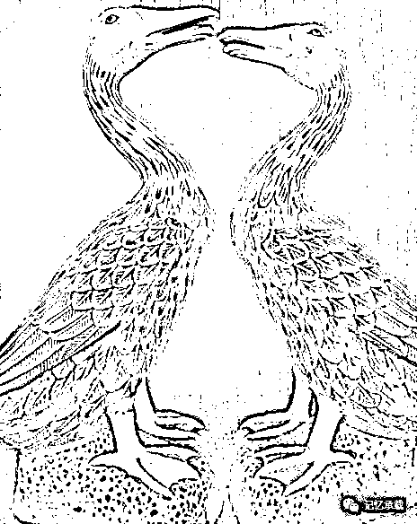

# 看过红楼梦，想看青楼梦么？

> 原文：[`mp.weixin.qq.com/s?__biz=MzU0MjYwNDU2Mw==&mid=2247483919&idx=1&sn=06dab0807753b959e32712b7383cc96d&chksm=fb196e73cc6ee76528d2e01c04bb69517781447614030d0121d6447c55a1417263e4aa6108ab#rd`](http://mp.weixin.qq.com/s?__biz=MzU0MjYwNDU2Mw==&mid=2247483919&idx=1&sn=06dab0807753b959e32712b7383cc96d&chksm=fb196e73cc6ee76528d2e01c04bb69517781447614030d0121d6447c55a1417263e4aa6108ab#rd)

我小时候很喜欢读红楼梦，虽然是个理科生，但是高三的时候不务正业的读了一整年，原本也许可以冲刺全省前 50 的，后来逐渐落到了 150 名开外。但是我并不后悔。

蒋勋说红楼梦是本写青春期的小说，我始终觉得，曹雪芹写的，还是怀才不遇，只是他的“才”非平常之才，他的“遇”也非平常之遇。

女娲补天炼了三万六千五百零一块石头，其余都拿去补天，剩了一块，就是后来的通灵宝玉的前身，因见众石俱得补天，独自己无才不得入选，遂自怨自愧，日夜悲哀。

大约，这就是怀才不遇的感觉。

说的这么热闹，这石头如今在哪呢？我肯定是给你们找不来的，我们换个物件，

图中是一对蓝色的瓷鸭子，一公一母。很漂亮，我们还能看见它的牙齿和舌头。你注意到母的比公的矮，那个年代的设计师还是很有思想的，今天往往都做成一模一样的，反而失真了。

1972 年尼克松访华，周恩来送给使团的礼物中，就有它。当时景德镇一共烧了 50 对，只送出去 49 对。剩下的一对儿，一直在我们家。

我拿它说事儿，是因为它和通灵宝玉有一点是一样的，都是被剩下的没人要的那个。

这就叫，怀才不遇。

当然，这对鸭子没有修炼过，也没有灵气，不会一个妄自嗟呀，一个空劳牵挂。他俩到底有没有奇缘，心事会不会虚化，我也不晓得。

但是我知道一点，**石头写成石头记也许有一天能变成红楼梦，鸭子如果写成“鸭子”记那也只能变成青楼梦了......**

我为什么特喜欢“鸭子”以及青楼这个话题呢？是因为我年轻的时候在某家公司。那时候公司年会，我当时做我们部门的年会节目的总编导。我编导的那个节目就是“东方不败”。

最著名的一句台词就是“十八省青楼的“东方不败”们，都出来接客啦......”，然后我们部门的兄弟们就一个个男扮女装鱼贯而出，然后开始唱海盗船长和粉红娘娘的小调......

当然，你可能觉得我是在恶搞。其实不是。我们那时候那家公司很奇怪，做芯片的人都很拽，做软件的人都很软。以至于流行一句话，做硬件吃硬饭，所以那么拽；做软件的吃软饭，所以都被他们欺负。以至于我编导出一个年会节目，上演软件部门集体接硬件的客的闹剧来形容这个公司文化。

后来我做市场，我有一次和自己的 BOSS 聊天，我说我们和做鸭有什么区别呢？反正都是出来卖的。其实你仔细想想，商人，可不就是出来卖的么？客户付钱，他想怎么样就可以怎么样，你都要满足他嘛。

我呆过很多企业，外企、民企、国企；介入过很多圈子，IT、房地产、金融；也见过很多人，研发、销售、官员、乃至 International financial speculator。

蓦然回首，忽的发现天底下所有人其实都是做鸭的，在一个商品经济做纽带运转的世界中，所有人都是出来卖的，无论你卖技术，卖知识，卖服务，卖资源、卖未来还是卖思想、卖信仰，本质上，地球就是个大青楼，我们都是鸭。

从这个角度讲，所有人都是一个圈子的——大青楼圈。

当然很多人不喜欢这个词，虽然我很喜欢。我很喜欢宗教，虽然我认为宗教也是一种鸭。只是卖的是信仰。有人可能不喜欢我这个词，也无妨。这并无不敬之意。

因为买卖不一定都通过钱。你买知识，也许花的时间。你买信仰，也许花的是理想。

你买人生体验，也许，花的是一生......

所以我萌生了写一本青楼梦的想法。

当然，肯定有人问你写这玩意有啥用呢？

那我反问你，红楼梦又有啥用呢？

老子说“有之以为利，无之以为用”，不存在的东西才会有用，存在的东西，本来就没什么用嘛

人活着原本就不是为了有用。当初我们的祖先一生绝大部分时间都是围绕着火堆唱歌、跳舞、画画，以此记录他们的人生体验。

落魄江湖载酒行

金融 IT 两相轻

十年一觉青楼梦

赢得人间薄幸名

欢迎转发

欢迎转载，转载请注明来自微信公众号：wodqbs

扫码关注有惊喜