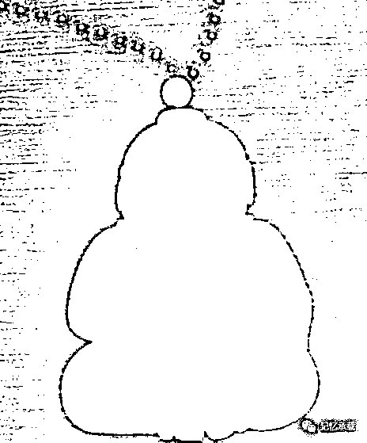
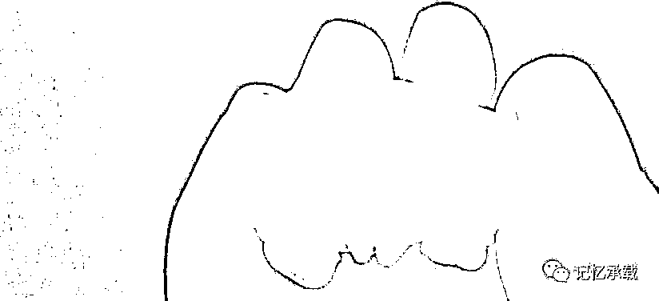

# 电影西游记女儿国

> 原文：[`mp.weixin.qq.com/s?__biz=MzU0MjYwNDU2Mw==&mid=2247483912&idx=1&sn=cb5185498f6946658452a7a39190197d&chksm=fb196e74cc6ee762f9d6f1dd2924077b08708e7384ec3f8940558806163c5c6bebba726ddd86#rd`](http://mp.weixin.qq.com/s?__biz=MzU0MjYwNDU2Mw==&mid=2247483912&idx=1&sn=cb5185498f6946658452a7a39190197d&chksm=fb196e74cc6ee762f9d6f1dd2924077b08708e7384ec3f8940558806163c5c6bebba726ddd86#rd)

最近冯绍峰的西游记女儿国正在热播。我们来聊一个奇葩的话题。西游记里的唐僧，有 JJ 么？注意我们说的是小说西游记里，不是真实的玄奘西域记里的唐僧。

看过西游记的都知道，唐三藏是如来佛祖坐下二弟子金蝉子，旃檀功德佛，是三十五佛之一，记载于佛经《大宝积经》卷九十〈优波离会〉以及《决定毗尼经》。

也就是说，他是佛。那么佛有 JJ 么？

有，有图为证。

这是一尊玉佛像，我未出生，它已经先于我来到我的家中。它有个奇特的现象是我在其它佛像上未曾见到的，我们翻开它的底座来看下面。

你看到了什么？对，就是那物件。

那为什么我们平日里在佛像上看不到这个？

因为，马阴藏相。

马阴藏相，佛教名词，梵语 kos/opagata-vasti-guhya。又作阴马藏相、阴藏相、马王隐藏相、势峰藏密相。是如来的三十二相之一。阴，即男根。佛陀的男根隐藏于腹中而不外现，故称阴藏。似马之阴，故称马阴藏。据宝女所问经卷四载，如来之阴马藏大人相者，乃往古之世，为谨慎己身，而远色欲故。往生要集卷中：‘如来阴藏，平如满月，有金色光，犹如日轮。’

这段话什么意思？佛陀等尊贵人物有 32 个体貌特征：其中 JJ 生得像马 JJ 隐藏于小腹，平常看不见，偶尔露峥嵘。

注意最后这半句，偶尔露峥嵘，显然，你们平日里看到的佛像都是平常看不见的状态，而我这尊，才是偶尔露峥嵘。

西游记里的唐僧是不是佛？显然是，佛有没有 JJ，当然有，那答案呼之欲出，唐僧显然是有 JJ 的。而且是最尊贵的那种，具备尊贵人物的 32 个体貌特征之一，马阴藏相。

“马阴藏相”疑与恒河湿婆神崇拜性力派有关，多见于藏地密宗，汉地显教诸宗亦有涉及。

耆那教自称是印度最古老的宗教，相传原有 24 位祖师，最早的创始人名勒舍婆。目前有历史记载的是二十三祖巴湿伐那陀和二十四祖筏驮摩那。后者生于古印度吠舍离一个王族家庭，属刹帝利种姓，是释迦牟尼同时代人，佛教称他为尼乾陀·若提子（意译离系亲子）；耆那教徒称他为大雄。

实际上，我们在印度的耆那教大雄的雕像上就能够看到显像的 JJ。而那时候婆罗门们就已经记载了所谓的三十二大人之相，后来因佛陀尊贵，故此在佛陀身上又再次得到了印证。

回到副标题的疑问，既然唐僧留在女儿国不存在先天的限制，那他为什么不肯留下呢？我想，这，也许就是理想的缘故吧。

**所谓理想，不是你想通过它得到什么，而是你愿意为了它，放弃什么。**

欢迎转发

欢迎转载，转载请注明来自微信公众号：wodqbs

扫码关注有惊喜