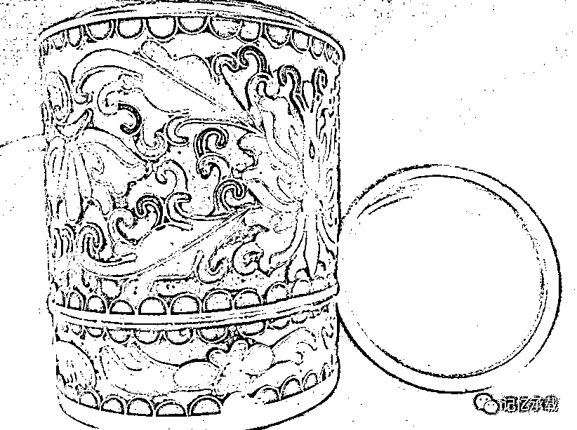

# 马云相亲为什么也会被女孩鄙视？

> 原文：[`mp.weixin.qq.com/s?__biz=MzU0MjYwNDU2Mw==&mid=2247483834&idx=1&sn=24febe38da0c76082bbb2105abde5127&chksm=fb196dc6cc6ee4d08bec3fc0c9056c120ee95d291b8ca49e4420e096f3fba4ed979bda23e4d5#rd`](http://mp.weixin.qq.com/s?__biz=MzU0MjYwNDU2Mw==&mid=2247483834&idx=1&sn=24febe38da0c76082bbb2105abde5127&chksm=fb196dc6cc6ee4d08bec3fc0c9056c120ee95d291b8ca49e4420e096f3fba4ed979bda23e4d5#rd)

最近，被两个事件刷屏了。

一个是马云的员工，阿里某程序员穿着特步鞋去相亲，被姑娘以衣着不修边幅鄙视导致失败，事后阿里官方微博发文表示同情，特步运动鞋公司也随即发文表示这个黑锅他们不背。

另一个是某个叫张晴的女律师，大约是她炫耀了一些名牌的包包、衣服，毕业于北大的学历，以及表示了对出生在县城的前男友的鄙视之类的一些话语。然后就有些比她更富有的对其表示鄙视，随后，各种炮轰和争辩类的文章都出来了。

作者没仔细了解过两件事的细节，不过本期，我们可以蹭个热点，来聊一聊炫耀与鄙视。

其实炫耀与鄙视不是今天才有，作者小时候，80 年代，国人和今天一样喜欢炫耀，喜欢鄙视，只是内容不同而已。

比如刚打进城的革命干部子弟们炫耀什么呢？大致无非是自己家是干部、领导干部、高级领导干部，三年自然灾害期间，自己家仍然有保姆，可以喝奶粉云云。

因为政权更迭失去权力的旧贵族，比如逃去台湾的蒋委员长曾经依赖过的那些江浙财阀的后人们就鄙视他们什么呢？无非就是嘲笑新贵们，农民进城，改不了习性。你看看我家擦屁股用的是餐巾纸，而你们新贵擦屁股用的是草纸。又比如，我们家枕头里塞的都是开司米（一种国外的品牌）的毛线当作枕芯。我们家包馄炖用的馅里一定会剁进去一个梨以此解油腻云云。还有饮食穿衣生活上种种细节类的鄙视链，不再一一列举，大致无非就是古人所说的，为官三世，方知穿衣吃饭那套理论，以此来显示自己是世家，而你们，只是暴发户。

阳光下没有新鲜事，所有的事情都只是一遍遍在重复。

其实，中国人一贯如此，不只是几十年前的人们，古人也是这个调调。

上一张图，

这是什么？

一个景泰蓝的有盖的筒。咱今儿不聊景泰蓝的工艺。要知道，在古代，铜钱铜钱，铜就是钱。为什么古人会用铜来做一个器皿呢？其实就是炫耀。

这就跟你今天用人民币叠一个盒子，是一个道理。铜胎掐丝珐琅工艺就是诞生于这种炫耀需求下的产品。

过去的人炫耀，古人炫耀，大人物也同样炫耀。

日本历史上的关白丰臣秀吉最初没有儿子，过继了外甥丰臣秀次作为养子继承人。那时候，后来成为日本实际统治者的德川家康还只是三河地区的一个乡下大名。

传闻秀次与家康的第一次见面就是一场经典的炫耀与鄙视。

秀次展示给家康看他的装扮。他用的作为大将标记的马标，是一面金色的大旗。这物件，原为越前北庄战死的织田信长（丰臣秀吉的原主人）手下首屈一指的勇将柴田胜家（丰臣秀吉的对手）所有。他戴的头盔是一顶仿照中国的头盔制作的唐冠，此物本是美浓地方出身的武将、现在秀吉手下任备中守的日根野弘就的武具。那件用鸟毛制作的披肩，则是木村常陆介的物品。木村是一位近江地方出身的豪杰，现在秀吉军中任职。这披肩本是木村的常用之物，架不住秀次苦苦请求，才不得不忍痛割爱。这真可以说是集当代英雄豪杰的战场装束于一身。  

而家康笑笑展示给秀次看，自己身上普通的盔甲、普通的军刀、普通的战旗。

秀次大为不解，问其物有何来历？

家康哈哈大笑，指着盔甲、军刀和战旗正色的告诉秀次，这是德川家康穿过的盔甲，德川家康佩戴的军刀，以及汇聚了我三河壮士们英魂的战旗！

这场对话翻译过来意思就是，一个学生与孔子见面，他一脸傲娇的告诉孔子，自己读过论语，孔子听罢莞尔，告诉他，论语正是自己讲课时，学生们对他说过的话做的课堂笔记。

作者并不是想说炫耀就一定是没有自信的体现，也不是想说不修边幅就是一个好习惯。

其实每个人都可以有自己的价值观，三观一致的人，可以聊聊，三观不一致的人，彼此远观即可，生命是个生态链，什么样的花都有它存在的价值。不需要刻意追求一致。

不过，作者自己就是个不修边幅的人，想当年第一次见如今的太太，只是汲拉着凉拖就走出了学生宿舍，也没有遭遇那个阿里码农式的被鄙视，这充分说明了，作者的内在魅力，是何等的惊人啊

对作者最好的打赏就是转发

欢迎其它公众号转载，转载请注明来自微信公众号：wodqbs

扫码关注有惊喜