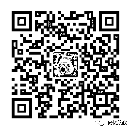

# 把日子过成这样，有意思么？

> 原文：[`mp.weixin.qq.com/s?__biz=MzU0MjYwNDU2Mw==&mid=2247483741&idx=1&sn=8a072ea6749fb839457cf126a4289e7b&chksm=fb196d21cc6ee437b2a14a1526b6fb1b72849049500de0f5698f41d279106250d52f253d70e3#rd`](http://mp.weixin.qq.com/s?__biz=MzU0MjYwNDU2Mw==&mid=2247483741&idx=1&sn=8a072ea6749fb839457cf126a4289e7b&chksm=fb196d21cc6ee437b2a14a1526b6fb1b72849049500de0f5698f41d279106250d52f253d70e3#rd)

这一期作者不聊物件，和关注本号的读者们聊聊天。

在第一期开号声明里，作者写的很清楚，这原本是个私号。但是万万没想到在完全没有推广的情况下，开号短短一周之内，粉丝竟然接近三位数，而且里面没有一个是作者的同事亲戚或者朋友，全都不认识。这实在出乎意料。

这样冷僻的标题，即使刻意推广，我想，能点开看的，百不足一，点开之后看完的，又百不足一，看完之后还能关注的，更是十分的少见。

我们看看开号一周推出的这些标题，《策马追流星》、《一片冰心在玉壶》、《问世间情为何物》，...，唯一一篇影评，还是评的芳华，一部文艺片里的文艺片。

再看看过去的一年里 10 万+的文章，题目大约是《华为为什么非要裁掉 35 岁以上的老员工》、《中兴 70 后程序员被辞退后跳楼》、《月薪 3 万撑不起孩子一个暑假》、《马云一个月赚二十个亿很痛苦》、《年初不买房，一年又白忙》、《80 后的养老危机可能是史上最悲催的一代》、《人工智能到来了，我们还有工作么？》、《折叠的都市，无法跨越的阶层》，......不再列举了，大约除了色情与奇葩，上述的就是最热门的话题集合了。

这说明，这个浮躁的世界，有多么渴望一丝的宁静。我想，这才是你们关注这个号的根本原因。

我不想评论那些制造焦虑和贩卖焦虑的公众号，毕竟这是一条产业链，人家也是要混饭吃的。但是我想问一个问题，

焦虑，有卵用么？

还记得我大学里第一个体育老师，对他印象深刻是因为他是个体育系的博导，上第一次体育课的时候，没让我们去运动，而是给我们讲了一番道理，那也是我第一次发现体育老师这么能说，真不愧是博导。

他说，你们看那些赛跑的运动员们，凡是跑的快的，都面带微笑，凡是咬牙切齿的，都跑不快，知道为什么么？

我们当然都一脸懵逼的看着他，他笑笑，回答说：“答案很简单，因为跑步，不是靠脸部肌肉跑的”。

全场绝倒。

这个道理事后想想是很简单，能量是守恒的，你把力气都用在脸部肌肉上，那脚下自然就慢了，跑的快不快，和咬牙咬的狠不狠，有毛线关系么？有么？

焦虑，也是一样的道理。焦虑就像咬牙切齿，你可以用尽吃奶的力气焦虑，问题是，然并卵？

当所有人都在贩卖焦虑的时候，我们提供宁静。

策马追流星我们聊的是人生短暂恰似流星，玉壶我们聊的是得到的时候不会珍惜，失去了却后悔莫及，情为何物里面我们聊的甚至是一只鸟，在这个浮躁的时代里，大约没有人会把小米嵌在蛋黄里蒸熟，把蛋黄丢掉，只喂鸟吃小米；在这个浮躁的时代里，也不再会有人去关心一只鸟的骨气，因为，骨气这样的奢侈品，连人，都用不起。

而今天，我们的用短暂的像流星一样的人生，每天焦虑的思考着该如何面对焦虑，等到我们垂垂老矣，却发现自己过的还不如曾经的一只鸟，最后躺在医院的病榻上燃烧着自己曾经燃烧岁月赚回的纸币来延长时光，用尽最后的一口气去哀叹失去的时光是多么的后悔莫及......

把一生过成这样，有意思么？

每天看各种公众号，他们无非在告诉你，你昨天错过了房价，今天错过了比特币，明天你还将失业，在恐惧和焦虑中每天被他们吓来吓去，还要为此打赏，任何事情都是遵从二八定律的，有钱人永远都是少数，我们就算不考虑真相，假如每个人都历经九九八十一难，都成为了马云。那么，请问，接下来等待你的是什么？是一个月赚二十个亿的马云式的焦虑。也就是说，即使我们突破真理，突破二八定律，那么，你用尽了一生，穿越无数焦虑，最后等待你的，还是焦虑。

这不禁让人想起王家卫的电影东邪西毒里梁朝伟的那句话，他翻过了一座又一座山，后来发现，山的那边，还是山......

此生，我们到底是来体验美好的，还是来体验焦虑的？

写在最后，作者不想发财，不想成就伟大的事业，只想为这个浮躁的世界提供一丝宁静，只想为在沙漠里淘金的人们提供一篇水草，无论这么做有多么的不合时宜，都想梗着脖子坚持，最后到了七八十岁死掉，用一生的时间，把这个浮躁焦虑的世界，变得美好了那么一点点。

本号的粉丝不是作者的粉丝，而是和作者一起，都是理想主义的共同粉丝。

这篇文章，欢迎转载，让所有那些在这个浮躁的世界里苦苦寻觅安宁的人，都可以看到我们的努力。

扫码关注有惊喜