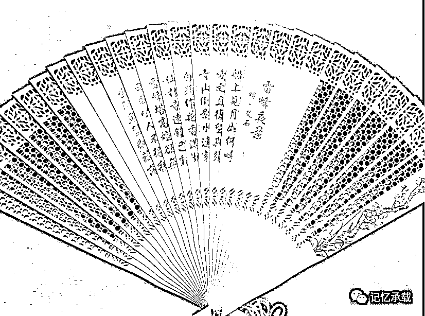

# 电影《芳华》里隐藏着的惊天秘密

> 原文：[`mp.weixin.qq.com/s?__biz=MzU0MjYwNDU2Mw==&mid=2247483698&idx=1&sn=765b009372eb9eea197eb3bab9909c49&chksm=fb196d4ecc6ee4587052ec70cf5489d19e26ea4a377b01d6917cd5cecbc264a83e59748b1bc3#rd`](http://mp.weixin.qq.com/s?__biz=MzU0MjYwNDU2Mw==&mid=2247483698&idx=1&sn=765b009372eb9eea197eb3bab9909c49&chksm=fb196d4ecc6ee4587052ec70cf5489d19e26ea4a377b01d6917cd5cecbc264a83e59748b1bc3#rd)

在起承之后插播一集，下周再转合。为什么呢？因为最近冯小刚的电影《芳华》热播。

作为公众号，应个景儿，也蹭个热点。

图中是一柄扇子，檀香扇，王星记的扇子，大约是几十年前我上一代人或者上上一代人买的，不是在上海买的就是在杭州买的。

这柄扇子是我很小的时候看到的，大约是 80 年代后期，当时给我的印象就是它很香，写这篇文章的时候，我还特意把它的盒子打开翻出来，三十年过去了，它仍然散发着浓郁的香味。

我已经忘记了当年是祖母还是母亲给我介绍的，是说檀香扇是过去的妇人拿着看戏的，手持扇子半遮面，煽动起来，香风扑面。这是一件蛮风雅的事情。

为什么拿一柄扇子说事呢，因为芳华说的是文工团的事，文工团就是演戏的，而扇子就是拿来看戏的。

我的童年和少年时代大部分时间是在省军区家属院度过的，我记事的时候，邓小平已经多次裁军，文工团我并没有见过，大概被裁光了，但是我家隔壁就是 5 团，它应该是个警卫团。在我很小的时候，5 团的范围还很大，占据了大半个街道。后来逐步被迁出市区，改建成居民区。最初的时候，5 团里面养着几头猪，那个时代的公共厕所就是地上一条横贯的槽，然后纵向建几个小门，有一次我和一个小区里的孩子一起去 5 团里玩，发现了这几头猪被独立的关在一个个小门里面。我们当时并没有意识到地上的槽是它的食槽，小门里是它的猪圈。以年幼的两个孩子的见识和对公共厕所的印象，第一反应就是几只无辜的猪被人关在了公厕里。善意的我们打开了门，用树枝把它们赶了出来，然后它们冲上了主干道，狂奔不已，我们在后面兴奋的追逐。5 团的小战士大惊失色。

这个故事我和我儿子说完的第二天我就带他一起去看芳华了，电影里有个桥段是刘峰在吃饺子，有个小战士冲进来大喊，刘峰，不好了，省军区的猪被人放出来了。我儿子开心的大笑，他以为猪是他爸爸放出来的。

当然了，年代不同，省份也不同，电影里的猪肯定与我无关，不过这个桥段倒是蛮贴近生活的。到此为止标题解释了，惊天的秘密就是电影里的猪是谁放走的？是我放的么？显然不是。

我比冯小刚小了一代人，对着同样的东西，视角不同，感受就不同。当时的成年人也许经历了很多作为孩子的我们当时无法理解的事情。记得干休所诊所的王主任在部队上就是个团长。今天回想起来，一个部队上的团长被转到省军区干休所，在几十平米的空间里管着 2，3 个小护士，给几个老干部看看老人病，内心应该是失落的。但是当时的我们是无法理解成人的世界，只是觉得找王主任开病假条去学校骗老师请假很容易，无论你找个什么理由，王主任都给你开假的病假条，以至于后来我们班主任都拒绝接受干休所门诊的病假条，要求只有三甲医院的假条才作数。当然，王主任还是有原则的，那时候学校门口有个电子游戏厅老板，你给他 5 块钱，他就冒充你爸去开家长会，把你不及格的卷子隐藏起来，以至于冒充多人的爸爸，被学校的老师认了出来。王主任起码没做过这种事。

无论哪一代人的芳华都会随着时间逝去，2500 年前孔子也在川上说，逝者如斯夫！不舍昼夜。

只愿每一代人的芳华逝去之后，都会留下美好的记忆和回忆。

驿外断桥边，寂寞开无主。

已是黄昏独自愁，更著风和雨。

无意苦争春，一任群芳妒。

零落成泥碾作尘，只有香如故。