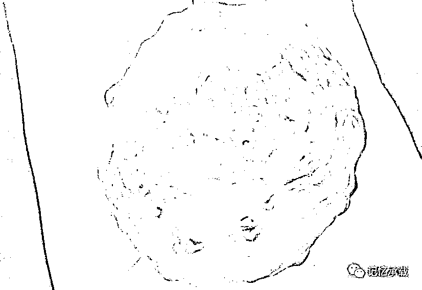

# 策马追流星

> 原文：[`mp.weixin.qq.com/s?__biz=MzU0MjYwNDU2Mw==&mid=2247483678&idx=1&sn=88d483fa8ac564a2d19d814a52389e68&chksm=fb196d62cc6ee4745ebb5bfd945bd8d118622baffc7c2c2b23555926f1565824c76b297d3be6#rd`](http://mp.weixin.qq.com/s?__biz=MzU0MjYwNDU2Mw==&mid=2247483678&idx=1&sn=88d483fa8ac564a2d19d814a52389e68&chksm=fb196d62cc6ee4745ebb5bfd945bd8d118622baffc7c2c2b23555926f1565824c76b297d3be6#rd)

从陨石说起

开号之后我一直在想从什么物件开始呢，想来想去，应该从最古老的说起。

这里面有三个说法：

其一，盘古开天地，天地是什么，就是地球，地球是什么，就是一颗星星，那陨石是什么？陨落的星星。

其二，陨石是所有物件里最老的，没有人类的时候，就有它，或许没有地球的时候，也有它了。

其三，陨石就是运势。天下事，无外乎运和势。所以，由陨石起就是由运势起，寓意美好。

陨石是哪来的？

大约是在 80 年代后期，我记事起，就见到这颗石头了，小时候父亲跟我说，说他年轻的时候在新疆天山核试验基地当兵，一夜忽见天空其星大如斗，坠落远方，他策马狂奔，追至星陨之地，见地上一大坑，此物坠期间，得之。

当然，我稍大一点就知道过程多有夸张，世上哪有策马追流星这么浪漫的事呢。

这是块铁陨石，来自什么星星不可考。其表面经过大气层燃烧之后留下黑色的熔壳表明它是近现代新降落的陨石，并非古代降落的陨石。

我记事的时候，距今已有三十年，那个年代并没有韩剧，更没有来自星星的你。当然，除了大学地质研究所之外，也没有几个人了解或者喜欢陨石这种东西。所以家里有颗星星会引起很多奇特的事。

我记得小时候，父亲怀疑过它有辐射，拍过它的照片洗出来之后看到石边的光晕怀疑是它产生的辐射，甚至考虑用铅盒把它装起来。我们都知道，造原子弹的铀就是被封装在铅之中的。当然，这种猜测并没有科学依据。

后来稍大一点，大约我上小学的时候，多日不雨，父亲把它放在水缸里，结果罕见的连续下了 7 天暴雨。从此父亲就认为它有祈雨的神效。当然，这个结论显然是不成立的，不过，倒让当时的我明白了一件事，中医的理论大约是这么来的，人们往往会因为两个不相干的事情碰巧遇在一起，就误以为它们之间会存在某种因果关系。其实，今天的科学实验，本质也是如此，只是实验的次数多了一些而已。

回到主题，策马追流星，这个过程显然不能是同步的，马跑的没有星星降落的快，但是这个意境构思的非常浪漫。

其实我们的人生就好似一场策马追流星的过程，理想就如同天上的星星，机遇就如同星陨的过程一闪而逝，而每个人都在为了自己的各种理想或者各种欲望不停的在奔波在追逐。

在我见到这颗陨石的 400 多年前，日本战国时代恰逢桶狭间会战，年轻的日本小大名织田信长舞毕敦盛，唱罢“人生五十载，如梦亦如幻，有生斯有死，壮士何所憾”，策马流星般冲向今川义元本阵，开启了天下布武的时代。

思へばこの世は常の住み家にあらず。

草叶に置く白露、水に宿る月よりなほあやし。

きんこくに花を咏じ、荣花は先つて无常の风に诱はるる。

南楼の月を弄ぶ辈も月に先つて有为の云にかくれり。

人间五十年、下天のうちを比ぶれば梦幻の如くなり。

一度生を享け、灭せぬもののあるべきか。