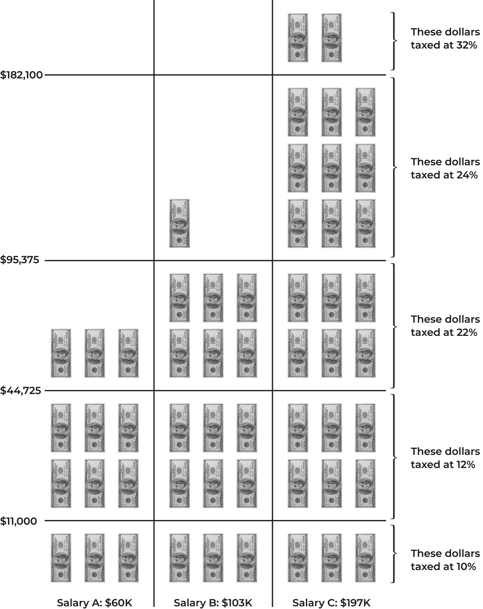

## 六、我已经准备好接受财务统治了。

当我第一次搬到纽约时，我 22 岁，刚刚从学校毕业，单身，准备好去*交际*。所以，自然而然地，我花了相当多的空闲时间约会。有一天晚上，我和一个男人约会，情况还不错——不是一见钟情的程度，但也不是假装接到电话要逃跑的程度。他足够帅，饮料不错，这个晚上并不完全浪费。

现在，我不禁注意到那个家伙穿得*很*光鲜：我们说的是劳力士手表，菲拉格慕懒汉鞋，爱马仕领带。我有点惊讶，因为他和我差不多年纪，他说他在华尔街工作。当然，那时我也在华尔街工作——这意味着我大致了解他可能挣多少钱。那可不是菲拉格慕和爱马仕的钱。至少，*我*挣不了那么多钱：我和另一个女孩合租一个 600 平方英尺的公寓来省房租，还在买那些便宜的药店连裤袜。所以，你知道，可能有点可疑。

看，我在这本书中谈了很多关于富人如何变得富有，变得更富有，以及保持富有的事情。但我想要绝对清楚：富有并不自动使你擅长理财。事实上，一些富人？对钱一窍不通。直到我开始和他们交往，我才真正意识到这一点。

就在这次约会上。

结果，这家伙在接下来的晚上一直在谈论他刚去米科诺斯岛旅行，他如何用奖金给自己买了这块劳力士，等等。你知道的——俗气。我有点失去兴趣。但在喝了第六七杯龙舌兰酒之间，他不小心说漏了嘴。

他有五位数的信用卡债务。

是的。当我听到那个时候，我几乎要醉倒在地板上了。像，先生——你现在一次性穿在身上的就是你的债务。我正在看着。你是一个负债累累的活广告牌。

不用说，没有第二次约会了。（热门看法，但如果某人的财务状况和财务目标与你不符，那是一个很大的红旗。）

我和 Wish.com 的查克·巴斯小出行只是表明，即使是在金融领域工作的人，即使是天生富裕的人（因为我提到这家伙的爸爸也是一位大亨 CEO），也不总是善于处理自己的钱。这家伙是最富有的那一百分之一，但他仍然不明白为什么在信用卡上刷上数千美元是一个坏主意，而且他没有办法按时还清。

理解赚钱、预算、储蓄和投资的基本原则都很好。但还有一些更高级的东西，你需要整理好才能真正实现财务统治。像信用、债务，甚至税收都可以利用*如果*你知道它们是如何运作的——或者如果你漫无目的地尝试，它们也可能让你遭受重大损失。

幸运的是，你有一个富有的好朋友准备向你展示所有的技巧。本章将讨论与金钱相关的更宏观的事情：借贷、偿还债务、向政府交税（哭泣），以及制定那些让你能够按照自己的意愿生活的大型财务计划。

（除非这涉及为设计师买鞋而负债。那就没办法帮你了，兄弟。）

### 现金、借记卡和信用卡：何时使用哪种支付方式

现金、借记卡和信用卡之间有什么区别？

我知道，这听起来像是爸爸笑话的开头。但这是一个合理的问题，对吧？为什么我们有这么多种货币可以使用呢？用一叠钞票支付和用美国运通卡支付真的有区别吗？如果在空旷的森林里刷信用卡，*会发出声音吗*？

好吧，我们不是在大一哲学研讨班上，但还是。使用这些支付方式各有利弊，了解区别将极大提升你明智消费的能力。

#### 现金

一般来说，我非常反对使用现金。

第一，没有保护。如果口袋里有二十美元，你摔倒了，二十美元掉在人行道上，那么那就不再是你的二十美元了。下一个经过的人？那就是他们的钱了。真的不希望这种事发生在你身上。

第二，使用现金非常容易。除了“ATM 取款”之外，它不会出现在账单上，所以你很容易陷入这种自欺欺人的怪异心态，因为*未来的我永远不会知道，哈哈哈！*

第三，使用现金不会得到任何回报。你不会得到信用卡奖励。你不会得到积分奖励。你不会得到现金返还。

所以就是这样。除非你只是想从附近的便利店买一瓶 Gatorade，我真的看不出使用现金的理由。

话虽如此。

使用现金有一些好处。很多地方——餐馆、美容院、其他服务提供商——提供现金支付折扣，而这个折扣可能比你用信用卡获得的奖励还要高。这是一个非常个案的情况，但如果有道理，那就有道理。

其他地方对信用卡消费设定最低消费额，或者只接受现金。虽然不是我最喜欢的，但如果你真的只想要*一瓶*便利店的 Gatorade 而不是*五瓶*，那么最好还是用纸币支付。

最后，现金在小费方面是王道。不幸的是，信用卡小费并不总是能够全部交到负责你订单的服务行业人员手中，原因不明，如果你希望放心知道你给出色女服务员的所有小费都到了她手中，最好还是递给她一张二十美元的钞票。

综上所述，现金的最佳策略是只在你知道需要用于特定事情时才取现，这样你就不会被诱惑随意花费（或者失去追踪）。就我个人而言，我取现用于支付我的家政服务和睫毛技师，但基本上就是这样了——其他所有事情都可以用信用卡解决。

#### 借记卡

你的借记卡直接链接到你的支票账户。它允许你通过在商家刷卡或从银行取现而无需支付费用，或者在 ATM 取现而支付少量费用来花费账户中的资金。

这应该是它在你生活中的主要目的：为你获取现金。

是的，你的借记卡上可能印有 Visa 或 Mastercard 标志，是的，你可以在收银台刷卡或在线输入卡号，就像信用卡一样。

但我真的不建议这样做。太多人倾向于认为借记卡和信用卡“基本上是一回事”，但这并不正确。他们不明白为什么要有信用卡，因为他们已经有了借记卡，这让他们可以刷卡购物而不是使用现金，这不就是目的吗？

不不不不。用借记卡购买与用现金购买是一样的：你没有得到任何东西。如果你已经递交卡或输入卡号，为什么不使用信用卡并获得一些回报呢？

此外，与现金一样，没有保护措施。但是在借记卡的情况下，这种缺乏保护措施实际上可能比现金的捡到就是自己的性质更糟糕。如果你掉了二十块钱，你只是失去了二十块钱——就这样。如果你掉了你的借记卡，你可能失去了银行账户中的所有资金。找到它的人可以刷卡、轻点和在亚马逊上尽情订购，直到你意识到并让银行冻结卡。

而且，与信用卡不同，那笔钱很可能*不会*回来。

这就是借记卡和信用卡真正分道扬镳的地方。借记卡是访问你的资金。信用卡是访问金融机构的资金。使用信用卡，你基本上是在一个月内花费银行的钱，然后一个月后他们会说：“嘿，我们一个月前借给了你这笔钱，所以还钱吧”，然后你用信用卡付款来补充他们的资金。

现在，如果你的借记卡被盗，那个小偷就在花你的钱，而你则很惨。银行会说 NMPYP——不是我的问题，是你的问题。想想看：如果是你的钱被盗了，你的银行并没有太大的动力帮助你找回。当然他们会冻结卡，但除此之外，他们只会说：“哦，抱歉，这对你来说真的很糟糕！”他们就像一个耐心听你讲述糟糕 Tinder 约会的朋友：他们无法解决问题，只是礼貌地回复而已。

但是如果你的*信用*卡被盗刷了，那个人实际上是在花银行的钱。当一个小偷在花银行的钱时，银行会非常有动力要拿回那笔钱。他们会联系商家。他们会扫描监控摄像头。他们会找出谁在使用那张卡，并像李安·尼森一样全力追踪他们。他们也会立即关闭卡片，并确保这些费用被取消，因为你立即报告了，他们知道不是你，你不需要承担责任。（同样，如果你用信用卡购买了东西，但从未收到？你可以发起退款，获得退款，并让你的银行与商家争论为什么货物没有送到。借记卡？你只能自己承担成本。）

因此，不要把你的借记卡用于所有事情只是在考虑激励措施所在，认识到你作为客户的价值，并知道如果你的卡被盗刷，你可以利用那些私人安全力量会*全力以赴*的情况。

另一个保留借记卡的原因是在银行的实体分支机构验证你的身份：如果你需要出门办事，出纳员只需要求使用与你的支票账户关联的借记卡，就可以立即查看你的个人资料。

但除此之外和取现金外，真的没有其他理由经常使用借记卡。对于我所有的支票账户，我只保留一张（1）借记卡在钱包里，这是我不需要支付任何 ATM 费用的卡。

#### 信用卡

我认为每个人都应该有一张信用卡。

在最基本的层面上，信用卡让你现在购买东西，直到以后再付款。与像借记卡那样直接从你的支票账户划款不同，信用卡实际上代表你向商家提供资金，然后在月底向*你*寄送账单。

所以这起步相当方便，对吧？但信用卡远不止是一张欠条。

信用卡提供欺诈保护，所以如果有人盗刷了你的 Visa 卡，在沃尔玛大肆购物，他们会全额赔偿你。它们让你获得旅行积分和现金返还，这样你就可以轻松获得免费物品。它们帮助你建立信用评分，这样你就可以在未来获得更好的抵押贷款和汽车贷款条件。

基本上，它们会拿你本来就在做的事情——花钱——并给你额外的回报。

这基本上使信用卡成为有史以来最伟大的东西 . . . *如果* 你了解它们的工作原理。

看，信用卡公司并不是出于好心给你提供现金。他们想要赚钱，而他们有三种方法。一，他们可能会收取持有该卡的特权的年费（通常是拥有很多福利的卡）。二，他们通过向商家收取交易费来赚钱：每当你刷卡时，商店都要支付 1.5 到 3.5％的手续费来处理信用卡付款，这笔费用直接归信用卡公司所有。三，他们通过持有余额的人赚钱。

还记得我那个身无分文的富家子弟约会对象和他的五位数信用卡债务吗？像他这样的人是这些公司的主要收入来源。他们使用信用卡购买他们无法在账单到期日前偿还的东西。相反，他们每个月只支付最低还款额——通常是信用卡公司要求的保持卡片开放的金额，通常*远远*少于总余额。在那点滴付款后剩下的金额会滚入下个月——带着利息。有时是*极高*的利息。当你只关注最低还款额时，很容易不会意识到每个月 APR（年利率，信用卡公司将根据此确定每个账单周期要增加多少金额到您的总额）是如何使您的总债务每个月增加的。这意味着我那个富有但身无分文的约会对象和像他一样的人不仅仍然要为他们最初的购物费用负责，还要为他们购买的东西*以及*因为他们没有立即偿还而支付的费用（即利息）。

信用卡公司的好消息。对于阿拉丁王子和他的劳力士来说是坏消息。

问题是，这种情况是完全可以避免的。如果你了解你的信用卡规则，不仅可以在其中安全地玩耍，而且可以打败那些家伙。

因为你知道信用卡公司*不*从富人身上赚钱。

富人知道如何使用信用卡，以便不仅避免支付利息，而且实际上可以*赚钱*。他们知道如果他们玩得好（哈哈），他们可以获得更多的奖励价值—以现金返还、豪华福利如酒店会员资格和机场休息室，以及其他免费赠品—即使他们支付三位数或四位数的年费。他们所要做的就是定期使用信用卡并在每个结算周期内全额还清。就是这样。他们不会被高利率的卡片吓倒，因为他们知道当您全额支付账单时，利率对您实际上没有任何影响。

所以信用卡是最好的东西。学会规则，不要违反它们，你就可以让你*已经*花费的钱为你工作。你在信用卡上的任何开销都应该在你的支票账户中已经分配了一美元来支付，然后信用卡账单应该按时支付。这就是你在“赚取奖励”和“避免利息支付”之间找到的甜蜜点——并且在这个过程中获得度假住宿、旅行保险和去圣特罗佩的头等舱机票等好处。

最后，在这里还有一个关于持有信用卡的最后一个方面要讨论：你的信用评分。记得信用卡基本上就是你在使用银行的钱吗？银行必须认为你有资格使用它的钱，然后才会放心地让你去购物。它不会轻易相信*任何人*。就像当你的一个女友要去参加一场黑领结婚礼，并从你的衣柜里借一条裙子时：你会自动给她你拥有的最漂亮的礼服吗，那件你绝对喜欢并且替换起来要花一大笔钱的？

不是吗？因为这取决于你对这位特定女友的*信任*程度。

如果你们自从女童子军营相识，还记得她因“最整洁的帐篷”而获得了一个荣誉徽章，你可能会相信她会好好照顾你的裙子，甚至在之后把它干洗一下。如果她是一个较新的、更随意的朋友，你并不*真的*那么了解她，也许你会借给她那件你打折买的可以替换的漂亮裙子，这样即使她不还给你也不会让你睡不着觉。如果你是在大学认识她，当时你正在扶着她吐出一杯长岛冰茶的时候……也许你不会冒险给她任何东西。

对于发放贷款或信用额度的金融机构也是如此。他们认为你越可信赖，他们就越愿意给你更高的消费限额或更大的贷款。而*这*就是你的信用评分所代表的内容，也是接下来的部分要讨论的内容。

### 信用评分目标

我用我的第一张信用卡犯过的最大错误？不是花钱过度。也不是把它丢了，然后让某个陌生人在亚马逊上把我的限额用光。

那是关闭账户。

为什么？一个叫做*我的信用评分*的小事。

你的信用评分是一个从 300 到 850 的数字，基本上评估你作为消费者的“信用价值”。这是一个“你有多大可能偿还债务”的评分，所以信用评分越高，你对潜在借款人就越有利——基本上，这是一个成绩，但是在现实生活中。

现在，为自己辩护，我当时认为我是在负责任。我的想法大致是*某种某种拥有太多未偿信贷额度是不好的某种东西*。我肯定听过不止一个“财务大师”传授的这条智慧：我已经在职场工作了几年，终于开始赚真钱了，我得到了一些更“精英”的信用卡，当我看到大学毕业后得到的入门级信用卡时，我只是想，*嗯，我不再需要这个了*。基本上，我认为我所做的是完全符合 A+学生行为的。

但那张入门卡也恰好是我*最老*的信用卡。而我当时没有意识到的一件事是，我被评分的其中一项是我的*信用历史*——也就是我作为一个稳定、可靠的信用卡持有者多少年来按时全额还款。当我取消那张卡时—*噗*。我的信用历史减半，从八年减少到四年。这就好比写了世界上最好的学期论文，然后永远删除了硬盘上的前半部分—不管我*做了工作*，因为我没有证据了。

这个小错误让我的信用评分直接下降了六十分，我唯一能做的就是等待并继续保持按时还款。当时，我非常生气（好吧，不瞒你说，我现在还*稍微*生气），但事后想想，如果我当时真的知道信用评分是什么（不仅仅是一个随机数字），我可能就能避免很多压力了。

所以，请：从我的错误中吸取教训，并了解这个现实生活等级到底是什么意思。

#### 为什么信用评分会存在？

没有人喜欢被评分，但信用评分确实有其目的。

正如我们在上一节中看到的，信用评分是信用卡公司确定你是否值得拥有超级大钻石精英卡，还是更适合拥有超级简单返现卡的方式。同样适用于抵押贷款、汽车贷款，甚至租房。鉴于我们的经济现在是一个真正的全球银行、放贷人和消费者网络，数字评分是唯一实际的做法。

当时，银行还是小镇事务，一切都很古老，放贷人可以依靠了解你的身份、了解你的家庭，知道你的制桶店或其他生意相当稳定，然后决定你是否值得贷款。但如今，放贷人需要更少基于村庄流言，更多基于事实的东西。（这意味着信用评分*本身*实际上相当现代：第一批标准化信用评分始于 1956 年，我们今天使用的系统自 1989 年才开始实施。）尽管存在各种问题（我们会讨论到这些问题），现代信用评分的数字等级解决了这个问题。

现在，你可能会问：“好吧，它们是等级……但我不记得参加过考试？？？我应该申请什么吗？”

不是的。广义上讲，在美国拥有社会安全号码的每个人都有资格拥有信用评分。有三家主要的信用局负责信用评分——Equifax、Experian 和 TransUnion——他们负责收集、分析并向贷款人提供有关消费者信用的信息。每当你第一次使用信用，或者以某种方式与债务或贷款有关，你就会开始被这些人评分（技术上讲，信用“评分”是一个错误的称呼，你有多个“信用评分”，每个信用局都有一个，但因为这三家信用局都在使用关于你的相同信息，它们通常会落在一个相对相似的范围内）。

然而，在你做到这一点之前，你将没有信用评分。不幸的是，*没有*信用评分和*不良*信用评分一样困难，因为在你证明自己擅长偿还债务之前，债权人没有任何依据。

这是富人*喜欢*操纵系统的地方之一。聪明的富裕父母所做的是将他们的孩子列入他们的信用卡授权用户，这意味着他们孩子的社会安全号码与该信用额度相关联。即使孩子不进行任何购买或偿还，只要父母按时支付信用卡账单，孩子就会被记录为一个负责任的信用使用者。随着时间的推移，孩子的*信用历史*变得越来越长，他们的评分也会提高。他们甚至无需学习就能得到 A+。

对于那些并非出生在极具见识的父母家庭的人来说，我们基本上是从零开始。这就是为什么理解这些无形测试中的内容以及最佳成绩是如此重要，这些测试正在评估你的信用，以及最佳成绩是什么。

#### 信用评分是如何计算的？

当信用局对你进行评分时，他们会考虑五个主要因素——你可以将这些看作是一份课程大纲，列出了哪些作业对你学期成绩的影响最大：

1.  付款历史（占你评分的 35%）：基本上，你有多频繁按时付款？越频繁，越好。

1.  信用利用率（占评分的 30%）：这是评估你欠多少钱，但是根据曲线来评分。重要的不是固定的金额，而是你使用了多少*可用*的金额，也就是你的信用利用率。因此，如果你有一张信用卡，额度为$10,000，你欠$2,000，那么你的信用利用率为 20%。

1.  信用历史长度（占评分的 15%）：你拥有当前信用额度多长时间了？历史越长，你被认为越不冒险，因为有更多数据显示你的付款历史。

1.  信用类型（评分的 10%）：市面上有不同种类的信用，借款人希望知道你能处理各种类型的信用。这会考虑你的分期付款（如抵押贷款或汽车贷款）、循环信用（如信用卡）和开放信用（如美国运通卡，每月需支付全额余额）之间的混合情况，并根据混合情况的平衡程度对你进行评分。

1.  新信用（评分的 10%）：这会评估你申请和开设新信用额度的频率。频繁申请更多贷款可能会引起警示（“这个人为什么总是需要更多钱？她破产了吗？”）。这也被称为最近信用查询的次数，或者你信用评分上的“硬查询”。

#### 什么是良好的信用评分，我的信用评分是多少？

至于实际的 A、B、C、D、E 和 F 等级，信用评分的整体范围从 300 到 850。

不幸的是，与字母等级不同，“及格”的门槛远高于“不是得到 F”。尽管 300 是最低分，但一旦达到 500 或更低，你更有可能被直接拒绝任何贷款或信用。为了获得任何可能需要借款的最佳条件，你需要一个非常好或优秀类别的评分——什么构成“好”（或“足够好”）会因借款人而异。

话虽如此，一般的分级通常是这样的：

+   800–850: 优秀

+   740–799: 非常好

+   670–739: 良好

+   580–669: 一般

+   300–579: 差

要检查你的评分，你可以每年一次免费访问 AnnualCreditReport.com 获取信用报告（包括评分以及用于评分的详细报告），这不会被视为“硬查询”。如果你发现自己处于班级的最低水平，*不要惊慌*。就像学校成绩一样，你可以做补救工作和额外学分作业来提高你的分数。通过时间和一些明智的理财举措，信用评分是可以很容易修复的。

（另外，我恳求你——从我的错误中吸取教训。不要关闭你的首张信用卡！！！不管它是给你每花一美元就扣一分的最糟糕的卡片——不要关闭它。你总是可以考虑将其升级为更高级的卡片，或者如果有你不想再支付的年费，将其降级，但是不要关闭它。感谢你来听我的演讲。）

#### 额外学分：五个提高信用评分的技巧

1.  **按时付款。** 对于任何贷款、信用卡账单、汽车贷款或其他信用额度，不要错过付款日期——即使只差一天，即使你只能支付最低金额。如果你对截止日期有点疏忽，那么在你的账单支付账户中保持一定的现金储备，并设置每月自动付款。如果你意外延迟了一次付款？打电话给你的银行，询问他们是否可以作为一次礼貌的举措将其从你的记录中删除。

1.  **了解信用利用率的甜蜜点。** 这里的魔法数字是 30%和 10%。30%是警示数字：一旦你开始使用超过你可用信用的 30%，你的信用评分就会受到影响。（所以，例如，如果你有一张信用额度为$10,000 的信用卡，并且在上面花费超过$3,000。）另一方面，10%（即，在该卡上花费约$1,000）更符合贷款人的喜好：这表明你在积极使用卡片（这是好事），但不会疯狂地累积费用。保持你的利用率在这个友好区域几个月，你应该会看到你的评分提高。

1.  **改变目标。** 这是我最喜欢的伎俩。你可能*认为*唯一减少信用利用率的方法是偿还债务...但并非如此。记住，信用利用率是一个百分比—一个分数。所以，如果你让底部数字（你的信用额度）变大，即使顶部数字（你的支出和欠款）保持不变，你也可以神奇地减少利用率。每六到十二个月，给你的信用卡公司打电话，要求提高信用额度—*尤其是*如果自开卡以来你的收入有所增加。很多时候，如果你与他们关系良好，他们会立即提高你的额度。

1.  **清理你的记录。** 信用局会犯错误。不正确的个人信息，不属于你的账户，甚至被标记为拖欠的账户都可能出现在你的信用报告中，影响你的评分。获取你的完整信用报告副本（不仅仅是分数），仔细查看。如果你发现任何可疑的、你不认识的或错误的内容，请立即联系信用局并告诉他们出了什么问题。他们会进行调查，确保你的报告准确，并希望修复你的评分。（这也是发现身份盗用的好方法—有人使用你的姓名和社会安全号码累积债务。）

1.  **申请担保信用卡。** 如果你没有信用记录或信用记录较低，并不意味着你不能申请信用卡。它只是暂时限制了你—暂时限制了你只能申请一种*类型*的信用卡。担保信用卡听起来就是什么样子：它本质上是一张带有保证金的卡，你需要提前向公司寄送一笔现金作为抵押。很多担保信用卡还会收取年费—通常在每年二十五到九十九美元之间—除了那笔保证金，但这可能是一个完全值得支付的价格：有了担保信用卡，如果你能明智地消费，不超过限额，并且每个月都还清账单，这种负责任的模式会随着时间推动你的信用评分—最终你将能够将你的担保卡升级为更有利可图的信用卡，享受更好的福利。

总的来说，如果你负责任，仔细阅读条款，并且能够正确地玩游戏规则，信用就是你的朋友。

### 债务

如果仅仅看到*债务*这个词就让你想蜷缩成一团，我理解。也许你有着无限数额的学生贷款，也许你的信用卡债务接近六位数，也许你为一辆你已经撞毁的汽车付出了昂贵的代价。对于一个如此直接的“借钱并在一段时间内偿还给贷款人”的事情，债务确实让我们感到糟糕。

所以让我向你保证：这一部分？这是一个无羞耻的区域。我最不希望的是你因为感到不舒服而跳过这一部分。我知道债务可能让人感到恐惧，但不必如此。如果你深陷债务，我会帮助你：有一些可靠、可行的策略可以帮助你更好地管理债务——我会带领你走过这些策略。

但是，债务不应该让你感到糟糕，因为债务本身并不邪恶，拥有债务并不代表你是个坏人。

债务是一种工具，就像铲子是一种工具一样。它是价值中立的，可以用于非常实际、建设性的目的。就像铲子可以帮助你种植美丽的花园并节省时间和精力一样，债务可以让你更快地实现目标，减少你的工作量。

但是工具也可以被用于邪恶。你可以用那把铲子挖个坑，然后转身用力敲击某人的头部，谋杀并埋葬他们（出于法律原因，我们需要明确指出—你富有的好朋友不鼓励谋杀）。

无论哪种情况，铲子本身并不邪恶，债务也不是本质上的坏事。但是*很多*金融记者、教育者和理财大师对债务都*非常*带有偏见。他们*非常*绝对主义。他们的论点基本上可以归结为两点：

1.  “拥有债务意味着你永远会穷。”

1.  “拥有债务源于做出糟糕的财务选择。”

因此：拥有债务是不好的，你应该感到糟糕。

对此我只能说，*你错了*。这两者都不正确，因为，再次强调，*债务是一种工具*—没有人比富人更了解这一点。

#### 真相＃1：富人绝对*会*有债务。

我的意思是，我很富有，我也有债务。

拥有房地产和经营大型企业的富人有债务。

甚至著名的富有白人男士™沃伦·巴菲特？这家伙也有抵押贷款。

但是在这一点上，我必须向我的富有同类们致敬：他们让债务经历了一场极端的改头换面。说真的—做这件事的人也曾参与过将蛋黄酱重新包装为蒜泥蛋黄酱的品牌重塑。

所有的债务只是借钱，对吧？我们知道这一点。但是我们大多数人不知道的是，我们对待债务的方式—我们如何思考它、评判它、看待它的用途—完全取决于你的社会经济阶层。这就是为什么很容易认为“富人没有债务”。他们掩盖得*相当*好。

看，当富人借钱时，我们不称之为债务。呃！不，我们称之为*杠杆*。一个千万富翁申请抵押贷款，将其余现金投资于一家初创公司并赚大钱，我们称赞他们的商业智慧，并将他们登上*TIME*杂志的封面。

当穷人借钱时，那就是债务。那是*不好的*。羞耻！

一个有三个孩子的单身妈妈用信用卡购买食品——不幸的是，她用口袋里的钱支付不起这些食品——我们指责她说：“看看你多么不负责任，像那样累积*债务*。”一个失业的人将智能手机放在分期付款计划上，因为他们没有电脑，需要*某种*方式发送简历，我们对他们“购买负担不起的奢侈品”感到不满。

很多时候，我们借钱是为了充分利用我们拥有的资源，无论是富有的还是贫穷的。但富人设法将自己与*债务*作为*那种*四个字母的词汇保持距离，并将*他们的*借钱重新包装为精明的行为。

所以让我明确一下：富人*喜欢*借钱。他们遵循《红磨坊》歌曲中的那句歌词，“为什么花我的钱，当我可以花你的？”并利用杠杆来做到这一点。

严格来说，并非*所有*债务都是杠杆，但所有杠杆本质上都是债务。这只是为了赚取*更多*钱而借钱。杠杆让你用少量的钱控制大量的资金，并获得更多的消费能力，而实际上只需从自己口袋里拿出总额的一小部分：就像你只需预付房屋购买价格的 20%，但仍然可以立即住进整个房子一样。

但这就是*真正*的债务无限金钱漏洞所在。富人总是在考虑那个增长率之间的差值。

以金·卡戴珊为例。无论你喜欢她还是讨厌她，你需要承认她的功劳：她是一位强悍的女商人，当涉及到她的钱时，她毫不手软。当她在马里布购买新房时，她的净资产超过 12 亿美元，很可能有足够的现金购买一栋价值 7000 万美元的豪宅。

但她绝不会做出如此愚蠢的商业决定。她有办法让这笔现金发挥作用，获得比单一房地产升值更高的回报。她有私募股权机会，初创公司恳请她投资，更不用说 Skims、SKKN . . . 等等。基本上，她有办法让她的钱发挥作用，如果这笔钱能比她的抵押贷款利息增长更快地赚钱，那么，瞧，即时赚钱。因此：她申请了抵押贷款。

所以富人并不讨厌借钱。他们*兴奋*地承担增长速度比他们的投资慢的债务，因为他们可以获利。 （更好的是，如果他们能够承担增长速度比通货膨胀率慢的债务？他们甚至不需要*做*任何事情，他们实际上就在赚钱。）

底线是，富人明白有时候借钱是一个*绝佳*主意。他们已经知道他们的钱可以比他们更努力地工作。借钱获取杠杆基本上就是在说，“好吧，但如果我的钱可以同时存在于两个地方，它会更努力工作多少呢？”

你真的无法自称为财务专家并说“富人没有债务”。富人*有*债务，这是他们变得富有并保持富有的方式。当富人发现他们能够以低廉的价格获取杠杆时，他们不会犹豫。他们会迅速行动。

所以，闺蜜们，*债务*不是一个四个字母的词。 （我是说，从技术上讲，它是……但不是一个坏词）。再次强调，债务只是你生活中可以用作工具的东西，它可以帮助你变得*更*，而不是*更少*，在财务上更有力量。

#### 真相＃2：无法管理的债务是一个可以解决的问题，而不是性格缺陷。

现在，也许你会说，“好的，太棒了，谢谢，Viv！但是，就像……我*很想*承担一些房地产的廉价债务，获取杠杆等等，但我欠信用卡公司大笔钱，利率是百分之一百万。我完蛋了，对吧？我对金钱一窍不通，无法玩这个游戏。”

不！首先，你并没有完蛋。有策略可以帮助你偿还债务，并获得利率优势，这样你就可以开始用你的钱赚钱。

在我们深入讨论这些之前，拥有债务并不意味着你对金钱一窍不通。

即使是消费者债务，高利息债务，发薪日贷款。

有太多远远超出我们控制范围的因素影响着我们与债务的关系：我们拥有多少债务，我们拥有的债务类型，以及我们可以利用的资源来帮助偿还债务。也许你成长在低收入家庭，也许你靠着发薪日度日，也许你曾经面临住房不安全，也许你需要支持父母和家人，也许你来自边缘化背景，收入不如你的白人男同事。

解决这些社会经济学细微差别很重要，因为没有人应该觉得自己落后，或对金钱一窍不通，或注定要失败，仅仅因为他们有债务。我们所有人都只是在尽力利用我们手头的工具和资源。因过去的决定而责备自己不会改变发生的事情，只会改变你对自己的感受，而且不是以一种好的方式。

幸运的是，现在你有一个新资源：我，你的富有闺蜜！

那么让我们谈谈偿还债务的策略。

正如我之前提到的，心态在能够控制你的债务方面起着巨大作用。这可能会让人感到非常不知所措，特别是如果你的债权人不断打电话催款。

##### 策略 #1：雪球法

控制债务的最大障碍是*心态*。说真的，人们通常不会以聪明的方式组织和排列他们的债务。是的，即使是聪明的人——因为债务在很多方面都是*情感上*的，而我们是心理生物，受到需要感觉自己在取得进展的驱动。

这就是第一种策略，被称为债务雪球。这种策略相对简单，相当受欢迎，它利用了那种希望看到进展并对自己的进步感到满意的愿望。

对于这种策略，你需要拿一张纸列出你的债务：债务的名称/类型（和/或欠债的人），你欠多少钱，以及利率。顺序不重要，你只是在这里进行头脑风暴。

所以，例如，你可能有：

1.  信用卡 #1：$10,000，利率 24%

1.  学生贷款：$7,000，利率 3%

1.  抵押贷款：$270,000，利率 5%

1.  车贷：$20,000，利率 7%

1.  信用卡 #2：$2,000，利率 22%

然后，你拿着这张清单重新排序。按照你欠的金额大小，从最小到最大排列你的债务。

1.  信用卡 #2：$2,000，利率 22%

1.  学生贷款：$7,000，利率 3%

1.  信用卡 #1：$10,000，利率 24%

1.  车贷：$20,000，利率 7%

1.  抵押贷款：$270,000，利率 5%

然后你采取行动。每个月，你会对所有债务进行最低还款（以保持与信用局的良好关系）。完成最低还款后，你会将任何额外的资金用于债务偿还，放在清单顶部的账户上——即余额最小的那个。随着时间的推移，你会逐渐偿还从小到大的债务，并相对快速地减少你欠款的账户数量。

雪球法对于那些希望得到积极反馈以保持动力的人来说效果非常好，也是看到早期成果的好方法。但是 . . .

看，我是白羊座。我很不耐烦。我脾气火爆。我想要快速、高效地完成事情。

雪球法呢？它并不是偿还债务的最快或最有效的方法。不要误会：能够结清一个账户是*巨大*的。感觉很好。但是，我不会为了这个特权而随着时间的推移支付更多利息。

所以让我向你介绍*我*最喜欢的方法：雪崩法。

##### 策略 #2：雪崩法

这种方法仍然要求你对债务进行排名，但这一次，不是按照欠款金额从小到大排名，而是按照利率从高到低排名。

所以，如果你从同样的清单开始：

1.  信用卡 #1：$10,000，利率 24%

1.  学生贷款：$7,000，利率 3%

1.  抵押贷款：$270,000，利率 5%

1.  车贷：$20,000，利率 7%

1.  信用卡 #2：$2,000，利率 22%

按照利率从高到低排名，你会得到：

1.  信用卡 #1：$10,000，利率为 24%

1.  信用卡 #2：$2,000，利率为 22%

1.  车贷：$20,000，利率为 7%

1.  抵押贷款：$270,000，利率为 5%

1.  学生贷款：$7,000，利率为 3%

从那里开始，流程是一样的：您对所有债务进行最低还款，但将任何额外的偿债资金用于利率最高的账户。

这就是为什么我如此喜欢这种方法。通过按利率顺序处理债务，您可以在尽可能快的时间内偿还债务，同时支付的利息最少。

如果您想要一个小的电子表格计算器，以查看您的债务在雪球法和雪崩法下的情况，请访问[richAF.club](https://richAF.club)下载我的 Excel 工作簿。

##### 策略 #3：债务整合

无论是雪球法还是雪崩法，您最终都在改变债务的同一方面：您欠的总金额。唯一的区别在于您处理构成该总额的部分的顺序。

另一方面，这种策略可以帮助您解决债务的*利率*问题。

债务整合是指您申请贷款并用其支付多个债务。您仍然欠同样总金额的钱，但现在以单一贷款的形式存在。其想法是这个新的单一贷款将比您以前的个别债务拥有更低的利率，因此您的总支付金额更少。

通过债务整合，您无需进行任何排名、雪球法或雪崩法，因为它们都被合并成一个整体。这种便利，加上利息的节省，可以帮助您更好地控制债务。

如果您的债务主要是高利率债务，如信用卡债务，这种策略是最合理的。如果您的债务大部分是低利率的，如联邦学生贷款或低利率抵押贷款，您可能无法通过整合来获得更低的利率。

债务整合还需要考虑您的付款历史和信用评分。为了获得贷款资格，并获得使数字可行的利率，您需要一个良好的信用历史，以便贷款人放心地将钱交给您。但如果您符合条件，利息节省可能会很大：当然，根据银行，您的良好信用评分可能有助于将您的总利息降至个位数百分比（例如，而不是信用卡债务上的 20%至 25%）。

要设置债务整合贷款，您需要联系银行或信用合作社等金融机构并申请。他们需要了解您的债务金额和当前债务的利率，以及您的个人信息和信用评分等基本信息。如果他们批准您的贷款，他们实际上同意偿还您的多个不同债务，而您同意您现在欠银行所有这些贷款的总额。

### 税收和税率$

“薇薇安，我怎样才能像富人一样交税？”

哼，更像是你*怎么*不像富人一样不交税？

我已经谈了很多关于富人*厌恶*交税的话题，这仍然是非常真实的。但富人对税收的总体了解并不仅仅是“税收不好”。事实上，大多数人应该了解更多关于税收如何运作以便*真正*像富人一样应对美国国税局。本节将解释税收分档的工作原理，税收的目的以及您如何合法地尽一切努力减少您要交出的钱。

#### 税收分档

大多数人*不*了解美国的税收分档是如何工作的。就像，是只有我吗，还是每个人的 Facebook 都充满了人们告诉别人拒绝加薪或不加班，因为“这会让他们进入下一个税收分档，最终还是要全部交给政府。”

好消息，朋友们：你高中的阴谋论者是错的。如果你赚更多的钱，你永远不会变得更糟。这是因为我们美国的税收分档是边际的——我知道，你已经开始打瞌睡了，但请跟着我，因为我可以向任何人解释税收。

想象一下，你不再用钱来支付了。相反，你得到的是披萨。每年你赚取的前 11,000 个披萨，你会得到香蒜酱披萨。（呃。）这是*每个人*都会得到的支付方式——不管你是里奇·里奇还是身无分文的贝基，我们都从这前 11,000 个披萨开始都是香蒜酱口味。政府说：“嗯，我们不太喜欢香蒜酱，所以我们只想要其中的百分之十。” 他们从每个香蒜酱披萨中拿走了一小块——到目前为止，一切顺利。

但是一旦你每年开始赚取超过 11,000 个披萨，你就升级到下一个口味——蘑菇！政府对此稍微喜欢一点，但只是一点点（因为实际上，它仍然是蘑菇），所以他们想要每个蘑菇披萨的百分之十二。

现在，在这个级别，没有人得到任何好的披萨配料，因为我们都在相同的阈值上升级——不幸的是对于身无分文的贝基来说，这就是她的全部：她不会得到任何其他口味，因为她今年不再赚取任何披萨。这意味着总体上，政府没有拿走她太多的披萨，因为他们会说：“如果你只有香蒜酱和蘑菇，那么我们真的只想拿走最少的。”

但你仍然在赚取披萨，然后你达到了下一个级别：大约 45,000 个披萨后，你开始得到香肠。现在政府说：“嗯，好的！我们要拿走其中的百分之二十二。” 所以他们拿走了所有你的香肠披萨的一大块，直到你达到大约 95,000 个披萨时，你开始得到意大利辣香肠。政府仍然对此感兴趣，显然，他们会拿走每个意大利辣香肠披萨的百分之二十四。

现在，你停在那里——这就是你今年能得到的所有披萨。但 Richie Rich 继续前进，他去年赚了 600,000 个披萨。所以他一路上品尝了*很多*口味：他得到了烤鸡肉、水牛牧场，甚至是夏威夷口味的披萨。（不要和我争论。这是我愿意为之奋斗的事业。）政府*喜欢*这些披萨，所以他们将分别拿走每个披萨的 32％、35％和 37％。

这就是*边际*的意思。当你进入更高的税率档次时，你并不突然放弃更大比例的每个披萨——你只是放弃了更多最新口味的部分。这并不意味着你突然放弃了更多的总收入。

所以当会计师或其他金融专业人士问“你的税率是多少？”时，他们实际上想要的基本上是你在顶级披萨口味中*最多*愿意放弃的大致指示。

现在，当人们*不*理解边际税率时——就像我们在 Facebook 上的朋友们一样——他们会惊慌失措，并基于错误的数学做出愚蠢的决定。他们看到那些税率从 10％和 12％开始，然后跳到 22％和 24％，然后再从那里大幅跳至 32％、35％、37％，他们开始惊慌：“嗯，如果我处于 24％和 32％之间，我宁愿赚得更少，留在 24％的税率范围内，因为那样我带回家的更多，即使我赚得更少！” 他们没有意识到他们只失去了每个*意大利辣香肠*披萨的 24％，因为政府不想要那么多香蒜香菇或者意大利辣香肠披萨。他们的*有效*税率——即每个披萨被拿走的平均金额，跨越所有口味——将*始终*更低。

如果你仔细考虑一下，这其实是有道理的。就像，是的，当然，政府确实有时会做一些不符合我们个人最佳利益的事情，甚至是完全不合逻辑的事情，但他们不会设立一个*那么*混乱的税收制度，对吧？如果税率档次的工作方式符合人们的想法，那么没有人会被激励去从事高薪工作，*永远*不会。就不会有心脏外科医生了，因为为什么你要成为一名心脏外科医生，当你可以成为一名水下编织筐子的人赚同样的钱时 . . . 我的意思是披萨？

边际税率，可视化

所有数字基于 2023 年的税率档次。

这就是说：始终接受加薪，不要害怕加班。你会有更多的钱。你每赚到一美元都对你有好处。也就是说，你*会*看到边际收益递减，因为在你的收入达到一定点之后，政府开始抽取更多的一部分—但只针对超过该门槛的收入，而不是每一美元。但你的*有效*税率（你实际上支付的税款占收入的百分比）永远不会像你的边际税率那么高（你某些收入被征税的最高百分比）。处于更高税收档位意味着你赚更多的钱，*这*是一件好事。

#### 纳税申报表和税款退款

让我们快速澄清一下。

你寄出去的一叠表格，展示你那一年赚了多少钱以及你欠政府多少？

那就是你的纳税申报表。

如果你支付过多税款，政府会寄给你的钱？

那是税款*退款*。

不是纳税申报表。是税款*退款*。

你把你的*申报表*寄给政府，政府会把*退款*寄给你。

我们明白了吗？

很好。因为我提起这个不只是为了挑剔。看，有些国家，政府基本上*确实*会给你寄退款。他们会为你填好。例如，澳大利亚税务局实际上只是给每个澳大利亚人寄一张表格，上面写着，“你好，伙计，这个数字看起来对吗？请勾选是或否。”

所以当我听到人们说，“哦，我终于从国税局得到我的退款了”，我只能想到“是的，要是真的有的话。”

相反，更像是：

> 纳税人：纳税时间，好的好的。我欠多少？
> 
> 国税局：嗯，这取决于你，伙计。你得自己弄清楚。
> 
> 纳税人：真的吗？但你们不是已经有所有的表格和资料了吗？
> 
> 国税局：哦，是的。是的，我们完全会。
> 
> 纳税人：那 . . . ？
> 
> 国税局：就像我们说的，伙计。这取决于你。
> 
> 纳税人：但是，我不擅长数学！如果我算错了怎么办？
> 
> 国税局：*监狱*。

在美国，我们主要通过从工资中扣除的方式向联邦政府支付所得税，以及适用的州和地方政府。然后，在年底，我们的雇主会给我们一张表格，上面写着，“这是我们支付给你的金额，这是我们为你扣除的税款。” 你使用这个表格填写你的纳税申报表，寄给国税局，然后要么支付你欠的款项（如果你不够），要么得到退款（如果你*多*付了）。

或者，你知道，监狱。

（不，我开玩笑的。因为意外填写错误而受到的处罚并不像人们说的那么严重。轻微的善意错误不会让你被关起来。最糟糕的情况是，你只需把钱还给政府，最糟糕的情况是你要支付一笔小额罚款。）

在实践中听起来很简单，但正如我们在税收档案中所看到的那样，数学并不那么直接。人们经常不理解他们填写的表格，他们会犯错误，他们在整年中也不会支付正确的金额。

虽然在 4 月 15 日欠钱很糟糕，因为，嗯，现在你可能要支付一些额外的钱，你可能没有预料到，但是得到退款呢？那也有点糟糕。

人们把他们的税款退还当作免费的奖金，但事实并非如此：这只是*你的*钱。是*你赚的*钱。是你实际上借给政府的，没有任何利息，长达一年。

那*不是*让你的钱为你工作。所以，最好是填写所有这些表格，尽可能调整你的预扣税，不要白白给*任何人*钱。

调整你的预扣税会因你是传统薪资/小时工作还是自由职业者/自雇而有所不同。

如果你在雇主那里工作，你在被雇佣时会填写一份 W-4 表格，基本上问：“你是谁，你赚多少钱，你结婚了吗，你有几个孩子？”并根据这些信息确定要预扣多少税。

这意味着，如果在一年内，你结婚了，生了孩子，或者从工作之外获得了新的收入来源，你应该去人力资源部门更新你的档案中的 W-4 表格。你要确保你配偶的收入（如果你打算联合申报）或者你的兼职收入在工资单计算你的预扣税率时被考虑进去，因为*所有*你赚的钱都会影响你的税率，不仅仅是工资。

另外，如果有任何关于你日常工作的事情让你感到不确定，你实际上应该有一个员工福利经理可以帮助你解决这个问题。他们的工作就是确保文书工作正确，所以向他们寻求帮助。

如果你是自由职业者，那么税收就是额外的烦恼。你是老板，这意味着你*也*是财务部门，而不是等到随后的四月才处理税收问题，你需要每个季度支付预估税款——这是自由职业者版本的工资预扣税。你不会从雇主那里得到一张 W-2 表格，而是从每个你合作过的客户那里得到一张 1099 表格。

除了文书工作，糟糕的部分是，与每次都是相同金额的工资支票不同，自由职业收入可能每年变化很大……而且因为所得税是渐进的，不像只需支付每赚一美元的二十二分那么简单。你必须猜测到年底你会赚多少钱，并使用*那个*数额来确定每三个月向 IRS 汇款多少。这些付款通常是根据你前一年的收入计算的，这至少是一个起点，但是，自由职业收入是变化的。很容易出现少缴税或多缴税的情况。

你不想白白给政府贷款，但你*也*不想最后要付几千美元的账单。所以这里有一个生活技巧：为你的税款开设一个专用的高收益储蓄账户。每次收到付款，就把一大笔钱放进那个账户里——我说的是 30 到 40%。按照去年的收入支付你的季度税款，然后把剩下的钱留在那里。到年底，如果你做完税务申报发现你欠更多的钱？没问题：它就在你留在 HYSA 的地方。如果你*不*欠更多的钱呢？那么这笔钱就是你的—*而且*它还在为你赚利息。

就我个人而言，我现在喜欢把 40%的钱留出来交税，因为我知道在联邦层面，我将处于 37%的最高税率。

“等等，维维安，你不是刚说有效税率和你的税率不是一回事吗？怎么回事？”

是的，这仍然是真的。但我也住在纽约市，对吧？我的当地税收会很高，我需要为这些税收留出一大笔钱。

最后，如果你是自由职业者？找一个会计和一个会计师。说真的，他们可能会比你自己做税收（当然，你支付给他们的钱都是商业费用，所以……可以抵税，宝贝）节省*很多*时间和金钱。他们还可以帮助你获得抵扣或信用，让你实际上可以拿回一些钱，这就是桌子上的免费钱。

#### 税收抵扣和税收信用

那么我们如何像富人一样不交税呢？我们可以最大化我们的抵扣和信用，即使是普通的、非亿万富翁的人也可以做到。税收抵扣和税收信用并不是什么花哨的东西：它们只是政府激励我们做事情的方式，无论是拥有房屋、驾驶电动车、捐赠慈善机构……清单还在继续。

这两者之间的区别在于。税收信用就像是你税收的优惠券。信用会减少你欠的税款金额，一分钱对一分钱。所以如果你有 1000 美元的税收信用，你将少交 1000 美元的税款。

另一方面，税收抵扣不会直接从你最终的税单中扣除，而是从决定你税单的收入中扣除。基本上，如果你花钱做了让国税局高兴的事情，国税局会说，“不，没关系——我们就假装你根本没有赚到那笔钱，*眨眼*。”

一个主要的抵扣是我们已经讨论过的东西：退休储蓄。如果你为 401(k)或传统 IRA 做出贡献，你可以从你计算税收之前从你的收入中减去你为这些账户做出的贡献金额。退休储蓄，以及某些其他费用，如学生贷款利息和赡养费，被称为“前线”抵扣，意味着你可以无论如何拿走它们（只要你符合收入要求，就像我在第 197 页描述的那样）。

然而，其他可抵扣的费用——比如慈善捐款和支付的抵押贷款利息——只有在*不*选择所谓的*标准扣除*时才适用。基本上，每个人都会从其应纳税收入中扣除一定金额，无论如何，这是以标准扣除的形式。这只是政府轻松简单地说，“大多数人都是普通人，而普通人通常在可抵扣的事项上花费约 X 金额，所以我们将假设你今年花费了这么多可抵扣费用。你甚至不需要证明，我们很放心。”

标准扣除额每年都会变化，但通常是一大笔钱（2023 年单身申报人为$13,850，已婚夫妇联合申报人为$27,700），所以除非你的扣除总额*超过*这个数字，你应该选择标准扣除。

最后，如果你经营自己的业务，有兼职工作，或者做自由职业工作，你应该*绝对*扣除符合条件的费用。你也不需要逐项列出这些费用（因为它们是从你的企业收入中扣除的，而不是从雇主的工资中扣除的），所以一定要确保你没有错过。

### 理财顾问、税务专家和打造你的资金管理团队

即使我们*能够*自己动手做一些事情，有时我们也只是想要专业建议。比如，当然，你可以在 Sephora 四处试错地在手腕上试色底妆，最终你可能会找到一个合适的颜色匹配……或者你可以让顾问过来用小色调匹配探测枪扫描你的脸，得到一个*精确*的匹配。

或者我们可能想要节省时间，尽可能保持尽可能多的宝贵的非工作时间，所以我们让 Instacart 来购物。额外费用、费用和小费可能完全值得这种便利。

我们的财务生活也是如此。无论是想要从专业人士那里获得量身定制的建议超出我们的专业知识范围，还是只是想省去与金钱相关琐事的麻烦，总有人可以被雇佣来实现这一目标。

现在，我们已经知道富人*喜欢*一个好团队，而资金管理肯定是他们的首选之一：记账员、会计师、税务律师、遗产规划律师、投资经理……名单还在继续。

但对于我们这些*还不是*高净值个人的人来说，为每一个专家买单可能并不明智——尤其是如果你不知道每个人到底做什么。很容易要么过早行动并为我们在赚钱生活阶段不需要的服务付费，要么为那些实际上并不符合我们最佳利益的人付费……或者两者兼而有之。

例如，我在我的私信中经常看到的最常见的问题之一是“Viv，我怎么找到理财顾问？！”

但实话说：大多数人还不需要财务顾问。如果你还没有达到每年最大化所有免税账户的程度，那么你很可能不需要任何专家建议。在那个阶段唯一需要做的事情就是继续投资并尽可能增加你的收入。

关于这些金融专家的事情是，他们最擅长处理复杂的金钱情况，但复杂并不一定意味着“涉及大量资本”。看，富人建立这些团队的原因不仅仅是因为他们的账单上有很多零。这是因为他们的设置很复杂：跨越不同州的多个房产，要建立和管理的大学储蓄和信托基金，也许还有一些赡养费要解决或者要正式化的业务结构……这真的是太多了。

但是*拥有金钱*并不意味着你需要找一群人告诉你该怎么处理它。如果你是一个有钱人在一份普通的 W-2 工作中工作，将所有的退休账户最大化，并将其余的投资资金投入到一个简单的指数基金和高级债券组合中……也许你并不需要做太多改变。说真的，我不在乎你一年挣 40 万美元，如果你的预算和投资计划对你有效，那么就没有紧迫的理由雇人告诉你该怎么做。

话虽如此，有一些金融专业人士是值得尽早雇佣的。

下面是你可能想要雇佣的人，你何时可能需要他们，以及为什么—以及在哪里找到他们。

#### 注册会计师（CPA）

当涉及与国税局打交道时，注册会计师是真正的 MVP。

注册会计师是帮助人们准备和提交个人和/或商业纳税申报表的人。如果你有一个注册会计师，你基本上可以把所有的表格都扔在他们的桌子上（或上传到一个安全的文件共享平台），然后坐下来等待你的初稿报表准备好。

这就是注册会计师的全面好处：他们节省你的时间。但注册会计师不仅仅是会计师或人类 TurboTax 机器。他们还可以帮助你审视你的个人情况，并确保你获得所有你有权获得的抵免和减免（或者解释一下你只需稍作调整就有资格获得的那些）。他们还做一件电脑屏幕无法做到的事情，那就是拿起电话回答你的问题，无论这些问题有多“愚蠢”。雇一个会计师，你不再需要搜索“我的调整后总收入是多少”。

另外，如果你的财务生活即将发生重大变化（或最近发生了），雇佣一个注册会计师也可以确保你在第一次婚后（或离婚后）导航你的第一份纳税申报表时正确地处理所有细节，设置新工作的正确预扣税额，或在参加奥巴马医改后申请任何健康保险费用抵免。

要确定，*并非*每个人都需要注册会计师。对于绝大多数人来说，特别是那些年轻人且没有财产或孩子的人，你完全可以使用自助税务软件并自行申报税款。你不会错过任何超级秘密的税收福利，我保证（尤其是现在你已经读过这一章），你也不会面临更高的审计风险（因为即使注册会计师准备你的纳税申报表，*你*负责确保其准确性—所以你不能只是责备你的会计师）。

#### 遗产律师

看吧：无论富有还是贫穷，我们都会死。（抱歉要告诉你这个。）

我之前说过，大多数金融专业人士在你的情况变得复杂时最有用。遗产律师是个例外。我认为每个人都应该有一个，因为我认为每个人都应该有一份专业的、具有法律约束力的遗嘱。

就像我说的，我们都会死。

虽然我们可能不喜欢考虑制定遗嘱之类的事情，因为直面死亡令人沮丧，但有专家帮助你做这件事可以给你带来巨大的心灵安宁。

首先，每个人都有遗产，不仅仅是富人——*遗产*指的是“当你死后留在地球上的所有东西”。这包括你银行账户里的钱，退休或投资账户中的资产，你拥有的任何财产（不仅仅是房屋，还有汽车和*房子里的东西*）。

其次，即使我们认为遗嘱是“将所有东西留给我的孩子的文件”，即使你没有孩子，你也可以*应该*拥有一份遗嘱。如果你突然和悲剧性地*无遗嘱*去世，你的幸存家人将不得不通过遗嘱法庭（并可能支付律师费用）追踪你的所有资产，并找出它们应该如何合理（和合法）地分配。

#### 财务规划师

如果你搜索类似“可以帮助我处理我的金钱的人”的内容，你会得到一大堆所谓的金融专业人士的结果。抱歉，但并非所有这些人都是合法的。

自称为财务教练、预算顾问、金钱心态专家或其他类似称号的人基本上只是在编造头衔。当然，他们可能有一个时髦的网站，一种轻松的氛围，甚至可能有一些高质量的社交媒体信息图表，但这并*不*意味着他们是合法资格的专业人士，可以帮助你一对一解决你的情况。在发布有用的财务视频在线和挖掘你的个人财务以制定计划之间存在着巨大的差异。所以我恳求你：在为咨询付费之前，请查看你喜欢的人是否有任何实际的资格证书。

或者，你可以从*只*看合格的、真正的专业人士开始搜索。对于绝大多数人来说，*持有认证的财务规划师*是一个可靠的选择。要成为 CFP，一个人必须通过认证考试，完成一定数量的教育和实践经验，并遵守一套严格的道德规则和行为准则。我想我不需要解释为什么这些都是好迹象，但基本上，是的，你需要一个知道自己在做什么且不会欺骗你的人。

话虽如此，我想再次强调，一旦你的年收入达到六位数或净资产达到二十五万美元，或者任何标准，你并不自动需要雇佣 CFP。如果你对自己的支出、储蓄和投资感到满意，并且一切都朝着你的目标发展，你不一定*需要*额外的建议。

但是，就像注册会计师和遗产律师一样，CFP 作为任何随机问题、氛围检查和基本上询问“我做得好吗？”的资源可以极大地帮助。就像我之前说的，尽管我很想在这本书中涵盖每一个可能的财务情景，但我*没有*那么多页，尽管我喜欢成为每个人的 Rich BFF，但无论我在社交媒体上发布得多快，我也无法真实地向每个人解释一切。

但最重要的是，CFP 是一个*受托人*，这意味着他们必须*始终*为客户的最佳利益行事。虽然*一些*财务规划师可能会大力推销某些投资产品，因为*他们*可以获得更多佣金，但受托人（如 CFP）会建议你只做对*你*最有利的事情，而这显然是你想要的。

### FU 数字

所以你正在使用信用卡，偿还债务，像冠军一样支付税款，而且你有一个强大的团队支持你处理所有棘手的事情。

那么，你需要多少钱才能翻过桌子，辞掉工作，告诉老板 F U？

答案就是你的 FU 数字。（同时，我并*不是*字面上建议你这样做。）这是你需要的金额，基本上，永远不用再担心为了钱工作。这是财务控制的*终极*成就——而且比你想象的更容易实现。

FU 数字是我个人对通常称为 FIRE 数字的“财务独立，早退休”概念的重新诠释。*FIRE*代表“财务独立，早退休”，但就个人而言？我不太喜欢这个术语。

原则上，我完全支持人们完全依靠投资的被动收入过上幸福生活。然而，在实践中 . . . FIRE 人士有点过于激进。他们热衷于传教。看，如果你喜欢 FIRE，那太好了。没有负面意思。但我对这个运动有一些问题。

首先，在与 FIRE 相关的讨论中存在很多羞耻感。FIRE 社区中的许多知名人士过着极端的生活方式。对一些人来说，这意味着完全脱离现代社会，*我自己打猎，住在原木小屋里，有堆肥厕所。* 这对你来说可能很棒，但我想我不必解释为什么这并不适合每个人。

除了那些住在 Airstream 拖车里不买鞋子的极端 FIRE 人士外，他们总是乐于指出*他们的方式*是实现 FIRE 的最佳方式。（与此同时，我在想，“你难道永远不想去杂货店吗？因为你得穿鞋。我不明白。”）出于某种原因，FIRE 纯粹主义者喜欢因为他人的选择，尤其是任何“浪费”金钱而羞辱他人。

正如你所知，你的女孩喜欢一些不容商量的事情，所以我发现这种态度非常不健康——因为说真的？只要按照自己想要的方式生活，不要评判其他人生活方式。如果你不买鞋子，嘿，过你想要的生活。我做不到，但你做你自己吧。

另一件事是，FIRE 通常是一种误称。就像“财务独立，提前退休”的整个前提是，你达到了足够大的储蓄数额，以至于你可以每年靠投资回报生活，而且你可以真正永远不再工作。但对于许多 FIRE 人士来说，最终发生的是他们达到了那个 FIRE 数额，然后他们成为了 FIRE 大师。他们建立了一个博客或课程，教导其他人如何达到他们的 FIRE 数额。

但这直接违背了 FIRE 本应关于的。从字面上讲，FIRE 意味着你提前退休，对吧？你不再工作，你不通过劳动赚钱，因为你靠投资收入生活。所以如果你作为一名会计师辞去工作，因为你已经实现了财务独立，但然后你开始教授“如何实现 FIRE”课程 . . . 我不知道，但那对我来说不像是退休。那只是你找到了一个更喜欢的新工作。

明确地说，教导人们理财没有错——我说这话是作为一个真正辞去日常工作来以教授理财为生的人——但要有所交代。如果你已经“FIREd”，但仍然积极地从他人那里获取金钱以交换你分享 FIRE 智慧，那么你仍然是通过工作赚钱。你赚钱的方式不同了，也许你现在有了更多的工作/生活灵活性，但你仍在工作。你*并没有*提前退休。

但除此之外，我认为大多数人甚至*不想*停止工作。富人也不想。当然，他们的工作可能是像经营青年联盟二手商店或在大都会艺术博物馆董事会任职这样的事情，但他们并不只是坐在那里啜饮马丁尼。他们在努力工作并保持忙碌，但这是*按照他们*的条件——因为富人有机会和选择权去做他们想做的任何事情。

这就是为什么我们需要重新构想这个数字是什么，抛弃这个早期退休的想法。达到那个数字与退休完全无关。这实际上只意味着你不再被迫做你不想做的工作。就我个人而言，当我和我的伴侣达到我们的数字时，我肯定会在我的创作者/影响者职业中减速。我可能会更多地从事慈善工作，或者做一份没有投资额外收入就无法生活的工作。例如，我一直有一点想成为社会工作者，但坦率地说，纽约市的社会工作者的薪水很低，不幸的是。如果你是两位移民父母的独生女，他们的退休计划就是你，那么这不是一个你可以从事的工作。但是当我达到一个我完全满意的数字时，我可以做一份我真的对做的工作感兴趣的工作，*而不必*担心支付我的开支。

所以我基本上将 FIRE 数字重新定义为 FU 数字，因为当你达到这个数字时，你可以告诉你的老板 F U，然后去做任何你想做的事情。你不需要退休，但你也不*被迫*做某种特定类型的工作。换句话说，达到这个数字意味着你现在能够完全依靠投资回报生活。你已经积累了足够的现金和投资资产来维持你的需求直到你死去。

达到你的 FU 数字有很多原因是令人惊叹的。其中一个，正如我们所建立的，是你可以选择一份你想做的工作。如果你不想做一份工作，你就不必要。许多人选择专注于抚养家庭，或尝试一项激情项目，成为一名摄影师或室内设计师或其他任何职业。

更重要的是，当达到这个 FU 数字后，金钱不再是你做选择的因素。因为，让我们真诚地面对自己：金钱是我们所做的一切事情中的一个因素。无论是选择品牌有机牛奶还是超市品牌，还是“我是在附近找工作还是为了那份工作搬到另一个州？”我们总是在某种程度上在计算。这限制了我们的选择*并且*需要花费大量的精力。

但是达到那个 FU 数字后，金钱不再是你做决定的因素。

而*这*是巨大的。

这就是真正的 Rich AF。

FU 数方程的美妙之处在于它对每个人都是不同的。有些人想要在没有孩子的 Airstream 房车中生活，不穿鞋，还有些人可能会说，“我想拥有自己的房子，我想要两个孩子并供他们上大学，我还想在那不勒斯拥有一个度假屋，这样我们每年冬天都可以去佛罗里达。” 这两个人追求各自不同的梦想，他们的 FU 数将会*大不相同*。这些数字也会随着时间的推移而变化，比如说你想在意大利的那不勒斯拥有度假屋，而不是在佛罗里达的那不勒斯？没问题，只需相应调整 FU 数。

计算出你的个人 FU 数的数学很简单。这是公式：

> FU 数 = 年度支出 ÷ 平均年回报率

换句话说，你的 FU 数是你需要投资的金额，以便通过投资回报“赚取”你所需的年度支出。

考虑到这一点，首先要计算出你的年度支出。你每年需要多少钱来维持生活？为了简化计算，假设你的所需年度支出为$100,000。你的 FU 数将是你需要投资的金额，以便每年获得$100,000 的投资回报。我们可以将数字代入方程中，看起来是这样的：

> FU 数 = $100,000 ÷ 平均年回报率

正如你所看到的，我们仍然需要插入另一个数字来完成计算：平均年回报率。没错，没有人能预知未来，但你*可以*安全地假设你的投资平均每年会给你 4%的回报率。（我会在下面解释为什么你可以这样假设—让我们先处理数学部分。）

我们可以将这里的 4%表示为.04。这使我们的方程变为：

> FU 数 = $100,000 ÷ .04 = $2,500,000

哇，你的 FU 数！如果你的年度所需支出是$100,000，那么一旦你投资了$2.5 百万，你就可以永远摆脱那种竞争。

#### “好的 . . . 但是我的年度支出应该是多少呢？”

你的年度所需支出应该是你需要维持自己和家人的任何费用。

但是当我说“维持”，我是以一个非常宽泛的意义来说的。对于 Airstream 的人来说，维持的意思实际上是“支付足够的费用以免于死亡”，所以也许是支付房车的停车费，基本食物，也许还有一双拖鞋穿去商店。而对于另一个人来说，“维持”可能意味着支付孩子的学费，支付所有房屋的抵押贷款，以及旅行开支。这可能意味着照顾父母或者有一个预算用于外出吃饭、娱乐自己和购买漂亮的珠宝。基本上，如果你认为这是你打算花费的钱，那么它应该成为那个数字的一部分。

然而，由于这一切都是如此个人化和价值取向，没有一种固定的方法来计算这个数字。换句话说，没有“应该”。这很大程度上是一次探索灵魂的远征，就像研究您的花费金额一样。您必须考虑每年这些事情会花费多少*以及*对您来说什么是重要的。（另外，如果一开始只是一个粗略估计也没关系——您可能会在未来几年内多次更改，我们稍后会讨论到。）

#### “但是，维维安，投资可能会波动！我怎么知道未来的回报会是多少？！”

嗯，你不会*确切*知道。但你可以做一个很好的猜测。更重要的是，你可以做一个很好的*保守*猜测，这样你就是故意低估并给自己一个缓冲。

考虑到这一点，我建议假设投资平均回报率为 4%，来计算 FU 数字，原因如下。

四分之一的投资回报率是非常保守的。（比我们之前看到的 7%规则要低，记得吗？）即使是高等级、低风险的债券每年也可以为您带来 4%的收益（在撰写本文时，甚至 100%无风险的高收益储蓄账户——您的资金在 FDIC 保险下最高可达 25 万美元——也支付 4%或更多）。但是假设您的资产配置不是完全失控的（比如 100%投资加密货币），您几乎可以肯定平均每年可以获得 4%的收益——有些年份您可能会获得 15%的收益，有些年份可能会获得-9%的收益，但*平均*来看，您会达到那 4%，甚至更多。（显然，希望您的收益超过 4%，平均来看，以应对资本利得税或生活成本意外突然增加等因素，但再次强调——如果您*计划*获得 4%，超过这个数字的任何收益都是一个令人愉快的惊喜。）

这个非常保守的数字也将有助于考虑通货膨胀：如果随着时间的推移，您只获得一定的回报，而这个回报*低于*通货膨胀，您最终会比最初开始时拥有的资金更少，随着这个数字变得越来越小，您的回报可能无法支付您的年度成本。

#### “嗯，我的 FU 数字看起来很大。这真的有可能吗？”

这就是 FU 数字的好处：它是灵活的。

首先，我并不是说您需要提前退休并停止通过工作赚钱，记得吗？再次强调，富人更喜欢逐渐淡出。他们不是永远退出工作世界，而是改变他们所做的工作。他们达到了这样一个境地，不需要拼命赚一百万美元一年，但当您只是悠闲工作或兼职做一些事情时，每年有 5 万美元进账？这一点都不错。

所以，即使你达到了你的 FU 数字，谁能说你不想注册，比如，遛狗在 Wag 上？你可以在早上散步 30 分钟，晚上散步 30 分钟，并且同时牵着某只狗的绳子，*并且*继续有钱进账。这是你不需要的钱，但拥有它很好，特别是如果你本来就要去散步的话。

要更详细地了解，你可以为几种不同的“滚蛋”方式进行这种 FU 计算。你可以有你的基本数字，当你达到这个数字时，你会说，“当我达到这个数字时，我会在我的职业生涯中降档，并选择一个我真正喜欢的工作，但我肯定还会继续工作。”你可以有你不再工作的数字，你会说，“在这个数字上，我将完全退休，而不是工作，我将专注于我的家庭。”然后你可以有一个字面上的数字，就像，“当我达到这个数字时，你们这些贱人再也听不到我的消息了，我要搬到法国南部，和平，再见。”

我建议你把这三个数字都记在脑后。因为这样，当你每天去工作时，你知道你的目标是什么，以及你离每个目标有多近——这些目标本质上给了你一些要努力工作的东西。只需弄清楚年度支出的这些层次，并以同样的方式重新计算。

另一件要记住的事情是，随着你的生活发展，你的 FU 数字可能会上升。如果你决定扩大家庭，如果你搬到一个更昂贵的地方，如果你领养了宠物，如果你患上了长期疾病或突然需要照顾家庭成员，那个数字会变得更高。那些孩子和金毛寻回犬意味着你不能再把那辆普锐斯开到底了；你将不得不换成丰田 Sienna，并确保为 Champ 的心丝虫药物预算。

你可以通过保守估计提前预测这些生活变化。如果你高估了预计的年度支出，低估了预期的投资回报，你正在为最坏的情况做计划，但在所有情况下，你很可能会得到比最糟糕情况更好的结果。

但这里最好的方法是把你的 FU 数字看待为你的预算，并给予定期的调整。重新评估你对生活的期望，你需要保持稳定的东西，以及所有这些将花费多少钱，并相应地重新计算你的数字。每当你有重大生活变化（结婚，生子，新工作）或至少每年一次时这样做。（简单的规则：每当你重新评估你的健康保险时，无论是因为有资格的事件还是只是你的年度保险确认时，都要审查你的 FU 数字。）

即使数字已经确定，也要保持灵活的态度。对我来说，我感到非常非常幸运，我热爱我的工作，我热爱我的工作，我每天醒来都真的*兴奋*地开始我的任务清单。我基本上永远不想退休。尽管如此，我和我的伴侣坐下来进行了一次诚实的对话，讨论我们的 FU 数字会是多少：基本上，如果我们想要有两个孩子，为他们提供尽可能好的教育，拥有一个美丽的主要住所和一个，也许两个度假屋，我们在谈论什么？我们估计为了非常安全起见，我们每年需要大约 100 万美元，所以我们的 FU 数字是 2500 万美元。

但这是否意味着我们要一直全力以赴工作直到那时？不，哈哈。

当我们达到 500 万美元时，肯定会有一个下降，当我们达到 1000 万美元时，又会有另一个下降——除了它们是漂亮的整数和重新评估的好地方外，这些里程碑并没有什么神奇之处。随着我们越来越接近，心态也会发生变化，权衡诸如“我需要挤进最后一次会议还是我准备为了幸福的生活和孩子去度假？”之类的事情。

现在我知道那个问题的答案吗？同样也不知道。我不知道四十五岁甚至三十五岁的薇薇安会对生活有什么感受，而我对此感到满意。因为这些问题、停顿和反思？这不是你只做一次的事情。这是一种你基本上从现在开始要做的练习。

简而言之：FU 数字背后的数学很简单，但也不是设定后就忘记它。你要不断检查你从生活中得到的东西以及你的钱是否能为你带来最大的价值。
