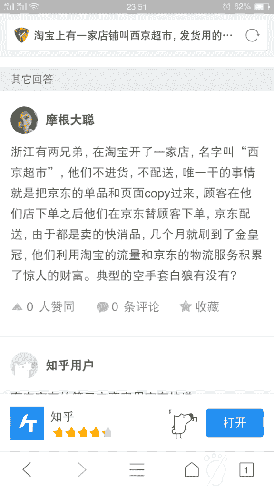
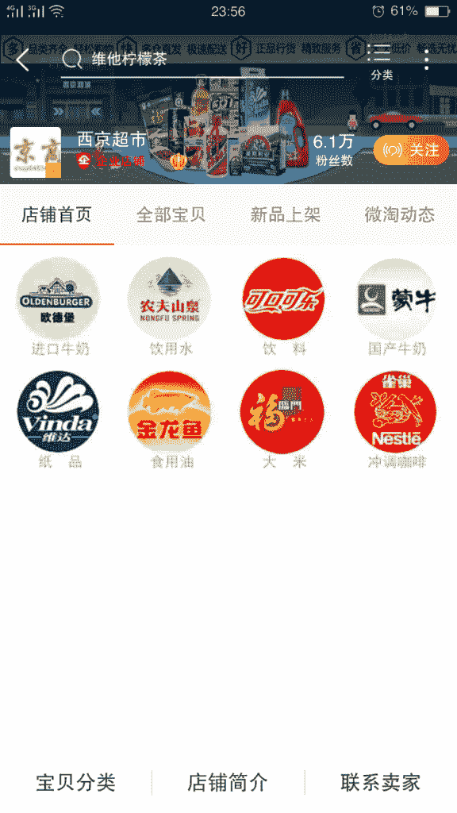

# 利用信息不对称赚钱

利用很多消费者只知道淘宝购物的信息不对称，淘宝店铺迅速升级到金皇冠。

淘宝购物

淘宝购物

在路上：每次配送地址都不一样，京东不会封账号吗？

桑夏木 回复 在路上：他本身就是企业店铺，所以在京东上申请一个企业用户也不是难事，可能价格比普通用户还要低一些。

十七：它的盈利模式是什么？挣差价？

sophie 回复 十七：CPS 联盟，价差……都可以

姚文杰 回复 sophie：CPS 联盟能详细讲解一下吗？

曲建伟：可以不走淘宝物流系统？

蒋小朝：关于本案例的两点思考： 1·从案例本身的角度： 盈利模式如下 CPS 联盟 赚取差价 出售淘宝店 出售顾客信息 2.从生财有术的角度：评论引流。 作为生财有术的第一篇精华帖，截止 20190524 已有 70 条评论，远高于其他精华帖。一篇曝光量高的文章，其前几条评论的曝光度也不会差。（适用场景举例：知乎高赞回答①评论之②回复已有的前几条评论）