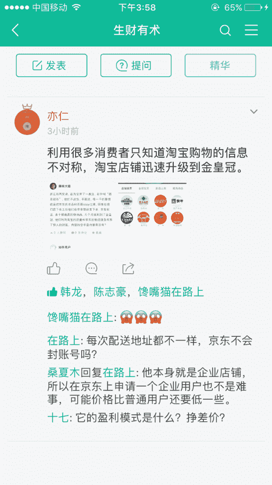

# 淘宝卖京东商品

关于亦仁老师说的淘宝卖京东商品这个案例，提供一下盈利模式，最简单一个是京东 E 卡，京东卡淘宝卖 98 左右，找渠道在 97.8 左右，如果自己想收的，在 97.3 左右，(这里面水比较深，不建议自己收卡)这里面有差价，但是这个利润还是小的。

第二个方法是通过优惠券购物，外面有人专门做软件抢优惠券，跟他们买优惠券，可以赚的差价比较多，第三个是通过京东联盟，跟淘宝联盟一样，有佣金。

京东商品

**评论：**

Frank：这让我想起来了中秋节月饼券的例子。工厂生产 100 元的月饼券，公司 100 元买入，发给员工，员工 70 元卖给黄牛，厂家 90 元回收。除了公司出钱，其它都赚钱。过节了，公司不发月饼估计也不行，公司也不赔。

[加入「生财有术」](https://www.ilangcai.com/jiaru/)

交流合作，请加微信：sige3638