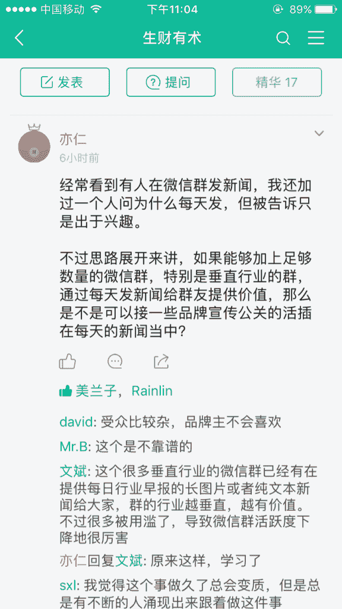

# 微信群社群 | 垂直社群

思路

刚看到亦仁老师说的微信群，其实还有另外一种做法，就是做社群，垂直社群，有个人去年就做这个，赚了一千多万，就是搞微信群社群的。

做法是以微信公众号做平台，引流到微信群里面，每个月都有讲课，分享，然后选群员或者嘉宾给其他人分享思路，项目。

每次讲课收费几百，看他们流水，每个月都几十万了，足够维护平台了，主要利润应该在后面，有平台以后，可以吸引流量和资源，做中间平台，因为行业特别垂直，所以他收到的信息和资源非常有价值，利用信息来赚钱。

除了这个对接项目和技术或者资金资源。亦仁老师你这个如果能找人帮你维护微信群的话，做平台，对接项目和资源或者天使投资之类的，感觉也不错哦

微信群社群

**评论：**

Jimi：其实这个小密圈就有点类似了，只是没讲课罢了，你看你都分享了很多思路。

华安知 回复 Jimi：嗯，之前我有跟他们推荐用小密圈，不过他们提了个问题，就是用户习惯，微信太强大了，有些用户会比较习惯微信群方式，所以没采用小密圈，微信群互动更好。有这么个说法，对于成交，关注公众号的＜微信里互动的＜微信群里面聊天的

Jimi 回复 华安知：嗯，普通人确实更适合直接用微信群，我是针对你给亦仁提的建议，毕竟我们都已经在小密圈了

RunSky 回复 Jimi：微信群更加容易来进行互动和讲课，这里就是不太好操作。

华安知：谢谢亦仁老师赞赏，第一次收到

niege：而且微信群引流到小密圈的转化率也很高，我的数据是 9%左右，如果亦仁真有运维微信群的想法，我报名

李巍 （私人号）：这是讲的财神会吧？

[加入「生财有术」](https://www.ilangcai.com/jiaru/)

交流合作，请加微信：sige3638