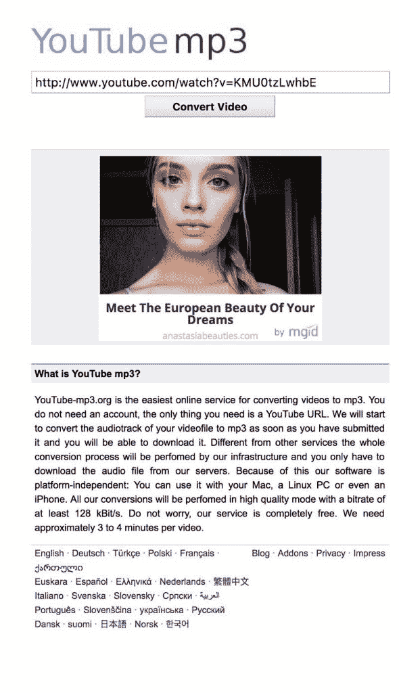
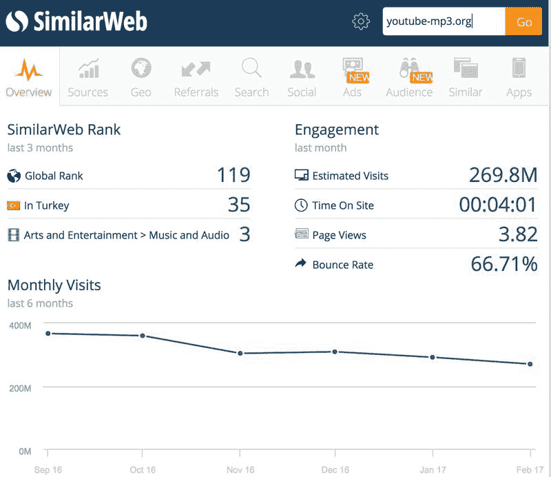

# YouTube 视频转音频

[youtube-MP3.org.ru](https://youtube-mp3.org.ru/)

输入 YouTube 视频链接就可以提取出来音频，技术难度几乎可以忽略不计。

月流量 2.7 亿，盈利模式是 mgid 广告联盟，不敢去估算收入

不要问我为什么会出现美女的广告，我也不知道！

youtube-MP3

YouTube

**评论：**

sophie：我最近也想过优酷的这些视频提取音频

sophie：都有想到就看有没行动了

海平线：提取音频的意义和价值在哪里？

亦仁 回复 海平线：有些人希望听音频而不是看视频。

liang：大批量的下载 youtube 不会禁它么？或者如果有盈利点 youtube 为什么不做？

亦仁 回复 liang：会禁，野火烧不尽，春风吹又生。

六六很六 回复 亦仁：如果这个思路放到国内的平台来做，会涉及到版权问题吧？

亦仁 回复 六六很六：会。

liang：我知道了，它是借助 youtube 获取流量。。流量 youtube 有，所以 youtube 没有动力做这个功能

朱凯阳：请教下，怎么估算广告收入？这个大约是 100 万刀/月？

亦仁 回复 朱凯阳：按照盈利的方式不同，收入会有很大的变化。 这个网站没有直接用 Google Adsense，我估计是被禁掉了。 如果用的是 Adsense，1000 个 IP 从 1 刀到 20 刀或者更高都有可能。 按照 1 刀来算，月 2.7 亿流量就是 2700 万刀。 就算按照 1000 个流量 0.1 刀来算，也是 270 万刀。 太恐怖了。

猪哥靓：这个点子为什么留言这么少？我觉得这个点子完全可以复制到国内，我查了，国内好像没有，怎么没人关注？

亦仁 回复 猪哥靓：那时候人少

sneider：请问一下怎么看出盈利模式是 mgid 广告联盟？

亦仁 回复 sneider：右上角有小标

sneider 回复 亦仁：噢，我打开这个网页看不到广告

Frank：提取 youtube 的音频，传到喜马拉雅上，有前途嚒？

范伟：这个真是我们习以为常的事情总觉得没有价值。

范伟：看了下超过 94%的用户直接通过网址进来，说明用户的目的非常明确 用户区域分布比较分散，排名第一的区域占比 11，未出现头部聚集效应，说明是一个普遍性的需求

区块链投资界：这个会设计到知识产权的纠纷吗

文圳：确实有这种需求。我之前用优酷客户端把喜欢视频载成音频，不过这个看起来功能更强也更方便

[加入「生财有术」](https://www.ilangcai.com/jiaru/)

交流合作，请加微信：sige3638