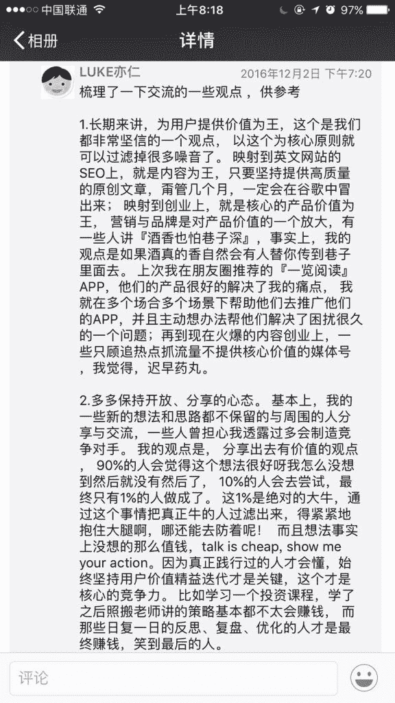
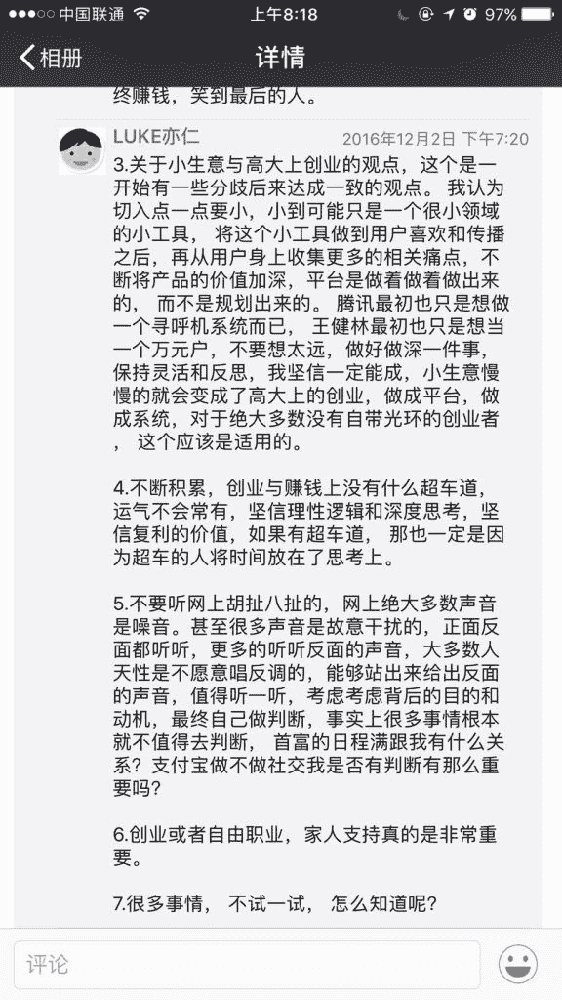

# 年入百万的自由职业者

米客小 D@Xplorer 若水 入坑了，杭州年入百万的自由职业者。

主要做英文 amazon affiliate，图片是我们上次面基时的收获总结

收获总结

收获总结

**评论：**

Jimi：很多事情，不试一试，怎么知道呢

Mr.wu：实践很重要，坚持更重要

琨：同来自 advertcn

david：家人支持很重要，个人成长环境很重要

niege：甭管什么想法，干起来是关键，一批能主动行动的人在一起才有可能成事👍申请把图片贴到自己小圈里。

队长传我球：attilitate 没听过。

TeaBoss.me：下一步的方向，做英文的推广已经快两年了，入圈一对比，发现自己还没有入门

BlockD：思维真好，怎么能藏着掖着，应该分享呀

Frank：1.为用户提供价值。价值的载体，文字，视频，语音。 2.保持开放的心态。对于 idea，不要怕分享，分享出来，一些人可以帮你验证，即便被抄袭，那也说明门槛很低，没有壁垒。 3.先服务一个很小的群体，然后在群体上深挖用户痛点，拓展服务。 4.多读书，勤思考。 5.多听反面声音。

高涛杰：真正优秀的思路从来都不会过时 这篇帖子是 2 年前的，至今仍觉得价值满满

熊磊：收获:分享新思路、新想法，筛选出牛人，抱大腿，紧紧跟随。

[加入「生财有术」](https://www.ilangcai.com/jiaru/)

交流合作，请加微信：sige3638