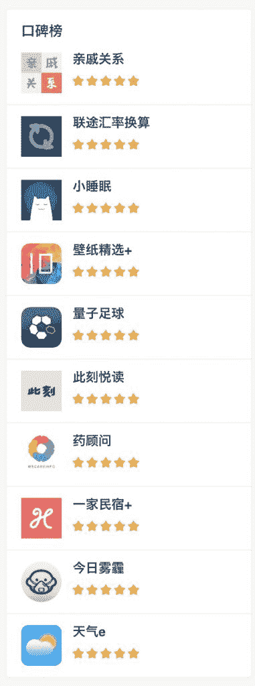
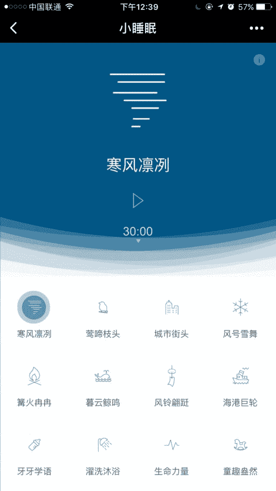
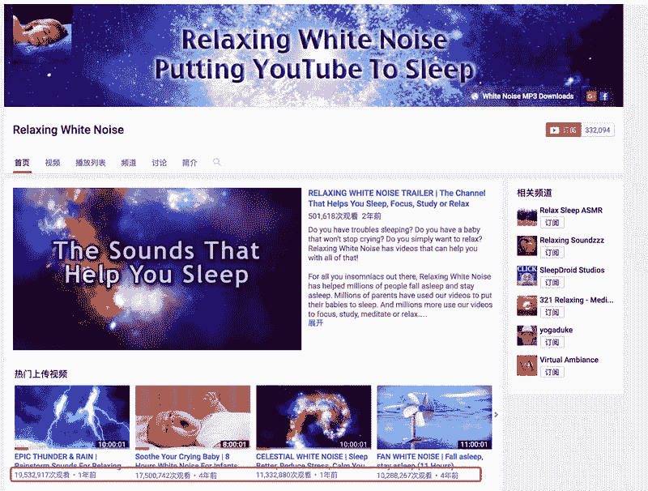

# 微信小程序 | 小睡眠

昨天提到了一个思路，从微信小程序已经上线的产品中找到合适的痛点切入。

因为微信小程序比较适合低频的工具属性的产品，所以目前已经上线的产品大部分是工具。

在小程序榜单上（第一张图），看到《小睡眠》排在第三，我自己也用过这个小程序，体验非常好，所以重点分享下这个案例。

《小睡眠》（第二张图）本质上是一个白噪音应用，这个细分市场可能知道的人比较少， 但是对白噪音有需求的人却喜欢的不得了。

在 Youtube 上搜索 relaxing white noise，很多白噪音的视频都是千万以上的播放量（第三张图），大多数视频描述里面都导向了一个购买白噪音 mp3 音频的链接，购买均价在 3 美元。按照 1/1000 的转化率（应该不止），一个音频转化收入 3 万美元，而实际边际成本为 0，一个网站正常 10 个音频以上，30 万美元的收入。

所以，如果我进入这个细分市场的话， 我的思路是

第一、尽快搞定内容和产品，包括音频的丰富度、完整度和版权。可以去谈合作、购买或者自己去录制白噪音，或者爬取一些没有版权的白噪音音频。

第二、搞定流量渠道，这里面会从有三个角度

1.  找到竞争对手已经覆盖的渠道，然后去慢慢的切对方的蛋糕；
2.  找到新出现的渠道，比如现在的小程序，抢占红利；
3.  找到新的场景，很多人并不会去搜索“白噪音”，可能会搜索的词是“ 工作无法专注”，“宝宝不睡觉”，“失眠”，“下雨的声音”，“效率低”，“冥想音乐”等，只要白噪音确实能解决这些问题，那么就可以从一个全新的场景切进来，比如“小睡眠”就是从睡眠角度切进这个市场的。

分析完毕，有兴趣的可以试试看或者进一步分析。

小睡眠

白噪音

白噪音

**评论：**

peter 锋：谢谢分享！另有一个关键词，叫颅内高潮，英文缩写 ASMR，[`www.youtube.com/watch?v=81l8LZPJLUQ`](https://www.youtube.com/watch?v=81l8LZPJLUQ)

亦仁 回复 peter 锋：网易云有一个类似的专题很火

羲吾：嗯，一直有时不时用一个睡眠音乐的 app 帮助入睡，但从来没这样想过。

绿玉：小睡眠是免费的呢。 这也是我对其他小工具收费变现的一个思考：好容易找到细分市场 然后发现已经有免费的工具在了。这个时候 可能需要给自己的产品找一个付费的原因，是不是会要求很高很难呢？

钱串串 回复 绿玉：我也觉得这个问题值得考虑，一般的套路就是基本服务免费，升级服务付费

绿玉 回复 钱串串：我刚才的想法是 选择不同渠道 比如小程序免费 但油管就多数收费 亦仁在帖子里提到的我还没验证；要是功能无法收费 流量大 可以放广告

亦仁 回复 绿玉：油管本身就是获取到的免费流量，也可以直接在油管上去听，导到网站的已经过过滤了一层

Frank：进入细分市场思路 1.尽快完善内容和服务。 2.如何引流？扒竞争对手的流量来源，接住新工具。 3.拓展场景，如关键词相关推荐，同类词意。 4.当前各个平台都在推小程序，从一个平台复制到另外一个平台可否？

[加入「生财有术」](https://www.ilangcai.com/jiaru/)

交流合作，请加微信：sige3638