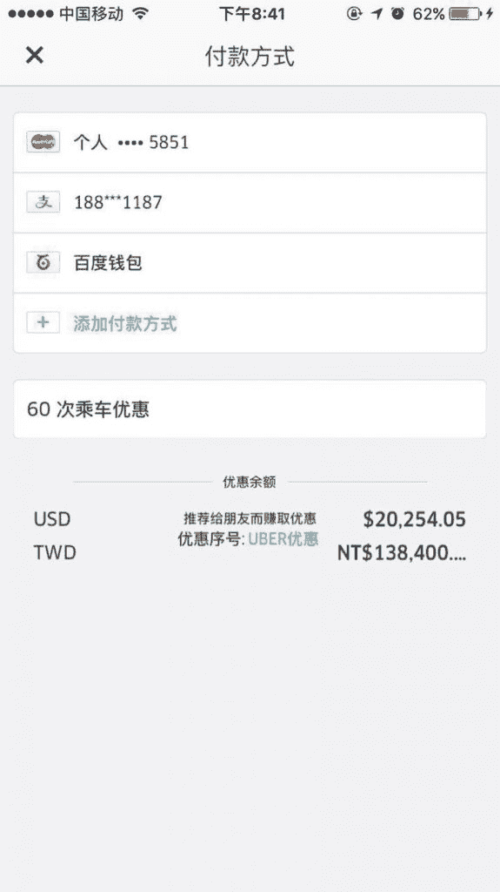
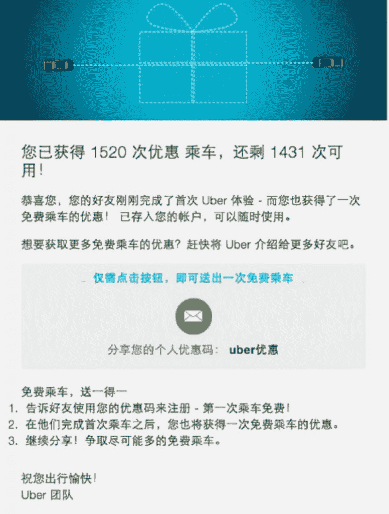

# 站长时代末期的案例

2014 年下半年 UBER 默默进入中国，并把优惠码获客机制以及大额补贴带入中国市场。

我在 14 年底了解到该机制并试图获取一定的推荐费以补贴打车，最后意外收获了巨大的长尾流量。

思路如下：

背景：每个账号都有一个可定制的优惠码，官方规则是只要有新用户首次用车前使用了该优惠码，就会赠予双方同等余额/优惠券，一开始是 100/50/30 余额，很快随着用户增长加快变成了 30/20/15 优惠券。

思路：将优惠码推荐给身边的好友是 UBER 的本意，但我很快发现了一个路径：有约 5%的用户会来不及向朋友索取优惠码，而匆忙从搜索引擎寻找。我只要优化属于我的优惠码在搜索引擎的排名和转化率即可。

方法：

1.首先优化这个码的本身，刚刚说了早期可以自定义，那就很简单把它优化成“官方模样” 比如“UBER 免费”“UBER 优惠”“UBER2015”后面弄了一堆类似的

2.通过百度搜索联想，确定押注某个关键词，最后确定是“UBER 优惠码”，这个在后期中文名“优步”被推广开以后发生了变化。

3.寻找最高效的 seo，摸索了一圈，优先级是 百度贴吧/豆瓣小组/百度经验/百度文库/百度知道

4.2015.4 月最高峰的时候，每天有上千用户通过我的优惠码首次用车

5.很快优惠券变成了 3 个月过期，养了身边十几个人免费打车+5 元一张卖优惠券。当然，当年市面上流通的可出售优惠码主要不是这个合法渠道。主要是刷单产业链出来的。

UBER 优惠码

UBER 优惠码

评论：

文由：这个案例确实经典，当年进入 uber 就是被这种方式安利了

保生：实战案例，赞赏一下

飞刀哥：很好的思路，学习了

龙东平：简直丧心病狂了

绿色机器猫：前辈了 牛

[加入「生财有术」](https://www.ilangcai.com/jiaru/)

交流合作，请加微信：sige3638