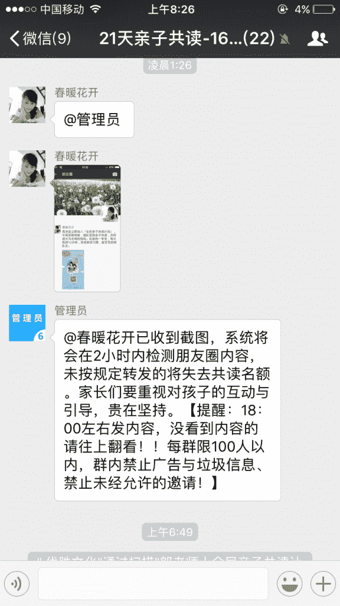
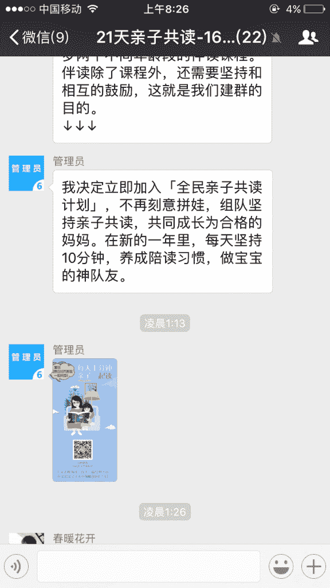
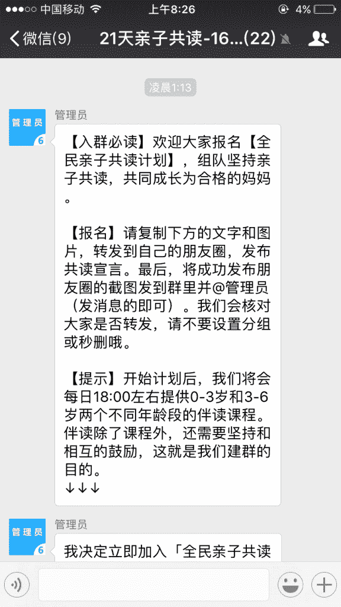
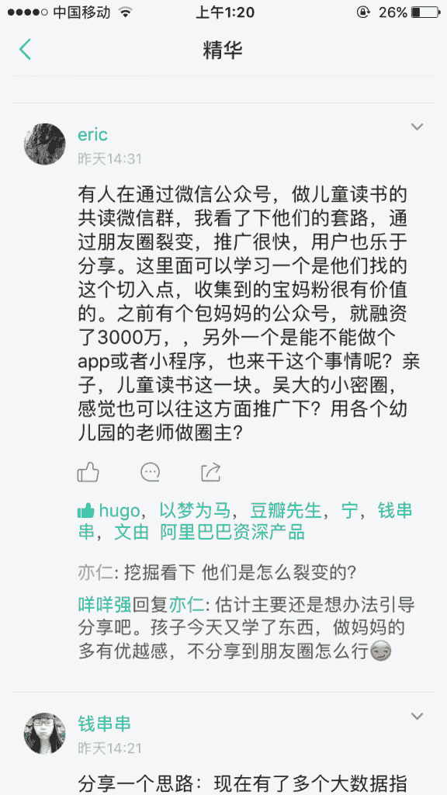
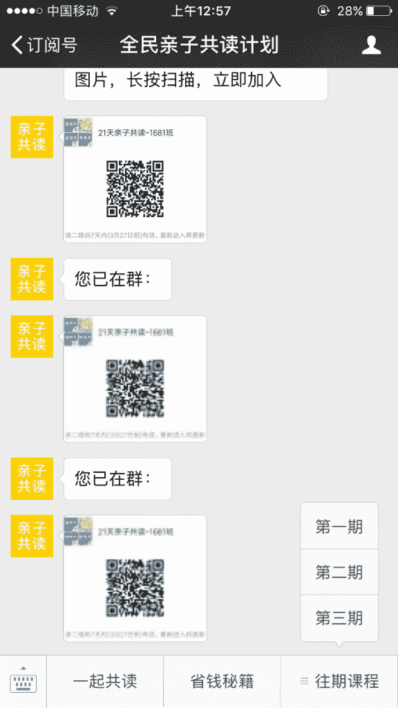

# 微信裂变套路 | 朋友圈裂变

好多大神啊这里，有点不敢发了

不过还是说一下这个微信怎么裂变的吧，抛砖引玉。

这是一个很经典也常用的套路。

裂变在公众号里面引导加微信群，就说亲子共读互相监督群之类的，进群之后，文案引导发朋友圈，进行朋友圈裂变，不停重复这个流程。

所有推广都可以用

朋友圈裂变

朋友圈裂变

朋友圈裂变

朋友圈裂变

朋友圈裂变

评论：

Amos：是的，前两天我加入了一个七天 PPT 入门的群，方式和你所说的一模一样，都是引导复制宣传文案在朋友圈转发，机器人检测…… 手段都一样，另外: 1,首先还是要找准用户的痛点，比如一些学习读书的内容还是对用户很有吸引力的;另外，我之前还接触过免费的塔罗牌占卜，这类和自身切身相关的，转发到朋友圈后也很有人感兴趣 2,其次宣传的话术文案…比如 xx 天速成，免费获取等等，对人很有吸引…

华安知：哇，谢谢亦仁老师赞赏

Cowboy：机器人如何检测？这个搞不懂

yuki：亲子类的现在是个热点，已经有亲子共读的 app 了，不过是共读英文的，还有是故事绘本之类的，和儿童搭界的这类 app 下载量都非常高

david：机器人检测是如何实现的？

Frank：现在再使用这种方法依然有效，加过有道的群。只不过活动结束后，会退群，但是关注公众号的目的是达到了。

[加入「生财有术」](https://www.ilangcai.com/jiaru/)

交流合作，请加微信：sige3638