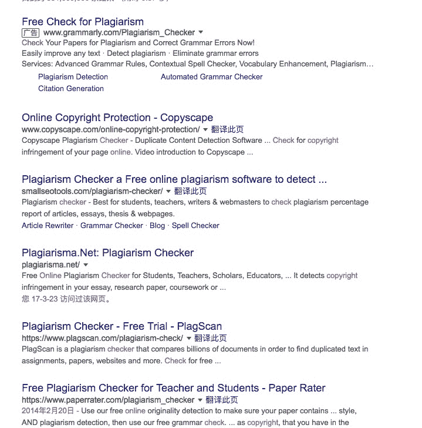
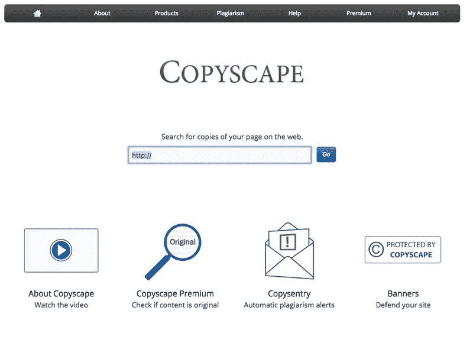
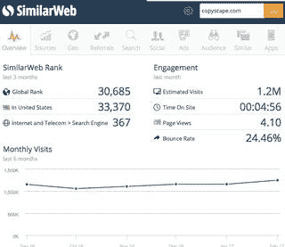

# 论文查重案例

昨天有人提到论文查重，我来分享几个关于这个主题的案例。

这个细分市场工具有不少， 看数据也都活的挺好，但是还有很多不足的空间，现在进入还有机会。

查重有 2 个关键点

1.  初始的数据库。

a. 很多工具站并不自己建数据库，他们只是将你提供的文章打散成句子或者词组之后在现有的搜索引擎（比如百度或者搜狗或者 Google）中去检索相似句子，然后判断是否有抄袭或者重复文章，这种类型的网站大多数是免费提供服务，提供一些增值服务或者广告收费。

b. 另外是自己建立数据库，比如说自己抓取了很多文章，或者买断了很多独家内容，比如知网这种类型的，靠收费赚钱。

1.  文章之间的比对。

a.文章比对上难度还是有一点，需要用到一点算法知识， 但网络上都有开源的算法。

基于上面两点，目前已经有的切入的场景

1.  查文章是否首发，是否原创，主要是老板查小编是否真的在写内容而不是从网上随便下载了一些文章组合起来。 这个场景下，国外的工具比较多， 国内反而我没怎么见到。也许是一个好机会。
2.  两篇文章的相似性比对，输入两篇文章的 url，或者提供两篇文章，直接标记出来相似的地方在哪里， 类似于知网查重产出的报告一样，这种需求我个人感觉还是蛮多的。但国内一直没人做好，可能是技术难度有点大？
3.  文章语法与文字纠错工，写完了一篇文章想查一下哪里有错别字，哪里语法不通。 英文这样的工具非常多，而且流量特别大。 中文的这样的做的好的工具不多，可能是因为中文查错别字比较慢？但需求确实真实的，几乎每个写作的人都希望有这样一款工具可以在线查一下哪里可能有错别字，有标点错误(并非每个人都会去装一个 word)，曾经有一个朋友直接表示过， 这样的工具开发出来每个月愿意花几十块钱订阅，有技术的朋友试试看。
4.  舆情监测与版权监测。 先前置一篇文章或者一些关键词，然后定时去查网络上相似或者相关的内容。做的大的有很多了。

案例：

Google 搜索下：copyright check online

第一个网站：[Online Copyright Protection](http://www.copyscape.com/online-copyright-protection/)

流量：月 120 万。

商业模式：免费对比服务+单次服务收费$0.05/API 收费/版权追踪分析工具

简单收入预估：月流量 120 万*每个人每个月使用 10 次（$0.5)= 60 万美元， 有点夸张，再打个 5 折，收入 30 万美元，成本几乎可以忽略不计。

增长黑客思路：他们建立一个认证系统，提供了一个版权保护的小挂件，写作的人可以将这个挂件放到自己的网站上，挂件上写着『protected by copyscape』，意思是我的网站目前在版权保护中，不要来抄我内容 blabla。 但核心是这个网站通过这个小挂件给自己提供了非常多的高质量的外链。

可以换个搜索词比如 dupilcate content check 等，也是很多类似的机会。

总结下， 这个细分市场应该还是有很大的机会，特别是在中文内容创业如火如荼的情况下，对应的很多服务没有跟上，推荐有技术的跟进。

copyright

copyscape

copyscape

评论：

阿兰不是图灵：我有这方面技术

学习者 回复 阿兰不是图灵：我给你去大学做推广

大远 回复 阿兰不是图灵：我给你打杂

Holy 回复 学习者：我刚好还在大学！

阿兰不是图灵 回复 Holy：我当时写硕士论文的时候就在知网买了两次查重服务

杜若 回复 阿兰不是图灵：可以加微信，本身在科研圈里

niege：我那时同学普遍查重 3 到 5 次，我全部复制的，却只自己在维普查了一次重，是 0，然后就给他们吹牛了，然后惨了，一个个帮处理论文

Bluekou：有机会，维权骑士正在做的虽然不是查重服务，但就是帮人进行维权

阿兰不是图灵 回复 Bluekou：维权骑士怎么去找文章偷窃行为的呢？

Lebron @小孟*：升级版的 Copyscape

[加入「生财有术」](https://www.ilangcai.com/jiaru/)

交流合作，请加微信：sige3638